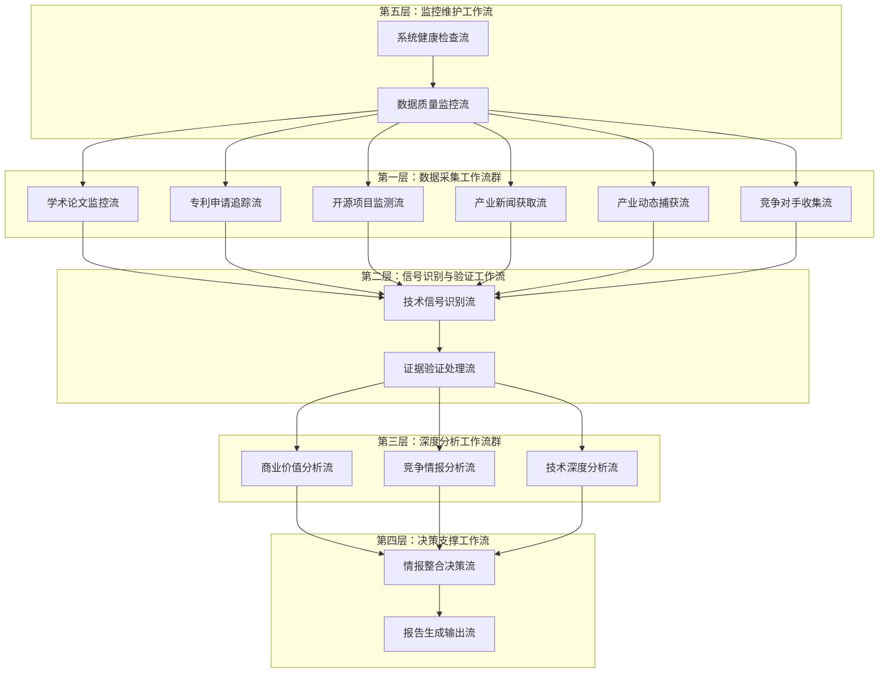

# 技术情报决策引擎 - Make工作流架构设计（修订版）

## **工作流总体架构**

### **核心设计理念：分层协同的情报处理管道**



## 📋 工作流架构总览

### **五层协同架构**
```
第一层：精准数据采集层 (WF1-WF6)
    ↓ 触发
第二层：信号识别验证层 (WF7-WF8)  
    ↓ 触发
第三层：深度分析层 (WF9-WF11)
    ↓ 触发
第四层：决策支撑层 (WF12-WF13)
    ↓ 监控
第五层：系统维护层 (WF14-WF15)
```

### **数据流向关系**
```
Registry配置表 → RAW数据采集 → 技术信号识别 → 多维度分析 → 情报整合 → 报告输出
```

---

## 🔄 第一层：精准数据采集工作流群

### **WF1：学术论文监控流**
**触发频率**：每6小时  
**数据限定**：基于Technology_Registry表

| 节点 | Module类型 | Module名称 | 职责描述 |
|-----|-----------|-----------|----------|
| N1-01 | Scheduler | Schedule | 定时触发工作流执行 |
| N1-02 | Data Storage | Google Sheets | 读取Technology_Registry表获取监控技术清单 |
| N1-03 | HTTP | HTTP | 调用arXiv API检索相关论文 |
| N1-04 | HTTP | HTTP | 调用Google Scholar API补充搜索 |
| N1-05 | HTTP | HTTP | 调用IEEE Xplore API获取工程论文 |
| N1-06 | Text Parser | Text Parser | 论文元数据提取和标准化 |
| N1-07 | Filter | Filter | 基于Technology_Registry关键词过滤 |
| N1-08 | AI | OpenAI | 技术相关性和创新度评估 |
| N1-09 | Filter | Filter | 创新度阈值过滤(≥7.0) |
| N1-10 | Data Storage | Google Sheets | 写入Raw_Academic_Papers表 |
| N1-11 | Webhook | Webhook | 触发WF7信号识别流 |

### **WF2：专利申请追踪流**
**触发频率**：每12小时  
**数据限定**：基于Technology_Registry + Competitor_Registry表

| 节点 | Module类型 | Module名称 | 职责描述 |
|-----|-----------|-----------|----------|
| N2-01 | Scheduler | Schedule | 定时触发工作流执行 |
| N2-02 | Data Storage | Google Sheets | 读取Technology_Registry表获取技术域 |
| N2-03 | Data Storage | Google Sheets | 读取Competitor_Registry表获取竞争对手清单 |
| N2-04 | HTTP | HTTP | 调用USPTO API检索专利申请 |
| N2-05 | HTTP | HTTP | 调用EPO API获取欧洲专利 |
| N2-06 | HTTP | HTTP | 调用Google Patents API综合搜索 |
| N2-07 | Text Parser | Text Parser | 专利信息提取和分类 |
| N2-08 | Filter | Filter | 技术域和竞争对手双重过滤 |
| N2-09 | AI | OpenAI | 专利重要性和威胁评估 |
| N2-10 | Filter | Filter | 重要性阈值过滤(≥7.0) |
| N2-11 | Data Storage | Google Sheets | 写入Raw_Patent_Data表 |
| N2-12 | Webhook | Webhook | 触发WF7信号识别流 |

### **WF3：开源项目监测流**
**触发频率**：每4小时  
**数据限定**：基于Technology_Registry表

| 节点 | Module类型 | Module名称 | 职责描述 |
|-----|-----------|-----------|----------|
| N3-01 | Scheduler | Schedule | 定时触发工作流执行 |
| N3-02 | Data Storage | Google Sheets | 读取Technology_Registry表获取技术关键词 |
| N3-03 | GitHub | GitHub | 监控GitHub趋势项目 |
| N3-04 | HTTP | HTTP | 调用GitLab API获取项目信息 |
| N3-05 | Text Parser | Text Parser | 项目信息标准化处理 |
| N3-06 | Filter | Filter | 基于Technology_Registry关键词匹配 |
| N3-07 | AI | OpenAI | 技术价值和商业潜力评估 |
| N3-08 | Filter | Filter | 商业潜力阈值过滤(≥7.0) |
| N3-09 | Data Storage | Google Sheets | 写入Raw_OpenSource_Data表 |
| N3-10 | Webhook | Webhook | 触发WF7信号识别流 |

### **WF4：产业新闻获取流**
**触发频率**：每2小时  
**数据限定**：基于Technology_Registry + Competitor_Registry表

| 节点 | Module类型 | Module名称 | 职责描述 |
|-----|-----------|-----------|----------|
| N4-01 | Scheduler | Schedule | 定时触发工作流执行 |
| N4-02 | Data Storage | Google Sheets | 读取Technology_Registry表获取技术关键词 |
| N4-03 | Data Storage | Google Sheets | 读取Competitor_Registry表获取公司清单 |
| N4-04 | RSS | RSS | TechCrunch新闻源订阅 |
| N4-05 | RSS | RSS | MIT Technology Review订阅 |
| N4-06 | RSS | RSS | VentureBeat新闻订阅 |
| N4-07 | Text Parser | Text Parser | 新闻内容提取和清理 |
| N4-08 | Filter | Filter | 技术关键词匹配过滤 |
| N4-09 | Filter | Filter | 竞争对手相关新闻过滤 |
| N4-10 | AI | OpenAI | 新闻价值和影响评估 |
| N4-11 | Filter | Filter | 新闻价值阈值过滤(≥8.0) |
| N4-12 | Data Storage | Google Sheets | 写入Raw_Tech_News表 |
| N4-13 | Router | Router | 高价值新闻路由到WF5 |
| N4-14 | Webhook | Webhook | 触发WF7信号识别流 |

### **WF5：产业动态捕获流**
**触发频率**：事件触发 + 每8小时  
**数据限定**：基于Conference_Registry表

| 节点 | Module类型 | Module名称 | 职责描述 |
|-----|-----------|-----------|----------|
| N5-01 | Webhook | Webhook | 接收WF4高价值新闻触发 |
| N5-02 | Data Storage | Google Sheets | 读取Conference_Registry表获取会议清单 |
| N5-03 | HTTP | HTTP | 查询会议官方网站信息 |
| N5-04 | HTTP | HTTP | 验证公司官方发布信息 |
| N5-05 | HTTP | HTTP | 查询SEC等监管文件 |
| N5-06 | Text Parser | Text Parser | 官方信息提取和验证 |
| N5-07 | Filter | Filter | 基于Conference_Registry会议相关过滤 |
| N5-08 | AI | OpenAI | 信息可信度和影响评估 |
| N5-09 | Filter | Filter | 可信度阈值过滤(≥8.0) |
| N5-10 | Data Storage | Google Sheets | 写入Raw_Industry_Dynamics表 |
| N5-11 | Webhook | Webhook | 触发WF6竞争情报流 |
| N5-12 | Webhook | Webhook | 触发WF7信号识别流 |

### **WF6：竞争对手收集流**
**触发频率**：每24小时 + 事件触发  
**数据限定**：基于Competitor_Registry表

| 节点 | Module类型 | Module名称 | 职责描述 |
|-----|-----------|-----------|----------|
| N6-01 | Scheduler | Schedule | 定时触发和事件触发 |
| N6-02 | Data Storage | Google Sheets | 读取Competitor_Registry表获取竞争对手配置 |
| N6-03 | LinkedIn | LinkedIn | 监控关键人员动态 |
| N6-04 | HTTP | HTTP | Crunchbase融资信息查询 |
| N6-05 | HTTP | HTTP | 公司官方动态监控 |
| N6-06 | Text Parser | Text Parser | 竞争情报信息提取 |
| N6-07 | Filter | Filter | 基于Competitor_Registry清单过滤 |
| N6-08 | AI | OpenAI | 威胁等级和重要性评估 |
| N6-09 | Filter | Filter | 威胁等级阈值过滤(≥7.0) |
| N6-10 | Data Storage | Google Sheets | 写入Raw_Competitor_Intelligence表 |
| N6-11 | Webhook | Webhook | 触发WF7信号识别流 |

---

## 🎯 第二层：信号识别验证工作流

### **WF7：技术信号识别流**
**触发方式**：Webhook触发  
**数据来源**：WF1-WF6汇聚

| 节点 | Module类型 | Module名称 | 职责描述 |
|-----|-----------|-----------|----------|
| N7-01 | Webhook | Webhook | 接收多源数据汇聚触发 |
| N7-02 | Data Aggregator | Data Aggregator | 多源数据预处理和标准化 |
| N7-03 | AI | OpenAI | 技术突破性评估 |
| N7-04 | AI | OpenAI | 商业价值预评估 |
| N7-05 | Data Transformer | Data Transformer | 信号强度综合计算 |
| N7-06 | Filter | Filter | 信号强度阈值过滤(≥8.0) |
| N7-07 | Data Transformer | Data Transformer | Intelligence_ID生成 |
| N7-08 | Data Storage | Google Sheets | 写入Tech_Intelligence_Master表 |
| N7-09 | Webhook | Webhook | 触发WF8证据验证流 |
| N7-10 | Webhook | Webhook | 触发WF9-WF11分析流 |

### **WF8：证据验证处理流**
**触发方式**：WF7触发  
**处理对象**：技术情报证据链

| 节点 | Module类型 | Module名称 | 职责描述 |
|-----|-----------|-----------|----------|
| N8-01 | Webhook | Webhook | 接收WF7验证请求 |
| N8-02 | HTTP | HTTP | 批量链接有效性验证 |
| N8-03 | Data Transformer | Data Transformer | 数据源权威性评估 |
| N8-04 | Text Parser | Text Parser | 多源信息交叉验证 |
| N8-05 | HTTP | HTTP | 专家观点搜索收集 |
| N8-06 | AI | OpenAI | 证据质量综合评分 |
| N8-07 | Filter | Filter | 置信度阈值控制(≥80%) |
| N8-08 | Data Storage | Google Sheets | 写入Evidence_Validation_Matrix表 |
| N8-09 | Data Storage | Google Sheets | 更新主表置信度字段 |

---

## 📊 第三层：深度分析工作流群

### **WF9：商业价值分析流**
**触发方式**：WF7触发  
**分析目标**：商业价值量化

| 节点 | Module类型 | Module名称 | 职责描述 |
|-----|-----------|-----------|----------|
| N9-01 | Webhook | Webhook | 接收WF7分析请求 |
| N9-02 | HTTP | HTTP | 市场数据API调用 |
| N9-03 | AI | OpenAI | TAM/SAM/SOM市场建模 |
| N9-04 | Data Transformer | Data Transformer | ROI多场景计算 |
| N9-05 | AI | OpenAI | 商业化时间线评估 |
| N9-06 | HTTP | HTTP | 可比案例数据收集 |
| N9-07 | AI | OpenAI | 投资回报分析 |
| N9-08 | Data Storage | Google Sheets | 写入Commercial_Value_Quantification表 |
| N9-09 | Data Storage | Google Sheets | 更新主表商业价值字段 |

### **WF10：竞争情报分析流**
**触发方式**：WF7触发  
**分析目标**：竞争态势评估

| 节点 | Module类型 | Module名称 | 职责描述 |
|-----|-----------|-----------|----------|
| N10-01 | Webhook | Webhook | 接收WF7分析请求 |
| N10-02 | Data Storage | Google Sheets | 读取历史竞争数据 |
| N10-03 | AI | OpenAI | 竞争格局分析 |
| N10-04 | HTTP | HTTP | 专利布局查询 |
| N10-05 | AI | OpenAI | 威胁等级评估 |
| N10-06 | AI | OpenAI | 合作机会识别 |
| N10-07 | Data Storage | Google Sheets | 写入Competitive_Intelligence_Monitor表 |
| N10-08 | Data Storage | Google Sheets | 更新主表竞争威胁字段 |

### **WF11：技术深度分析流**
**触发方式**：WF7触发  
**分析目标**：技术成熟度评估

| 节点 | Module类型 | Module名称 | 职责描述 |
|-----|-----------|-----------|----------|
| N11-01 | Webhook | Webhook | 接收WF7分析请求 |
| N11-02 | AI | OpenAI | 技术原理深度解析 |
| N11-03 | Data Transformer | Data Transformer | TRL技术成熟度评估 |
| N11-04 | AI | OpenAI | 应用场景分析 |
| N11-05 | AI | OpenAI | 技术演进预测 |
| N11-06 | AI | OpenAI | 技术壁垒识别 |
| N11-07 | Data Storage | Google Sheets | 写入Technical_Deep_Analysis表 |
| N11-08 | Data Storage | Google Sheets | 更新主表技术字段 |

---

## 🎯 第四层：决策支撑工作流

### **WF12：情报整合决策流**
**触发方式**：WF9-WF11完成触发  
**处理目标**：综合决策建议

| 节点 | Module类型 | Module名称 | 职责描述 |
|-----|-----------|-----------|----------|
| N12-01 | Data Aggregator | Data Aggregator | 等待多流分析完成 |
| N12-02 | Data Storage | Google Sheets | 数据完整性验证 |
| N12-03 | Data Transformer | Data Transformer | 综合评分计算 |
| N12-04 | AI | OpenAI | 行动建议生成 |
| N12-05 | AI | OpenAI | 风险评估缓解 |
| N12-06 | Data Transformer | Data Transformer | 投资机会评级 |
| N12-07 | Data Storage | Google Sheets | 写入Action_Recommendations表 |
| N12-08 | Data Storage | Google Sheets | 更新主表最终状态 |
| N12-09 | Webhook | Webhook | 触发WF13报告生成 |

### **WF13：报告生成输出流**
**触发方式**：WF12触发  
**输出目标**：情报报告分发

| 节点 | Module类型 | Module名称 | 职责描述 |
|-----|-----------|-----------|----------|
| N13-01 | Webhook | Webhook | 接收报告生成请求 |
| N13-02 | Data Storage | Google Sheets | 情报数据筛选排序 |
| N13-03 | AI | OpenAI | 日报内容生成 |
| N13-04 | AI | OpenAI | 详细卡片生成 |
| N13-05 | Text Parser | Text Parser | Markdown格式化 |
| N13-06 | Email | Email | 邮件报告发送 |
| N13-07 | Slack | Slack | 即时通知推送 |
| N13-08 | HTTP | HTTP | 仪表板更新 |
| N13-09 | Webhook | Webhook | API数据推送 |

---

## 🔧 第五层：系统维护工作流

### **WF14：数据质量监控流**
**触发频率**：每小时  
**监控范围**：全系统数据质量

| 节点 | Module类型 | Module名称 | 职责描述 |
|-----|-----------|-----------|----------|
| N14-01 | Schedule | Schedule | 定时数据质量检查 |
| N14-02 | Data Storage | Google Sheets | 数据完整性扫描 |
| N14-03 | HTTP | HTTP | 链接有效性验证 |
| N14-04 | Data Transformer | Data Transformer | 异常数据识别 |
| N14-05 | AI | OpenAI | 质量评估报告 |
| N14-06 | Data Storage | Google Sheets | 自动数据修复 |
| N14-07 | Email | Email | 质量问题预警 |

### **WF15：系统健康检查流**
**触发频率**：每30分钟  
**监控范围**：工作流运行状态

| 节点 | Module类型 | Module名称 | 职责描述 |
|-----|-----------|-----------|----------|
| N15-01 | Schedule | Schedule | 定时系统检查 |
| N15-02 | Make API | Make API | 工作流状态监控 |
| N15-03 | HTTP | HTTP | 外部服务连通性测试 |
| N15-04 | Data Transformer | Data Transformer | 性能指标计算 |
| N15-05 | Filter | Filter | 异常状况识别 |
| N15-06 | Make API | Make API | 自动故障恢复 |
| N15-07 | Slack | Slack | 紧急状况预警 |

---

## 📊 工作流设计总结

### **整体架构特点**
- **15个工作流**：覆盖完整情报处理链路
- **162个节点**：平均每个工作流10.8个节点
- **三源限定**：所有RAW数据基于三个Registry表限定
- **五层协同**：清晰的数据流向和触发关系

### **关键设计原则**
1. **精准限定**：RAW数据采集严格基于Registry表
2. **质量优先**：多层过滤确保高质量输出
3. **自动化**：全流程自动化处理和监控
4. **可维护**：清晰的节点职责和模块划分

### **预期产出效果**
- **每日A级情报**：1-3条高价值技术线索
- **整体质量**：信噪比≥80%，准确率≥85%
- **响应速度**：重大事件24小时内识别
- **系统稳定**：>95%工作流成功率

此设计确保基于明确的Registry限定进行精准数据采集，实现高质量技术情报的自动化产出。
