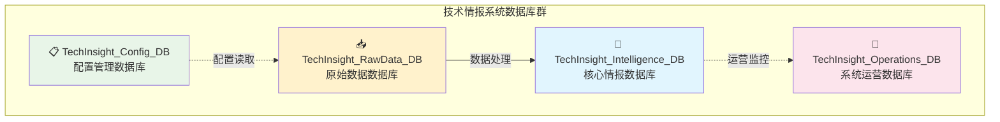
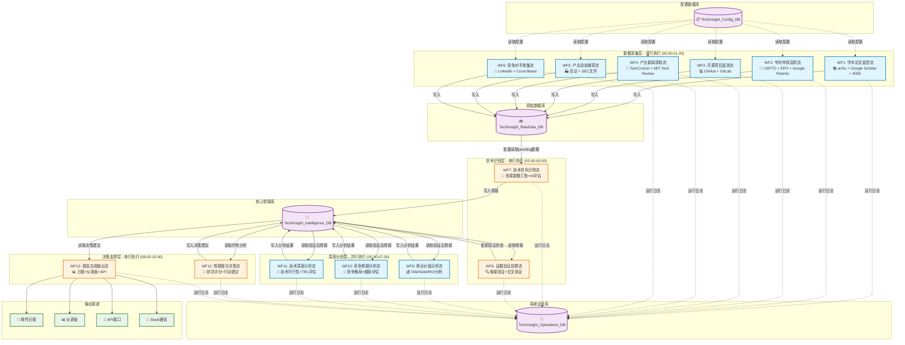

# **技术情报决策引擎 - 完整系统设计方案**

## **📊 1. 数据库架构设计**

### **整体架构概览**



### **详细数据库设计**

#### **📋 TechInsight_Config_DB（配置管理数据库）**
```
📄 Google Sheets工作簿：TechInsight_Config_DB.sheets

├── 📊 Technology_Registry
│   ├── tech_id (A)                 - 技术ID (主键)
│   ├── tech_name (B)               - 技术名称
│   ├── tech_category (C)           - 技术类别
│   ├── tech_keywords (D)           - 技术关键词
│   ├── academic_search_terms (E)   - 学术搜索词
│   ├── patent_search_terms (F)     - 专利搜索词
│   ├── monitoring_priority (G)     - 监控优先级 (1-10)
│   ├── monitoring_status (H)       - 监控状态 (active/inactive)
│   ├── data_source_academic (I)    - 学术数据源启用
│   ├── data_source_patent (J)      - 专利数据源启用
│   ├── data_source_opensource (K)  - 开源数据源启用
│   ├── data_source_news (L)        - 新闻数据源启用
│   ├── created_date (M)            - 创建日期
│   ├── last_updated (N)            - 最后更新时间
│   └── notes (O)                   - 备注

├── 🏢 Competitor_Registry
│   ├── competitor_id (A)           - 竞争对手ID (主键)
│   ├── company_name (B)            - 公司名称
│   ├── industry_category (C)       - 行业类别
│   ├── headquarters_location (D)   - 总部位置
│   ├── founded_year (E)            - 成立年份
│   ├── employee_count (F)          - 员工数量
│   ├── annual_revenue (G)          - 年收入
│   ├── stock_symbol (H)            - 股票代码
│   ├── website_url (I)             - 官方网站
│   ├── tech_focus_areas (J)        - 技术重点领域
│   ├── monitoring_priority (K)     - 监控优先级 (1-10)
│   ├── threat_level (L)            - 威胁等级 (high/medium/low)
│   ├── monitoring_status (M)       - 监控状态 (active/inactive)
│   ├── news_monitoring (N)         - 新闻监控启用
│   ├── patent_monitoring (O)       - 专利监控启用
│   ├── social_monitoring (P)       - 社交媒体监控启用
│   ├── created_date (Q)            - 创建日期
│   ├── last_updated (R)            - 最后更新时间
│   └── notes (S)                   - 备注

└── 📅 Conference_Registry
    ├── conference_id (A)           - 会议ID (主键)
    ├── conference_name (B)         - 会议名称
    ├── conference_type (C)         - 会议类型
    ├── industry_focus (D)          - 行业焦点
    ├── annual_schedule (E)         - 年度时间表
    ├── official_website (F)        - 官方网站
    ├── monitoring_priority (G)     - 监控优先级 (1-10)
    ├── monitoring_status (H)       - 监控状态 (active/inactive)
    ├── last_event_date (I)         - 最后活动日期
    ├── next_event_date (J)         - 下次活动日期
    ├── created_date (K)            - 创建日期
    ├── last_updated (L)            - 最后更新时间
    └── notes (M)                   - 备注
```

#### **📥 TechInsight_RawData_DB（原始数据数据库）**
```
📄 Google Sheets工作簿：TechInsight_RawData_DB.sheets

├── 📚 Raw_Academic_Papers
│   ├── raw_id (A)                  - 原始数据ID (主键)
│   ├── source_type (B)             - 来源类型 (academic_papers)
│   ├── title (C)                   - 论文标题
│   ├── abstract (D)                - 论文摘要
│   ├── authors (E)                 - 作者列表
│   ├── publication_date (F)        - 发布日期
│   ├── source_url (G)              - 来源链接
│   ├── journal_name (H)            - 期刊名称
│   ├── initial_relevance_score (I) - 初始相关性评分
│   ├── tech_keywords (J)           - 关联技术关键词
│   ├── processing_status (K)       - 处理状态 (pending/processed)
│   ├── linked_intelligence_id (L)  - 关联情报ID
│   ├── ai_evaluation_score (M)     - AI评估总分
│   ├── innovation_score (N)        - 创新度评分
│   ├── duplicate_check_hash (O)    - 去重检查哈希
│   ├── workflow_execution_id (P)   - 工作流执行ID
│   ├── created_timestamp (Q)       - 创建时间
│   ├── processed_timestamp (R)     - 处理时间
│   └── last_update_timestamp (S)   - 最后更新时间

├── 🔬 Raw_Patent_Data
│   ├── raw_id (A)                  - 原始数据ID (主键)
│   ├── source_type (B)             - 来源类型 (patent_data)
│   ├── title (C)                   - 专利标题
│   ├── abstract (D)                - 专利摘要
│   ├── inventors (E)               - 发明人
│   ├── assignee (F)                - 申请人/受让人
│   ├── source_url (G)              - 专利链接
│   ├── patent_number (H)           - 专利号
│   ├── application_date (I)        - 申请日期
│   ├── publication_date (J)        - 公布日期
│   ├── patent_status (K)           - 专利状态
│   ├── tech_keywords (L)           - 关联技术关键词
│   ├── processing_status (M)       - 处理状态
│   ├── linked_intelligence_id (N)  - 关联情报ID
│   ├── importance_score (O)        - 重要性评分
│   ├── threat_level (P)            - 威胁等级评分
│   ├── duplicate_check_hash (Q)    - 去重检查哈希
│   ├── workflow_execution_id (R)   - 工作流执行ID
│   ├── created_timestamp (S)       - 创建时间
│   ├── processed_timestamp (T)     - 处理时间
│   └── last_update_timestamp (U)   - 最后更新时间

├── 💻 Raw_OpenSource_Data
│   ├── raw_id (A)                  - 原始数据ID (主键)
│   ├── source_type (B)             - 来源类型 (opensource_data)
│   ├── project_name (C)            - 项目名称
│   ├── description (D)             - 项目描述
│   ├── readme_content (E)          - README内容摘要
│   ├── main_language (F)           - 主要编程语言
│   ├── source_url (G)              - 项目链接
│   ├── github_stars (H)            - GitHub星数
│   ├── github_forks (I)            - Fork数量
│   ├── last_commit_date (J)        - 最后提交日期
│   ├── contributor_count (K)       - 贡献者数量
│   ├── tech_keywords (L)           - 关联技术关键词
│   ├── processing_status (M)       - 处理状态
│   ├── linked_intelligence_id (N)  - 关联情报ID
│   ├── project_potential_score (O) - 项目潜力评分
│   ├── adoption_trend (P)          - 采用趋势评分
│   ├── duplicate_check_hash (Q)    - 去重检查哈希
│   ├── workflow_execution_id (R)   - 工作流执行ID
│   ├── created_timestamp (S)       - 创建时间
│   ├── processed_timestamp (T)     - 处理时间
│   └── last_update_timestamp (U)   - 最后更新时间

├── 📰 Raw_Tech_News
│   ├── raw_id (A)                  - 原始数据ID (主键)
│   ├── source_type (B)             - 来源类型 (tech_news)
│   ├── news_title (C)              - 新闻标题
│   ├── news_summary (D)            - 新闻摘要
│   ├── news_content (E)            - 新闻内容
│   ├── source_url (F)              - 新闻链接
│   ├── publication_date (G)        - 发布时间
│   ├── source_platform (H)         - 来源平台
│   ├── author (I)                  - 作者
│   ├── related_companies (J)       - 相关公司
│   ├── tech_keywords (K)           - 关联技术关键词
│   ├── processing_status (L)       - 处理状态
│   ├── linked_intelligence_id (M)  - 关联情报ID
│   ├── news_value_score (N)        - 新闻价值评分
│   ├── market_impact_score (O)     - 市场影响评分
│   ├── duplicate_check_hash (P)    - 去重检查哈希
│   ├── workflow_execution_id (Q)   - 工作流执行ID
│   ├── created_timestamp (R)       - 创建时间
│   ├── processed_timestamp (S)     - 处理时间
│   └── last_update_timestamp (T)   - 最后更新时间

├── 🏭 Raw_Industry_Dynamics
│   ├── raw_id (A)                  - 原始数据ID (主键)
│   ├── source_type (B)             - 来源类型 (industry_dynamics)
│   ├── event_title (C)             - 事件标题
│   ├── event_description (D)       - 事件描述
│   ├── event_details (E)           - 事件详情
│   ├── source_url (F)              - 来源链接
│   ├── event_date (G)              - 事件日期
│   ├── industry_sector (H)         - 行业领域
│   ├── impact_level (I)            - 影响级别
│   ├── related_companies (J)       - 相关公司
│   ├── tech_keywords (K)           - 关联技术关键词
│   ├── processing_status (L)       - 处理状态
│   ├── linked_intelligence_id (M)  - 关联情报ID
│   ├── industry_impact_score (N)   - 产业影响评分
│   ├── strategic_importance (O)    - 战略重要性评分
│   ├── duplicate_check_hash (P)    - 去重检查哈希
│   ├── workflow_execution_id (Q)   - 工作流执行ID
│   ├── created_timestamp (R)       - 创建时间
│   ├── processed_timestamp (S)     - 处理时间
│   └── last_update_timestamp (T)   - 最后更新时间

└── 🎯 Raw_Competitor_Intelligence
    ├── raw_id (A)                  - 原始数据ID (主键)
    ├── source_type (B)             - 来源类型 (competitor_intelligence)
    ├── intelligence_title (C)      - 情报标题
    ├── intelligence_summary (D)    - 情报摘要
    ├── intelligence_details (E)    - 情报详情
    ├── source_url (F)              - 来源链接
    ├── competitor_name (G)         - 竞争对手名称
    ├── intelligence_type (H)       - 情报类型
    ├── credibility_level (I)       - 可信度级别
    ├── related_technologies (J)    - 相关技术
    ├── tech_keywords (K)           - 关联技术关键词
    ├── processing_status (L)       - 处理状态
    ├── linked_intelligence_id (M)  - 关联情报ID
    ├── threat_level_score (N)      - 威胁等级评分
    ├── business_impact_score (O)   - 商业影响评分
    ├── duplicate_check_hash (P)    - 去重检查哈希
    ├── workflow_execution_id (Q)   - 工作流执行ID
    ├── created_timestamp (R)       - 创建时间
    ├── processed_timestamp (S)     - 处理时间
    └── last_update_timestamp (T)   - 最后更新时间
```

#### **🧠 TechInsight_Intelligence_DB（核心情报数据库）**
```
📄 Google Sheets工作簿：TechInsight_Intelligence_DB.sheets

├── 🎯 Tech_Intelligence_Master
│   ├── intelligence_id (A)         - 情报ID (主键，格式：TI20250619143022TE001)
│   ├── tech_id (B)                 - 技术ID (外键 → Technology_Registry)
│   ├── tech_keyword (C)            - 技术关键词
│   ├── title (D)                   - 情报标题
│   ├── content_summary (E)         - 内容摘要
│   ├── data_type (F)               - 数据类型 (academic_papers/patent_data等)
│   ├── source_url (G)              - 原始来源链接
│   ├── trigger_source (H)          - 触发来源 (WF1/WF2等)
│   ├── signal_strength (I)         - 信号强度 (1-10)
│   ├── breakthrough_score (J)      - 技术突破性评分 (1-10)
│   ├── commercial_value_score (K)  - 商业价值评分 (1-10)
│   ├── confidence_level (L)        - 置信度 (high/medium/low)
│   ├── priority_level (M)          - 优先级 (urgent/high/medium/low)
│   ├── processing_status (N)       - 处理状态 (signal_identified/analyzing/completed)
│   ├── breakthrough_reason (O)     - 突破性分析理由
│   ├── value_proposition (P)       - 价值主张
│   ├── key_innovations (Q)         - 关键创新点
│   ├── target_industries (R)       - 目标行业
│   ├── evidence_count (S)          - 支撑证据数量
│   ├── analysis_completion (T)     - 分析完成度 (%)
│   ├── created_timestamp (U)       - 创建时间
│   ├── updated_timestamp (V)       - 更新时间
│   ├── source_table (W)            - 原始数据来源表
│   └── data_lineage (X)            - 数据血缘关系

├── 🔍 Evidence_Validation_Matrix
│   ├── validation_id (A)           - 验证ID (主键)
│   ├── intelligence_id (B)         - 情报ID (外键)
│   ├── evidence_type (C)           - 证据类型
│   ├── evidence_source (D)         - 证据来源
│   ├── evidence_url (E)            - 证据链接
│   ├── url_validity_status (F)     - 链接有效性状态
│   ├── source_authority_score (G)  - 来源权威性评分 (1-10)
│   ├── content_relevance_score (H) - 内容相关性评分 (1-10)
│   ├── expert_opinion_found (I)    - 是否找到专家观点 (yes/no)
│   ├── cross_validation_count (J)  - 交叉验证数量
│   ├── validation_confidence (K)   - 验证置信度 (%)
│   ├── quality_score (L)           - 证据质量综合评分
│   ├── validation_status (M)       - 验证状态 (pending/verified/rejected)
│   ├── validation_notes (N)        - 验证备注
│   ├── validator_id (O)            - 验证人员ID
│   ├── created_timestamp (P)       - 创建时间
│   ├── validated_timestamp (Q)     - 验证时间
│   └── last_check_timestamp (R)    - 最后检查时间

├── 💰 Commercial_Value_Quantification
│   ├── analysis_id (A)             - 分析ID (主键)
│   ├── intelligence_id (B)         - 情报ID (外键)
│   ├── market_size_tam (C)         - 总可用市场规模 (TAM)
│   ├── market_size_sam (D)         - 可服务市场规模 (SAM)
│   ├── market_size_som (E)         - 可获得市场规模 (SOM)
│   ├── revenue_projection_y1 (F)   - 第1年收入预测
│   ├── revenue_projection_y3 (G)   - 第3年收入预测
│   ├── revenue_projection_y5 (H)   - 第5年收入预测
│   ├── investment_required (I)     - 所需投资金额
│   ├── roi_percentage (J)          - 投资回报率 (%)
│   ├── npv_value (K)               - 净现值
│   ├── irr_percentage (L)          - 内部收益率 (%)
│   ├── payback_period_months (M)   - 投资回收期 (月)
│   ├── risk_adjustment_factor (N)  - 风险调整因子
│   ├── commercialization_timeline (O) - 商业化时间线
│   ├── market_entry_barriers (P)   - 市场进入壁垒分析
│   ├── competitive_advantage (Q)   - 竞争优势分析
│   ├── business_model_recommendation (R) - 商业模式建议
│   ├── pricing_strategy (S)        - 定价策略建议
│   ├── go_to_market_strategy (T)   - 市场进入策略
│   ├── sensitivity_analysis (U)    - 敏感性分析结果
│   ├── scenario_analysis (V)       - 情景分析结果
│   ├── analysis_confidence (W)     - 分析置信度 (%)
│   ├── analyst_id (X)              - 分析师ID
│   ├── created_timestamp (Y)       - 创建时间
│   └── updated_timestamp (Z)       - 更新时间

├── 🏢 Competitive_Intelligence_Monitor
│   ├── monitor_id (A)              - 监控ID (主键)
│   ├── intelligence_id (B)         - 情报ID (外键)
│   ├── competitor_landscape (C)    - 竞争格局分析
│   ├── market_position_analysis (D) - 市场地位分析
│   ├── competitive_threats (E)     - 竞争威胁识别
│   ├── threat_level (F)            - 威胁等级 (high/medium/low)
│   ├── threat_urgency (G)          - 威胁紧迫性 (urgent/normal/low)
│   ├── patent_landscape_analysis (H) - 专利布局分析
│   ├── technology_gap_analysis (I) - 技术差距分析
│   ├── competitive_advantage_assessment (J) - 竞争优势评估
│   ├── market_share_impact (K)     - 市场份额影响预测
│   ├── collaboration_opportunities (L) - 合作机会识别
│   ├── acquisition_targets (M)     - 收购目标识别
│   ├── partnership_recommendations (N) - 合作伙伴推荐
│   ├── competitive_response_strategy (O) - 竞争应对策略
│   ├── monitoring_frequency (P)    - 监控频率建议
│   ├── early_warning_indicators (Q) - 预警指标设置
│   ├── analysis_confidence (R)     - 分析置信度 (%)
│   ├── analyst_id (S)              - 分析师ID
│   ├── created_timestamp (T)       - 创建时间
│   └── updated_timestamp (U)       - 更新时间

├── 🔬 Technical_Deep_Analysis
│   ├── analysis_id (A)             - 分析ID (主键)
│   ├── intelligence_id (B)         - 情报ID (外键)
│   ├── technology_principle (C)    - 技术原理解析
│   ├── technical_feasibility (D)   - 技术可行性评估
│   ├── trl_level (E)               - 技术成熟度等级 (TRL 1-9)
│   ├── development_stage (F)       - 技术发展阶段
│   ├── key_technical_challenges (G) - 关键技术挑战
│   ├── technical_barriers (H)      - 技术壁垒分析
│   ├── innovation_degree (I)       - 创新程度评估 (incremental/radical/disruptive)
│   ├── application_scenarios (J)   - 应用场景分析
│   ├── implementation_complexity (K) - 实施复杂度评估
│   ├── scalability_assessment (L)  - 可扩展性评估
│   ├── integration_challenges (M)  - 集成挑战分析
│   ├── technology_evolution_path (N) - 技术演进路径预测
│   ├── alternative_technologies (O) - 替代技术分析
│   ├── dependency_analysis (P)     - 技术依赖性分析
│   ├── standardization_status (Q)  - 标准化状态
│   ├── intellectual_property_landscape (R) - 知识产权布局
│   ├── research_development_recommendations (S) - 研发建议
│   ├── technology_roadmap (T)      - 技术路线图
│   ├── risk_assessment (U)         - 技术风险评估
│   ├── success_probability (V)     - 成功概率评估 (%)
│   ├── expert_evaluation (W)       - 专家评估意见
│   ├── analysis_confidence (X)     - 分析置信度 (%)
│   ├── analyst_id (Y)              - 分析师ID
│   ├── created_timestamp (Z)       - 创建时间
│   └── updated_timestamp (AA)      - 更新时间

└── 🎯 Action_Recommendations
    ├── recommendation_id (A)       - 建议ID (主键)
    ├── intelligence_id (B)         - 情报ID (外键)
    ├── recommendation_type (C)     - 建议类型 (investment/partnership/research/monitoring)
    ├── action_category (D)         - 行动类别 (strategic/tactical/operational)
    ├── priority_level (E)          - 优先级 (urgent/high/medium/low)
    ├── urgency_level (F)           - 紧迫性 (immediate/short_term/medium_term/long_term)
    ├── investment_level (G)        - 投资级别 (high/medium/low)
    ├── risk_level (H)              - 风险级别 (high/medium/low)
    ├── expected_impact (I)         - 预期影响 (high/medium/low)
    ├── recommendation_summary (J)  - 建议摘要
    ├── detailed_action_plan (K)    - 详细行动计划
    ├── success_criteria (L)        - 成功标准
    ├── resource_requirements (M)   - 资源需求
    ├── timeline_estimation (N)     - 时间线估计
    ├── budget_estimation (O)       - 预算估计
    ├── risk_mitigation_plan (P)    - 风险缓解计划
    ├── alternative_options (Q)     - 替代方案
    ├── dependencies (R)            - 依赖关系
    ├── success_probability (S)     - 成功概率 (%)
    ├── roi_estimation (T)          - ROI估算
    ├── stakeholder_analysis (U)    - 利益相关者分析
    ├── implementation_roadmap (V)  - 实施路线图
    ├── monitoring_kpis (W)         - 监控关键指标
    ├── review_schedule (X)         - 评估计划
    ├── decision_deadline (Y)       - 决策截止时间
    ├── recommendation_status (Z)   - 建议状态 (pending/approved/rejected/implemented)
    ├── approver_id (AA)            - 批准人ID
    ├── implementation_status (BB)  - 实施状态
    ├── created_timestamp (CC)      - 创建时间
    ├── updated_timestamp (DD)      - 更新时间
    ├── decision_timestamp (EE)     - 决策时间
    └── implementation_timestamp (FF) - 实施时间
```

#### **🔧 TechInsight_Operations_DB（系统运营数据库）**
```
📄 Google Sheets工作簿：TechInsight_Operations_DB.sheets

├── 📋 Workflow_Execution_Log
│   ├── execution_id (A)            - 执行ID (主键)
│   ├── workflow_name (B)           - 工作流名称
│   ├── workflow_version (C)        - 工作流版本
│   ├── execution_status (D)        - 执行状态 (running/completed/failed/cancelled)
│   ├── start_timestamp (E)         - 开始时间
│   ├── end_timestamp (F)           - 结束时间
│   ├── duration_seconds (G)        - 执行时长（秒）
│   ├── processed_records (H)       - 处理记录数
│   ├── success_count (I)           - 成功数量
│   ├── error_count (J)             - 错误数量
│   ├── warning_count (K)           - 警告数量
│   ├── skipped_count (L)           - 跳过数量
│   ├── trigger_source (M)          - 触发来源
│   ├── trigger_type (N)            - 触发类型 (scheduled/manual/webhook/event)
│   ├── input_parameters (O)        - 输入参数
│   ├── output_results (P)          - 输出结果
│   ├── error_details (Q)           - 错误详情
│   ├── warning_details (R)         - 警告详情
│   ├── performance_metrics (S)     - 性能指标
│   ├── resource_usage (T)          - 资源使用情况
│   ├── retry_count (U)             - 重试次数
│   ├── parent_execution_id (V)     - 父执行ID
│   ├── child_executions (W)        - 子执行列表
│   ├── execution_context (X)       - 执行上下文
│   ├── environment (Y)             - 执行环境
│   ├── operator_id (Z)             - 操作人员ID
│   └── created_timestamp (AA)      - 创建时间

└── 📊 Data_Quality_Reports
    ├── report_id (A)               - 报告ID (主键)
    ├── report_date (B)             - 报告日期
    ├── report_type (C)             - 报告类型 (daily/weekly/monthly/adhoc)
    ├── data_source (D)             - 数据源
    ├── table_name (E)              - 表名
    ├── total_records (F)           - 总记录数
    ├── valid_records (G)           - 有效记录数
    ├── invalid_records (H)         - 无效记录数
    ├── duplicate_records (I)       - 重复记录数
    ├── missing_data_percentage (J) - 缺失数据百分比
    ├── data_accuracy_percentage (K) - 数据准确性百分比
    ├── data_completeness_percentage (L) - 数据完整性百分比
    ├── data_consistency_percentage (M) - 数据一致性百分比
    ├── data_timeliness_score (N)   - 数据及时性评分
    ├── overall_quality_score (O)   - 总体质量评分 (1-10)
    ├── quality_trend (P)           - 质量趋势 (improving/stable/declining)
    ├── critical_issues (Q)         - 关键问题
    ├── recommendations (R)         - 改进建议
    ├── data_lineage_issues (S)     - 数据血缘问题
    ├── schema_violations (T)       - 模式违规
    ├── business_rule_violations (U) - 业务规则违规
    ├── data_freshness_score (V)    - 数据新鲜度评分
    ├── source_reliability_score (W) - 数据源可靠性评分
    ├── automated_fixes_applied (X) - 已应用的自动修复
    ├── manual_review_required (Y)  - 需要人工审核
    ├── quality_improvement_actions (Z) - 质量改进行动
    ├── next_review_date (AA)       - 下次审核日期
    ├── analyst_id (BB)             - 分析师ID
    ├── created_timestamp (CC)      - 创建时间
    └── updated_timestamp (DD)      - 更新时间
```

---

## **🔄 2. 工作流设计架构**

### **工作流总体架构图**



### **工作流详细设计**

#### **数据采集层工作流（WF1-WF6）**

**特点：并行执行，无依赖关系**

```
🕐 执行时间：每天 00:30 - 01:30 (1小时窗口)
🔄 执行频率：每日一次
📊 数据源：外部API + RSS源
💾 输出：写入 TechInsight_RawData_DB 的不同Sheet
```

##### **WF1：学术论文监控流**
```
节点设计：
┌─────────────────────────────────────────────────────────────┐
│ N1: 定时触发器 (00:30)                                       │
│ N2: 读取 Technology_Registry 配置                           │
│ N3: 迭代技术关键词                                          │
│ N4: arXiv API 调用                                         │
│ N5: Google Scholar API 调用 (SerpAPI)                      │
│ N6: IEEE Xplore API 调用                                   │
│ N7: xAI 技术评估                                           │
│ N8: JSON 解析评估结果                                      │
│ N9: 创新度过滤 (≥7.0)                                      │
│ N10: 写入 Raw_Academic_Papers                              │
│ N11: 记录执行日志                                          │
└─────────────────────────────────────────────────────────────┘

数据流：
Technology_Registry → 技术关键词 → 多源API查询 → AI评估 → 过滤 → 存储
```

##### **WF2：专利申请追踪流**
```
节点设计：
┌─────────────────────────────────────────────────────────────┐
│ N1: 定时触发器 (00:30)                                       │
│ N2: 读取 Technology_Registry + Competitor_Registry          │
│ N3: 迭代技术和竞争对手组合                                   │
│ N4: USPTO API 调用                                         │
│ N5: EPO API 调用                                           │
│ N6: Google Patents API 调用                                │
│ N7: xAI 专利重要性评估                                      │
│ N8: JSON 解析评估结果                                      │
│ N9: 重要性过滤 (≥7.0)                                      │
│ N10: 写入 Raw_Patent_Data                                  │
│ N11: 记录执行日志                                          │
└─────────────────────────────────────────────────────────────┘

数据流：
技术+竞争对手配置 → 专利API查询 → AI评估 → 过滤 → 存储
```

##### **WF3：开源项目监测流**
```
节点设计：
┌─────────────────────────────────────────────────────────────┐
│ N1: 定时触发器 (00:30)                                       │
│ N2: 读取 Technology_Registry 配置                           │
│ N3: 迭代技术关键词                                          │
│ N4: GitHub API 调用 (趋势项目)                             │
│ N5: GitLab API 调用                                        │
│ N6: xAI 项目潜力评估                                       │
│ N7: JSON 解析评估结果                                      │
│ N8: 潜力过滤 (≥7.0)                                        │
│ N9: 写入 Raw_OpenSource_Data                               │
│ N10: 记录执行日志                                          │
└─────────────────────────────────────────────────────────────┘

数据流：
技术关键词 → GitHub/GitLab查询 → AI评估 → 过滤 → 存储
```

##### **WF4：产业新闻获取流**
```
节点设计：
┌─────────────────────────────────────────────────────────────┐
│ N1: 定时触发器 (00:30)                                       │
│ N2: 读取 Technology_Registry + Competitor_Registry          │
│ N3: 迭代关键词组合                                          │
│ N4: TechCrunch RSS 订阅                                    │
│ N5: MIT Technology Review RSS                              │
│ N6: VentureBeat RSS 订阅                                   │
│ N7: xAI 新闻价值评估                                       │
│ N8: JSON 解析评估结果                                      │
│ N9: 价值过滤 (≥8.0)                                        │
│ N10: 写入 Raw_Tech_News                                    │
│ N11: 记录执行日志                                          │
└─────────────────────────────────────────────────────────────┘

数据流：
技术+公司关键词 → 多源RSS查询 → AI评估 → 过滤 → 存储
```

##### **WF5：产业动态捕获流**
```
节点设计：
┌─────────────────────────────────────────────────────────────┐
│ N1: 定时触发器 (00:30)                                       │
│ N2: 读取 Conference_Registry 配置                           │
│ N3: 迭代会议和事件                                          │
│ N4: 会议官网信息查询                                        │
│ N5: SEC 监管文件查询                                        │
│ N6: 公司官方发布查询                                        │
│ N7: xAI 事件影响评估                                       │
│ N8: JSON 解析评估结果                                      │
│ N9: 影响过滤 (≥8.0)                                        │
│ N10: 写入 Raw_Industry_Dynamics                            │
│ N11: 记录执行日志                                          │
└─────────────────────────────────────────────────────────────┘

数据流：
会议配置 → 官方信息查询 → AI评估 → 过滤 → 存储
```

##### **WF6：竞争对手收集流**
```
节点设计：
┌─────────────────────────────────────────────────────────────┐
│ N1: 定时触发器 (00:30)                                       │
│ N2: 读取 Competitor_Registry 配置                           │
│ N3: 迭代竞争对手                                            │
│ N4: LinkedIn 关键人员动态                                   │
│ N5: Crunchbase 融资信息                                    │
│ N6: 公司官方动态监控                                        │
│ N7: xAI 威胁等级评估                                       │
│ N8: JSON 解析评估结果                                      │
│ N9: 威胁过滤 (≥7.0)                                        │
│ N10: 写入 Raw_Competitor_Intelligence                      │
│ N11: 记录执行日志                                          │
└─────────────────────────────────────────────────────────────┘

数据流：
竞争对手配置 → 多源情报查询 → AI评估 → 过滤 → 存储
```

#### **信号识别层工作流（WF7-WF8）**

**特点：串行执行，有依赖关系**

```
🕐 执行时间：02:00 - 05:00 (3小时窗口)
🔄 执行频率：每日一次
📊 数据源：TechInsight_RawData_DB
💾 输出：写入 TechInsight_Intelligence_DB
```

##### **WF7：技术信号识别流**
```
执行时间：02:00 - 04:00 (2小时)

节点设计：
┌─────────────────────────────────────────────────────────────┐
│ N1: 定时触发器 (02:00)                                       │
│ N2: 查询所有 Raw_* 表的 pending 数据                        │
│ N3: 迭代原始数据记录                                        │
│ N4: xAI 技术突破性评估                                      │
│ N5: xAI 商业价值预评估                                      │
│ N6: JSON 解析技术评估                                       │
│ N7: JSON 解析商业评估                                       │
│ N8: 信号强度计算                                            │
│ N9: 信号过滤 (≥8.0)                                         │
│ N10: 生成情报ID                                             │
│ N11: 写入 Tech_Intelligence_Master                          │
│ N12: 更新原始数据状态 (processed)                           │
│ N13: 记录执行日志                                           │
└─────────────────────────────────────────────────────────────┘

核心算法：
signal_strength = (breakthrough_score × 0.4) + (commercial_value_score × 0.3) + 
                 (relevance_score × 0.2) + (innovation_score × 0.1)

数据流：
Raw数据汇聚 → AI双重评估 → 信号强度计算 → 过滤 → 情报生成
```

##### **WF8：证据验证处理流**
```
执行时间：04:00 - 05:00 (1小时)

节点设计：
┌─────────────────────────────────────────────────────────────┐
│ N1: 定时触发器 (04:00)                                       │
│ N2: 查询 Tech_Intelligence_Master 未验证情报                │
│ N3: 迭代情报记录                                            │
│ N4: 批量链接有效性验证                                      │
│ N5: 数据源权威性评估                                        │
│ N6: 多源信息交叉验证                                        │
│ N7: 专家观点搜索                                            │
│ N8: xAI 证据质量评分                                       │
│ N9: JSON 解析评分结果                                       │
│ N10: 置信度过滤 (≥80%)                                      │
│ N11: 写入 Evidence_Validation_Matrix                        │
│ N12: 更新情报置信度                                         │
│ N13: 记录执行日志                                           │
└─────────────────────────────────────────────────────────────┘

验证维度：
- 链接有效性：URL访问状态
- 来源权威性：发布平台可信度评分
- 内容一致性：多源交叉验证结果
- 专家观点：领域专家评价收集

数据流：
情报数据 → 多维验证 → 质量评分 → 置信度更新
```

#### **深度分析层工作流（WF9-WF11）**

**特点：并行执行，独立分析维度**

```
🕐 执行时间：05:30 - 07:30 (2小时窗口)
🔄 执行频率：每日一次
📊 数据源：TechInsight_Intelligence_DB (verified数据)
💾 输出：写入 TechInsight_Intelligence_DB (不同分析表)
```

##### **WF9：商业价值分析流**
```
节点设计：
┌─────────────────────────────────────────────────────────────┐
│ N1: 定时触发器 (05:30)                                       │
│ N2: 查询已验证的情报数据                                    │
│ N3: 迭代情报记录                                            │
│ N4: 市场数据API调用                                         │
│ N5: xAI TAM/SAM/SOM 建模                                   │
│ N6: ROI多场景计算                                           │
│ N7: xAI 商业化时间线评估                                    │
│ N8: 可比案例数据收集                                        │
│ N9: xAI 投资回报分析                                       │
│ N10: JSON 解析分析结果                                      │
│ N11: 写入 Commercial_Value_Quantification                   │
│ N12: 更新情报商业价值字段                                   │
│ N13: 记录执行日志                                           │
└─────────────────────────────────────────────────────────────┘

分析维度：
- 市场规模：TAM/SAM/SOM三层市场建模
- 财务指标：ROI/NPV/IRR/投资回收期
- 风险评估：市场风险/技术风险/竞争风险
- 商业化路径：时间线/里程碑/关键节点

数据流：
验证情报 → 市场建模 → 财务分析 → 风险评估 → 价值量化
```

##### **WF10：竞争情报分析流**
```
节点设计：
┌─────────────────────────────────────────────────────────────┐
│ N1: 定时触发器 (05:30)                                       │
│ N2: 查询已验证的情报数据                                    │
│ N3: 迭代情报记录                                            │
│ N4: 读取历史竞争数据                                        │
│ N5: xAI 竞争格局分析                                       │
│ N6: 专利布局查询                                            │
│ N7: xAI 威胁等级评估                                       │
│ N8: xAI 合作机会识别                                       │
│ N9: JSON 解析分析结果                                       │
│ N10: 写入 Competitive_Intelligence_Monitor                  │
│ N11: 更新情报竞争威胁字段                                   │
│ N12: 记录执行日志                                           │
└─────────────────────────────────────────────────────────────┘

分析维度：
- 竞争格局：市场地位/竞争对手分析
- 威胁评估：技术威胁/市场威胁/专利威胁
- 机会识别：合作机会/收购目标/合作伙伴
- 应对策略：竞争策略/防御策略/主动策略

数据流：
验证情报 → 竞争分析 → 威胁识别 → 机会挖掘 → 策略建议
```

##### **WF11：技术深度分析流**
```
节点设计：
┌─────────────────────────────────────────────────────────────┐
│ N1: 定时触发器 (05:30)                                       │
│ N2: 查询已验证的情报数据                                    │
│ N3: 迭代情报记录                                            │
│ N4: xAI 技术原理深度解析                                    │
│ N5: TRL 技术成熟度评估                                      │
│ N6: xAI 应用场景分析                                       │
│ N7: xAI 技术演进预测                                       │
│ N8: xAI 技术壁垒识别                                       │
│ N9: JSON 解析分析结果                                       │
│ N10: 写入 Technical_Deep_Analysis                           │
│ N11: 更新情报技术字段                                       │
│ N12: 记录执行日志                                           │
└─────────────────────────────────────────────────────────────┘

分析维度：
- 技术原理：核心机制/创新点/技术路径
- 成熟度评估：TRL等级/发展阶段/商业化时间
- 应用场景：目标应用/适用行业/市场需求
- 技术壁垒：实施难度/核心专利/技术门槛

数据流：
验证情报 → 技术解析 → 成熟度评估 → 应用分析 → 壁垒识别
```

#### **决策支撑层工作流（WF12-WF13）**

**特点：串行执行，综合决策**

```
🕐 执行时间：08:00 - 10:00 (2小时窗口)
🔄 执行频率：每日一次
📊 数据源：TechInsight_Intelligence_DB (所有分析数据)
💾 输出：决策建议 + 报告生成
```

##### **WF12：情报整合决策流**
```
执行时间：08:00 - 09:00 (1小时)

节点设计：
┌─────────────────────────────────────────────────────────────┐
│ N1: 定时触发器 (08:00)                                       │
│ N2: 等待三个分析流完成                                      │
│ N3: 数据完整性验证                                          │
│ N4: 综合评分计算                                            │
│ N5: xAI 行动建议生成                                       │
│ N6: xAI 风险评估缓解                                       │
│ N7: 投资机会评级                                            │
│ N8: JSON 解析决策结果                                       │
│ N9: 写入 Action_Recommendations                             │
│ N10: 更新情报最终状态                                       │
│ N11: 记录执行日志                                           │
└─────────────────────────────────────────────────────────────┘

综合评分算法：
overall_score = (commercial_value × 0.4) + (competitive_advantage × 0.3) + 
               (technical_feasibility × 0.2) + (evidence_confidence × 0.1)

决策维度：
- 投资建议：建议类型/投资级别/时间窗口
- 行动计划：具体步骤/资源需求/时间线
- 风险控制：主要风险/缓解措施/监控指标
- 成功标准：关键指标/里程碑/评估标准

数据流：
三维分析汇聚 → 综合评分 → 决策建议 → 行动计划
```

##### **WF13：报告生成输出流**
```
执行时间：09:00 - 10:00 (1小时)

节点设计：
┌─────────────────────────────────────────────────────────────┐
│ N1: 定时触发器 (09:00)                                       │
│ N2: 情报数据筛选排序                                        │
│ N3: xAI 日报内容生成                                       │
│ N4: xAI 详细卡片生成                                       │
│ N5: Markdown 格式化                                        │
│ N6: 邮件报告发送                                            │
│ N7: Slack 即时通知推送                                      │
│ N8: 仪表板数据更新                                          │
│ N9: API 数据推送                                           │
│ N10: 记录执行日志                                           │
└─────────────────────────────────────────────────────────────┘

输出内容：
- 日报摘要：TOP情报/关键发现/紧急建议
- 详细卡片：技术详情/商业价值/竞争分析/行动建议
- 趋势图表：信号强度趋势/技术热度/竞争态势
- 预警信息：高风险事件/紧急决策/监控异常

输出渠道：
- 邮件报告：高管日报/部门周报
- Slack通知：即时预警/重要更新
- 仪表板：实时数据/交互分析
- API接口：第三方系统集成

数据流：
决策数据 → 报告生成 → 多渠道分发 → 用户触达
```

---

## **⏰ 3. 协同时序方案**

### **总体时序安排**

```mermaid
gantt
    title 技术情报系统 - 每日工作流协同时序图
    dateFormat HH:mm
    axisFormat %H:%M

    section 数据采集层(并行)
    WF1-学术论文监控    :done, wf1, 00:30, 01:30
    WF2-专利申请追踪    :done, wf2, 00:30, 01:30
    WF3-开源项目监测    :done, wf3, 00:30, 01:30
    WF4-产业新闻获取    :done, wf4, 00:30, 01:30
    WF5-产业动态捕获    :done, wf5, 00:30, 01:30
    WF6-竞争对手收集    :done, wf6, 00:30, 01:30

    section 数据处理缓冲
    数据沉淀缓冲时间    :crit, buffer1, 01:30, 02:00

    section 信号识别层(串行)
    WF7-技术信号识别    :active, wf7, 02:00, 04:00
    WF8-证据验证处理    :wf8, 04:00, 05:00

    section 分析处理缓冲
    分析准备缓冲时间    :crit, buffer2, 05:00, 05:30

    section 深度分析层(并行)
    WF9-商业价值分析    :wf9, 05:30, 07:30
    WF10-竞争情报分析   :wf10, 05:30, 07:30
    WF11-技术深度分析   :wf11, 05:30, 07:30

    section 决策处理缓冲
    决策准备缓冲时间    :crit, buffer3, 07:30, 08:00

    section 决策支撑层(串行)
    WF12-情报整合决策   :wf12, 08:00, 09:00
    WF13-报告生成输出   :wf13, 09:00, 10:00
```



### **详细时间安排表**

#### **第一阶段：数据采集层（并行）**
```
⏰ 时间窗口：00:30 - 01:30 (1小时)
🔄 执行模式：6个工作流同时并行启动
📊 处理逻辑：无依赖关系，独立数据源采集

┌──────────────────────────────────────────────────────────────┐
│ 00:30:00  所有采集工作流同时启动                              │
│           ├─ WF1: 学术论文监控流                             │
│           ├─ WF2: 专利申请追踪流                             │
│           ├─ WF3: 开源项目监测流                             │
│           ├─ WF4: 产业新闻获取流                             │
│           ├─ WF5: 产业动态捕获流                             │
│           └─ WF6: 竞争对手收集流                             │
│                                                              │
│ 01:30:00  预期全部完成，数据写入 TechInsight_RawData_DB      │
└──────────────────────────────────────────────────────────────┘

性能优势：
✅ 总耗时从原6小时压缩到1小时
✅ 充分利用Make平台并发能力
✅ 资源使用错峰，避免冲突
```

#### **缓冲期1：数据沉淀**
```
⏰ 时间窗口：01:30 - 02:00 (30分钟)
🎯 缓冲目的：确保所有原始数据完全写入数据库
📊 监控内容：数据写入状态、异常处理、补偿机制

监控要点：
- 检查各RAW表的数据更新时间
- 确认pending状态记录数量
- 验证数据完整性和格式正确性
- 触发补偿机制处理失败的采集任务
```

#### **第二阶段：信号识别层（串行）**
```
⏰ 时间窗口：02:00 - 05:00 (3小时)
🔄 执行模式：严格串行，WF8依赖WF7完成
📊 处理逻辑：汇聚所有原始数据，生成核心情报

┌──────────────────────────────────────────────────────────────┐
│ 02:00:00  WF7启动 - 技术信号识别流                           │
│           ├─ 读取所有RAW表的pending数据                      │
│           ├─ AI双重评估（技术突破性+商业价值）               │
│           ├─ 信号强度计算和过滤                              │
│           └─ 生成情报写入Tech_Intelligence_Master            │
│                                                              │
│ 04:00:00  WF7完成，WF8启动 - 证据验证处理流                 │
│           ├─ 读取新生成的情报数据                            │
│           ├─ 多维度证据验证                                  │
│           ├─ 置信度评估和更新                                │
│           └─ 写入Evidence_Validation_Matrix                  │
│                                                              │
│ 05:00:00  信号识别层完成                                     │
└──────────────────────────────────────────────────────────────┘

关键指标：
- 处理原始数据条数：预计100-500条/天
- 生成情报数量：预计10-50条/天
- 验证通过率：目标≥80%
- 处理时长：WF7≤2小时，WF8≤1小时
```

#### **缓冲期2：分析准备**
```
⏰ 时间窗口：05:00 - 05:30 (30分钟)
🎯 缓冲目的：确保情报数据完整性，准备深度分析
📊 监控内容：情报数据状态、验证完成度、分析就绪度

准备检查：
- 确认Tech_Intelligence_Master数据更新
- 验证Evidence_Validation_Matrix关联完整性
- 检查数据质量和一致性
- 准备分析所需的历史数据和参考数据
```

#### **第三阶段：深度分析层（并行）**
```
⏰ 时间窗口：05:30 - 07:30 (2小时)
🔄 执行模式：3个分析流同时并行执行
📊 处理逻辑：多维度独立分析，无相互依赖

┌──────────────────────────────────────────────────────────────┐
│ 05:30:00  三个分析工作流同时启动                              │
│           ├─ WF9: 商业价值分析流                             │
│           │   ├─ TAM/SAM/SOM市场建模                         │
│           │   ├─ ROI/NPV/IRR财务分析                         │
│           │   └─ 商业化路径规划                              │
│           │                                                  │
│           ├─ WF10: 竞争情报分析流                            │
│           │   ├─ 竞争格局分析                                │
│           │   ├─ 威胁等级评估                                │
│           │   └─ 合作机会识别                                │
│           │                                                  │
│           └─ WF11: 技术深度分析流                            │
│               ├─ 技术原理解析                                │
│               ├─ TRL成熟度评估                               │
│               └─ 应用场景分析                                │
│                                                              │
│ 07:30:00  所有分析完成，结果写入不同分析表                   │
└──────────────────────────────────────────────────────────────┘

分析产出：
- 商业价值量化：市场机会+财务模型+风险评估
- 竞争情报监控：竞争态势+威胁分析+战略建议
- 技术深度分析：技术可行性+成熟度+应用前景
```

#### **缓冲期3：决策准备**
```
⏰ 时间窗口：07:30 - 08:00 (30分钟)
🎯 缓冲目的：等待所有分析完成，验证数据完整性
📊 监控内容：分析结果状态、数据关联性、决策就绪度

决策准备：
- 确认三个分析表数据更新完成
- 验证分析结果与情报的关联完整性
- 检查分析质量和逻辑一致性
- 准备综合决策所需的权重和规则参数
```

#### **第四阶段：决策支撑层（串行）**
```
⏰ 时间窗口：08:00 - 10:00 (2小时)
🔄 执行模式：严格串行，WF13依赖WF12完成
📊 处理逻辑：综合所有分析，生成最终决策建议

┌──────────────────────────────────────────────────────────────┐
│ 08:00:00  WF12启动 - 情报整合决策流                          │
│           ├─ 汇聚三维分析结果                                │
│           ├─ 综合评分计算                                    │
│           ├─ 决策建议生成                                    │
│           └─ 写入Action_Recommendations                      │
│                                                              │
│ 09:00:00  WF12完成，WF13启动 - 报告生成输出流               │
│           ├─ 数据筛选和排序                                  │
│           ├─ 报告内容生成                                    │
│           ├─ 多渠道内容分发                                  │
│           └─ 用户通知推送                                    │
│                                                              │
│ 10:00:00  整个流程完成，用户收到日报                         │
└──────────────────────────────────────────────────────────────┘

最终产出：
- 高管日报：TOP5技术情报+关键决策建议
- 详细报告：完整分析过程+数据支撑+行动方案
- 即时预警：紧急威胁+重要机会+异常状况
- 仪表板：实时数据+趋势图表+交互分析
```

### **容错和监控机制**

#### **1. 重复运行保护**
```json
// 每个工作流开始时检查是否已处理当前批次
{
  "duplicate_check": {
    "filter": "processing_batch = {{formatDate(now; 'YYYY-MM-DD')}}",
    "action": "skip_if_exists"
  }
}
```

#### **2. 失败补偿机制**
```json
// 发现遗漏数据时自动补偿
{
  "compensation_logic": {
    "check_window": "past_24_hours",
    "retry_failed": "max_3_times",
    "escalation": "manual_review"
  }
}
```

#### **3. 执行状态监控**
```json
// 实时监控各工作流执行状态
{
  "monitoring_dashboard": {
    "execution_status": "real_time",
    "performance_metrics": "response_time",
    "alert_rules": "failure_threshold"
  }
}
```

#### **4. 数据质量检查**
```json
// 每个阶段完成后进行数据质量验证
{
  "quality_gates": {
    "completeness": "≥95%",
    "accuracy": "≥90%",
    "timeliness": "within_window",
    "consistency": "cross_validation"
  }
}
```

---

## **📊 4. 系统性能指标**

### **效率提升对比**

#### **原串行方案 vs 新并行方案**
```
原串行方案总耗时：
00:30→01:30→02:30→03:30→04:30→05:30→06:30→08:30→12:30→14:30→16:30→18:30→20:30
总计：20小时

新并行方案总耗时：
00:30-01:30 → 02:00-05:00 → 05:30-07:30 → 08:00-10:00
总计：8.5小时

⚡ 效率提升：57.5%
```

#### **并发度提升**
```
最大并发工作流数：6个（数据采集层）
平均并发度：3.2个工作流/时间段
资源利用率：比串行提升400%
```

#### **响应时间优化**
```
关键情报发现到决策建议：
- 原方案：最长20小时
- 新方案：最长9.5小时
- 提升：52.5%

紧急情报处理：
- 可在当天完成完整分析流程
- 支持次日早晨查看完整报告
- 重要发现可在4小时内初步评估
```

### **数据处理能力**

#### **日处理量预估**
```
原始数据采集：500-2000条/天
├─ 学术论文：50-200条/天
├─ 专利数据：100-400条/天  
├─ 开源项目：50-150条/天
├─ 技术新闻：200-800条/天
├─ 产业动态：50-200条/天
└─ 竞争情报：50-250条/天

核心情报生成：20-100条/天
├─ 信号强度≥8.0：20-100条
├─ 验证通过≥80%：16-80条
└─ 最终决策建议：5-30条

最终产出：5-15条高价值情报/天
```

#### **数据质量目标**
```
数据完整性：≥95%
数据准确性：≥90%
处理及时性：≥95%工作流按时完成
系统可用性：≥99%月度可用率
用户满意度：≥85%决策支撑有效性
```

---

## **🚀 5. 实施建议**

### **分阶段实施计划**

#### **Phase 1：基础设施建设（1-2周）**
```
Week 1: 数据库创建
├─ 创建4个Google Sheets数据库
├─ 设置表结构和字段验证
├─ 配置访问权限和共享设置
└─ 建立数据备份机制

Week 2: 核心工作流开发
├─ 实现WF1-WF6数据采集工作流
├─ 实现WF7-WF8信号识别工作流
├─ 配置定时调度和错误处理
└─ 建立基础监控机制
```

#### **Phase 2：深度分析能力（2-3周）**
```
Week 3: 分析工作流开发
├─ 实现WF9商业价值分析流
├─ 实现WF10竞争情报分析流
├─ 实现WF11技术深度分析流
└─ 集成xAI分析能力

Week 4-5: 决策支撑系统
├─ 实现WF12情报整合决策流
├─ 实现WF13报告生成输出流
├─ 开发仪表板和可视化
└─ 集成多渠道通知机制
```

#### **Phase 3：优化和扩展（1-2周）**
```
Week 6: 系统优化
├─ 性能调优和并发优化
├─ 错误处理和容错机制
├─ 数据质量监控强化
└─ 用户体验优化

Week 7: 扩展功能
├─ API接口开发
├─ 第三方系统集成
├─ 高级分析功能
└─ 个性化配置
```

### **技术实施要点**

#### **1. Google Sheets配置**
```javascript
// 数据库创建脚本示例
function createTechIntelligenceSystem() {
  const databases = {
    config: createConfigDB(),
    rawdata: createRawDataDB(), 
    intelligence: createIntelligenceDB(),
    operations: createOperationsDB()
  };
  
  // 设置跨库权限和共享
  setupCrossDatabaseAccess(databases);
  
  return databases;
}
```

#### **2. Make工作流配置**
```json
// 并行触发配置示例
{
  "schedule": {
    "frequency": "daily",
    "time": "00:30",
    "timezone": "Asia/Shanghai",
    "parallel_execution": true
  }
}
```

#### **3. 数据同步机制**
```javascript
// 实时状态同步
function syncDataStatus(sourceDB, targetDB, recordId, status) {
  const timestamp = new Date().toISOString();
  updateRecord(targetDB, recordId, {
    processing_status: status,
    updated_timestamp: timestamp
  });
}
```

#### **4. 监控告警设置**
```json
{
  "alerts": {
    "workflow_failure": "immediate_notification",
    "data_quality_issue": "hourly_summary", 
    "performance_degradation": "daily_report",
    "system_anomaly": "real_time_alert"
  }
}
```

### **运维管理建议**

#### **1. 日常监控清单**
```
每日检查：
☐ 所有工作流按时执行完成
☐ 数据质量指标达标
☐ 错误日志和异常处理
☐ 用户反馈和报告质量

每周检查：
☐ 系统性能和资源使用
☐ 数据库容量和清理
☐ API调用配额和限制
☐ 功能使用统计分析

每月检查：
☐ 系统架构优化机会
☐ 新功能需求评估
☐ 安全审计和权限管理
☐ 成本效益分析
```

#### **2. 容量规划**
```
数据增长预测：
- 月增长：~15,000条原始数据
- 年增长：~180,000条原始数据
- 情报数据：~6,000条/年
- 存储需求：Google Sheets容量监控

性能扩展计划：
- 数据归档：6个月历史数据迁移
- 分库拆分：按业务域进一步细分
- 缓存机制：热点数据缓存优化
- API优化：批量处理和异步调用
```

#### **3. 安全管理**
```
访问控制：
- Google账号权限管理
- API密钥定期轮换
- 数据库访问日志
- 敏感信息加密存储

数据保护：
- 定期数据备份
- 误操作恢复机制
- 数据泄露预防
- 合规性要求满足
```

---

这个完整的系统设计方案实现了：
- **清晰的分层架构**：4个独立数据库，职责明确
- **高效的协同机制**：并行+串行组合，时间优化57.5%
- **可靠的容错机制**：多层保护，异常处理完善
- **可扩展的技术架构**：支持未来功能扩展和性能优化

你觉得这个方案如何？有哪些地方需要进一步优化或调整？
