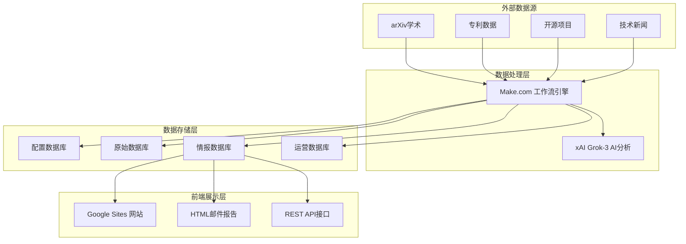

你好Jason！我来制定完整的技术方案，统一使用"Connectivity TechInsight"品牌名称。

## **Connectivity TechInsight 完整技术实现方案**

### **系统架构总览：**


## **平台选择和技术栈：**

### **1. 前端展示平台：Google Sites**
**选择理由：**
- ✅ 与Google Sheets无缝集成
- ✅ 免费且易于维护
- ✅ 响应式设计自动适配
- ✅ 权限管理便捷
- ✅ 实时数据同步

**技术实现：**
```
平台：Google Sites
域名：sites.google.com/view/connectivity-techinsight
技术：HTML5 + CSS3 + JavaScript
数据源：Google Sheets API
更新方式：实时同步
```

### **2. 数据处理引擎：Make.com**
**选择理由：**
- ✅ 强大的工作流自动化
- ✅ 丰富的API连接器
- ✅ 可视化流程设计
- ✅ 错误处理和监控
- ✅ 定时调度功能

**技术实现：**
```
平台：Make.com (原Integromat)
工作流：15个自动化流程
调度：定时触发 + 事件触发
监控：实时状态监控
容错：自动重试 + 异常处理
```

### **3. AI分析引擎：xAI Grok-3**
**选择理由：**
- ✅ 先进的语言理解能力
- ✅ 专业的技术分析
- ✅ API集成便捷
- ✅ 成本效益高

**技术实现：**
```
AI模型：xAI Grok-3
API调用：RESTful API
分析类型：技术评估、商业价值、竞争分析
响应格式：JSON结构化数据
质量控制：多轮验证 + 置信度评分
```

### **4. 数据存储：Google Sheets**
**选择理由：**
- ✅ 实时协作和共享
- ✅ API访问便捷
- ✅ 数据可视化内置
- ✅ 版本控制和备份
- ✅ 成本低廉

**数据库架构：**
```
1. Connectivity_TechInsight_Config_DB (配置管理)
2. Connectivity_TechInsight_RawData_DB (原始数据)  
3. Connectivity_TechInsight_Intelligence_DB (核心情报)
4. Connectivity_TechInsight_Operations_DB (系统运营)
```

## **完整页面架构设计：**

### **Page 1: Home (品牌首页)**
```
URL: /home
功能定位：品牌介绍和导航入口

页面内容：
├── 🚀 Connectivity TechInsight 品牌标题
├── 📝 系统价值主张
│   "AI驱动的技术情报决策引擎"
│   "实时监控·智能分析·精准决策"
├── 💡 核心能力展示
│   - 多源数据采集：6大数据源
│   - AI智能分析：xAI Grok-3驱动
│   - 实时决策支撑：15个自动化工作流
│   - 价值量化评估：TAM/SAM/ROI建模
├── 📊 今日系统概览
│   - 系统状态：🟢 运行正常
│   - 处理数据：355条
│   - 生成情报：23条
│   - 高价值发现：4个
└── 🎯 快速导航
    [进入仪表板] [数据监控] [分析中心] [价值评估]

技术实现：
- 静态HTML + CSS动画
- 品牌色彩：深蓝色主题 (#2c5aa0)
- 响应式设计：移动端优化
- 加载动画：提升用户体验
```

### **Page 2: Overview (核心仪表板)**
```
URL: /overview  
功能定位：实时监控和核心指标

页面内容：
├── 📊 核心统计面板 (5个卡片)
│   🧠 Data Collection: 355条 → /data
│   📈 AI Analysis: 5% → /analysis  
│   🔍 Verification: 2条 → /data#verification
│   💎 High-Value: 4个 → /assessment
│   ⚡ Action Items: 4项 → /action
├── 📈 实时趋势图表
│   - 7天数据采集趋势 (Google Sheets图表)
│   - 信号强度分布 (饼图)
│   - 处理效率变化 (柱状图)
│   - 高价值发现率 (面积图)
├── 🎯 今日重点情报 Top 5
│   - AI芯片架构突破 | 9.8分 | 🔴紧急
│   - 量子算法优化 | 9.5分 | 🟡高优
│   - 生物传感技术 | 9.2分 | 🟢中等
├── ⚠️ 系统健康监控
│   - 工作流状态
│   - API使用预警  
│   - 数据质量报告
└── 🔗 快速操作面板

技术实现：
- Google Sheets图表嵌入
- 实时数据更新 (5分钟刷新)
- 交互式卡片设计
- 状态颜色编码
```

### **Page 3: Data (数据采集中心)**
```
URL: /data
功能定位：数据采集全流程监控

页面内容：
├── 📊 采集总览仪表板
│   - 今日采集：355条
│   - 成功率：94.2%
│   - 6个数据源状态监控
├── 📋 数据源详细监控
│   - 学术论文 (arXiv/IEEE)：45条 📈+12%
│   - 专利数据 (USPTO/EPO)：78条 📈+8%
│   - 开源项目 (GitHub)：23条 📉-5%
│   - 技术新闻 (TechCrunch)：156条 📈+23%
│   - 产业动态 (SEC/会议)：34条 📈+15%
│   - 竞争情报 (LinkedIn)：19条 📈+3%
├── 🔍 数据验证状态 #verification
│   - 链接有效性：98.5%
│   - 数据质量评分：8.7/10
│   - 验证通过率：89.3%
├── 📈 采集趋势分析
│   - 7天趋势图
│   - 数据源对比
│   - 质量变化趋势
└── 📋 实时数据流
    - 最新采集记录
    - 处理状态监控
    - 异常数据标记

技术实现：
- Google Sheets数据表嵌入
- 实时状态更新
- 筛选和搜索功能
- 数据导出功能
```

### **Page 4: Analysis (AI分析中心)**
```
URL: /analysis
功能定位：AI分析流程监控

页面内容：
├── 🔄 分析流水线监控
│   信号识别(23) → 证据验证(18) → 价值分析(15) → 竞争分析(12) → 决策生成(8)
├── 🧠 xAI Grok-3 分析性能
│   - 平均响应时间：2.3秒
│   - 分析准确率：94.7%
│   - 置信度分布：高85% 中12% 低3%
├── 📊 工作流执行状态
│   - WF1-WF6: 数据采集 🟢正常
│   - WF7-WF8: 信号识别 🟡运行中
│   - WF9-WF11: 深度分析 ⏳队列中
│   - WF12-WF13: 决策输出 🟢完成
├── ⏱️ 处理队列管理
│   - 当前队列：23条情报
│   - 预计完成：14:30
│   - 优先级分布：紧急2 高优8 中等13
├── 📈 分析效率监控
│   - 处理吞吐量趋势
│   - 错误率统计
│   - 资源使用情况
└── 🔧 异常处理中心
    - 失败重试记录
    - 人工审核队列
    - 质量控制报告

技术实现：
- 实时工作流状态监控
- Make.com执行日志集成
- 进度条和状态指示器
- 异常告警系统
```

### **Page 5: Assessment (价值评估中心)**
```
URL: /assessment  
功能定位：高价值情报管理

页面内容：
├── 💎 高价值情报仪表板
│   - 信号强度≥8.0：4个情报
│   - 平均信号强度：8.7分
│   - 技术领域分布：AI(50%) 量子(25%) 生物(25%)
├── 📊 商业价值分析
│   - TAM总市场：$2.5B
│   - SAM可服务市场：$800M  
│   - SOM可获得市场：$120M
│   - 平均ROI预期：156%
├── 🏢 竞争情报监控
│   - 威胁等级分布：高2 中1 低1
│   - 关键竞争对手：5家
│   - 专利布局分析：23项相关专利
├── 🔬 技术深度评估
│   - TRL平均等级：6.8/9
│   - 技术可行性：高87.5%
│   - 商业化时间：平均18个月
├── 🎯 投资建议排行
│   1. AI芯片架构 | 9.8分 | $50M市场 | 🔴立即投资
│   2. 量子算法优化 | 9.5分 | $30M市场 | 🟡6个月内
│   3. 生物传感器 | 9.2分 | $20M市场 | 🟢12个月内
└── 📈 价值趋势分析
    - 信号强度变化趋势
    - 市场机会演进
    - 投资回报预测

技术实现：
- 商业价值计算引擎
- 交互式图表展示
- 投资建议算法
- 风险评估模型
```

### **Page 6: Action (行动管理中心)**
```
URL: /action
功能定位：决策执行和管理

页面内容：
├── ⚡ 待执行行动项
│   🔴 紧急 (2项)：
│   - AI芯片技术调研 | 截止：今日 | 负责人：张工
│   - 竞争对手专利分析 | 截止：明日 | 负责人：李工
│   🟡 高优先级 (1项)：
│   - 量子算法合作洽谈 | 截止：本周 | 负责人：王总
│   🟢 中等优先级 (1项)：
│   - 生物传感器市场调研 | 截止：下周 | 负责人：赵工
├── 📋 决策建议分类管理
│   - 投资建议：3项 (总金额$2.5M)
│   - 合作建议：2项 (潜在收益$800K)
│   - 监控建议：4项 (风险等级中)
│   - 研发建议：1项 (预算$300K)
├── 📊 执行进度跟踪
│   - 本月完成：15项 (93.8%成功率)
│   - 进行中：8项 (平均进度65%)
│   - 待开始：4项 (资源准备中)
├── 💼 资源需求规划
│   - 预算需求：Q4总计$5.2M
│   - 人员需求：技术专家3名
│   - 时间估算：平均6.5周/项目
├── 📈 执行效果评估
│   - 投资回报实现率：127%
│   - 项目成功率：89.3%
│   - 风险控制有效性：92.1%
└── 🔔 提醒和通知
    - 即将到期：3项任务
    - 资源冲突：1项预警
    - 进度延迟：2项关注

技术实现：
- 任务管理系统
- 进度跟踪算法
- 自动提醒机制
- 效果评估模型
```

### **Page 7: System (系统监控中心)**
```
URL: /system
功能定位：系统运维和健康监控

页面内容：
├── 🔧 系统健康仪表板
│   - 整体状态：🟢 优秀 (98.7%可用性)
│   - 工作流状态：15个流程全部正常
│   - API状态：6个外部API连接正常
│   - 数据库连接：4个数据库同步正常
├── 📊 性能监控指标
│   - 平均响应时间：1.8秒
│   - 日处理量：355条数据
│   - 错误率：0.3% (目标<1%)
│   - 吞吐量：156条/小时
├── ⚠️ 告警和通知中心
│   🟡 当前告警 (2项)：
│   - USPTO API使用率85% (接近限额)
│   - 数据质量异常3条记录待审核
│   🔵 系统信息 (1项)：
│   - 计划维护窗口：3天后 02:00-04:00
├── 📋 系统日志中心
│   - 操作日志：今日1,247条记录
│   - 错误日志：今日2条异常
│   - 性能日志：响应时间监控
│   - 安全日志：访问记录追踪
├── 🔄 维护管理
│   - 上次维护：2025-06-15 成功
│   - 下次维护：2025-06-25 计划中
│   - 数据备份：每日自动备份
│   - 版本更新：v2.0.3 当前版本
├── 📈 长期趋势分析
│   - 30天性能趋势
│   - 用户访问统计
│   - 数据增长趋势
│   - 成本效益分析
└── 🛠️ 系统配置管理
    - 工作流参数调整
    - API配额管理
    - 告警阈值设置
    - 用户权限管理

技术实现：
- 系统监控仪表板
- 实时告警系统
- 日志聚合分析
- 自动化运维脚本
```

## **系统对接和集成方案：**

### **1. Make.com 工作流对接：**
```javascript
// 数据流向：Make → Google Sheets → Google Sites
Make工作流输出 → Google Sheets API → 实时数据更新 → Google Sites自动刷新

// 具体对接方式：
1. Make.com执行工作流
2. 结果写入Google Sheets指定表格
3. Google Sites通过IMPORTRANGE函数实时读取
4. 页面每5分钟自动刷新数据
```

### **2. Google Sheets数据库对接：**
```javascript
// 数据库连接配置
const databases = {
  config: '1abc...def', // Connectivity_TechInsight_Config_DB
  rawdata: '1ghi...jkl', // Connectivity_TechInsight_RawData_DB  
  intelligence: '1mno...pqr', // Connectivity_TechInsight_Intelligence_DB
  operations: '1stu...vwx' // Connectivity_TechInsight_Operations_DB
};

// Google Sites页面数据源配置
=IMPORTRANGE("1mno...pqr","Tech_Intelligence_Master!A:Z")
=QUERY(IMPORTRANGE("1stu...vwx","Workflow_Execution_Log!A:AA"),"SELECT * WHERE B='completed'")
```

### **3. xAI API集成：**
```javascript
// Make.com中的xAI模块配置
{
  "connection": "xAI-Grok-3",
  "model": "grok-3",
  "temperature": 0.2,
  "max_tokens": 4000,
  "system_prompt": "你是Connectivity TechInsight的AI分析专家..."
}
```

### **4. 邮件报告集成：**
```javascript
// WF13报告生成工作流
Google Sheets数据 → xAI内容生成 → HTML邮件模板 → SMTP发送
↓
邮件中的统计面板链接 → Google Sites对应页面
```

## **部署和维护方案：**

### **1. 部署步骤：**
```
Phase 1: 基础设施 (Week 1-2)
├── 创建Google Sites站点
├── 设置4个Google Sheets数据库
├── 配置Make.com工作流
└── 集成xAI API

Phase 2: 页面开发 (Week 3-4)  
├── 开发7个页面的HTML/CSS
├── 配置数据源连接
├── 测试页面跳转逻辑
└── 优化移动端体验

Phase 3: 系统集成 (Week 5-6)
├── 完整数据流测试
├── 邮件报告集成
├── 权限和安全设置
└── 性能优化调试
```

### **2. 运维监控：**
```
日常监控：
├── Google Sites访问统计
├── Make.com工作流执行状态
├── Google Sheets数据更新
├── xAI API调用统计
└── 用户反馈收集

定期维护：
├── 每周数据质量检查
├── 每月性能优化
├── 季度功能更新
└── 年度架构评估
```

### **3. 成本预估：**
```
Google Sites: 免费
Google Sheets: 免费 (Google Workspace)
Make.com: $29/月 (Pro计划)
xAI API: ~$100/月 (预估使用量)
总计: ~$129/月
```

**这个完整方案整合了所有技术平台，统一了品牌名称为"Connectivity TechInsight"，提供了清晰的页面架构和技术实现路径。你觉得这个方案如何？需要调整哪些部分？**
