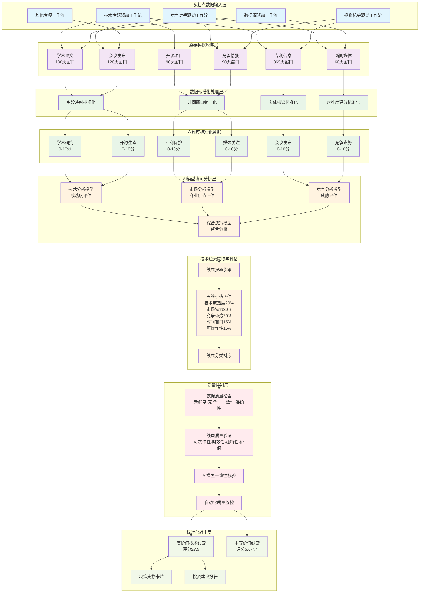
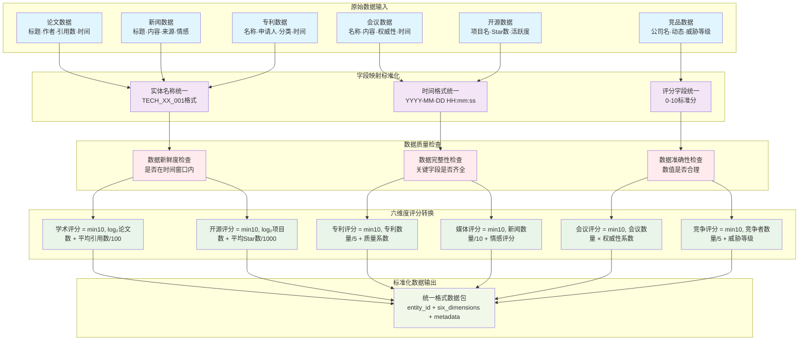
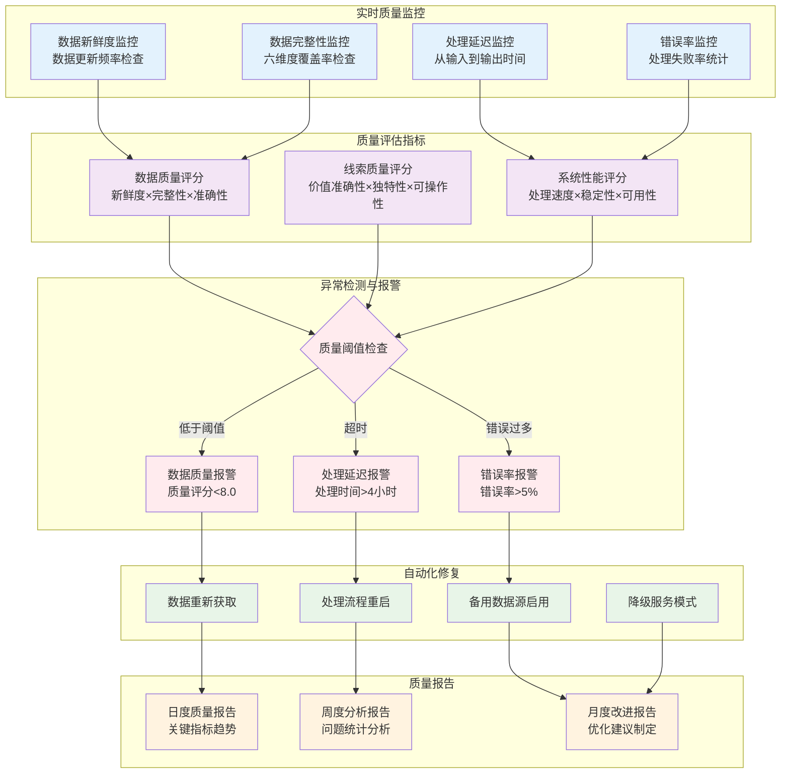

# ICT技术线索工作流统一化指导原则

**版本：** v1.0  
**制定日期：** 2025-06-19  
**适用范围：** 所有技术情报收集与分析工作流  
**目标：** 统一多源数据工作流，提升高价值技术线索输出质量

---

## **1. 总体指导原则**

### **1.1 核心目标导向**
所有工作流设计必须服务于**"输出高价值技术线索"**这一核心目标。技术线索的价值体现在：
- **前瞻性**：能够提前识别技术发展趋势
- **可操作性**：能够转化为具体的投资或研发决策
- **稀缺性**：具备竞争对手尚未发现的独特洞察
- **时效性**：在技术发展的关键时间窗口内被发现

### **1.2 多起点兼容原则**
承认并保持多种工作流起点的合理性：
- **技术专题驱动**：适用于深度技术研究和发展趋势分析
- **竞争对手驱动**：适用于市场竞争情报和策略分析
- **数据源驱动**：适用于大规模信息筛选和异常发现
- **投资机会驱动**：适用于商业化机会识别和评估

### **1.3 标准化不僵化原则**
在确保数据一致性的同时，保持工作流的灵活性和适应性：
- 统一输出格式，不限制输入方式
- 标准化核心流程，允许个性化扩展
- 建立最小标准，支持渐进优化

---

## **2. 数据标准化原则**

### **2.1 六维度数据标准**

**强制标准化的六个核心数据维度：**

| 维度 | 标准指标 | 评分范围 | 标准化公式 |
|------|----------|----------|------------|
| 学术研究 | 论文数量+平均引用数 | 0-10 | $$\text{学术评分} = \min(10, \log_2(\text{论文数}) + \frac{\text{平均引用数}}{100})$$ |
| 开源生态 | 项目数量+活跃度 | 0-10 | $$\text{开源评分} = \min(10, \log_2(\text{项目数}) + \frac{\text{平均Star数}}{1000})$$ |
| 专利保护 | 专利数量+质量 | 0-10 | $$\text{专利评分} = \min(10, \frac{\text{专利数量}}{5} + \text{专利质量系数})$$ |
| 媒体关注 | 新闻数量+情感倾向 | 0-10 | $$\text{媒体评分} = \min(10, \frac{\text{新闻数量}}{10} + \text{情感评分})$$ |
| 会议发布 | 会议数量+权威性 | 0-10 | $$\text{会议评分} = \min(10, \text{会议数量} \times \text{权威性系数})$$ |
| 竞争态势 | 竞争者数量+威胁等级 | 0-10 | $$\text{竞争评分} = \min(10, \frac{\text{竞争者数量}}{5} + \text{威胁等级})$$ |

### **2.2 时间窗口标准**

**统一的数据收集时间窗口：**
- **学术研究**：180天（考虑学术发表周期）
- **开源项目**：90天（技术迭代较快）
- **专利信息**：365天（专利申请周期较长）
- **新闻媒体**：60天（时效性要求高）
- **会议发布**：120天（会议举办周期）
- **竞争情报**：90天（市场变化频率）

### **2.3 实体标识标准**

**统一实体命名规范：**
```
技术实体ID: TECH_[领域代码]_[序号]
  示例: TECH_AI_001 (人工智能)
        TECH_BC_001 (区块链)

竞争对手ID: COMP_[规模]_[序号] 
  示例: COMP_LARGE_001 (大型企业)
        COMP_STARTUP_001 (初创公司)

专利ID: PATENT_[国家]_[年份]_[序号]
  示例: PATENT_US_2024_001
```

---

## **3. 技术线索价值评估原则**

### **3.1 线索价值评估框架**

**五维价值评估模型：**

$$\text{线索价值分} = \sum_{i=1}^{5} (\text{维度评分}_i \times \text{权重}_i) \times \text{置信度系数}$$

**权重分配：**
- **技术成熟度**：20% - 技术发展阶段和实现可能性
- **市场潜力**：30% - 商业化价值和市场规模
- **竞争态势**：20% - 竞争激烈程度和进入壁垒
- **时间窗口**：15% - 机会窗口的长短和紧迫性
- **可操作性**：15% - 转化为具体行动的可能性

### **3.2 线索分类标准**

**按信号类型分类：**
- **breakthrough_hint**：技术突破暗示（权重系数1.2）
- **paradigm_shift**：范式转移信号（权重系数1.3）
- **bottleneck_discovery**：瓶颈发现（权重系数1.0）
- **new_approach**：新方法论（权重系数1.1）
- **future_implication**：未来暗示（权重系数0.9）

**按价值等级分类：**
- **高价值线索**：综合评分 ≥ 7.5
- **中等价值线索**：综合评分 5.0-7.4
- **低价值线索**：综合评分 < 5.0

### **3.3 线索输出标准格式**

**标准化技术线索输出模板：**
```json
{
  "signal_id": "唯一信号标识符",
  "signal_title": "线索标题（20字以内）",
  "value_score": "价值评分（0-10）",
  "signal_type": "信号类型分类",
  "technical_domain": "技术领域",
  "maturity_stage": "技术成熟度阶段",
  "market_opportunity": "市场机会描述",
  "competitive_analysis": "竞争态势分析", 
  "action_recommendations": "行动建议列表",
  "risk_assessment": "风险评估",
  "urgency_level": "紧迫性评分（1-10）",
  "confidence_score": "置信度（0-1）",
  "data_sources": "支撑数据来源",
  "discovery_timestamp": "发现时间戳"
}
```

---

## **4. 工作流设计原则**

### **4.1 模块化设计原则**

**标准工作流模块构成：**
1. **数据收集模块**：从各数据源获取原始信息
2. **数据标准化模块**：将原始数据转换为标准格式
3. **线索提取模块**：使用AI从标准化数据中提取技术线索
4. **价值评估模块**：对提取的线索进行价值评估和排序
5. **输出格式化模块**：将线索转换为标准输出格式
6. **质量控制模块**：进行数据质量检查和线索验证

### **4.2 数据流标准化**

**统一的数据传递格式：**
```json
{
  "workflow_metadata": {
    "workflow_id": "工作流标识",
    "execution_timestamp": "执行时间戳",
    "data_freshness": "数据新鲜度评分"
  },
  "entity_context": {
    "primary_entity_id": "主实体标识",
    "entity_type": "实体类型",
    "related_entities": "关联实体列表"
  },
  "standardized_data": {
    "six_dimensions": "六维度标准化数据",
    "quality_indicators": "数据质量指标",
    "completeness_score": "数据完整性评分"
  },
  "extracted_signals": {
    "signal_count": "提取的线索数量",
    "high_value_signals": "高价值线索列表",
    "confidence_distribution": "置信度分布"
  }
}
```

### **4.3 AI模型协同原则**

**多模型分析标准：**
- **技术分析模型**：专注技术成熟度和发展趋势
- **市场分析模型**：专注商业价值和市场机会
- **竞争分析模型**：专注竞争态势和威胁评估
- **综合决策模型**：整合多模型结果，输出最终建议

**模型一致性要求：**
- 输入格式标准化：所有模型使用相同的输入数据格式
- 输出格式标准化：所有模型输出JSON格式的结构化结果
- 置信度标准化：所有模型必须提供0-1范围的置信度评分

---

## **5. 质量控制原则**

### **5.1 数据质量标准**

**强制质量检查点：**
1. **数据新鲜度检查**：所有数据必须在有效时间窗口内
2. **数据完整性检查**：六维度数据完整性不低于60%
3. **数据一致性检查**：同一实体的数据在不同来源间一致性不低于85%
4. **数据准确性检查**：关键数据字段准确性不低于95%

### **5.2 线索质量标准**

**线索输出质量要求：**
- **可操作性验证**：每个高价值线索必须包含具体的行动建议
- **时效性验证**：线索发现到输出的时间不超过4小时
- **独特性验证**：避免重复发现相同的技术线索
- **价值验证**：通过历史数据回测验证价值评估模型准确性

### **5.3 自动化质量监控**

**质量监控指标：**
```json
{
  "data_quality_kpis": {
    "data_freshness_score": "数据新鲜度评分",
    "data_completeness_rate": "数据完整性比率",
    "cross_source_consistency": "跨源一致性评分",
    "processing_latency": "处理延迟时间"
  },
  "signal_quality_kpis": {
    "high_value_signal_ratio": "高价值线索比例",
    "signal_uniqueness_rate": "线索独特性比率",
    "actionability_score": "可操作性评分",
    "confidence_accuracy": "置信度准确性"
  }
}
```

---

## **6. 实施指导原则**

### **6.1 渐进式改造策略**

**三阶段实施计划：**

**阶段一：基础标准化**（4-6周）
- 统一六维度数据格式
- 建立标准化处理模块
- 实现基本的线索提取功能

**阶段二：质量提升**（6-8周）
- 完善AI模型协同
- 建立质量监控体系
- 优化线索价值评估算法

**阶段三：智能化升级**（8-10周）
- 实现自动化关联发现
- 建立预测性质量管理
- 完善决策支持功能

### **6.2 兼容性保证**

**新旧系统并存策略：**
- 现有工作流保持运行，逐步接入标准化接口
- 新工作流严格按照标准设计
- 建立数据迁移和同步机制

### **6.3 持续优化机制**

**定期评估和改进：**
- **周度评估**：线索质量和数据质量指标
- **月度评估**：工作流效率和标准化程度
- **季度评估**：整体目标达成情况和策略调整

---

## **7. 成功衡量标准**

### **7.1 定量指标**

**核心KPI设定：**
- **线索发现效率**：从数据收集到线索输出时间 < 4小时
- **高价值线索比例**：评分≥7.5的线索占比 > 25%
- **线索独特性**：新发现线索比例 > 60%
- **数据质量综合评分**：> 8.0（满分10分）
- **工作流标准化程度**：> 90%

### **7.2 定性指标**

**业务价值体现：**
- 技术线索的前瞻性和准确性得到业务部门认可
- 基于线索的决策有效性和执行成功率提升
- 竞争优势的获得和市场机会的及时把握
- 研发投资的精准性和回报率改善

---

## **8. 风险控制与应急预案**

### **8.1 主要风险识别**

**技术风险：**
- AI模型准确性下降
- 数据源质量恶化
- 系统性能瓶颈

**业务风险：**
- 线索价值评估偏差
- 重要线索遗漏
- 竞争对手信息泄露

### **8.2 应急处理机制**

**风险应对策略：**
- 建立多模型冗余备份
- 设置人工审核检查点
- 定期进行系统压力测试
- 建立快速回滚机制

---

**本文档为ICT技术线索工作流统一化的指导性原则，各具体工作流的设计和实施应严格遵循本原则，确保整体目标的有效达成。**

# ICT技术线索工作流统一化架构图

## **整体架构流程图**



## **技术线索价值评估详细流程图**

```mermaid
graph LR
    subgraph "线索提取"
        A[标准化数据输入] --> B[AI线索提取引擎]
        B --> C[原始技术线索]
    end
    
    subgraph "五维价值评估"
        C --> D1[技术成熟度评估<br/>权重20%]
        C --> D2[市场潜力评估<br/>权重30%]
        C --> D3[竞争态势评估<br/>权重20%]
        C --> D4[时间窗口评估<br/>权重15%]
        C --> D5[可操作性评估<br/>权重15%]
    end
    
    subgraph "综合评分计算"
        D1 --> E[价值评分算法<br/>Σ(维度评分×权重)×置信度]
        D2 --> E
        D3 --> E
        D4 --> E
        D5 --> E
        E --> F[综合价值评分<br/>0-10分]
    end
    
    subgraph "线索分类与输出"
        F --> G{价值评分分级}
        G -->|≥7.5| H1[高价值线索<br/>重点关注]
        G -->|5.0-7.4| H2[中等价值线索<br/>持续监控]
        G -->|<5.0| H3[低价值线索<br/>归档备查]
    end
    
    subgraph "质量验证"
        H1 --> I1[可操作性验证]
        H1 --> I2[独特性验证]
        H1 --> I3[时效性验证]
        I1 --> J[最终输出]
        I2 --> J
        I3 --> J
    end
    
    %% 样式
    classDef extract fill:#e3f2fd
    classDef evaluate fill:#f3e5f5
    classDef calculate fill:#e8f5e8
    classDef classify fill:#fff3e0
    classDef verify fill:#ffebee
    
    class A,B,C extract
    class D1,D2,D3,D4,D5 evaluate
    class E,F calculate
    class G,H1,H2,H3 classify
    class I1,I2,I3,J verify
```

## **数据标准化处理详细流程图**



## **质量控制与监控体系图**



这些图示清晰地展现了ICT技术线索工作流统一化的完整架构，包括：

1. **整体架构流程图**：展示从多起点输入到高价值线索输出的完整流程
2. **技术线索价值评估详细流程图**：详细说明五维价值评估的具体过程
3. **数据标准化处理详细流程图**：展示六维度数据标准化的具体步骤
4. **质量控制与监控体系图**：说明质量保证的完整机制

这些图示与前面的原则性文档相互呼应，为实际实施提供了清晰的可视化指导。
