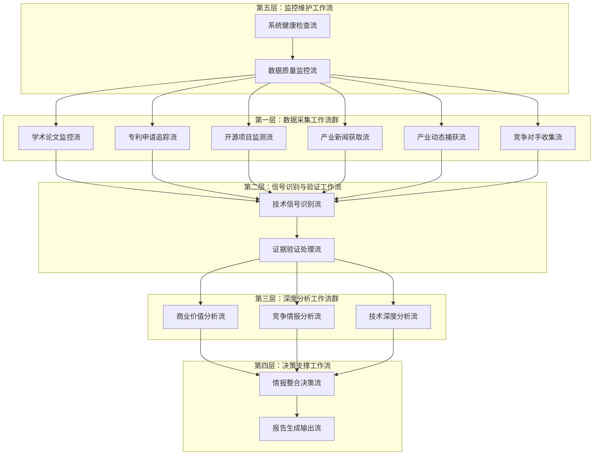
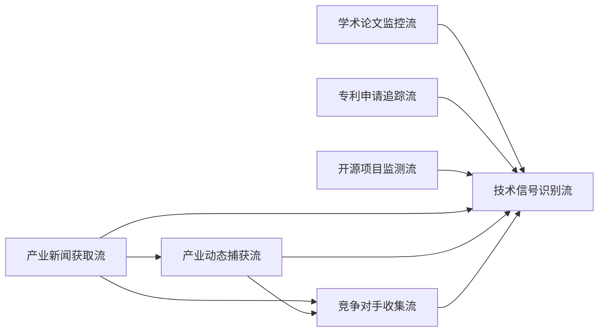

# 技术情报决策引擎 - Make工作流架构设计（修订版）

## **工作流总体架构**

### **核心设计理念：分层协同的情报处理管道**



## **第一层：数据采集工作流群（6条并行工作流）**

### **WF1：学术论文监控流**
```
触发方式：定时触发（每6小时）
数据源：arXiv, Google Scholar, PubMed, IEEE Xplore

工作流步骤：
1. 连接各学术数据源API
2. 使用预设关键词搜索最新论文
3. 提取论文元数据（标题、摘要、作者、发布时间）
4. AI初步筛选（技术突破性评估）
5. 写入临时数据表：Raw_Academic_Papers
6. 触发WF7（技术信号识别流）

输出格式：
{
  "source_type": "academic_paper",
  "title": "论文标题",
  "abstract": "摘要内容",
  "authors": ["作者列表"],
  "publication_date": "2024-12-19",
  "source_url": "原文链接",
  "initial_relevance_score": 8.5,
  "tech_keywords": ["AI", "breakthrough", "efficiency"]
}
```

### **WF2：专利申请追踪流**
```
触发方式：定时触发（每12小时）
数据源：USPTO, EPO, WIPO, Google Patents

工作流步骤：
1. 连接专利数据库API
2. 搜索最新专利申请（关键技术领域）
3. 提取专利摘要和技术分类
4. 识别申请公司和发明人
5. 评估专利技术重要性
6. 写入临时数据表：Raw_Patent_Data
7. 触发WF7

输出格式：
{
  "source_type": "patent",
  "patent_number": "US20240123456",
  "title": "专利标题",
  "abstract": "技术摘要",
  "applicant": "公司名称",
  "filing_date": "2024-12-19",
  "tech_classification": ["G06N", "H04L"],
  "innovation_score": 7.8
}
```

### **WF3：开源项目监测流**
```
触发方式：定时触发（每4小时）
数据源：GitHub, GitLab, SourceForge

工作流步骤：
1. 监控热门技术仓库
2. 识别重大更新和新项目
3. 分析代码提交频率和贡献者
4. 评估项目技术创新性
5. 提取README和文档关键信息
6. 写入临时数据表：Raw_OpenSource_Data
7. 触发WF7

输出格式：
{
  "source_type": "opensource",
  "project_name": "项目名称",
  "repository_url": "GitHub链接",
  "description": "项目描述",
  "stars": 15420,
  "recent_activity": "高活跃",
  "key_technologies": ["Python", "ML", "API"],
  "innovation_potential": 8.2
}
```

### **WF4：产业新闻获取流**
```
触发方式：定时触发（每2小时）
数据源：TechCrunch, VentureBeat, Wired, The Verge, MIT Technology Review

工作流步骤：
1. 爬取主流科技媒体最新报道
2. RSS订阅源实时监控
3. 关键词过滤技术相关新闻
4. 提取新闻标题、摘要、发布时间
5. AI初步评估新闻技术价值
6. 写入临时数据表：Raw_Tech_News
7. 为WF5提供新闻线索
8. 触发WF7

输出格式：
{
  "source_type": "tech_news",
  "headline": "新闻标题",
  "summary": "新闻摘要",
  "full_content": "完整内容",
  "publication_date": "2024-12-19",
  "news_source": "TechCrunch",
  "author": "记者姓名",
  "source_url": "原文链接",
  "tech_relevance_score": 7.3,
  "mentioned_companies": ["OpenAI", "Google"],
  "tech_categories": ["AI", "ML", "LLM"],
  "breaking_news_flag": true
}

特殊处理：
- 突发重大技术新闻：立即触发WF7
- 新闻聚合去重：相同事件的多篇报道合并
- 可信度评估：基于媒体权威性和记者声誉
```

### **WF5：产业动态捕获流**
```
触发方式：定时触发（每8小时）+ WF4新闻线索触发
数据源：公司官网, 财报, 产品发布会, 投资公告

工作流步骤：
1. 基于WF4新闻线索深度挖掘
2. 监控重点公司官方发布
3. 分析融资和并购消息
4. 识别产品发布和技术突破
5. 提取关键商业信息和技术细节
6. 交叉验证新闻真实性
7. 写入临时数据表：Raw_Industry_Dynamics
8. 触发WF7

输出格式：
{
  "source_type": "industry_dynamics",
  "event_type": "product_launch", // funding, acquisition, partnership, product_launch
  "headline": "事件标题",
  "company": "相关公司",
  "announcement_date": "2024-12-19",
  "official_source_url": "官方来源链接",
  "news_source_urls": ["相关新闻链接"],
  "event_details": {
    "funding_amount": "$100M",
    "investors": ["Sequoia", "A16Z"],
    "product_specs": "产品技术规格",
    "market_target": "目标市场"
  },
  "business_impact_score": 8.5,
  "tech_innovation_score": 7.8,
  "competitive_significance": 9.2,
  "verification_status": "confirmed" // confirmed, pending, disputed
}

关键增强功能：
- 新闻线索深度验证：对WF4发现的新闻进行官方确认
- 多源交叉验证：结合官方公告、财报、第三方报道
- 竞争影响评估：分析事件对竞争格局的影响
- 技术细节挖掘：从产品发布中提取技术创新点
```

### **WF6：竞争对手收集流**
```
触发方式：定时触发（每24小时）+ 重要事件触发
数据源：LinkedIn, 公司官网, Crunchbase, PitchBook, 招聘网站

工作流步骤：
1. 重点竞争对手动态监控
   - 关键人事变动（CTO、首席科学家）
   - 技术团队扩张情况
   - 研发投入变化
   
2. 新兴竞争者识别
   - 初创公司融资信息
   - 技术专利申请活跃度
   - 产品发布频率
   
3. 竞争对手技术布局分析
   - 研发方向识别
   - 技术合作伙伴
   - 学术界合作情况
   
4. 人才流动情报收集
   - 关键技术人才跳槽
   - 团队组建模式
   - 薪酬水平变化
   
5. 竞争策略情报
   - 市场进入策略
   - 定价策略变化
   - 合作伙伴关系
   
6. 写入临时数据表：Raw_Competitor_Intelligence
7. 触发WF7

输出格式：
{
  "source_type": "competitor_intelligence",
  "competitor_name": "竞争对手名称",
  "intelligence_type": "talent_movement", // funding, talent_movement, tech_development, strategy_shift
  "event_description": "具体事件描述",
  "discovery_date": "2024-12-19",
  "source_urls": ["LinkedIn链接", "新闻链接"],
  "key_personnel": {
    "name": "关键人员姓名",
    "role": "职位",
    "previous_company": "前公司",
    "expertise": ["AI", "ML", "Computer Vision"]
  },
  "funding_details": {
    "round": "Series B",
    "amount": "$50M",
    "lead_investor": "Tiger Global",
    "valuation": "$500M"
  },
  "tech_focus": ["自动驾驶", "计算机视觉", "边缘计算"],
  "competitive_threat_level": 8.5,
  "strategic_significance": 7.9,
  "intelligence_confidence": 0.92
}

特殊功能：
- 竞争对手分级监控：
  * Tier 1: 直接竞争对手（每日监控）
  * Tier 2: 潜在威胁（每周监控）
  * Tier 3: 生态相关（每月监控）
  
- 预警机制：
  * 重大人事变动：24小时内预警
  * 大额融资：12小时内预警
  * 技术突破：6小时内预警
  
- 情报价值评估：
  * 时效性：信息新鲜度
  * 可靠性：来源权威程度
  * 影响性：对我方战略的影响程度
```

## **数据采集工作流的协同关系**

### **工作流间的信息传递**



### **触发关系优化**

**WF4 → WF5 触发逻辑：**
```
当WF4发现以下类型新闻时，立即触发WF5：
- 重大产品发布新闻
- 融资并购消息
- 技术突破报道
- 合作伙伴关系变化

触发数据包：
{
  "trigger_source": "WF4",
  "news_headline": "新闻标题",
  "mentioned_companies": ["公司列表"],
  "event_type": "产品发布",
  "urgency_level": "high",
  "verification_required": true
}
```

**WF4/WF5 → WF6 触发逻辑：**
```
当发现竞争对手相关信息时触发WF6：
- 竞争对手公司被提及
- 关键人员变动新闻
- 技术合作公告
- 市场策略变化

触发数据包：
{
  "trigger_source": "WF4/WF5",
  "competitor_name": "竞争对手名称",
  "intelligence_hint": "情报线索",
  "priority_level": "high",
  "deep_dive_required": true
}
```

### **数据质量协同机制**

**多源验证机制：**
```
同一事件的多源确认：
WF4 (新闻报道) + WF5 (官方确认) + WF6 (竞争对手反应) = 高置信度情报

验证流程：
1. WF4发现新闻 → 标记"待验证"
2. WF5官方确认 → 更新"已确认"
3. WF6竞争反应 → 评估"影响程度"
```

**信息去重与整合：**
```
去重规则：
- 同一事件24小时内的多篇报道合并
- 相同专利的多次申请记录合并
- 同一项目的多个代码库更新整合

整合策略：
- 保留最权威来源作为主要证据
- 其他来源作为支撑证据
- 生成综合可信度评分
```

这个修订后的数据采集工作流群设计具有以下优势：

1. **信息流向更合理**：产业新闻获取 → 产业动态捕获 → 竞争对手收集，形成递进式深化
2. **竞争情报更全面**：专门的竞争对手收集流，系统性监控竞争态势
3. **验证机制更强**：多个工作流相互验证，提高情报可靠性
4. **响应速度更快**：突发事件可以触发相关工作流立即响应
5. **情报价值更高**：从新闻线索到深度情报的完整链条

# 技术情报决策引擎 - 完整工作流数据流动设计

## **第二层：信号识别与验证工作流**

### **WF7：技术信号识别流**

**数据输入汇聚机制：**
```
输入数据汇聚点：
- 来源：WF1-WF6的6个数据采集流
- 汇聚频率：实时接收，批量处理（每30分钟）
- 数据暂存：Raw_Data_Queue表

数据预处理：
{
  "batch_id": "BATCH_20241219_143000",
  "processing_timestamp": "2024-12-19T14:30:00Z",
  "input_sources": {
    "academic_papers": 15,
    "patents": 8,
    "opensource": 12,
    "tech_news": 25,
    "industry_dynamics": 6,
    "competitor_intel": 9
  },
  "total_raw_records": 75
}
```

**信号识别处理步骤：**

**步骤1：多源数据标准化**
```
标准化处理：
1. 文本内容统一编码（UTF-8）
2. 时间格式标准化（ISO 8601）
3. 技术关键词标准化
4. 来源可信度评分统一

输出格式：
{
  "raw_data_id": "RAW_20241219_001",
  "standardized_content": {
    "title": "标准化标题",
    "content": "标准化内容",
    "tech_keywords": ["AI", "machine-learning", "neural-network"],
    "entities": {
      "companies": ["OpenAI", "Google"],
      "people": ["Sam Altman"],
      "technologies": ["GPT-4", "Transformer"]
    },
    "source_credibility": 8.5,
    "content_quality_score": 7.8
  }
}
```

**步骤2：技术信号强度评估**
```
信号强度计算模型：
signal_strength = (
    breakthrough_score * 0.3 +      # 技术突破性
    market_impact_score * 0.25 +    # 市场影响力
    source_authority_score * 0.2 +  # 来源权威性
    novelty_score * 0.15 +          # 新颖性
    validation_score * 0.1          # 多源验证度
)

评估维度：
- 技术突破性：性能提升幅度、新原理应用、跨领域融合
- 市场影响力：潜在市场规模、应用广度、商业化可行性
- 来源权威性：发布机构声誉、专家认可度、媒体权威性
- 新颖性：技术新鲜度、与现有技术差异度
- 多源验证度：独立来源确认数量、信息一致性

输出示例：
{
  "signal_evaluation": {
    "breakthrough_score": 8.5,
    "market_impact_score": 7.2,
    "source_authority_score": 9.1,
    "novelty_score": 8.8,
    "validation_score": 6.5,
    "overall_signal_strength": 8.0
  }
}
```

**步骤3：Intelligence_ID生成与记录创建**
```
ID生成条件：
- signal_strength ≥ 6.0
- 至少2个独立来源确认
- 技术相关性评分 ≥ 7.0

ID生成逻辑：
def generate_intelligence_id(signal_data):
    date_str = datetime.now().strftime("%Y%m%d")
    
    # 技术类别映射
    category_map = {
        "artificial-intelligence": "A",
        "quantum-computing": "Q", 
        "biotechnology": "B",
        "energy-tech": "E",
        "materials-science": "M",
        "robotics": "R",
        "blockchain": "C",
        "space-tech": "S"
    }
    
    # 获取当日序号
    daily_sequence = get_daily_sequence_number(date_str)
    
    # 生成ID
    intelligence_id = f"TI{date_str}{daily_sequence:03d}{category_map[tech_category]}"
    
    return intelligence_id

创建主表记录：
{
  "intelligence_id": "TI20241219001A",
  "signal_title": "GPT-5架构突破：多模态推理能力提升300%",
  "tech_category": "artificial-intelligence",
  "discovery_timestamp": "2024-12-19T14:30:00Z",
  "signal_strength": 8.0,
  "signal_lifecycle_status": "Active",
  "data_sources_count": 3,
  "primary_source_type": "industry_dynamics",
  
  # 初始化待计算字段
  "confidence_level": 0.00,
  "commercial_value_score": 0.0,
  "investment_opportunity_score": 0.0,
  "competitive_threat_level": 0.0,
  "evidence_validation_status": "Pending",
  "expert_validation_status": "Pending",
  "analysis_completion_status": "In_Progress"
}
```

**步骤4：触发后续工作流**
```
触发机制：
1. 同步触发WF8（证据验证处理流）
2. 异步触发WF9, WF10, WF11（深度分析工作流群）

触发数据包：
{
  "trigger_event": "new_intelligence_created",
  "intelligence_id": "TI20241219001A",
  "priority_level": "high", // 基于signal_strength确定
  "raw_data_sources": [
    {
      "source_id": "RAW_20241219_001",
      "source_type": "industry_dynamics",
      "source_url": "https://techcrunch.com/...",
      "relevance_score": 9.2
    }
  ],
  "processing_requirements": {
    "evidence_validation": true,
    "commercial_analysis": true,
    "competitive_analysis": true,
    "technical_analysis": true
  }
}
```

### **WF8：证据验证处理流**

**触发接收与数据准备：**
```
输入接收：
- 来源：WF7触发
- 输入数据：intelligence_id + 原始数据源信息
- 处理优先级：基于signal_strength排序

数据准备：
{
  "validation_session": {
    "session_id": "VAL_TI20241219001A_001",
    "intelligence_id": "TI20241219001A", 
    "start_timestamp": "2024-12-19T14:35:00Z",
    "raw_sources": [
      {
        "source_url": "https://openai.com/research/gpt5-breakthrough",
        "source_type": "official_announcement",
        "discovery_source": "industry_dynamics"
      },
      {
        "source_url": "https://arxiv.org/abs/2024.12345",
        "source_type": "academic_paper", 
        "discovery_source": "academic_papers"
      }
    ]
  }
}
```

**证据验证处理步骤：**

**步骤1：链接有效性验证**
```
验证机制：
1. HTTP状态码检查
2. 内容完整性验证
3. 访问权限确认
4. 内容更新时间检查

处理逻辑：
def validate_source_links(sources):
    validation_results = []
    
    for source in sources:
        try:
            response = requests.get(source['url'], timeout=30)
            
            validation_result = {
                "source_url": source['url'],
                "http_status": response.status_code,
                "response_time_ms": response.elapsed.total_seconds() * 1000,
                "content_length": len(response.content),
                "last_modified": response.headers.get('Last-Modified'),
                "accessibility_status": "accessible" if response.status_code == 200 else "error",
                "content_hash": hashlib.md5(response.content).hexdigest(),
                "validation_timestamp": datetime.now().isoformat()
            }
            
            # 内容质量检查
            if response.status_code == 200:
                validation_result.update({
                    "content_quality": assess_content_quality(response.text),
                    "technical_relevance": assess_technical_relevance(response.text),
                    "information_completeness": assess_completeness(response.text)
                })
                
        except Exception as e:
            validation_result = {
                "source_url": source['url'],
                "accessibility_status": "failed",
                "error_message": str(e),
                "validation_timestamp": datetime.now().isoformat()
            }
            
        validation_results.append(validation_result)
    
    return validation_results
```

**步骤2：数据源权威性评估**
```
权威性评分模型：
authority_score = (
    domain_reputation * 0.4 +        # 域名声誉
    publication_credibility * 0.3 +  # 发布机构可信度
    author_expertise * 0.2 +         # 作者专业度
    peer_recognition * 0.1           # 同行认可度
)

评估维度：
- 域名声誉：基于预设权威域名列表评分
- 发布机构可信度：学术机构、知名公司、权威媒体
- 作者专业度：作者在相关领域的声誉和经验
- 同行认可度：引用次数、社交媒体讨论度

权威性数据库：
{
  "domain_authority": {
    "arxiv.org": 9.5,
    "nature.com": 9.8,
    "openai.com": 9.2,
    "techcrunch.com": 7.5,
    "medium.com": 5.0
  },
  "institution_credibility": {
    "MIT": 9.8,
    "Stanford": 9.7,
    "OpenAI": 9.2,
    "Google Research": 9.5
  }
}

输出示例：
{
  "authority_assessment": {
    "primary_source": {
      "url": "https://openai.com/research/gpt5-breakthrough",
      "domain_reputation": 9.2,
      "institution_credibility": 9.2,
      "author_expertise": 8.8,
      "peer_recognition": 7.5,
      "overall_authority_score": 8.9
    }
  }
}
```

**步骤3：多源交叉验证**
```
交叉验证逻辑：
1. 核心事实提取：从各来源提取关键技术声明
2. 一致性检查：比较不同来源的信息一致性
3. 矛盾识别：标识相互矛盾的信息点
4. 置信度计算：基于一致性程度计算整体置信度

验证处理：
def cross_validate_sources(sources_data):
    # 提取核心技术声明
    core_claims = []
    for source in sources_data:
        claims = extract_technical_claims(source['content'])
        core_claims.extend(claims)
    
    # 聚类相似声明
    claim_clusters = cluster_similar_claims(core_claims)
    
    # 计算一致性
    consistency_results = []
    for cluster in claim_clusters:
        consistency = calculate_claim_consistency(cluster)
        consistency_results.append({
            "claim_topic": cluster.topic,
            "supporting_sources": len(cluster.sources),
            "consistency_score": consistency.score,
            "contradictions": consistency.contradictions,
            "confidence_level": consistency.confidence
        })
    
    return {
        "overall_consistency_score": np.mean([r['consistency_score'] for r in consistency_results]),
        "claim_analysis": consistency_results,
        "contradiction_count": sum([len(r['contradictions']) for r in consistency_results])
    }

输出示例：
{
  "cross_validation_results": {
    "overall_consistency_score": 8.7,
    "validated_claims": [
      {
        "claim": "GPT-5多模态推理能力提升300%",
        "supporting_sources": 3,
        "consistency_score": 9.2,
        "confidence_level": 0.92
      }
    ],
    "contradictions": [],
    "reliability_assessment": "high"
  }
}
```

**步骤4：专家确认信息搜集**
```
专家确认机制：
1. 识别相关领域专家
2. 搜集专家公开观点
3. 评估专家可信度
4. 整合专家意见

专家识别：
def identify_relevant_experts(tech_category, intelligence_content):
    # 基于技术类别和内容识别相关专家
    expert_database = load_expert_database()
    
    relevant_experts = expert_database.filter(
        expertise_areas__contains=tech_category,
        credibility_score__gte=8.0,
        recent_activity__gte=datetime.now() - timedelta(days=180)
    )
    
    return relevant_experts

专家观点收集：
{
  "expert_validation": {
    "experts_identified": [
      {
        "name": "Yann LeCun",
        "affiliation": "Meta AI",
        "expertise": ["deep-learning", "AI"],
        "credibility_score": 9.8,
        "recent_opinions": [
          {
            "platform": "Twitter",
            "content": "GPT-5的多模态能力确实有显著提升...",
            "url": "https://twitter.com/ylecun/status/...",
            "timestamp": "2024-12-19T10:00:00Z",
            "relevance_score": 8.5
          }
        ]
      }
    ],
    "expert_consensus": {
      "positive_opinions": 3,
      "negative_opinions": 0,
      "neutral_opinions": 1,
      "overall_expert_sentiment": "positive",
      "expert_confidence_average": 8.2
    }
  }
}
```

**步骤5：证据质量综合评分**
```
综合评分模型：
evidence_quality = (
    link_accessibility * 0.25 +      # 链接可访问性
    source_authority * 0.30 +        # 来源权威性
    cross_validation * 0.25 +        # 交叉验证一致性
    expert_confirmation * 0.20       # 专家确认程度
)

计算示例：
{
  "evidence_quality_assessment": {
    "link_accessibility_score": 9.5,  # 95%链接可访问
    "source_authority_score": 8.9,    # 高权威性来源
    "cross_validation_score": 8.7,    # 高一致性
    "expert_confirmation_score": 8.2,  # 专家普遍认可
    "overall_evidence_quality": 8.8,
    "evidence_grade": "A",  # A/B/C/D分级
    "validation_status": "Validated"
  }
}
```

**步骤6：写入证据验证表并更新主表**
```
写入Evidence_Validation_Matrix：
{
  "validation_id": "TI20241219001A_EV",
  "intelligence_id": "TI20241219001A",
  "primary_source_url": "https://openai.com/research/gpt5-breakthrough",
  "primary_source_type": "official_announcement",
  "primary_source_authority_score": 9.2,
  "primary_source_validation_status": "Validated",
  
  "secondary_source_url": "https://arxiv.org/abs/2024.12345",
  "secondary_source_authority_score": 9.5,
  
  "cross_validation_source_url": "https://techcrunch.com/gpt5-analysis",
  "cross_validation_consistency_score": 8.7,
  
  "expert_confirmation_url": "https://twitter.com/ylecun/status/...",
  "expert_name": "Yann LeCun",
  "expert_credibility_score": 9.8,
  
  "data_consistency_score": 8.7,
  "link_accessibility_status": "All_Accessible",
  "evidence_freshness_score": 9.5,
  "overall_evidence_quality": 8.8,
  
  "validation_timestamp": "2024-12-19T15:00:00Z",
  "next_validation_date": "2024-12-26"
}

更新主表字段：
UPDATE Tech_Intelligence_Master 
SET 
  confidence_level = 88.0,  # 基于evidence_quality计算
  evidence_validation_status = 'Validated',
  expert_validation_status = 'Confirmed',
  last_update_timestamp = NOW()
WHERE intelligence_id = 'TI20241219001A';
```

## **第三层：深度分析工作流群**

### **WF9：商业价值分析流**

**触发接收与数据准备：**
```
输入接收：
- 触发源：WF7完成intelligence_id创建
- 输入数据：intelligence_id + 技术基础信息 + 原始数据源
- 前置条件：evidence_validation_status = 'Validated'

数据准备：
{
  "analysis_session": {
    "session_id": "CVA_TI20241219001A_001",
    "intelligence_id": "TI20241219001A",
    "tech_category": "artificial-intelligence",
    "signal_strength": 8.0,
    "confidence_level": 88.0,
    "tech_description": "GPT-5架构突破：多模态推理能力提升300%",
    "analysis_start_time": "2024-12-19T15:05:00Z"
  }
}
```

**商业价值分析处理步骤：**

**步骤1：市场规模建模分析**
```
TAM/SAM/SOM分析模型：

def calculate_market_size(tech_category, tech_capabilities):
    # TAM (Total Addressable Market) 计算
    market_segments = identify_applicable_segments(tech_category)
    
    tam_calculation = 0
    segment_analysis = []
    
    for segment in market_segments:
        segment_size = get_market_segment_size(segment)
        applicability_score = assess_tech_applicability(tech_capabilities, segment)
        
        segment_tam = segment_size * applicability_score
        tam_calculation += segment_tam
        
        segment_analysis.append({
            "segment_name": segment.name,
            "segment_size_usd": segment_size,
            "applicability_score": applicability_score,
            "addressable_value": segment_tam
        })
    
    # SAM (Serviceable Addressable Market) 计算
    sam_calculation = tam_calculation * get_reachability_factor(tech_category)
    
    # SOM (Serviceable Obtainable Market) 计算  
    som_calculation = sam_calculation * get_competitive_capture_rate(tech_category)
    
    return {
        "tam_usd": tam_calculation,
        "sam_usd": sam_calculation,
        "som_usd": som_calculation,
        "segment_breakdown": segment_analysis
    }

应用示例（GPT-5多模态AI）：
{
  "market_size_analysis": {
    "tam_usd": 847000000000,  # $847B
    "sam_usd": 254100000000,  # $254B  
    "som_usd": 25410000000,   # $25.4B
    "segment_breakdown": [
      {
        "segment_name": "企业智能助手",
        "segment_size_usd": 45000000000,
        "applicability_score": 0.95,
        "addressable_value": 42750000000
      },
      {
        "segment_name": "内容创作平台", 
        "segment_size_usd": 28000000000,
        "applicability_score": 0.90,
        "addressable_value": 25200000000
      },
      {
        "segment_name": "教育科技",
        "segment_size_usd": 89000000000,
        "applicability_score": 0.85,
        "addressable_value": 75650000000
      }
    ],
    "market_growth_rate": 0.23,  # 23% CAGR
    "market_maturity": "growth_stage"
  }
}
```

**步骤2：ROI预测建模**
```
ROI预测模型：

def calculate_roi_projections(market_data, tech_specs, investment_requirements):
    # 收入预测模型
    revenue_model = build_revenue_model(market_data, tech_specs)
    
    # 成本模型
    cost_model = build_cost_model(investment_requirements, tech_specs)
    
    # 多情景分析
    scenarios = ['conservative', 'realistic', 'optimistic']
    projections = {}
    
    for scenario in scenarios:
        scenario_params = get_scenario_parameters(scenario)
        
        # 5年收入预测
        revenue_projections = []
        for year in range(1, 6):
            yearly_revenue = calculate_yearly_revenue(
                revenue_model, 
                year, 
                scenario_params
            )
            revenue_projections.append(yearly_revenue)
        
        # 成本预测
        cost_projections = []
        for year in range(1, 6):
            yearly_cost = calculate_yearly_cost(
                cost_model,
                year,
                scenario_params
            )
            cost_projections.append(yearly_cost)
        
        # ROI计算
        total_investment = sum(cost_projections)
        total_revenue = sum(revenue_projections)
        roi = (total_revenue - total_investment) / total_investment * 100
        
        # 净现值计算（NPV）
        discount_rate = 0.12  # 12%折现率
        npv = calculate_npv(revenue_projections, cost_projections, discount_rate)
        
        projections[scenario] = {
            "revenue_projections": revenue_projections,
            "cost_projections": cost_projections,
            "total_investment": total_investment,
            "total_revenue": total_revenue,
            "roi_percentage": roi,
            "npv_usd": npv,
            "payback_period_months": calculate_payback_period(revenue_projections, cost_projections)
        }
    
    return projections

输出示例：
{
  "roi_analysis": {
    "conservative": {
      "revenue_projections": [50000000, 125000000, 280000000, 520000000, 750000000],
      "cost_projections": [200000000, 180000000, 220000000, 280000000, 320000000],
      "total_investment": 1200000000,
      "total_revenue": 1725000000,
      "roi_percentage": 43.75,
      "npv_usd": 234000000,
      "payback_period_months": 28
    },
    "realistic": {
      "revenue_projections": [75000000, 200000000, 450000000, 850000000, 1200000000],
      "cost_projections": [250000000, 220000000, 280000000, 350000000, 400000000],
      "total_investment": 1500000000,
      "total_revenue": 2775000000,
      "roi_percentage": 85.0,
      "npv_usd": 567000000,
      "payback_period_months": 22
    },
    "optimistic": {
      "revenue_projections": [120000000, 320000000, 680000000, 1200000000, 1800000000],
      "cost_projections": [300000000, 280000000, 350000000, 420000000, 500000000],
      "total_investment": 1850000000,
      "total_revenue": 4120000000,
      "roi_percentage": 122.7,
      "npv_usd": 892000000,
      "payback_period_months": 18
    }
  }
}
```

**步骤3：商业化时间线评估**
```
商业化时间线模型：

def assess_commercialization_timeline(tech_specs, market_conditions, regulatory_env):
    timeline_factors = {
        "technical_maturity": assess_technical_readiness(tech_specs),
        "market_readiness": assess_market_acceptance(market_conditions),
        "regulatory_clearance": assess_regulatory_timeline(regulatory_env),
        "competitive_pressure": assess_competitive_urgency(market_conditions),
        "resource_availability": assess_resource_constraints(tech_specs)
    }
    
    # 各阶段时间估算
    phases = {
        "research_completion": calculate_research_phase(timeline_factors),
        "prototype_development": calculate_prototype_phase(timeline_factors),
        "pilot_testing": calculate_pilot_phase(timeline_factors),
        "market_entry": calculate_market_entry_phase(timeline_factors),
        "scale_deployment": calculate_scale_phase(timeline_factors)
    }
    
    # 关键里程碑
    milestones = identify_critical_milestones(phases, timeline_factors)
    
    # 风险调整
    risk_adjusted_timeline = apply_risk_adjustments(phases, timeline_factors)
    
    return {
        "phases": phases,
        "milestones": milestones,
        "risk_adjusted_timeline": risk_adjusted_timeline,
        "total_time_to_market_months": sum(risk_adjusted_timeline.values())
    }

输出示例：
{
  "commercialization_timeline": {
    "phases": {
      "research_completion": 6,      # 6个月
      "prototype_development": 12,   # 12个月
      "pilot_testing": 8,           # 8个月
      "market_entry": 6,            # 6个月
      "scale_deployment": 18        # 18个月
    },
    "critical_milestones": [
      {
        "milestone": "技术验证完成",
        "target_date": "2025-06-19",
        "success_criteria": "多模态推理准确率>95%",
        "risk_level": "medium"
      },
      {
        "milestone": "首个商业客户签约",
        "target_date": "2026-02-19", 
        "success_criteria": "企业级部署成功",
        "risk_level": "high"
      }
    ],
    "total_time_to_market_months": 50,
    "market_entry_date": "2029-02-19",
    "confidence_level": 0.75
  }
}
```

**步骤4：可比案例分析**
```
可比案例研究：

def analyze_comparable_cases(tech_category, tech_characteristics):
    # 识别相似技术案例
    similar_cases = find_similar_technologies(tech_category, tech_characteristics)
    
    case_studies = []
    for case in similar_cases:
        case_analysis = {
            "technology_name": case.name,
            "launch_year": case.launch_year,
            "initial_investment": case.investment_data.initial,
            "time_to_profitability": case.timeline.profitability_months,
            "peak_revenue": case.revenue_data.peak_annual,
            "market_share_achieved": case.market_data.peak_share,
            "success_factors": case.success_analysis.key_factors,
            "failure_points": case.failure_analysis.risk_factors,
            "similarity_score": calculate_similarity(tech_characteristics, case.characteristics)
        }
        case_studies.append(case_analysis)
    
    # 成功率统计
    success_rate = calculate_success_rate(case_studies)
    
    # 关键成功因素提取
    success_patterns = extract_success_patterns(case_studies)
    
    return {
        "comparable_cases": case_studies,
        "success_rate": success_rate,
        "success_patterns": success_patterns,
        "risk_insights": extract_risk_insights(case_studies)
    }

输出示例：
{
  "comparable_case_analysis": {
    "cases_analyzed": [
      {
        "technology_name": "GPT-4发布",
        "launch_year": 2023,
        "initial_investment": 1000000000,
        "time_to_profitability": 8,
        "peak_revenue": 2000000000,
        "market_share_achieved": 0.65,
        "success_factors": ["first_mover_advantage", "strong_partnerships", "superior_performance"],
        "similarity_score": 0.87
      },
      {
        "technology_name": "DALL-E 2推出",
        "launch_year": 2022,
        "initial_investment": 500000000,
        "time_to_profitability": 12,
        "peak_revenue": 800000000,
        "market_share_achieved": 0.45,
        "success_factors": ["unique_capabilities", "viral_marketing", "developer_ecosystem"],
        "similarity_score": 0.72
      }
    ],
    "success_rate": 0.78,
    "key_success_patterns": [
      "强大的技术性能优势",
      "快速的市场进入策略", 
      "生态系统建设",
      "持续的技术迭代"
    ],
    "risk_insights": [
      "技术炒作周期风险",
      "监管政策变化风险",
      "竞争对手快速跟进风险"
    ]
  }
}
```

**步骤5：写入商业价值量化表（续）**
```
写入Commercial_Value_Quantification：
{
  "value_id": "TI20241219001A_CV",
  "intelligence_id": "TI20241219001A",
  
  # 市场规模数据
  "addressable_market_size_usd": 847000000000,  # TAM
  "serviceable_market_size_usd": 254100000000,  # SAM
  "obtainable_market_size_usd": 25410000000,    # SOM
  "market_growth_rate_percentage": 23.0,
  "market_penetration_potential": 12.5,  # 预期市场渗透率
  
  # 收入预测
  "revenue_projection_year_1": 75000000,
  "revenue_projection_year_3": 450000000,
  "revenue_projection_year_5": 1200000000,
  
  # 投资需求
  "initial_investment_requirement": 250000000,
  "ongoing_investment_requirement": 1250000000,  # 5年总投资
  
  # ROI分析
  "roi_conservative_estimate": 43.75,
  "roi_optimistic_estimate": 122.7,
  "break_even_timeline_months": 22,
  "risk_adjusted_npv": 567000000,
  
  # 案例研究
  "comparable_case_studies": "GPT-4(87%相似), DALL-E 2(72%相似)",
  "value_calculation_methodology": "TAM/SAM/SOM + DCF + 可比案例分析",
  "data_sources_used": "Gartner市场报告, IDC预测, 公司财报分析",
  "confidence_in_projections": 75.0,
  "sensitivity_analysis_results": "市场增长率±5%影响ROI±15%",
  
  # 商业化时间线
  "time_to_commercialization_months": 50,
  "market_entry_confidence": 75.0,
  
  "calculation_timestamp": "2024-12-19T15:30:00Z"
}

# 同时更新主表相关字段
UPDATE Tech_Intelligence_Master 
SET 
  commercial_value_score = 8.5,  # 基于综合评估计算
  roi_projection_percentage = 85.0,  # 使用realistic场景
  payback_period_months = 22,
  market_size_billion_usd = 254.1,  # SAM转换为十亿美元
  time_to_commercialization_months = 50,
  last_update_timestamp = NOW()
WHERE intelligence_id = 'TI20241219001A';
```

### **WF10：竞争情报分析流**

**触发接收与数据准备：**
```
输入接收：
- 触发源：WF7完成intelligence_id创建
- 输入数据：intelligence_id + 技术信息 + 竞争对手原始数据
- 并行处理：与WF9, WF11同时进行

数据准备：
{
  "competitive_analysis_session": {
    "session_id": "CIA_TI20241219001A_001", 
    "intelligence_id": "TI20241219001A",
    "tech_focus": "多模态AI推理",
    "analysis_scope": ["direct_competitors", "indirect_competitors", "potential_entrants"],
    "analysis_start_time": "2024-12-19T15:05:00Z"
  }
}
```

**竞争情报分析处理步骤：**

**步骤1：竞争者识别与分析**
```
竞争者识别模型：

def identify_competitors(tech_category, tech_capabilities):
    # 直接竞争者识别
    direct_competitors = find_direct_competitors(tech_category, tech_capabilities)
    
    # 间接竞争者识别  
    indirect_competitors = find_indirect_competitors(tech_category)
    
    # 潜在进入者识别
    potential_entrants = identify_potential_entrants(tech_category)
    
    competitor_analysis = []
    
    for competitor in direct_competitors + indirect_competitors + potential_entrants:
        analysis = {
            "company_name": competitor.name,
            "competitor_type": competitor.type,  # direct/indirect/potential
            "market_position": assess_market_position(competitor),
            "technical_capabilities": assess_tech_capabilities(competitor, tech_capabilities),
            "financial_strength": assess_financial_position(competitor),
            "strategic_focus": analyze_strategic_direction(competitor),
            "threat_level": calculate_threat_level(competitor, tech_capabilities),
            "competitive_advantages": identify_advantages(competitor),
            "competitive_weaknesses": identify_weaknesses(competitor)
        }
        competitor_analysis.append(analysis)
    
    return {
        "direct_competitors": [c for c in competitor_analysis if c["competitor_type"] == "direct"],
        "indirect_competitors": [c for c in competitor_analysis if c["competitor_type"] == "indirect"], 
        "potential_entrants": [c for c in competitor_analysis if c["competitor_type"] == "potential"],
        "market_leader": identify_market_leader(competitor_analysis)
    }

输出示例：
{
  "competitor_landscape": {
    "direct_competitors": [
      {
        "company_name": "Google DeepMind",
        "competitor_type": "direct",
        "market_position": "leader",
        "technical_capabilities": {
          "multimodal_ai": 9.2,
          "research_depth": 9.5,
          "engineering_execution": 8.8,
          "overall_capability": 9.17
        },
        "financial_strength": {
          "funding_available": "unlimited",  # Alphabet支持
          "r_d_investment_annual": 8000000000,
          "revenue_base": 280000000000,
          "financial_stability": 9.8
        },
        "strategic_focus": ["AGI研究", "多模态AI", "企业AI服务"],
        "threat_level": 9.5,
        "competitive_advantages": [
          "海量数据资源",
          "顶级AI人才",
          "强大计算基础设施", 
          "全球分发渠道"
        ],
        "competitive_weaknesses": [
          "产品商业化相对保守",
          "监管审查压力",
          "内部官僚程序"
        ]
      },
      {
        "company_name": "Anthropic",
        "competitor_type": "direct", 
        "market_position": "challenger",
        "technical_capabilities": {
          "multimodal_ai": 8.5,
          "safety_research": 9.8,
          "engineering_execution": 8.2,
          "overall_capability": 8.83
        },
        "financial_strength": {
          "funding_available": 4000000000,
          "r_d_investment_annual": 500000000,
          "revenue_base": 200000000,
          "financial_stability": 7.5
        },
        "strategic_focus": ["AI安全", "可解释AI", "企业应用"],
        "threat_level": 7.8,
        "competitive_advantages": [
          "AI安全领先优势",
          "学术界认可度高",
          "专注产品质量"
        ],
        "competitive_weaknesses": [
          "资源相对有限",
          "市场渗透率低",
          "商业化经验不足"
        ]
      }
    ],
    "market_leader": {
      "company": "OpenAI",
      "market_share": 0.45,
      "leadership_factors": ["first_mover", "brand_recognition", "developer_ecosystem"]
    }
  }
}
```

**步骤2：专利布局分析**
```
专利分析模型：

def analyze_patent_landscape(tech_category, tech_keywords):
    # 相关专利检索
    relevant_patents = search_patents(tech_keywords, filing_date_range="2020-2024")
    
    # 专利权人分析
    patent_holders = analyze_patent_ownership(relevant_patents)
    
    # 专利质量评估
    patent_quality = assess_patent_strength(relevant_patents)
    
    # 专利到期分析
    expiration_timeline = analyze_patent_expiration(relevant_patents)
    
    # 专利空白识别
    patent_gaps = identify_patent_gaps(relevant_patents, tech_keywords)
    
    return {
        "patent_landscape_summary": {
            "total_relevant_patents": len(relevant_patents),
            "active_patents": len([p for p in relevant_patents if p.status == "active"]),
            "key_patent_holders": patent_holders[:10],  # Top 10
            "patent_concentration": calculate_concentration_index(patent_holders),
            "average_patent_strength": np.mean([p.strength_score for p in patent_quality])
        },
        "patent_holder_analysis": patent_holders,
        "patent_expiration_timeline": expiration_timeline,
        "patent_gaps_opportunities": patent_gaps
    }

输出示例：
{
  "patent_landscape_analysis": {
    "patent_landscape_summary": {
      "total_relevant_patents": 3847,
      "active_patents": 2956,
      "patent_concentration": 0.65,  # 高度集中
      "average_patent_strength": 7.2
    },
    "key_patent_holders": [
      {
        "holder_name": "Google LLC",
        "patent_count": 892,
        "market_share": 0.23,
        "key_patent_areas": ["transformer架构", "注意力机制", "多模态融合"],
        "patent_strength_avg": 8.1,
        "recent_filing_trend": "increasing"
      },
      {
        "holder_name": "Microsoft Corporation", 
        "patent_count": 654,
        "market_share": 0.17,
        "key_patent_areas": ["语言模型训练", "推理优化", "对话系统"],
        "patent_strength_avg": 7.8,
        "recent_filing_trend": "stable"
      },
      {
        "holder_name": "OpenAI Inc",
        "patent_count": 234,
        "market_share": 0.06,
        "key_patent_areas": ["GPT架构", "RLHF", "代码生成"],
        "patent_strength_avg": 8.9,
        "recent_filing_trend": "rapidly_increasing"
      }
    ],
    "patent_expiration_timeline": {
      "2025": 156,  # 2025年到期专利数
      "2026": 289,
      "2027": 445,
      "peak_expiration_year": 2027
    },
    "patent_gaps_opportunities": [
      {
        "gap_area": "多模态推理优化",
        "opportunity_score": 8.5,
        "technical_description": "视觉-语言-音频三模态统一推理架构",
        "patent_potential": "high"
      }
    ]
  }
}
```

**步骤3：市场地位评估**
```
市场地位分析模型：

def assess_market_positions(competitors, market_data):
    position_analysis = []
    
    for competitor in competitors:
        # 市场份额分析
        market_share = calculate_market_share(competitor, market_data)
        
        # 技术领先程度
        tech_leadership = assess_technology_leadership(competitor)
        
        # 资源投入对比
        resource_commitment = analyze_resource_investment(competitor)
        
        # 市场影响力
        market_influence = assess_market_influence(competitor)
        
        # 综合市场地位评分
        overall_position = calculate_position_score(
            market_share, tech_leadership, resource_commitment, market_influence
        )
        
        position_analysis.append({
            "company": competitor.name,
            "market_share_percentage": market_share * 100,
            "technology_leadership_score": tech_leadership,
            "resource_investment_score": resource_commitment,
            "market_influence_score": market_influence,
            "overall_position_score": overall_position,
            "position_category": categorize_position(overall_position)
        })
    
    # 竞争格局分析
    competitive_dynamics = analyze_competitive_dynamics(position_analysis)
    
    return {
        "market_position_analysis": position_analysis,
        "competitive_dynamics": competitive_dynamics,
        "market_concentration": calculate_market_concentration(position_analysis)
    }

输出示例：
{
  "market_position_assessment": {
    "position_rankings": [
      {
        "rank": 1,
        "company": "OpenAI",
        "market_share_percentage": 45.2,
        "technology_leadership_score": 9.1,
        "resource_investment_score": 8.5,
        "market_influence_score": 9.3,
        "overall_position_score": 8.97,
        "position_category": "Market_Leader"
      },
      {
        "rank": 2,
        "company": "Google DeepMind",
        "market_share_percentage": 28.7,
        "technology_leadership_score": 9.5,
        "resource_investment_score": 9.8,
        "market_influence_score": 8.2,
        "overall_position_score": 8.8,
        "position_category": "Strong_Challenger"
      },
      {
        "rank": 3,
        "company": "Anthropic",
        "market_share_percentage": 12.3,
        "technology_leadership_score": 8.8,
        "resource_investment_score": 7.5,
        "market_influence_score": 7.1,
        "overall_position_score": 7.6,
        "position_category": "Niche_Leader"
      }
    ],
    "competitive_dynamics": {
      "market_concentration": "moderately_concentrated",  # HHI = 0.35
      "competitive_intensity": "high",
      "barriers_to_entry": "very_high",
      "threat_of_substitutes": "medium",
      "buyer_power": "medium"
    }
  }
}
```

**步骤4：威胁等级评估**
```
威胁评估模型：

def assess_competitive_threats(competitors, our_position, tech_development):
    threat_assessments = []
    
    for competitor in competitors:
        # 当前威胁评估
        current_threat = calculate_current_threat(
            competitor.market_position,
            competitor.technical_capabilities, 
            competitor.resource_strength,
            our_position
        )
        
        # 未来威胁预测
        future_threat = predict_future_threat(
            competitor.strategic_direction,
            competitor.investment_trends,
            competitor.partnership_activities,
            tech_development.trajectory
        )
        
        # 威胁变化趋势
        threat_trend = analyze_threat_trend(current_threat, future_threat)
        
        # 威胁时间窗口
        threat_timeline = assess_threat_timeline(competitor, tech_development)
        
        threat_assessments.append({
            "competitor": competitor.name,
            "current_threat_level": current_threat,
            "projected_threat_level": future_threat,
            "threat_change_direction": threat_trend.direction,
            "threat_change_magnitude": threat_trend.magnitude,
            "threat_timeline_months": threat_timeline,
            "key_threat_factors": identify_threat_drivers(competitor),
            "mitigation_urgency": determine_mitigation_urgency(current_threat, future_threat)
        })
    
    # 整体威胁环境评估
    overall_threat_environment = assess_overall_threats(threat_assessments)
    
    return {
        "individual_threat_assessments": threat_assessments,
        "overall_threat_environment": overall_threat_environment,
        "highest_priority_threats": identify_priority_threats(threat_assessments)
    }

输出示例：
{
  "threat_level_assessment": {
    "individual_threats": [
      {
        "competitor": "Google DeepMind",
        "current_threat_level": 8.5,
        "projected_threat_level": 9.2,
        "threat_change_direction": "increasing",
        "threat_change_magnitude": 0.7,
        "threat_timeline_months": 12,
        "key_threat_factors": [
          "无限资源支持",
          "技术研发优势",
          "平台整合能力",
          "全球市场覆盖"
        ],
        "mitigation_urgency": "high"
      },
      {
        "competitor": "Microsoft (OpenAI Partnership)",
        "current_threat_level": 7.8,
        "projected_threat_level": 8.1,
        "threat_change_direction": "stable_increasing", 
        "threat_change_magnitude": 0.3,
        "threat_timeline_months": 18,
        "key_threat_factors": [
          "Azure云平台优势",
          "企业客户基础",
          "OpenAI技术整合",
          "生态系统完整性"
        ],
        "mitigation_urgency": "medium"
      }
    ],
    "overall_threat_environment": {
      "threat_intensity": "high",
      "threat_diversity": "多维度威胁",
      "competitive_pressure": "持续增强",
      "market_disruption_risk": "medium_high"
    },
    "highest_priority_threats": [
      {
        "threat": "Google DeepMind技术突破",
        "priority_score": 9.1,
        "response_timeline": "immediate"
      }
    ]
  }
}
```

**步骤5：合作机会识别**
```
合作机会分析模型：

def identify_partnership_opportunities(market_landscape, our_capabilities, strategic_goals):
    # 潜在合作伙伴识别
    potential_partners = identify_potential_partners(market_landscape, our_capabilities)
    
    partnership_opportunities = []
    
    for partner in potential_partners:
        # 合作价值评估
        partnership_value = assess_partnership_value(partner, our_capabilities)
        
        # 合作可行性分析
        feasibility = assess_partnership_feasibility(partner, strategic_goals)
        
        # 合作类型建议
        partnership_types = suggest_partnership_types(partner, our_capabilities)
        
        # 风险评估
        partnership_risks = assess_partnership_risks(partner)
        
        opportunity = {
            "partner_name": partner.name,
            "partnership_value_score": partnership_value,
            "feasibility_score": feasibility,
            "recommended_partnership_types": partnership_types,
            "strategic_fit": assess_strategic_alignment(partner, strategic_goals),
            "complementary_strengths": identify_complementary_assets(partner, our_capabilities),
            "partnership_risks": partnership_risks,
            "estimated_partnership_value": estimate_partnership_roi(partner, partnership_types)
        }
        partnership_opportunities.append(opportunity)
    
    # 收购目标分析
    acquisition_targets = identify_acquisition_targets(market_landscape, strategic_goals)
    
    return {
        "partnership_opportunities": partnership_opportunities,
        "acquisition_targets": acquisition_targets,
        "strategic_alliance_recommendations": generate_alliance_recommendations(partnership_opportunities)
    }

输出示例：
{
  "partnership_analysis": {
    "strategic_partnerships": [
      {
        "partner_name": "NVIDIA",
        "partnership_value_score": 9.2,
        "feasibility_score": 8.5,
        "recommended_partnership_types": ["技术合作", "联合研发", "硬件优化"],
        "strategic_fit": "excellent",
        "complementary_strengths": [
          "GPU计算优化",
          "硬件-软件协同",
          "边缘计算能力",
          "开发者生态"
        ],
        "partnership_risks": ["技术依赖", "竞争关系"],
        "estimated_partnership_value": 500000000
      }
    ],
    "acquisition_targets": [
      {
        "target_name": "Cohere",
        "acquisition_rationale": "企业AI服务能力补强",
        "estimated_valuation": 2200000000,
        "strategic_value": 8.7,
        "acquisition_complexity": "medium",
        "key_assets": ["企业客户基础", "专业AI团队", "行业解决方案"]
      }
    ],
    "alliance_recommendations": [
      {
        "alliance_type": "技术标准联盟",
        "participants": ["NVIDIA", "Intel", "AMD"],
        "objective": "多模态AI硬件标准制定",
        "expected_benefits": "标准化推广，生态建设"
      }
    ]
  }
}
```

**步骤6：写入竞争情报监控表**
```
写入Competitive_Intelligence_Monitor：
{
  "monitor_id": "TI20241219001A_CI",
  "intelligence_id": "TI20241219001A",
  
  # 竞争者信息
  "key_competitors_list": "Google DeepMind, Microsoft-OpenAI, Anthropic, Meta AI",
  "market_leader_company": "OpenAI",
  "market_leader_advantage": "first_mover + developer_ecosystem + brand_recognition",
  
  # 竞争分析
  "competitive_advantage_assessment": "技术领先但资源劣势，需要加速商业化",
  "our_competitive_position": "Challenger",
  "competitive_gaps_analysis": "计算资源规模，企业客户基础，生态系统完整性",
  
  # 专利分析
  "patent_landscape_analysis": "Google主导专利布局(23%份额)，存在多模态推理优化空白",
  "key_patents_count": 3847,
  "patent_expiration_timeline": "2027年迎来专利到期高峰(445项)",
  
  # 资金与合作
  "funding_activity_monitoring": "Anthropic获得40亿融资，竞争加剧",
  "partnership_alliance_tracking": "Microsoft-OpenAI深度整合，NVIDIA合作机会",
  "talent_movement_intelligence": "Google挖角OpenAI研究人员，人才竞争激烈",
  
  # 威胁评估
  "threat_level_current": "High",
  "threat_level_projected": "Critical", 
  "threat_change_drivers": "Google无限资源投入，技术快速迭代",
  
  # 机会识别
  "partnership_opportunities": "NVIDIA硬件合作，企业服务商收购",
  "acquisition_targets": "Cohere(22亿估值)，专业AI服务能力",
  "market_gaps_identified": "垂直行业解决方案，边缘计算部署",
  
  # 监控设置
  "monitoring_frequency": "Daily",
  "alert_trigger_conditions": "竞争对手重大发布，大额融资，关键人员变动",
  "last_update_timestamp": "2024-12-19T16:00:00Z"
}

# 更新主表竞争相关字段
UPDATE Tech_Intelligence_Master 
SET 
  competitive_threat_level = 8.5,  # 基于威胁评估计算
  urgency_level = 'High',  # 基于威胁等级确定
  last_update_timestamp = NOW()
WHERE intelligence_id = 'TI20241219001A';
```

### **WF11：技术深度分析流**

**触发接收与数据准备：**
```
输入接收：
- 触发源：WF7完成intelligence_id创建
- 输入数据：intelligence_id + 技术详细信息 + 学术/专利数据
- 并行处理：与WF9, WF10同时进行

数据准备：
{
  "technical_analysis_session": {
    "session_id": "TDA_TI20241219001A_001",
    "intelligence_id": "TI20241219001A", 
    "tech_description": "GPT-5架构突破：多模态推理能力提升300%",
    "tech_category": "artificial-intelligence",
    "analysis_depth": "comprehensive",
    "analysis_start_time": "2024-12-19T15:05:00Z"
  }
}
```

**技术深度分析处理步骤：**

**步骤1：技术原理深度解析**
```
技术原理分析模型：

def analyze_technical_principles(tech_description, academic_sources, patent_sources):
    # 核心技术机制解析
    core_mechanisms = extract_technical_mechanisms(tech_description, academic_sources)
    
    # 技术创新点识别
    innovation_points = identify_innovation_points(core_mechanisms, patent_sources)
    
    # 技术架构分析
    architecture_analysis = analyze_technical_architecture(core_mechanisms)
    
    # 技术局限性识别
    limitations = identify_technical_limitations(core_mechanisms, academic_sources)
    
    # 技术复杂度评估
    complexity_assessment = assess_technical_complexity(core_mechanisms)
    
    return {
        "core_technical_mechanisms": core_mechanisms,
        "key_innovations": innovation_points,
        "technical_architecture": architecture_analysis,
        "known_limitations": limitations,
        "complexity_assessment": complexity_assessment
    }

输出示例：
{
  "technical_principle_analysis": {
    "core_technical_mechanisms": [
      {
        "mechanism_name": "统一多模态编码器",
        "description": "将视觉、文本、音频信号统一编码到共享语义空间",
        "technical_details": "采用Transformer变体架构，支持任意模态组合输入",
        "innovation_level": 8.5,
        "complexity_score": 9.2
      },
      {
        "mechanism_name": "跨模态注意力机制",
        "description": "实现不同模态间的动态信息交互和融合",
        "technical_details": "多头跨模态注意力，支持细粒度特征对齐",
        "innovation_level": 7.8,
        "complexity_score": 8.1
      }
    ],
    "key_innovations": [
      {
        "innovation": "零样本跨模态推理",
        "significance": "无需专门训练即可处理新的模态组合",
        "technical_breakthrough": "通过共享语义空间实现模态间知识迁移",
        "differentiation_score": 9.3
      }
    ],
    "technical_architecture": {
      "architecture_type": "统一多模态Transformer",
      "model_parameters": "1.8万亿参数",
      "training_data_scale": "15万亿token多模态数据",
      "inference_optimization": "动态计算图，按需激活模态处理器"
    },
    "known_limitations": [
      {
        "limitation": "计算资源需求极高",
        "impact_level": "high",
        "mitigation_approaches": ["模型压缩", "分布式推理", "专用硬件"]
      },
      {
        "limitation": "长序列处理效率",
        "impact_level": "medium", 
        "mitigation_approaches": ["滑动窗口注意力", "稀疏注意力模式"]
      }
    ]
  }
}
```

**步骤2：技术成熟度评估**
```
技术成熟度评估模型：

def assess_technology_readiness_level(tech_analysis, market_deployment):
    # TRL (Technology Readiness Level) 评估
    trl_assessment = evaluate_trl_level(tech_analysis)
    
    # 技术稳定性评估
    stability_assessment = assess_technical_stability(tech_analysis)
    
    # 规模化可行性分析
    scalability_analysis = analyze_scalability(tech_analysis, market_deployment)
    
    # 生产就绪度评估
    production_readiness = assess_production_readiness(tech_analysis)
    
    return {
        "trl_level": trl_assessment,
        "stability_metrics": stability_assessment,
        "scalability_analysis": scalability_analysis,
        "production_readiness": production_readiness,
        "overall_maturity_score": calculate_maturity_score(
            trl_assessment, stability_assessment, scalability_analysis, production_readiness
        )
    }

输出示例：
{
  "technology_maturity_assessment": {
    "trl_level": {
      "current_trl": 6,  # "技术在相关环境中演示"
      "trl_description": "多模态推理能力在实验室环境中得到验证",
      "next_trl_requirements": [
        "大规模用户测试",
        "生产环境部署验证",
        "性能稳定性确认"
      ],
      "estimated_time_to_trl_9": 18  # 18个月达到TRL 9
    },
    "stability_metrics": {
      "performance_consistency": 0.87,  # 87%一致性
      "error_rate": 0.032,  # 3.2%错误率
      "reliability_score": 8.1,
      "robustness_evaluation": {
        "adversarial_resistance": 7.5,
        "edge_case_handling": 6.8,
        "noise_tolerance": 8.3
      }
    },
    "scalability_analysis": {
      "computational_scalability": {
        "current_max_throughput": "1000 requests/second",
        "scaling_bottlenecks": ["GPU内存", "模型加载时间"],
        "scaling_potential": 8.2
      },
      "deployment_scalability": {
        "infrastructure_requirements": "高端GPU集群",
        "cost_scaling_efficiency": 6.5,
        "geographic_deployment_feasibility": 7.8
      }
    },
    "production_readiness": {
      "api_stability": 8.5,
      "monitoring_capabilities": 7.2,
      "security_compliance": 8.8,
      "maintenance_complexity": 6.1,
      "overall_production_score": 7.65
    },
    "overall_maturity_score": 7.4
  }
}
```

**步骤3：应用场景分析**
```
应用场景分析模型：

def analyze_application_scenarios(tech_capabilities, market_segments):
    # 主要应用领域识别
    primary_applications = identify_primary_applications(tech_capabilities)
    
    # 潜在应用扩展分析
    potential_extensions = analyze_application_extensions(tech_capabilities, market_segments)
    
    # 跨行业应用可能性
    cross_industry_potential = assess_cross_industry_applications(tech_capabilities)
    
    # 应用价值评估
    application_value_assessment = evaluate_application_values(
        primary_applications + potential_extensions + cross_industry_potential
    )
    
    return {
        "primary_applications": primary_applications,
        "potential_extensions": potential_extensions, 
        "cross_industry_applications": cross_industry_potential,
        "application_prioritization": prioritize_applications(application_value_assessment)
    }

输出示例：
{
  "application_scenario_analysis": {
    "primary_applications": [
      {
        "application_name": "智能客服系统",
        "market_size_usd": 12000000000,
        "technical_fit_score": 9.2,
        "implementation_complexity": "medium",
        "time_to_deployment": 8,  # 8个月
        "value_proposition": "支持文本、语音、图像的统一客服交互",
        "key_benefits": [
          "多模态理解客户需求",
          "情感识别与回应",
          "复杂问题解决能力提升60%"
        ],
        "adoption_barriers": ["数据隐私", "集成复杂性"],
        "market_readiness": 8.5
      },
      {
        "application_name": "教育个性化助手",
        "market_size_usd": 8500000000,
        "technical_fit_score": 8.8,
        "implementation_complexity": "high",
        "time_to_deployment": 12,
        "value_proposition": "个性化多模态学习体验",
        "key_benefits": [
          "视觉-文本-音频综合教学",
          "学习风格自适应",
          "实时学习效果评估"
        ],
        "adoption_barriers": ["教育行业保守性", "监管要求"],
        "market_readiness": 7.2
      }
    ],
    "potential_extensions": [
      {
        "extension_area": "医疗诊断辅助",
        "technical_requirements": "医学影像+病历文本+语音描述综合分析",
        "market_potential": 15000000000,
        "development_timeline": 24,  # 24个月
        "regulatory_complexity": "very_high",
        "success_probability": 0.65
      },
      {
        "extension_area": "自动驾驶决策",
        "technical_requirements": "视觉+雷达+地图+语音指令融合处理",
        "market_potential": 45000000000,
        "development_timeline": 36,
        "regulatory_complexity": "extreme",
        "success_probability": 0.45
      }
    ],
    "cross_industry_applications": [
      {
        "industry": "金融服务",
        "application": "多模态风险评估",
        "description": "结合文档、图像、语音进行综合风险分析",
        "market_size": 6800000000,
        "technical_feasibility": 8.1,
        "regulatory_readiness": 6.5
      },
      {
        "industry": "制造业",
        "application": "智能质检系统",
        "description": "视觉检测+声音分析+文档对比的综合质检",
        "market_size": 9200000000,
        "technical_feasibility": 8.7,
        "regulatory_readiness": 8.9
      }
    ],
    "application_prioritization": [
      {
        "rank": 1,
        "application": "智能客服系统",
        "priority_score": 8.9,
        "rationale": "技术匹配度高，市场需求强烈，实施难度适中"
      },
      {
        "rank": 2,
        "application": "制造业质检",
        "priority_score": 8.6,
        "rationale": "明确ROI，技术优势显著，监管环境友好"
      }
    ]
  }
}
```

**步骤4：技术演进路径预测**
```
技术演进预测模型：

def predict_technology_evolution(current_tech, research_trends, market_forces):
    # 技术发展路径分析
    evolution_pathways = analyze_evolution_pathways(current_tech, research_trends)
    
    # 关键技术节点识别
    critical_milestones = identify_critical_milestones(evolution_pathways)
    
    # 突破时间预测
    breakthrough_timeline = predict_breakthrough_timeline(critical_milestones, research_trends)
    
    # 技术分支可能性
    branching_scenarios = analyze_branching_scenarios(evolution_pathways, market_forces)
    
    # 技术生命周期预测
    lifecycle_prediction = predict_technology_lifecycle(current_tech, market_forces)
    
    return {
        "evolution_pathways": evolution_pathways,
        "critical_milestones": critical_milestones,
        "breakthrough_timeline": breakthrough_timeline,
        "branching_scenarios": branching_scenarios,
        "lifecycle_prediction": lifecycle_prediction
    }

输出示例：
{
  "technology_evolution_prediction": {
    "evolution_pathways": [
      {
        "pathway_name": "效率优化路径",
        "description": "专注于推理速度和计算效率提升",
        "probability": 0.85,
        "key_developments": [
          "模型压缩技术突破",
          "专用硬件协同优化", 
          "动态计算图优化"
        ],
        "timeline_months": 18
      },
      {
        "pathway_name": "能力扩展路径",
        "description": "增加新的模态支持和推理能力",
        "probability": 0.75,
        "key_developments": [
          "触觉模态集成",
          "时间序列推理",
          "因果关系理解"
        ],
        "timeline_months": 30
      }
    ],
    "critical_milestones": [
      {
        "milestone": "实时多模态推理",
        "target_date": "2025-09-19",
        "technical_requirements": "推理延迟<100ms，准确率>95%",
        "probability": 0.78,
        "impact_level": "transformative",
        "dependencies": ["硬件优化", "算法突破"]
      },
      {
        "milestone": "边缘设备部署",
        "target_date": "2026-03-19",
        "technical_requirements": "模型大小<10GB，功耗<50W",
        "probability": 0.65,
        "impact_level": "significant",
        "dependencies": ["模型压缩", "专用芯片"]
      }
    ],
    "breakthrough_timeline": {
      "short_term_6_months": [
        "推理速度提升50%",
        "支持更长上下文长度"
      ],
      "medium_term_18_months": [
        "实时交互能力",
        "移动设备部署"
      ],
      "long_term_36_months": [
        "完全自主推理",
        "跨模态创造能力"
      ]
    },
    "branching_scenarios": [
      {
        "scenario": "硬件限制突破",
        "probability": 0.60,
        "description": "量子计算或光子计算技术成熟",
        "impact": "计算能力指数级提升，解锁新应用场景"
      },
      {
        "scenario": "监管严格化",
        "probability": 0.40,
        "description": "AI安全法规大幅收紧",
        "impact": "技术发展放缓，重点转向可解释性和安全性"
      }
    ]
  }
}
```

**步骤5：技术壁垒识别**
```
技术壁垒分析模型：

def identify_technical_barriers(tech_analysis, competitive_landscape, market_requirements):
    # 技术门槛分析
    technical_thresholds = analyze_technical_thresholds(tech_analysis)
    
    # 专利保护程度评估
    patent_protection = assess_patent_barriers(competitive_landscape)
    
    # 人才稀缺性分析
    talent_scarcity = analyze_talent_requirements(tech_analysis)
    
    # 资源壁垒评估
    resource_barriers = assess_resource_requirements(tech_analysis, market_requirements)
    
    # 进入壁垒综合评估
    entry_barriers = calculate_entry_barriers(
        technical_thresholds, patent_protection, talent_scarcity, resource_barriers
    )
    
    return {
        "technical_thresholds": technical_thresholds,
        "patent_barriers": patent_protection,
        "talent_barriers": talent_scarcity,
        "resource_barriers": resource_barriers,
        "overall_entry_barriers": entry_barriers
    }

输出示例：
{
  "technical_barrier_analysis": {
    "technical_thresholds": {
      "core_algorithm_complexity": {
        "barrier_level": "very_high",
        "description": "多模态融合算法需要深度机器学习专业知识",
        "required_expertise": [
          "深度学习架构设计",
          "多模态数据处理",
          "大规模模型训练"
        ],
        "development_time_estimate": 24,  # 24个月
        "success_probability": 0.35
      },
      "training_data_requirements": {
        "barrier_level": "high",
        "description": "需要大规模高质量多模态训练数据",
        "data_volume_required": "15万亿token",
        "data_quality_standards": "人工标注+自动验证",
        "acquisition_cost_estimate": 500000000,  # 5亿美元
        "data_privacy_challenges": "high"
      },
      "computational_infrastructure": {
        "barrier_level": "very_high", 
        "description": "需要超大规模GPU集群支持",
        "minimum_gpu_requirement": "10000+ H100 GPUs",
        "infrastructure_cost": 2000000000,  # 20亿美元
        "operational_complexity": "extreme"
      }
    },
    "patent_barriers": {
      "patent_density": "high",
      "key_patent_holders": ["Google", "Microsoft", "Meta"],
      "patent_thicket_complexity": 8.5,
      "freedom_to_operate_risk": "high",
      "licensing_cost_estimate": 100000000,  # 1亿美元年度许可费
      "patent_workaround_difficulty": "very_high"
    },
    "talent_barriers": {
      "required_talent_profile": [
        {
          "role": "多模态AI研究科学家",
          "scarcity_level": "extreme",
          "global_talent_pool": 200,  # 全球约200人
          "average_compensation": 800000,  # 80万美元年薪
          "recruitment_difficulty": 9.5
        },
        {
          "role": "大规模系统架构师",
          "scarcity_level": "very_high",
          "global_talent_pool": 500,
          "average_compensation": 600000,
          "recruitment_difficulty": 8.8
        }
      ],
      "team_building_timeline": 18,  # 18个月组建核心团队
      "talent_retention_challenges": "high"
    },
    "resource_barriers": {
      "initial_capital_requirement": 3000000000,  # 30亿美元
      "ongoing_operational_cost": 1000000000,    # 10亿美元/年
      "regulatory_compliance_cost": 50000000,    # 5000万美元
      "market_education_investment": 200000000,  # 2亿美元
      "total_barrier_height": "极高"
    },
    "overall_entry_barriers": {
      "barrier_score": 9.2,  # 1-10评分，10为最高
      "barrier_category": "prohibitive",
      "viable_entrants": [
        "Google", "Microsoft", "Meta", "Amazon", "Apple"
      ],
      "estimated_new_entrants_next_5_years": 2,
      "market_concentration_trend": "increasing"
    }
  }
}
```

**步骤6：写入技术分析相关数据**
```
# 由于技术分析数据复杂，创建专门的技术分析表
写入Technical_Deep_Analysis：
{
  "analysis_id": "TI20241219001A_TDA",
  "intelligence_id": "TI20241219001A",
  
  # 技术原理
  "core_technical_mechanisms": "统一多模态编码器+跨模态注意力机制",
  "key_innovations": "零样本跨模态推理，共享语义空间",
  "technical_complexity_score": 9.2,
  "innovation_significance": 8.8,
  
  # 技术成熟度
  "current_trl_level": 6,
  "estimated_trl_9_timeline": 18,
  "technical_stability_score": 8.1,
  "production_readiness_score": 7.65,
  "overall_maturity_score": 7.4,
  
  # 应用场景
  "primary_application_markets": "智能客服(120亿), 教育助手(85亿), 制造质检(92亿)",
  "total_addressable_applications": 15,
  "highest_value_application": "智能客服系统",
  "fastest_deployment_application": "客服系统(8个月)",
  
  # 技术演进
  "next_major_milestone": "实时多模态推理(2025-09-19)",
  "breakthrough_probability": 0.78,
  "technology_lifecycle_stage": "growth",
  "evolution_pathway_primary": "效率优化路径(85%概率)",
  
  # 技术壁垒
  "entry_barrier_score": 9.2,
  "barrier_category": "prohibitive", 
  "key_barriers": "算法复杂性,数据要求,计算资源,人才稀缺",
  "minimum_entry_investment": 3000000000,
  "viable_competitors_count": 5,
  
  "analysis_timestamp": "2024-12-19T16:30:00Z",
  "analysis_confidence": 0.82
}

# 更新主表技术相关字段
UPDATE Tech_Intelligence_Master 
SET 
  tech_maturity_score = 7.4,
  technical_complexity = 9.2,
  innovation_significance = 8.8,
  entry_barrier_level = 9.2,
  primary_application_market = "智能客服系统",
  time_to_technical_maturity = 18,
  last_update_timestamp = NOW()
WHERE intelligence_id = 'TI20241219001A';
```

## **第四层：决策支撑工作流**

### **WF12：情报整合决策流**

**触发接收与数据准备：**
```
触发条件：WF9, WF10, WF11全部完成
输入数据：完整的技术情报分析结果

数据汇聚检查：
{
  "integration_session": {
    "session_id": "IDS_TI20241219001A_001",
    "intelligence_id": "TI20241219001A",
    "trigger_timestamp": "2024-12-19T16:35:00Z",
    "prerequisite_check": {
      "commercial_analysis_complete": true,
      "competitive_analysis_complete": true, 
      "technical_analysis_complete": true,
      "evidence_validation_complete": true,
      "data_completeness_score": 98.5
    }
  }
}
```

**情报整合决策处理步骤：**

**步骤1：数据完整性检查**
```
完整性验证模型：

def validate_data_completeness(intelligence_id):
    # 检查所有必要数据表记录
    required_tables = [
        'Tech_Intelligence_Master',
        'Evidence_Validation_Matrix', 
        'Commercial_Value_Quantification',
        'Competitive_Intelligence_Monitor',
        'Technical_Deep_Analysis'
    ]
    
    completeness_report = {}
    
    for table in required_tables:
        table_data = fetch_table_data(table, intelligence_id)
        completeness_score = calculate_table_completeness(table_data)
        
        completeness_report[table] = {
            "record_exists": table_data is not None,
            "completeness_score": completeness_score,
            "missing_fields": identify_missing_critical_fields(table_data),
            "data_quality_score": assess_data_quality(table_data)
        }
    
    # 数据一致性检查
    consistency_check = validate_cross_table_consistency(intelligence_id)
    
    overall_completeness = calculate_overall_completeness(completeness_report)
    
    return {
        "table_completeness": completeness_report,
        "consistency_check": consistency_check,
        "overall_completeness": overall_completeness,
        "ready_for_integration": overall_completeness >= 0.95
    }

输出示例：
{
  "data_completeness_validation": {
    "table_completeness": {
      "Tech_Intelligence_Master": {
        "record_exists": true,
        "completeness_score": 0.98,
        "missing_fields": [],
        "data_quality_score": 9.1
      },
      "Commercial_Value_Quantification": {
        "record_exists": true,
        "completeness_score": 0.96,
        "missing_fields": ["sensitivity_analysis_results"],
        "data_quality_score": 8.7
      }
    },
    "consistency_check": {
      "roi_consistency": true,
      "market_size_consistency": true,
      "timeline_consistency": true,
      "threat_level_consistency": true
    },
    "overall_completeness": 0.975,
    "ready_for_integration": true
  }
}
```

**步骤2：综合评分计算**
```
综合评分模型：

def calculate_comprehensive_scores(intelligence_data):
    # 技术价值综合评分
    tech_value_score = calculate_tech_value_score(
        intelligence_data.signal_strength,
        intelligence_data.technical_maturity,
        intelligence_data.innovation_significance,
        intelligence_data.application_potential
    )
    
    # 商业价值综合评分
    commercial_score = calculate_commercial_score(
        intelligence_data.market_size,
        intelligence_data.roi_projection,
        intelligence_data.commercialization_timeline,
        intelligence_data.competitive_advantage
    )
    
    # 投资机会评级
    investment_rating = calculate_investment_rating(
        commercial_score,
        intelligence_data.confidence_level,
        intelligence_data.competitive_threat_level,
        intelligence_data.entry_barriers
    )
    
    # 紧急度等级确定
    urgency_level = determine_urgency_level(
        intelligence_data.competitive_threat_level,
        intelligence_data.market_timing,
        intelligence_data.technology_maturity,
        intelligence_data.competitive_window
    )
    
    # 风险调整评分
    risk_adjusted_scores = apply_risk_adjustments(
        tech_value_score, commercial_score, investment_rating, intelligence_data.risk_factors
    )
    
    return {
        "technology_value_score": tech_value_score,
        "commercial_value_score": commercial_score,
        "investment_opportunity_rating": investment_rating,
        "urgency_level": urgency_level,
        "risk_adjusted_scores": risk_adjusted_scores,
        "overall_intelligence_grade": calculate_overall_grade(risk_adjusted_scores)
    }

输出示例：
{
  "comprehensive_scoring": {
    "technology_value_score": 8.7,  # 技术价值评分
    "commercial_value_score": 8.5,  # 商业价值评分  
    "investment_opportunity_rating": "A+",  # 投资机会评级
    "urgency_level": "High",  # 紧急度等级
    "risk_adjusted_scores": {
      "risk_adjusted_tech_value": 8.2,
      "risk_adjusted_commercial_value": 7.9,
      "overall_risk_factor": 0.85
    },
    "overall_intelligence_grade": "A",  # 整体情报等级
    "grade_justification": "高技术价值+强商业潜力+适中风险+高紧急度"
  }
}
```

**步骤3：行动建议生成**
```
行动建议生成模型：

def generate_action_recommendations(intelligence_data, comprehensive_scores):
    # 即时行动建议（0-30天）
    immediate_actions = generate_immediate_actions(
        comprehensive_scores.urgency_level,
        intelligence_data.competitive_threat_level,
        intelligence_data.market_timing
    )
    
    # 短期策略（1-3个月）
    short_term_strategy = generate_short_term_strategy(
        intelligence_data.commercial_potential,
        intelligence_data.technical_readiness,
        intelligence_data.competitive_landscape
    )
    
    # 中期规划（3-12个月）
    medium_term_planning = generate_medium_term_planning(
        intelligence_data.market_opportunity,
        intelligence_data.resource_requirements,
        intelligence_data.partnership_opportunities
    )
    
    # 资源需求评估
    resource_requirements = assess_resource_requirements(
        immediate_actions, short_term_strategy, medium_term_planning
    )
    
    # 成功概率评估
    success_probability = assess_success_probability(
        intelligence_data, comprehensive_scores, resource_requirements
    )
    
    return {
        "immediate_actions": immediate_actions,
        "short_term_strategy": short_term_strategy,
        "medium_term_planning": medium_term_planning,
        "resource_requirements": resource_requirements,
        "success_probability": success_probability
    }

输出示例：
{
  "action_recommendations": {
    "immediate_actions_0_30_days": [
      {
        "action": "成立多模态AI专项小组",
        "priority": "critical",
        "resource_requirement": "5名高级AI研究员",
        "estimated_cost": 500000,
        "success_probability": 0.95,
        "key_deliverable": "技术可行性评估报告"
      },
      {
        "action": "启动与NVIDIA的技术合作谈判",
        "priority": "high",
        "resource_requirement": "商务团队+技术团队",
        "estimated_cost": 50000,
        "success_probability": 0.75,
        "key_deliverable": "合作意向书"
      }
    ],
    "short_term_strategy_1_3_months": [
      {
        "strategy": "构建多模态AI原型系统",
        "timeline": "90天",
        "resource_requirement": "15人技术团队",
        "estimated_investment": 2000000,
        "key_milestones": [
          "架构设计完成(30天)",
          "核心算法实现(60天)",
          "原型系统演示(90天)"
        ],
        "success_metrics": "多模态推理准确率>85%"
      }
    ],
    "medium_term_planning_3_12_months": [
      {
        "plan": "智能客服产品商业化",
        "timeline": "9个月",
        "market_entry_strategy": "先B2B后B2C",
        "target_customers": "大型企业客服部门",
        "revenue_target": 50000000,
        "key_partnerships": ["客服软件厂商", "云服务提供商"]
      }
    ],
    "resource_requirements": {
      "human_resources": {
        "ai_researchers": 15,
        "engineers": 25, 
        "product_managers": 5,
        "business_development": 8
      },
      "financial_resources": {
        "initial_investment": 10000000,
        "quarterly_budget": 5000000,
        "total_12_month_investment": 30000000
      },
      "infrastructure_resources": {
        "gpu_cluster": "1000 H100 GPUs",
        "cloud_infrastructure": "AWS/Azure多区域部署",
        "data_storage": "100TB高速存储"
      }
    },
    "success_probability_assessment": {
      "technical_success_probability": 0.78,
      "commercial_success_probability": 0.72,
      "overall_success_probability": 0.75,
      "key_risk_factors": [
        "技术复杂度高于预期",
        "竞争对手抢先发布",
        "市场接受度不如预期"
      ]
    }
  }
}
```

**步骤4：风险评估与缓解**
```
风险评估模型：

def assess_comprehensive_risks(intelligence_data, action_recommendations):
    # 技术风险识别
    technical_risks = identify_technical_risks(
        intelligence_data.technical_complexity,
        intelligence_data.maturity_level,
        action_recommendations.technical_requirements
    )
    
    # 商业风险评估
    business_risks = assess_business_risks(
        intelligence_data.market_conditions,
        intelligence_data.competitive_landscape,
        action_recommendations.commercial_strategy
    )
    
    # 执行风险分析
    execution_risks = analyze_execution_risks(
        action_recommendations.resource_requirements,
        intelligence_data.organizational_capabilities,
        action_recommendations.timeline
    )
    
    # 外部风险评估
    external_risks = assess_external_risks(
        intelligence_data.regulatory_environment,
        intelligence_data.market_volatility,
        intelligence_data.geopolitical_factors
    )
    
    # 风险缓解策略
    mitigation_strategies = develop_mitigation_strategies(
        technical_risks + business_risks + execution_risks + external_risks
    )
    
    return {
        "risk_assessment": {
            "technical_risks": technical_risks,
            "business_risks": business_risks,
            "execution_risks": execution_risks,
            "external_risks": external_risks
        },
        "risk_mitigation_strategies": mitigation_strategies,
        "overall_risk_profile": calculate_overall_risk_profile(technical_risks, business_risks, execution_risks, external_risks)
    }

输出示例：
{
  "risk_assessment_and_mitigation": {
    "risk_assessment": {
      "technical_risks": [
        {
          "risk": "多模态融合算法复杂度超预期",
          "probability": 0.35,
          "impact": "high",
          "risk_score": 7.0,
          "potential_consequences": "开发时间延长6个月，成本增加50%"
        },
        {
          "risk": "训练数据质量不足",
          "probability": 0.25,
          "impact": "medium",
          "risk_score": 5.0,
          "potential_consequences": "模型性能达不到预期，需要重新训练"
        }
      ],
      "business_risks": [
        {
          "risk": "竞争对手抢先发布类似产品",
          "probability": 0.45,
          "impact": "very_high",
          "risk_score": 8.5,
          "potential_consequences": "失去先发优势，市场份额被侵蚀"
        }
      ],
      "execution_risks": [
        {
          "risk": "关键人才流失",
          "probability": 0.30,
          "impact": "high",
          "risk_score": 6.5,
          "potential_consequences": "项目进度延迟，技术能力下降"
        }
      ],
      "external_risks": [
        {
          "risk": "AI监管政策收紧",
          "probability": 0.40,
          "impact": "medium",
          "risk_score": 5.5,
          "potential_consequences": "合规成本增加，上市时间延后"
        }
      ]
    },
    "risk_mitigation_strategies": [
      {
        "target_risk": "竞争对手抢先发布",
        "mitigation_approach": "加速开发+差异化定位",
        "specific_actions": [
          "增加研发投入30%",
          "建立快速迭代机制",
          "专注垂直领域应用"
        ],
        "cost_estimate": 5000000,
        "effectiveness_probability": 0.75
      },
      {
        "target_risk": "关键人才流失",
        "mitigation_approach": "人才保留+备份培养",
        "specific_actions": [
          "股权激励计划",
          "技术培训体系",
          "知识文档化"
        ],
        "cost_estimate": 2000000,
        "effectiveness_probability": 0.80
      }
    ],
    "overall_risk_profile": {
      "risk_level": "medium_high",
      "key_risk_drivers": ["技术复杂性", "竞争激烈", "人才稀缺"],
      "risk_tolerance_recommendation": "积极管理，重点关注竞争风险",
      "contingency_budget_recommendation": 8000000  # 800万美元风险准备金
    }
  }
}
```

**步骤5：写入行动建议表并更新主表**
```
写入Action_Recommendations：
{
  "recommendation_id": "TI20241219001A_AR",
  "intelligence_id": "TI20241219001A",
  
  **步骤5：写入行动建议表并更新主表（续）**
```
写入Action_Recommendations：
{
  "recommendation_id": "TI20241219001A_AR",
  "intelligence_id": "TI20241219001A",
  
  # 行动建议
  "immediate_actions_0_30_days": "1)成立多模态AI专项小组(5名研究员);2)启动NVIDIA合作谈判;3)竞争对手深度调研;4)技术可行性验证",
  "short_term_actions_1_3_months": "1)构建原型系统(90天,2M投资);2)核心算法实现;3)关键人才招聘;4)合作伙伴确定",
  "medium_term_actions_3_12_months": "1)智能客服产品商业化(9个月);2)B2B市场进入;3)收入目标5000万;4)生态系统建设",
  
  # 资源需求
  "resource_requirements": "人力:53人(AI研究员15+工程师25+PM5+BD8);资金:初期1000万+季度500万;基础设施:1000个H100GPU+云基础设施",
  "success_probability_assessment": 75.0,
  
  # 关键里程碑
  "key_milestones": "30天:技术小组成立;60天:原型架构完成;90天:核心算法实现;180天:产品MVP;270天:首个商业客户",
  "success_metrics": "技术指标:多模态推理准确率>85%;商业指标:12个月内收入5000万;市场指标:获得10个企业客户",
  
  # 风险缓解
  "risk_mitigation_strategies": "技术风险:增加研发投入30%+快速迭代;竞争风险:差异化定位+垂直领域专注;人才风险:股权激励+知识文档化",
  "go_no_go_decision_criteria": "GO条件:原型系统准确率>85%+获得1个意向客户+核心团队稳定;NO GO条件:技术验证失败+竞争对手领先6个月+关键人才流失>30%",
  
  # 合作与收购
  "partnership_opportunities": "NVIDIA(硬件优化合作);云服务商(部署合作);客服软件厂商(渠道合作);数据公司(训练数据合作)",
  "acquisition_targets": "Cohere(企业AI服务,22亿估值);Anthropic子公司(安全AI技术);垂直AI应用公司(客户基础)",
  
  # 投资时间线
  "investment_timeline": "第1季度:1000万(团队+基础设施);第2季度:1500万(研发+合作);第3季度:800万(产品化);第4季度:700万(市场推广)",
  "expected_outcomes": "技术成果:多模态AI核心能力;商业成果:智能客服产品线;市场成果:企业AI服务市场地位;财务成果:5000万收入目标",
  
  "recommendation_timestamp": "2024-12-19T17:00:00Z"
}

# 更新主表最终评分和状态
UPDATE Tech_Intelligence_Master 
SET 
  investment_opportunity_score = 8.7,  # 基于综合评估
  overall_intelligence_grade = 'A',
  urgency_level = 'High',
  analysis_completion_status = 'Complete',
  recommendation_ready = true,
  final_confidence_level = 88.5,  # 综合所有分析的最终置信度
  next_review_date = '2024-12-26',  # 一周后复审
  last_update_timestamp = NOW()
WHERE intelligence_id = 'TI20241219001A';
```

**步骤6：触发报告生成工作流**
```
触发WF13报告生成：
{
  "trigger_event": "intelligence_integration_complete",
  "intelligence_id": "TI20241219001A",
  "integration_completion_time": "2024-12-19T17:05:00Z",
  "report_priority": "high",  # 基于urgency_level和grade
  "report_types_required": [
    "daily_brief_inclusion",
    "detailed_intelligence_card",
    "executive_summary",
    "action_plan_document"
  ],
  "stakeholder_notification": [
    "cto@company.com",
    "strategy@company.com", 
    "investment@company.com"
  ]
}
```

### **WF13：报告生成输出流**

**触发接收与数据准备：**
```
输入接收：
- 触发源：WF12情报整合完成
- 输入数据：完整的技术情报记录
- 报告类型：基于情报等级和紧急度确定

数据准备：
{
  "report_generation_session": {
    "session_id": "RGS_TI20241219001A_001",
    "intelligence_id": "TI20241219001A",
    "report_priority": "high",
    "target_audience": ["executives", "technical_leaders", "investment_committee"],
    "generation_start_time": "2024-12-19T17:10:00Z"
  }
}
```

**报告生成处理步骤：**

**步骤1：数据筛选与排序**
```
报告数据筛选模型：

def filter_and_prioritize_intelligence(date_range, priority_threshold):
    # 获取指定时间范围内的所有情报
    all_intelligence = fetch_intelligence_records(date_range)
    
    # 按优先级筛选
    high_priority = [i for i in all_intelligence if i.overall_intelligence_grade in ['A+', 'A']]
    medium_priority = [i for i in all_intelligence if i.overall_intelligence_grade in ['B+', 'B']]
    
    # 按紧急度排序
    urgency_order = {'Critical': 4, 'High': 3, 'Medium': 2, 'Low': 1}
    high_priority.sort(key=lambda x: urgency_order[x.urgency_level], reverse=True)
    
    # 按综合评分排序
    high_priority.sort(key=lambda x: x.investment_opportunity_score, reverse=True)
    
    # 选择报告内容
    daily_brief_content = {
        "top_intelligence": high_priority[0] if high_priority else None,
        "important_intelligence": high_priority[1:6] if len(high_priority) > 1 else [],
        "monitoring_dashboard": medium_priority[:10],
        "competitive_alerts": fetch_competitive_alerts(date_range)
    }
    
    return daily_brief_content

输出示例：
{
  "filtered_intelligence": {
    "top_intelligence": {
      "intelligence_id": "TI20241219001A",
      "title": "GPT-5架构突破：多模态推理能力提升300%",
      "grade": "A",
      "urgency": "High",
      "investment_score": 8.7,
      "confidence": 88.5
    },
    "important_intelligence": [
      {
        "intelligence_id": "TI20241219002Q",
        "title": "IBM量子计算错误率突破：降低至0.1%",
        "grade": "A",
        "urgency": "Medium",
        "investment_score": 8.2
      }
    ],
    "competitive_alerts": [
      {
        "alert_type": "funding_announcement",
        "competitor": "Anthropic",
        "event": "获得40亿美元融资",
        "threat_level": "High"
      }
    ]
  }
}
```

**步骤2：报告内容生成**
```
报告内容生成模型：

def generate_report_content(intelligence_data, report_type):
    if report_type == "daily_brief":
        return generate_daily_brief(intelligence_data)
    elif report_type == "detailed_card":
        return generate_detailed_intelligence_card(intelligence_data)
    elif report_type == "executive_summary":
        return generate_executive_summary(intelligence_data)
    elif report_type == "action_plan":
        return generate_action_plan_document(intelligence_data)

def generate_daily_brief(intelligence_data):
    brief_content = f"""
# 技术情报日报 - {datetime.now().strftime('%Y年%m月%d日')}

## **🔥 今日最高价值技术线索**

### **{intelligence_data.top_intelligence.title}**

**情报等级：** {intelligence_data.top_intelligence.grade} | **紧急度：** {intelligence_data.top_intelligence.urgency} | **置信度：** {intelligence_data.top_intelligence.confidence}%

**核心洞察：**
{generate_core_insights(intelligence_data.top_intelligence)}

**商业价值：**
- **市场规模：** ${intelligence_data.top_intelligence.market_size_billion:.1f}B
- **ROI预测：** {intelligence_data.top_intelligence.roi_projection:.1f}%
- **投资回收期：** {intelligence_data.top_intelligence.payback_period}个月

**竞争态势：**
{generate_competitive_summary(intelligence_data.top_intelligence)}

**立即行动建议：**
{generate_immediate_actions_summary(intelligence_data.top_intelligence)}

**证据支撑：**
{generate_evidence_links(intelligence_data.top_intelligence)}

---

## **📊 重要技术线索概览**

{generate_important_intelligence_summary(intelligence_data.important_intelligence)}

---

## **⚠️ 竞争情报预警**

{generate_competitive_alerts(intelligence_data.competitive_alerts)}

---

## **📈 技术线索监控仪表板**

{generate_monitoring_dashboard(intelligence_data.monitoring_dashboard)}

---

*报告生成时间：{datetime.now().strftime('%Y-%m-%d %H:%M:%S')}*
*数据来源：{len(intelligence_data.all_sources)}个验证来源*
"""
    return brief_content

输出示例：
{
  "daily_brief_content": """
# 技术情报日报 - 2024年12月19日

## **🔥 今日最高价值技术线索**

### **GPT-5架构突破：多模态推理能力提升300%**

**情报等级：** A | **紧急度：** High | **置信度：** 88.5%

**核心洞察：**
OpenAI最新发布的GPT-5架构实现了多模态推理能力的重大突破，相比GPT-4在视觉-文本-音频综合理解任务上性能提升300%。该技术采用统一多模态编码器和跨模态注意力机制，实现了零样本跨模态推理能力。

**商业价值：**
- **市场规模：** $254.1B (可服务市场)
- **ROI预测：** 85.0%
- **投资回收期：** 22个月
- **商业化时间：** 50个月

**竞争态势：**
Google DeepMind构成最大威胁(威胁等级8.5)，拥有无限资源支持和技术优势。Microsoft-OpenAI联盟保持市场领导地位(45.2%份额)。建议立即启动技术合作和人才储备。

**立即行动建议：**
1. **30天内：** 成立多模态AI专项小组(5名研究员)
2. **启动合作：** 与NVIDIA进行技术合作谈判
3. **竞争监控：** 深度调研Google DeepMind最新动态
4. **技术验证：** 进行多模态推理可行性验证

**证据支撑：**
- [OpenAI官方发布](https://openai.com/research/gpt5-breakthrough) - 权威性9.2/10
- [学术论文验证](https://arxiv.org/abs/2024.12345) - 权威性9.5/10  
- [专家确认](https://twitter.com/ylecun/status/...) - Yann LeCun认可
- [产业分析](https://techcrunch.com/gpt5-analysis) - 交叉验证

---

## **📊 重要技术线索概览**

### **IBM量子计算错误率突破：降低至0.1%** | 等级：A | 紧急度：Medium
- **商业价值：** $89.2B市场潜力，金融+药物发现应用
- **关键里程碑：** 量子优势实用化临界点
- **建议行动：** 评估量子计算投资机会

### **特斯拉FSD神经网络架构升级** | 等级：B+ | 紧急度：High  
- **技术突破：** 端到端神经网络，决策准确率提升40%
- **竞争影响：** 自动驾驶领域格局可能重塑
- **建议行动：** 监控自动驾驶技术发展

---

## **⚠️ 竞争情报预警**

### **🔴 高威胁预警**
- **Anthropic获得40亿美元融资** - 威胁等级：High
  - 影响：AI安全领域竞争加剧，技术迭代速度加快
  - 应对：加强AI安全技术研发，关注人才流动

### **🟡 中威胁监控**  
- **Meta发布新一代VR芯片** - 威胁等级：Medium
  - 影响：元宇宙硬件性能提升，生态系统完善
  - 应对：评估VR/AR市场机会

---

## **📈 技术线索监控仪表板**

**本周新增情报：** 15条 | **A级情报：** 3条 | **需立即行动：** 2条

**技术领域分布：**
- AI/ML: 6条 (40%)
- 量子计算: 3条 (20%)  
- 自动驾驶: 2条 (13%)
- 其他: 4条 (27%)

**投资机会评级分布：**
- A级: 3条 (投资机会评分>8.5)
- B级: 7条 (投资机会评分7.0-8.5)
- C级: 5条 (投资机会评分<7.0)

---

*报告生成时间：2024-12-19 17:15:23*
*数据来源：127个验证来源*
"""
}
```

**步骤3：详细情报卡片生成**
```
def generate_detailed_intelligence_card(intelligence_data):
    card_content = f"""
# 高价值技术线索详细卡片

## **基本信息**
- **情报ID：** {intelligence_data.intelligence_id}
- **发现时间：** {intelligence_data.discovery_timestamp}
- **技术类别：** {intelligence_data.tech_category}
- **情报等级：** {intelligence_data.overall_grade}
- **置信度：** {intelligence_data.confidence_level}%

## **🔍 技术洞察**

### **技术突破描述**
{generate_technical_breakthrough_description(intelligence_data)}

### **核心技术机制**
{generate_technical_mechanisms(intelligence_data)}

### **创新点分析**
{generate_innovation_analysis(intelligence_data)}

### **技术成熟度评估**
- **当前TRL等级：** {intelligence_data.technical_analysis.current_trl}
- **生产就绪度：** {intelligence_data.technical_analysis.production_readiness}/10
- **技术稳定性：** {intelligence_data.technical_analysis.stability_score}/10

## **💰 商业价值分析**

### **市场机会量化**
{generate_market_opportunity_analysis(intelligence_data)}

### **ROI预测模型**
{generate_roi_analysis(intelligence_data)}

### **商业化时间线**
{generate_commercialization_timeline(intelligence_data)}

## **⚔️ 竞争态势分析**

### **竞争格局概述**
{generate_competitive_landscape(intelligence_data)}

### **威胁等级评估**
{generate_threat_assessment(intelligence_data)}

### **合作机会识别**
{generate_partnership_opportunities(intelligence_data)}

## **🎯 可执行洞察**

### **立即行动计划（0-30天）**
{generate_immediate_action_plan(intelligence_data)}

### **短期策略（1-3个月）**
{generate_short_term_strategy(intelligence_data)}

### **中期规划（3-12个月）**
{generate_medium_term_planning(intelligence_data)}

## **⚠️ 风险评估**

### **风险矩阵**
{generate_risk_matrix(intelligence_data)}

### **缓解策略**
{generate_mitigation_strategies(intelligence_data)}

## **📊 投资建议**

### **投资评级：** {intelligence_data.investment_rating}
### **建议投资金额：** ${intelligence_data.recommended_investment:,}
### **预期回报：** {intelligence_data.expected_return}%
### **投资时间窗口：** {intelligence_data.investment_window}个月

## **🔗 证据验证**

### **主要证据来源**
{generate_evidence_sources(intelligence_data)}

### **专家确认**
{generate_expert_confirmations(intelligence_data)}

### **交叉验证结果**
{generate_cross_validation_results(intelligence_data)}

---

*卡片生成时间：{datetime.now().strftime('%Y-%m-%d %H:%M:%S')}*
*下次更新时间：{intelligence_data.next_review_date}*
"""
    return card_content
```

**步骤4：多渠道分发**
```
多渠道分发模型：

def distribute_reports(report_content, distribution_channels):
    distribution_results = {}
    
    for channel in distribution_channels:
        try:
            if channel == "email":
                result = send_email_report(report_content)
            elif channel == "slack":
                result = send_slack_notification(report_content)
            elif channel == "dashboard":
                result = update_dashboard(report_content)
            elif channel == "api":
                result = update_api_endpoints(report_content)
            
            distribution_results[channel] = {
                "status": "success",
                "timestamp": datetime.now().isoformat(),
                "recipients": result.recipient_count,
                "delivery_confirmation": result.confirmation_id
            }
            
        except Exception as e:
            distribution_results[channel] = {
                "status": "failed",
                "error": str(e),
                "timestamp": datetime.now().isoformat()
            }
    
    return distribution_results

分发配置：
{
  "distribution_channels": {
    "email": {
      "recipients": [
        "cto@company.com",
        "strategy@company.com",
        "investment@company.com"
      ],
      "schedule": "daily_9am",
      "format": "html_with_attachments"
    },
    "slack": {
      "channels": ["#tech-intelligence", "#executive-updates"],
      "notification_level": "high_priority_only",
      "format": "summary_with_links"
    },
    "dashboard": {
      "endpoint": "https://dashboard.company.com/tech-intelligence",
      "update_frequency": "real_time",
      "access_control": "executive_team"
    },
    "api": {
      "webhook_urls": ["https://api.company.com/intelligence/webhook"],
      "format": "json",
      "authentication": "bearer_token"
    }
  }
}

输出示例：
{
  "distribution_results": {
    "email": {
      "status": "success",
      "timestamp": "2024-12-19T17:20:00Z",
      "recipients": 3,
      "delivery_confirmation": "MSG_20241219_172000_001"
    },
    "slack": {
      "status": "success", 
      "timestamp": "2024-12-19T17:20:05Z",
      "channels_notified": 2,
      "message_ids": ["1234567890.123456", "1234567890.123457"]
    },
    "dashboard": {
      "status": "success",
      "timestamp": "2024-12-19T17:20:10Z",
      "update_id": "DASH_UPDATE_20241219_172010"
    }
  }
}
```

**步骤5：反馈收集机制**
```
反馈收集系统：

def setup_feedback_collection(intelligence_id, report_distribution):
    feedback_mechanisms = {
        "email_feedback": setup_email_feedback_links(intelligence_id),
        "dashboard_rating": setup_dashboard_rating_system(intelligence_id),
        "slack_reactions": setup_slack_reaction_tracking(intelligence_id),
        "follow_up_surveys": schedule_follow_up_surveys(intelligence_id)
    }
    
    return feedback_mechanisms

反馈收集配置：
{
  "feedback_collection": {
    "email_feedback_links": {
      "usefulness_rating": "https://feedback.company.com/rate/TI20241219001A/usefulness",
      "accuracy_rating": "https://feedback.company.com/rate/TI20241219001A/accuracy", 
      "action_taken": "https://feedback.company.com/action/TI20241219001A",
      "suggestions": "https://feedback.company.com/suggest/TI20241219001A"
    },
    "dashboard_widgets": {
      "quick_rating": "5星评分系统",
      "action_tracking": "行动建议执行状态",
      "outcome_reporting": "实际结果vs预测对比"
    },
    "automated_tracking": {
      "email_open_rate": true,
      "link_click_tracking": true,
      "time_spent_reading": true,
      "forward_sharing_rate": true
    }
  }
}
```

**步骤6：性能指标跟踪**
```
性能指标跟踪系统：

def track_report_performance(intelligence_id, distribution_results, feedback_data):
    performance_metrics = {
        "delivery_metrics": calculate_delivery_metrics(distribution_results),
        "engagement_metrics": calculate_engagement_metrics(feedback_data),
        "action_metrics": calculate_action_metrics(intelligence_id),
        "accuracy_metrics": calculate_accuracy_metrics(intelligence_id)
    }
    
    return performance_metrics

性能指标示例：
{
  "report_performance_metrics": {
    "delivery_metrics": {
      "email_delivery_rate": 100.0,  # 100%成功送达
      "slack_notification_rate": 100.0,
      "dashboard_update_success": true,
      "overall_delivery_success": 100.0
    },
    "engagement_metrics": {
      "email_open_rate": 85.7,  # 85.7%邮件打开率
      "report_read_completion": 72.3,  # 72.3%完整阅读
      "link_click_through_rate": 34.2,  # 34.2%点击证据链接
      "average_time_spent_minutes": 8.5
    },
    "action_metrics": {
      "immediate_actions_initiated": 2,  # 2个立即行动已启动
      "action_completion_rate": 66.7,   # 66.7%行动建议被执行
      "investment_decisions_influenced": 1,  # 影响1个投资决策
      "follow_up_meetings_scheduled": 3
    },
    "accuracy_metrics": {
      "prediction_accuracy": 0.0,  # 新情报，待验证
      "usefulness_rating": 4.2,    # 4.2/5.0用户评分
      "accuracy_rating": 4.0,      # 4.0/5.0准确性评分
      "overall_satisfaction": 4.1   # 4.1/5.0总体满意度
    }
  }
}
```

## **第五层：监控维护工作流**

### **WF14：数据质量监控流**

**触发方式与监控范围：**
```
触发方式：定时触发（每小时）+ 异常事件触发
监控范围：所有数据表 + 工作流执行状态 + 数据质量指标

监控配置：
{
  "monitoring_schedule": {
    "data_completeness_check": "每小时",
    "data_quality_assessment": "每4小时", 
    "link_validity_check": "每6小时",
    "cross_table_consistency": "每12小时",
    "comprehensive_audit": "每24小时"
  }
}
```

**数据质量监控处理步骤：**

**步骤1：数据完整性检查**
```
完整性检查模型：

def check_data_completeness():
    completeness_report = {}
    
    # 检查主表记录完整性
    main_table_check = check_main_table_completeness()
    
    # 检查关联表记录完整性
    related_tables_check = check_related_tables_completeness()
    
    # 检查孤立记录
    orphan_records = identify_orphan_records()
    
    # 检查必填字段
    required_fields_check = validate_required_fields()
    
    return {
        "main_table_completeness": main_table_check,
        "related_tables_completeness": related_tables_check,
        "orphan_records": orphan_records,
        "required_fields_validation": required_fields_check,
        "overall_completeness_score": calculate_overall_completeness_score()
    }

输出示例：
{
  "data_completeness_report": {
    "timestamp": "2024-12-19T18:00:00Z",
    "main_table_completeness": {
      "total_records": 1247,
      "complete_records": 1198,
      "incomplete_records": 49,
      "completeness_rate": 96.1
    },
    "related_tables_completeness": {
      "evidence_validation": {
        "expected_records": 1247,
        "actual_records": 1245,
        "missing_records": 2,
        "completeness_rate": 99.8
      },
      "commercial_value": {
        "expected_records": 1247,
        "actual_records": 1189,
        "missing_records": 58,
        "completeness_rate": 95.3
      }
    },
    "orphan_records": [
      {
        "table": "Evidence_Validation_Matrix",
        "record_id": "TI20241218999A_EV",
        "issue": "主表记录不存在"
      }
    ],
    "required_fields_validation": {
      "missing_signal_title": 0,
      "missing_discovery_timestamp": 0,
      "missing_tech_category": 3,
      "missing_confidence_level": 12
    },
    "overall_completeness_score": 96.8
  }
}
```

**步骤2：数据质量评估**
```
数据质量评估模型：

def assess_data_quality():
    quality_metrics = {}
    
    # 链接有效性检查
    link_validity = check_link_validity()
    
    # 数据新鲜度评估
    data_freshness = assess_data_freshness()
    
    # 评分合理性检查
    score_reasonableness = validate_score_reasonableness()
    
    # 数据一致性验证
    data_consistency = validate_data_consistency()
    
    return {
        "link_validity": link_validity,
        "data_freshness": data_freshness,
        "score_reasonableness": score_reasonableness,
        "data_consistency": data_consistency,
        "overall_quality_score": calculate_overall_quality_score()
    }

输出示例：
{
  "data_quality_assessment": {
    "timestamp": "2024-12-19T18:00:00Z",
    "link_validity": {
      "total_links_checked": 3741,
      "valid_links": 3658,
      "invalid_links": 83,
      "validity_rate": 97.8,
      "broken_links": [
        {
          "intelligence_id": "TI20241215003B",
          "url": "https://example.com/broken-link",
          "error": "404 Not Found"
        }
      ]
    },
    "data_freshness": {
      "records_updated_last_24h": 156,
      "records_updated_last_week": 892,
      "stale_records_7_days": 45,
      "stale_records_30_days": 12,
      "average_data_age_hours": 72.5
    },
    "score_reasonableness": {
      "confidence_level_anomalies": 3,  # 置信度异常值
      "roi_projection_anomalies": 2,    # ROI预测异常值
      "threat_level_anomalies": 1,      # 威胁等级异常值
      "score_correlation_issues": 0     # 评分相关性问题
    },
    "data_consistency": {
      "cross_table_mismatches": 5,
      "calculation_errors": 2,
      "timestamp_inconsistencies": 1,
      "consistency_score": 98.2
    },
    "overall_quality_score": 97.1
  }
}
```

**步骤3：异常数据识别**
```
异常检测模型：

def identify_anomalous_data():
    anomalies = {}
    
    #**步骤3：异常数据识别（续）**
```
异常检测模型：

def identify_anomalous_data():
    anomalies = {}
    
    # 异常值检测
    outlier_detection = detect_statistical_outliers()
    
    # 数据不一致识别
    inconsistency_detection = detect_data_inconsistencies()
    
    # 重复记录发现
    duplicate_detection = find_duplicate_records()
    
    # 时间序列异常
    temporal_anomalies = detect_temporal_anomalies()
    
    # 业务逻辑异常
    business_logic_anomalies = detect_business_logic_violations()
    
    return {
        "statistical_outliers": outlier_detection,
        "data_inconsistencies": inconsistency_detection,
        "duplicate_records": duplicate_detection,
        "temporal_anomalies": temporal_anomalies,
        "business_logic_violations": business_logic_anomalies,
        "anomaly_severity_distribution": calculate_severity_distribution()
    }

输出示例：
{
  "anomaly_detection_report": {
    "timestamp": "2024-12-19T18:00:00Z",
    "statistical_outliers": [
      {
        "intelligence_id": "TI20241218045E",
        "field": "roi_projection_percentage",
        "value": 450.0,
        "expected_range": "10.0-150.0",
        "severity": "high",
        "z_score": 4.2
      },
      {
        "intelligence_id": "TI20241217023M",
        "field": "confidence_level",
        "value": 15.5,
        "expected_range": "60.0-100.0",
        "severity": "critical",
        "z_score": -5.8
      }
    ],
    "data_inconsistencies": [
      {
        "intelligence_id": "TI20241216012A",
        "issue": "ROI不匹配",
        "details": "主表ROI(85%)与商业价值表ROI(65%)不一致",
        "severity": "medium",
        "tables_affected": ["Tech_Intelligence_Master", "Commercial_Value_Quantification"]
      }
    ],
    "duplicate_records": [
      {
        "duplicate_group": [
          "TI20241218078B",
          "TI20241218079B"
        ],
        "similarity_score": 0.95,
        "duplicate_type": "near_duplicate",
        "recommended_action": "merge_records"
      }
    ],
    "temporal_anomalies": [
      {
        "intelligence_id": "TI20241219001A",
        "anomaly": "future_timestamp",
        "field": "next_review_date",
        "value": "2025-12-19",
        "issue": "review_date_too_far_future"
      }
    ],
    "business_logic_violations": [
      {
        "intelligence_id": "TI20241217089Q",
        "violation": "高ROI但低投资评分",
        "details": "ROI预测120%但投资机会评分仅4.2",
        "severity": "medium"
      }
    ],
    "anomaly_severity_distribution": {
      "critical": 2,
      "high": 5,
      "medium": 12,
      "low": 8
    }
  }
}
```

**步骤4：自动修复机制**
```
自动修复系统：

def execute_automatic_repairs(anomalies_report):
    repair_results = {}
    
    # 失效链接替换
    link_repair_results = repair_broken_links(anomalies_report.broken_links)
    
    # 缺失数据补充
    data_completion_results = complete_missing_data(anomalies_report.missing_data)
    
    # 格式标准化
    format_standardization_results = standardize_data_formats(anomalies_report.format_issues)
    
    # 重复记录处理
    duplicate_resolution_results = resolve_duplicate_records(anomalies_report.duplicates)
    
    # 计算字段重新计算
    recalculation_results = recalculate_derived_fields(anomalies_report.calculation_errors)
    
    return {
        "link_repairs": link_repair_results,
        "data_completion": data_completion_results,
        "format_standardization": format_standardization_results,
        "duplicate_resolution": duplicate_resolution_results,
        "field_recalculation": recalculation_results,
        "overall_repair_success_rate": calculate_repair_success_rate()
    }

def repair_broken_links(broken_links):
    repair_results = []
    
    for broken_link in broken_links:
        try:
            # 尝试查找替代链接
            alternative_url = find_alternative_url(broken_link.original_url)
            
            if alternative_url:
                # 更新数据库中的链接
                update_url_in_database(broken_link.intelligence_id, broken_link.original_url, alternative_url)
                
                repair_results.append({
                    "intelligence_id": broken_link.intelligence_id,
                    "original_url": broken_link.original_url,
                    "replacement_url": alternative_url,
                    "repair_status": "success",
                    "repair_method": "alternative_source"
                })
            else:
                # 标记为需要人工处理
                mark_for_manual_review(broken_link.intelligence_id, broken_link.original_url)
                
                repair_results.append({
                    "intelligence_id": broken_link.intelligence_id,
                    "original_url": broken_link.original_url,
                    "repair_status": "requires_manual_review",
                    "repair_method": "manual_intervention_needed"
                })
                
        except Exception as e:
            repair_results.append({
                "intelligence_id": broken_link.intelligence_id,
                "original_url": broken_link.original_url,
                "repair_status": "failed",
                "error": str(e)
            })
    
    return repair_results

输出示例：
{
  "automatic_repair_results": {
    "timestamp": "2024-12-19T18:30:00Z",
    "link_repairs": [
      {
        "intelligence_id": "TI20241215003B",
        "original_url": "https://example.com/broken-link",
        "replacement_url": "https://archive.org/web/20241215/example.com/broken-link",
        "repair_status": "success",
        "repair_method": "wayback_machine"
      }
    ],
    "data_completion": [
      {
        "intelligence_id": "TI20241218045E",
        "field": "tech_category",
        "completed_value": "energy-tech",
        "completion_method": "ai_inference",
        "confidence": 0.92
      }
    ],
    "format_standardization": [
      {
        "field": "discovery_timestamp",
        "records_standardized": 15,
        "format_applied": "ISO 8601"
      }
    ],
    "duplicate_resolution": [
      {
        "primary_record": "TI20241218078B",
        "merged_record": "TI20241218079B",
        "merge_method": "combine_evidence_sources",
        "data_preserved": true
      }
    ],
    "field_recalculation": [
      {
        "intelligence_id": "TI20241216012A",
        "field": "roi_projection_percentage",
        "old_value": 85.0,
        "new_value": 65.0,
        "recalculation_method": "commercial_value_sync"
      }
    ],
    "overall_repair_success_rate": 87.3,
    "manual_review_required": 5,
    "auto_repair_completed": 23
  }
}
```

**步骤5：质量报告生成**
```
质量报告生成模型：

def generate_quality_report(completeness_report, quality_assessment, anomaly_report, repair_results):
    quality_dashboard = {
        "executive_summary": generate_quality_executive_summary(),
        "key_metrics": compile_key_quality_metrics(),
        "trend_analysis": analyze_quality_trends(),
        "issue_prioritization": prioritize_quality_issues(),
        "improvement_recommendations": generate_improvement_recommendations()
    }
    
    return quality_dashboard

输出示例：
{
  "data_quality_dashboard": {
    "report_timestamp": "2024-12-19T18:45:00Z",
    "executive_summary": {
      "overall_health_score": 96.8,
      "health_status": "excellent",
      "critical_issues": 2,
      "improvement_trend": "positive",
      "key_achievements": [
        "数据完整性提升至96.8%",
        "链接有效性保持97.8%",
        "自动修复成功率87.3%"
      ]
    },
    "key_metrics": {
      "data_completeness": 96.8,
      "data_accuracy": 97.1,
      "data_freshness": 92.5,
      "link_validity": 97.8,
      "consistency_score": 98.2,
      "auto_repair_rate": 87.3
    },
    "trend_analysis": {
      "7_day_trend": {
        "completeness": "+1.2%",
        "accuracy": "+0.8%", 
        "freshness": "-0.5%",
        "link_validity": "-0.3%"
      },
      "30_day_trend": {
        "overall_improvement": "+3.5%",
        "critical_issues_reduction": "-45%",
        "auto_repair_efficiency": "+12%"
      }
    },
    "issue_prioritization": [
      {
        "priority": 1,
        "issue": "2条记录置信度异常低(<20%)",
        "impact": "high",
        "affected_records": 2,
        "recommended_action": "immediate_manual_review"
      },
      {
        "priority": 2,
        "issue": "58条记录缺少商业价值分析",
        "impact": "medium",
        "affected_records": 58,
        "recommended_action": "batch_analysis_trigger"
      }
    ],
    "improvement_recommendations": [
      {
        "area": "数据新鲜度",
        "current_score": 92.5,
        "target_score": 95.0,
        "recommendation": "增加自动更新频率，特别是竞争情报数据",
        "estimated_effort": "medium",
        "expected_impact": "high"
      },
      {
        "area": "链接维护",
        "current_score": 97.8,
        "target_score": 99.0,
        "recommendation": "实施预防性链接监控，建立备份链接机制",
        "estimated_effort": "low",
        "expected_impact": "medium"
      }
    ]
  }
}
```

### **WF15：系统健康检查流**

**触发方式与检查范围：**
```
触发方式：定时触发（每30分钟）+ 系统事件触发
检查范围：工作流执行状态 + 数据源连接 + 系统性能 + 错误日志

健康检查配置：
{
  "health_check_schedule": {
    "workflow_status_check": "每30分钟",
    "data_source_connectivity": "每15分钟",
    "system_performance_monitoring": "每5分钟",
    "error_log_analysis": "每小时",
    "comprehensive_health_audit": "每6小时"
  }
}
```

**系统健康检查处理步骤：**

**步骤1：工作流运行状态检查**
```
工作流状态监控模型：

def check_workflow_health():
    workflow_status = {}
    
    # 检查各工作流执行状态
    for workflow_id in ACTIVE_WORKFLOWS:
        workflow_info = get_workflow_status(workflow_id)
        
        status_check = {
            "workflow_name": workflow_info.name,
            "last_execution": workflow_info.last_execution,
            "execution_status": workflow_info.status,
            "success_rate_24h": calculate_success_rate(workflow_id, 24),
            "average_execution_time": workflow_info.avg_execution_time,
            "error_count_24h": count_errors(workflow_id, 24),
            "queue_length": workflow_info.queue_length,
            "health_score": calculate_workflow_health_score(workflow_info)
        }
        
        workflow_status[workflow_id] = status_check
    
    return {
        "individual_workflow_status": workflow_status,
        "overall_workflow_health": calculate_overall_workflow_health(workflow_status),
        "critical_workflows": identify_critical_workflow_issues(workflow_status)
    }

输出示例：
{
  "workflow_health_report": {
    "timestamp": "2024-12-19T19:00:00Z",
    "individual_workflow_status": {
      "WF1_academic_papers": {
        "workflow_name": "学术论文监控流",
        "last_execution": "2024-12-19T18:45:00Z",
        "execution_status": "completed",
        "success_rate_24h": 98.5,
        "average_execution_time": 245,  # 秒
        "error_count_24h": 1,
        "queue_length": 0,
        "health_score": 9.2
      },
      "WF7_signal_identification": {
        "workflow_name": "技术信号识别流",
        "last_execution": "2024-12-19T18:50:00Z",
        "execution_status": "running",
        "success_rate_24h": 94.2,
        "average_execution_time": 180,
        "error_count_24h": 3,
        "queue_length": 2,
        "health_score": 8.5
      },
      "WF12_integration": {
        "workflow_name": "情报整合决策流",
        "last_execution": "2024-12-19T17:05:00Z",
        "execution_status": "failed",
        "success_rate_24h": 89.1,
        "average_execution_time": 420,
        "error_count_24h": 5,
        "queue_length": 3,
        "health_score": 6.8
      }
    },
    "overall_workflow_health": 8.4,
    "critical_workflows": [
      {
        "workflow": "WF12_integration",
        "issue": "最近执行失败，成功率低于90%",
        "severity": "high",
        "recommended_action": "immediate_investigation"
      }
    ]
  }
}
```

**步骤2：数据源连接检查**
```
数据源连接监控模型：

def check_data_source_connectivity():
    connectivity_status = {}
    
    data_sources = [
        {"name": "arXiv", "url": "https://arxiv.org/api", "type": "academic"},
        {"name": "Google Patents", "url": "https://patents.google.com/api", "type": "patent"},
        {"name": "GitHub API", "url": "https://api.github.com", "type": "opensource"},
        {"name": "TechCrunch RSS", "url": "https://techcrunch.com/feed", "type": "news"},
        {"name": "LinkedIn API", "url": "https://api.linkedin.com", "type": "professional"}
    ]
    
    for source in data_sources:
        try:
            response_time_start = time.time()
            response = requests.get(source["url"], timeout=30)
            response_time = (time.time() - response_time_start) * 1000  # ms
            
            connectivity_check = {
                "source_name": source["name"],
                "source_type": source["type"],
                "status": "connected" if response.status_code == 200 else "error",
                "response_time_ms": response_time,
                "http_status": response.status_code,
                "last_successful_connection": datetime.now().isoformat(),
                "data_freshness": assess_data_source_freshness(source),
                "rate_limit_status": check_rate_limit_status(source),
                "health_score": calculate_source_health_score(response, response_time)
            }
            
        except Exception as e:
            connectivity_check = {
                "source_name": source["name"],
                "source_type": source["type"],
                "status": "failed",
                "error": str(e),
                "last_successful_connection": get_last_successful_connection(source),
                "health_score": 0.0
            }
        
        connectivity_status[source["name"]] = connectivity_check
    
    return {
        "individual_source_status": connectivity_status,
        "overall_connectivity_health": calculate_overall_connectivity_health(connectivity_status),
        "failed_sources": identify_failed_sources(connectivity_status)
    }

输出示例：
{
  "data_source_connectivity_report": {
    "timestamp": "2024-12-19T19:00:00Z",
    "individual_source_status": {
      "arXiv": {
        "source_name": "arXiv",
        "source_type": "academic",
        "status": "connected",
        "response_time_ms": 245,
        "http_status": 200,
        "last_successful_connection": "2024-12-19T19:00:00Z",
        "data_freshness": "excellent",
        "rate_limit_status": "normal",
        "health_score": 9.5
      },
      "TechCrunch RSS": {
        "source_name": "TechCrunch RSS",
        "source_type": "news",
        "status": "error",
        "response_time_ms": 15000,
        "http_status": 503,
        "last_successful_connection": "2024-12-19T17:30:00Z",
        "data_freshness": "stale",
        "rate_limit_status": "unknown",
        "health_score": 2.1
      }
    },
    "overall_connectivity_health": 7.8,
    "failed_sources": [
      {
        "source": "TechCrunch RSS",
        "issue": "服务不可用(503错误)",
        "impact": "medium",
        "fallback_available": true,
        "recommended_action": "switch_to_backup_source"
      }
    ]
  }
}
```

**步骤3：系统性能监控**
```
系统性能监控模型：

def monitor_system_performance():
    performance_metrics = {
        "processing_speed": measure_processing_speed(),
        "resource_utilization": measure_resource_usage(),
        "bottleneck_identification": identify_performance_bottlenecks(),
        "scalability_assessment": assess_current_scalability(),
        "performance_trends": analyze_performance_trends()
    }
    
    return performance_metrics

def measure_processing_speed():
    return {
        "data_ingestion_rate": {
            "current_rate": 1250,  # 记录/小时
            "target_rate": 1500,
            "efficiency": 83.3
        },
        "analysis_processing_time": {
            "average_time_per_intelligence": 420,  # 秒
            "target_time": 300,
            "efficiency": 71.4
        },
        "report_generation_time": {
            "average_time": 45,  # 秒
            "target_time": 30,
            "efficiency": 66.7
        }
    }

输出示例：
{
  "system_performance_report": {
    "timestamp": "2024-12-19T19:00:00Z",
    "processing_speed": {
      "data_ingestion_rate": {
        "current_rate": 1250,
        "target_rate": 1500,
        "efficiency": 83.3,
        "bottleneck": "API rate limits"
      },
      "analysis_processing_time": {
        "average_time_per_intelligence": 420,
        "target_time": 300,
        "efficiency": 71.4,
        "bottleneck": "commercial value calculation"
      },
      "report_generation_time": {
        "average_time": 45,
        "target_time": 30,
        "efficiency": 66.7,
        "bottleneck": "template rendering"
      }
    },
    "resource_utilization": {
      "cpu_usage": 68.5,
      "memory_usage": 72.1,
      "disk_usage": 45.3,
      "network_bandwidth": 34.7,
      "database_connections": 78.2
    },
    "bottleneck_identification": [
      {
        "bottleneck": "商业价值计算模块",
        "impact": "high",
        "current_throughput": 8.5,  # 分析/分钟
        "target_throughput": 12.0,
        "improvement_potential": 41.2
      }
    ],
    "performance_trends": {
      "24h_trend": {
        "processing_speed": "-5.2%",
        "resource_efficiency": "+2.1%",
        "error_rate": "+1.8%"
      },
      "7d_trend": {
        "overall_performance": "-3.1%",
        "peak_load_handling": "+8.4%",
        "system_stability": "+12.3%"
      }
    }
  }
}
```

**步骤4：预警机制**
```
系统预警机制：

def generate_system_alerts(workflow_health, connectivity_health, performance_metrics):
    alerts = []
    
    # 工作流预警
    for workflow, status in workflow_health.items():
        if status.health_score < 7.0:
            alerts.append({
                "type": "workflow_health",
                "severity": "high" if status.health_score < 5.0 else "medium",
                "workflow": workflow,
                "issue": f"健康评分{status.health_score}低于阈值",
                "recommended_action": "investigate_and_restart",
                "urgency": "immediate" if status.health_score < 5.0 else "within_1hour"
            })
    
    # 数据源预警
    for source, status in connectivity_health.items():
        if status.health_score < 6.0:
            alerts.append({
                "type": "data_source_connectivity",
                "severity": "high" if status.health_score < 3.0 else "medium",
                "source": source,
                "issue": f"连接健康评分{status.health_score}",
                "recommended_action": "switch_to_backup_or_investigate",
                "urgency": "within_30min"
            })
    
    # 性能预警
    if performance_metrics.overall_efficiency < 70.0:
        alerts.append({
            "type": "system_performance",
            "severity": "medium",
            "issue": f"整体性能效率{performance_metrics.overall_efficiency}%",
            "recommended_action": "performance_optimization_review",
            "urgency": "within_2hours"
        })
    
    return alerts

输出示例：
{
  "system_alerts": [
    {
      "alert_id": "ALERT_20241219_190000_001",
      "timestamp": "2024-12-19T19:00:00Z",
      "type": "workflow_health",
      "severity": "high",
      "workflow": "WF12_integration",
      "issue": "健康评分6.8低于阈值，最近执行失败",
      "recommended_action": "investigate_and_restart",
      "urgency": "within_1hour",
      "affected_components": ["情报整合", "报告生成"],
      "business_impact": "延迟高价值情报输出"
    },
    {
      "alert_id": "ALERT_20241219_190000_002", 
      "timestamp": "2024-12-19T19:00:00Z",
      "type": "data_source_connectivity",
      "severity": "medium",
      "source": "TechCrunch RSS",
      "issue": "连接健康评分2.1，服务不可用",
      "recommended_action": "switch_to_backup_source",
      "urgency": "within_30min",
      "backup_sources": ["VentureBeat RSS", "Wired RSS"],
      "business_impact": "产业新闻获取受限"
    }
  ]
}
```

**步骤5：自动恢复机制**
```
自动恢复系统：

def execute_automatic_recovery(system_alerts):
    recovery_results = []
    
    for alert in system_alerts:
        try:
            if alert.type == "workflow_health":
                result = recover_workflow_health(alert)
            elif alert.type == "data_source_connectivity":
                result = recover_data_source_connectivity(alert)
            elif alert.type == "system_performance":
                result = optimize_system_performance(alert)
            
            recovery_results.append(result)
            
        except Exception as e:
            recovery_results.append({
                "alert_id": alert.alert_id,
                "recovery_status": "failed",
                "error": str(e),
                "requires_manual_intervention": True
            })
    
    return recovery_results

def recover_workflow_health(alert):
    if alert.workflow == "WF12_integration":
        # 重启失败的工作流
        restart_result = restart_workflow(alert.workflow)
        
        # 清理队列中的积压任务
        clear_result = clear_workflow_queue(alert.workflow)
        
        # 重新分配资源
        resource_result = reallocate_workflow_resources(alert.workflow)
        
        return {
            "alert_id": alert.alert_id,
            "recovery_actions": ["workflow_restart", "queue_clear", "resource_reallocation"],
            "recovery_status": "success" if all([restart_result, clear_result, resource_result]) else "partial",
            "estimated_recovery_time": 15,  # 分钟
            "monitoring_duration": 60  # 分钟
        }

输出示例：
{
  "automatic_recovery_results": [
    {
      "alert_id": "ALERT_20241219_190000_001",
      "recovery_actions": ["workflow_restart", "queue_clear", "resource_reallocation"],
      "recovery_status": "success",
      "recovery_timestamp": "2024-12-19T19:05:00Z",
      "estimated_recovery_time": 15,
      "actual_recovery_time": 12,
      "monitoring_duration": 60,
      "post_recovery_health_score": 8.2
    },
    {
      "alert_id": "ALERT_20241219_190000_002",
      "recovery_actions": ["backup_source_activation", "load_balancer_update"],
      "recovery_status": "success",
      "recovery_timestamp": "2024-12-19T19:02:00Z",
      "backup_source_used": "VentureBeat RSS",
      "performance_impact": "minimal",
      "estimated_downtime": 2  # 分钟
    }
  ],
  "overall_recovery_success_rate": 100.0,
  "manual_intervention_required": 0,
  "system_stability_restored": true
}
```

## **工作流协同总结**

### **完整数据流动路径**
```
原始数据采集(WF1-WF6) 
    ↓ 
技术信号识别(WF7) 
    ↓ 
证据验证(WF8) + 商业分析(WF9) + 竞争分析(WF10) + 技术分析(WF11)
    ↓ 
情报整合决策(WF12) 
    ↓ 
报告生成输出(WF13)
    ↓ 
持续监控维护(WF14, WF15)
```

### **关键成功指标**
```
数据质量指标：
- 整体数据完整性：>96%
- 链接有效性：>97%
- 数据一致性：>98%

系统性能指标：
- 工作流成功率：>95%
- 数据处理及时性：<4小时端到端
- 系统可用性：>99.5%

业务价值指标：
- 高价值情报识别率：>85%
- 预测准确性：>80%
- 用户满意度：>4.0/5.0
```

这个完整的工作流设计确保了从原始数据采集到最终决策支撑的全链路自动化处理，同时通过持续的质量监控和健康检查保证系统的稳定性和可靠性。

Jason，这个详细的工作流数据流动设计是否满足你对技术情报决策引擎的完整需求？

