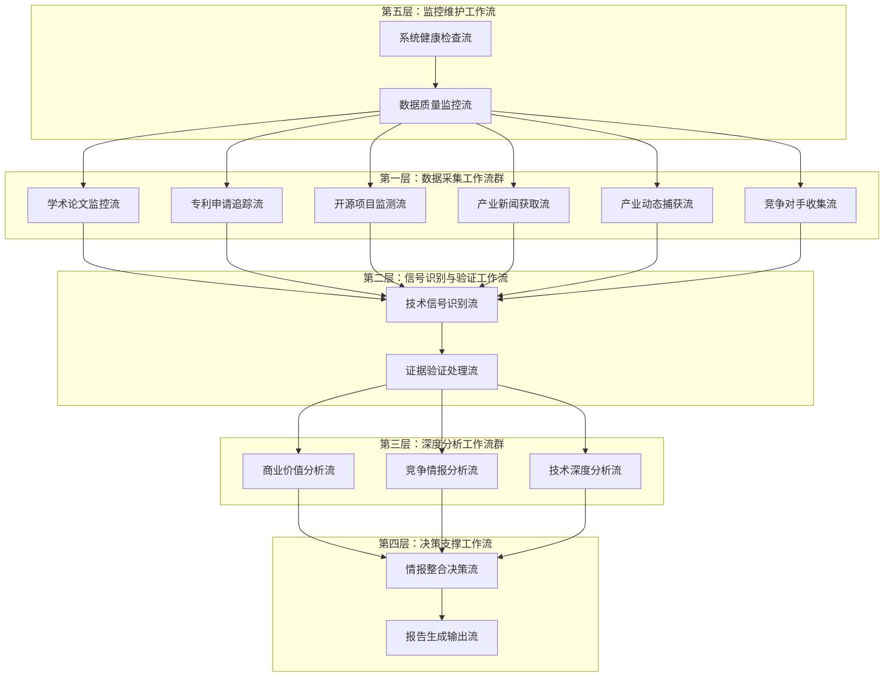
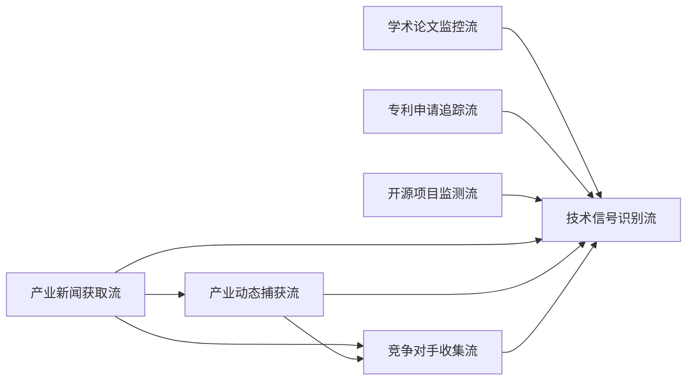

# 技术情报决策引擎 - Make工作流架构设计（修订版）

## **工作流总体架构**

### **核心设计理念：分层协同的情报处理管道**



## **第一层：数据采集工作流群（6条并行工作流）**

### **WF1：学术论文监控流**
```
触发方式：定时触发（每6小时）
数据源：arXiv, Google Scholar, PubMed, IEEE Xplore

工作流步骤：
1. 连接各学术数据源API
2. 使用预设关键词搜索最新论文
3. 提取论文元数据（标题、摘要、作者、发布时间）
4. AI初步筛选（技术突破性评估）
5. 写入临时数据表：Raw_Academic_Papers
6. 触发WF7（技术信号识别流）

输出格式：
{
  "source_type": "academic_paper",
  "title": "论文标题",
  "abstract": "摘要内容",
  "authors": ["作者列表"],
  "publication_date": "2024-12-19",
  "source_url": "原文链接",
  "initial_relevance_score": 8.5,
  "tech_keywords": ["AI", "breakthrough", "efficiency"]
}
```

### **WF2：专利申请追踪流**
```
触发方式：定时触发（每12小时）
数据源：USPTO, EPO, WIPO, Google Patents

工作流步骤：
1. 连接专利数据库API
2. 搜索最新专利申请（关键技术领域）
3. 提取专利摘要和技术分类
4. 识别申请公司和发明人
5. 评估专利技术重要性
6. 写入临时数据表：Raw_Patent_Data
7. 触发WF7

输出格式：
{
  "source_type": "patent",
  "patent_number": "US20240123456",
  "title": "专利标题",
  "abstract": "技术摘要",
  "applicant": "公司名称",
  "filing_date": "2024-12-19",
  "tech_classification": ["G06N", "H04L"],
  "innovation_score": 7.8
}
```

### **WF3：开源项目监测流**
```
触发方式：定时触发（每4小时）
数据源：GitHub, GitLab, SourceForge

工作流步骤：
1. 监控热门技术仓库
2. 识别重大更新和新项目
3. 分析代码提交频率和贡献者
4. 评估项目技术创新性
5. 提取README和文档关键信息
6. 写入临时数据表：Raw_OpenSource_Data
7. 触发WF7

输出格式：
{
  "source_type": "opensource",
  "project_name": "项目名称",
  "repository_url": "GitHub链接",
  "description": "项目描述",
  "stars": 15420,
  "recent_activity": "高活跃",
  "key_technologies": ["Python", "ML", "API"],
  "innovation_potential": 8.2
}
```

### **WF4：产业新闻获取流**
```
触发方式：定时触发（每2小时）
数据源：TechCrunch, VentureBeat, Wired, The Verge, MIT Technology Review

工作流步骤：
1. 爬取主流科技媒体最新报道
2. RSS订阅源实时监控
3. 关键词过滤技术相关新闻
4. 提取新闻标题、摘要、发布时间
5. AI初步评估新闻技术价值
6. 写入临时数据表：Raw_Tech_News
7. 为WF5提供新闻线索
8. 触发WF7

输出格式：
{
  "source_type": "tech_news",
  "headline": "新闻标题",
  "summary": "新闻摘要",
  "full_content": "完整内容",
  "publication_date": "2024-12-19",
  "news_source": "TechCrunch",
  "author": "记者姓名",
  "source_url": "原文链接",
  "tech_relevance_score": 7.3,
  "mentioned_companies": ["OpenAI", "Google"],
  "tech_categories": ["AI", "ML", "LLM"],
  "breaking_news_flag": true
}

特殊处理：
- 突发重大技术新闻：立即触发WF7
- 新闻聚合去重：相同事件的多篇报道合并
- 可信度评估：基于媒体权威性和记者声誉
```

### **WF5：产业动态捕获流**
```
触发方式：定时触发（每8小时）+ WF4新闻线索触发
数据源：公司官网, 财报, 产品发布会, 投资公告

工作流步骤：
1. 基于WF4新闻线索深度挖掘
2. 监控重点公司官方发布
3. 分析融资和并购消息
4. 识别产品发布和技术突破
5. 提取关键商业信息和技术细节
6. 交叉验证新闻真实性
7. 写入临时数据表：Raw_Industry_Dynamics
8. 触发WF7

输出格式：
{
  "source_type": "industry_dynamics",
  "event_type": "product_launch", // funding, acquisition, partnership, product_launch
  "headline": "事件标题",
  "company": "相关公司",
  "announcement_date": "2024-12-19",
  "official_source_url": "官方来源链接",
  "news_source_urls": ["相关新闻链接"],
  "event_details": {
    "funding_amount": "$100M",
    "investors": ["Sequoia", "A16Z"],
    "product_specs": "产品技术规格",
    "market_target": "目标市场"
  },
  "business_impact_score": 8.5,
  "tech_innovation_score": 7.8,
  "competitive_significance": 9.2,
  "verification_status": "confirmed" // confirmed, pending, disputed
}

关键增强功能：
- 新闻线索深度验证：对WF4发现的新闻进行官方确认
- 多源交叉验证：结合官方公告、财报、第三方报道
- 竞争影响评估：分析事件对竞争格局的影响
- 技术细节挖掘：从产品发布中提取技术创新点
```

### **WF6：竞争对手收集流**
```
触发方式：定时触发（每24小时）+ 重要事件触发
数据源：LinkedIn, 公司官网, Crunchbase, PitchBook, 招聘网站

工作流步骤：
1. 重点竞争对手动态监控
   - 关键人事变动（CTO、首席科学家）
   - 技术团队扩张情况
   - 研发投入变化
   
2. 新兴竞争者识别
   - 初创公司融资信息
   - 技术专利申请活跃度
   - 产品发布频率
   
3. 竞争对手技术布局分析
   - 研发方向识别
   - 技术合作伙伴
   - 学术界合作情况
   
4. 人才流动情报收集
   - 关键技术人才跳槽
   - 团队组建模式
   - 薪酬水平变化
   
5. 竞争策略情报
   - 市场进入策略
   - 定价策略变化
   - 合作伙伴关系
   
6. 写入临时数据表：Raw_Competitor_Intelligence
7. 触发WF7

输出格式：
{
  "source_type": "competitor_intelligence",
  "competitor_name": "竞争对手名称",
  "intelligence_type": "talent_movement", // funding, talent_movement, tech_development, strategy_shift
  "event_description": "具体事件描述",
  "discovery_date": "2024-12-19",
  "source_urls": ["LinkedIn链接", "新闻链接"],
  "key_personnel": {
    "name": "关键人员姓名",
    "role": "职位",
    "previous_company": "前公司",
    "expertise": ["AI", "ML", "Computer Vision"]
  },
  "funding_details": {
    "round": "Series B",
    "amount": "$50M",
    "lead_investor": "Tiger Global",
    "valuation": "$500M"
  },
  "tech_focus": ["自动驾驶", "计算机视觉", "边缘计算"],
  "competitive_threat_level": 8.5,
  "strategic_significance": 7.9,
  "intelligence_confidence": 0.92
}

特殊功能：
- 竞争对手分级监控：
  * Tier 1: 直接竞争对手（每日监控）
  * Tier 2: 潜在威胁（每周监控）
  * Tier 3: 生态相关（每月监控）
  
- 预警机制：
  * 重大人事变动：24小时内预警
  * 大额融资：12小时内预警
  * 技术突破：6小时内预警
  
- 情报价值评估：
  * 时效性：信息新鲜度
  * 可靠性：来源权威程度
  * 影响性：对我方战略的影响程度
```

## **数据采集工作流的协同关系**

### **工作流间的信息传递**



### **触发关系优化**

**WF4 → WF5 触发逻辑：**
```
当WF4发现以下类型新闻时，立即触发WF5：
- 重大产品发布新闻
- 融资并购消息
- 技术突破报道
- 合作伙伴关系变化

触发数据包：
{
  "trigger_source": "WF4",
  "news_headline": "新闻标题",
  "mentioned_companies": ["公司列表"],
  "event_type": "产品发布",
  "urgency_level": "high",
  "verification_required": true
}
```

**WF4/WF5 → WF6 触发逻辑：**
```
当发现竞争对手相关信息时触发WF6：
- 竞争对手公司被提及
- 关键人员变动新闻
- 技术合作公告
- 市场策略变化

触发数据包：
{
  "trigger_source": "WF4/WF5",
  "competitor_name": "竞争对手名称",
  "intelligence_hint": "情报线索",
  "priority_level": "high",
  "deep_dive_required": true
}
```

### **数据质量协同机制**

**多源验证机制：**
```
同一事件的多源确认：
WF4 (新闻报道) + WF5 (官方确认) + WF6 (竞争对手反应) = 高置信度情报

验证流程：
1. WF4发现新闻 → 标记"待验证"
2. WF5官方确认 → 更新"已确认"
3. WF6竞争反应 → 评估"影响程度"
```

**信息去重与整合：**
```
去重规则：
- 同一事件24小时内的多篇报道合并
- 相同专利的多次申请记录合并
- 同一项目的多个代码库更新整合

整合策略：
- 保留最权威来源作为主要证据
- 其他来源作为支撑证据
- 生成综合可信度评分
```

这个修订后的数据采集工作流群设计具有以下优势：

1. **信息流向更合理**：产业新闻获取 → 产业动态捕获 → 竞争对手收集，形成递进式深化
2. **竞争情报更全面**：专门的竞争对手收集流，系统性监控竞争态势
3. **验证机制更强**：多个工作流相互验证，提高情报可靠性
4. **响应速度更快**：突发事件可以触发相关工作流立即响应
5. **情报价值更高**：从新闻线索到深度情报的完整链条

Jason，这个修订后的数据采集工作流架构是否更符合你的需求？需要我进一步细化某个特定工作流的实现细节吗？
