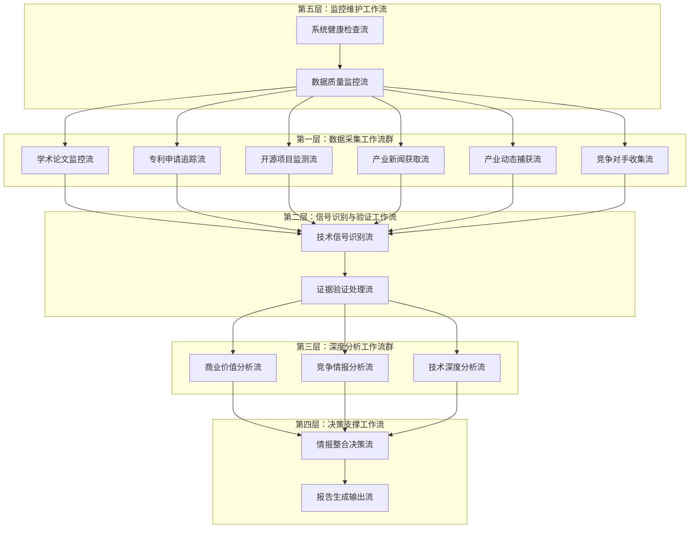
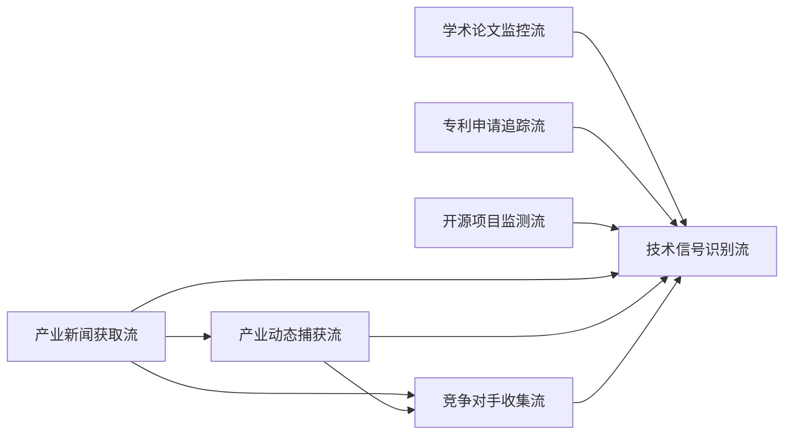

# 技术情报决策引擎 - Make工作流架构设计（修订版）

## **工作流总体架构**

### **核心设计理念：分层协同的情报处理管道**



## **第一层：数据采集工作流群（6条并行工作流）**

### **WF1：学术论文监控流**
```
触发方式：定时触发（每6小时）
数据源：arXiv, Google Scholar, PubMed, IEEE Xplore

工作流步骤：
1. 连接各学术数据源API
2. 使用预设关键词搜索最新论文
3. 提取论文元数据（标题、摘要、作者、发布时间）
4. AI初步筛选（技术突破性评估）
5. 写入临时数据表：Raw_Academic_Papers
6. 触发WF7（技术信号识别流）

输出格式：
{
  "source_type": "academic_paper",
  "title": "论文标题",
  "abstract": "摘要内容",
  "authors": ["作者列表"],
  "publication_date": "2024-12-19",
  "source_url": "原文链接",
  "initial_relevance_score": 8.5,
  "tech_keywords": ["AI", "breakthrough", "efficiency"]
}
```

### **WF2：专利申请追踪流**
```
触发方式：定时触发（每12小时）
数据源：USPTO, EPO, WIPO, Google Patents

工作流步骤：
1. 连接专利数据库API
2. 搜索最新专利申请（关键技术领域）
3. 提取专利摘要和技术分类
4. 识别申请公司和发明人
5. 评估专利技术重要性
6. 写入临时数据表：Raw_Patent_Data
7. 触发WF7

输出格式：
{
  "source_type": "patent",
  "patent_number": "US20240123456",
  "title": "专利标题",
  "abstract": "技术摘要",
  "applicant": "公司名称",
  "filing_date": "2024-12-19",
  "tech_classification": ["G06N", "H04L"],
  "innovation_score": 7.8
}
```

### **WF3：开源项目监测流**
```
触发方式：定时触发（每4小时）
数据源：GitHub, GitLab, SourceForge

工作流步骤：
1. 监控热门技术仓库
2. 识别重大更新和新项目
3. 分析代码提交频率和贡献者
4. 评估项目技术创新性
5. 提取README和文档关键信息
6. 写入临时数据表：Raw_OpenSource_Data
7. 触发WF7

输出格式：
{
  "source_type": "opensource",
  "project_name": "项目名称",
  "repository_url": "GitHub链接",
  "description": "项目描述",
  "stars": 15420,
  "recent_activity": "高活跃",
  "key_technologies": ["Python", "ML", "API"],
  "innovation_potential": 8.2
}
```

### **WF4：产业新闻获取流**
```
触发方式：定时触发（每2小时）
数据源：TechCrunch, VentureBeat, Wired, The Verge, MIT Technology Review

工作流步骤：
1. 爬取主流科技媒体最新报道
2. RSS订阅源实时监控
3. 关键词过滤技术相关新闻
4. 提取新闻标题、摘要、发布时间
5. AI初步评估新闻技术价值
6. 写入临时数据表：Raw_Tech_News
7. 为WF5提供新闻线索
8. 触发WF7

输出格式：
{
  "source_type": "tech_news",
  "headline": "新闻标题",
  "summary": "新闻摘要",
  "full_content": "完整内容",
  "publication_date": "2024-12-19",
  "news_source": "TechCrunch",
  "author": "记者姓名",
  "source_url": "原文链接",
  "tech_relevance_score": 7.3,
  "mentioned_companies": ["OpenAI", "Google"],
  "tech_categories": ["AI", "ML", "LLM"],
  "breaking_news_flag": true
}

特殊处理：
- 突发重大技术新闻：立即触发WF7
- 新闻聚合去重：相同事件的多篇报道合并
- 可信度评估：基于媒体权威性和记者声誉
```

### **WF5：产业动态捕获流**
```
触发方式：定时触发（每8小时）+ WF4新闻线索触发
数据源：公司官网, 财报, 产品发布会, 投资公告

工作流步骤：
1. 基于WF4新闻线索深度挖掘
2. 监控重点公司官方发布
3. 分析融资和并购消息
4. 识别产品发布和技术突破
5. 提取关键商业信息和技术细节
6. 交叉验证新闻真实性
7. 写入临时数据表：Raw_Industry_Dynamics
8. 触发WF7

输出格式：
{
  "source_type": "industry_dynamics",
  "event_type": "product_launch", // funding, acquisition, partnership, product_launch
  "headline": "事件标题",
  "company": "相关公司",
  "announcement_date": "2024-12-19",
  "official_source_url": "官方来源链接",
  "news_source_urls": ["相关新闻链接"],
  "event_details": {
    "funding_amount": "$100M",
    "investors": ["Sequoia", "A16Z"],
    "product_specs": "产品技术规格",
    "market_target": "目标市场"
  },
  "business_impact_score": 8.5,
  "tech_innovation_score": 7.8,
  "competitive_significance": 9.2,
  "verification_status": "confirmed" // confirmed, pending, disputed
}

关键增强功能：
- 新闻线索深度验证：对WF4发现的新闻进行官方确认
- 多源交叉验证：结合官方公告、财报、第三方报道
- 竞争影响评估：分析事件对竞争格局的影响
- 技术细节挖掘：从产品发布中提取技术创新点
```

### **WF6：竞争对手收集流**
```
触发方式：定时触发（每24小时）+ 重要事件触发
数据源：LinkedIn, 公司官网, Crunchbase, PitchBook, 招聘网站

工作流步骤：
1. 重点竞争对手动态监控
   - 关键人事变动（CTO、首席科学家）
   - 技术团队扩张情况
   - 研发投入变化
   
2. 新兴竞争者识别
   - 初创公司融资信息
   - 技术专利申请活跃度
   - 产品发布频率
   
3. 竞争对手技术布局分析
   - 研发方向识别
   - 技术合作伙伴
   - 学术界合作情况
   
4. 人才流动情报收集
   - 关键技术人才跳槽
   - 团队组建模式
   - 薪酬水平变化
   
5. 竞争策略情报
   - 市场进入策略
   - 定价策略变化
   - 合作伙伴关系
   
6. 写入临时数据表：Raw_Competitor_Intelligence
7. 触发WF7

输出格式：
{
  "source_type": "competitor_intelligence",
  "competitor_name": "竞争对手名称",
  "intelligence_type": "talent_movement", // funding, talent_movement, tech_development, strategy_shift
  "event_description": "具体事件描述",
  "discovery_date": "2024-12-19",
  "source_urls": ["LinkedIn链接", "新闻链接"],
  "key_personnel": {
    "name": "关键人员姓名",
    "role": "职位",
    "previous_company": "前公司",
    "expertise": ["AI", "ML", "Computer Vision"]
  },
  "funding_details": {
    "round": "Series B",
    "amount": "$50M",
    "lead_investor": "Tiger Global",
    "valuation": "$500M"
  },
  "tech_focus": ["自动驾驶", "计算机视觉", "边缘计算"],
  "competitive_threat_level": 8.5,
  "strategic_significance": 7.9,
  "intelligence_confidence": 0.92
}

特殊功能：
- 竞争对手分级监控：
  * Tier 1: 直接竞争对手（每日监控）
  * Tier 2: 潜在威胁（每周监控）
  * Tier 3: 生态相关（每月监控）
  
- 预警机制：
  * 重大人事变动：24小时内预警
  * 大额融资：12小时内预警
  * 技术突破：6小时内预警
  
- 情报价值评估：
  * 时效性：信息新鲜度
  * 可靠性：来源权威程度
  * 影响性：对我方战略的影响程度
```

## **数据采集工作流的协同关系**

### **工作流间的信息传递**



### **触发关系优化**

**WF4 → WF5 触发逻辑：**
```
当WF4发现以下类型新闻时，立即触发WF5：
- 重大产品发布新闻
- 融资并购消息
- 技术突破报道
- 合作伙伴关系变化

触发数据包：
{
  "trigger_source": "WF4",
  "news_headline": "新闻标题",
  "mentioned_companies": ["公司列表"],
  "event_type": "产品发布",
  "urgency_level": "high",
  "verification_required": true
}
```

**WF4/WF5 → WF6 触发逻辑：**
```
当发现竞争对手相关信息时触发WF6：
- 竞争对手公司被提及
- 关键人员变动新闻
- 技术合作公告
- 市场策略变化

触发数据包：
{
  "trigger_source": "WF4/WF5",
  "competitor_name": "竞争对手名称",
  "intelligence_hint": "情报线索",
  "priority_level": "high",
  "deep_dive_required": true
}
```

### **数据质量协同机制**

**多源验证机制：**
```
同一事件的多源确认：
WF4 (新闻报道) + WF5 (官方确认) + WF6 (竞争对手反应) = 高置信度情报

验证流程：
1. WF4发现新闻 → 标记"待验证"
2. WF5官方确认 → 更新"已确认"
3. WF6竞争反应 → 评估"影响程度"
```

**信息去重与整合：**
```
去重规则：
- 同一事件24小时内的多篇报道合并
- 相同专利的多次申请记录合并
- 同一项目的多个代码库更新整合

整合策略：
- 保留最权威来源作为主要证据
- 其他来源作为支撑证据
- 生成综合可信度评分
```

这个修订后的数据采集工作流群设计具有以下优势：

1. **信息流向更合理**：产业新闻获取 → 产业动态捕获 → 竞争对手收集，形成递进式深化
2. **竞争情报更全面**：专门的竞争对手收集流，系统性监控竞争态势
3. **验证机制更强**：多个工作流相互验证，提高情报可靠性
4. **响应速度更快**：突发事件可以触发相关工作流立即响应
5. **情报价值更高**：从新闻线索到深度情报的完整链条

# 技术情报决策引擎 - 完整工作流数据流动设计

## **第二层：信号识别与验证工作流**

### **WF7：技术信号识别流**

**数据输入汇聚机制：**
```
输入数据汇聚点：
- 来源：WF1-WF6的6个数据采集流
- 汇聚频率：实时接收，批量处理（每30分钟）
- 数据暂存：Raw_Data_Queue表

数据预处理：
{
  "batch_id": "BATCH_20241219_143000",
  "processing_timestamp": "2024-12-19T14:30:00Z",
  "input_sources": {
    "academic_papers": 15,
    "patents": 8,
    "opensource": 12,
    "tech_news": 25,
    "industry_dynamics": 6,
    "competitor_intel": 9
  },
  "total_raw_records": 75
}
```

**信号识别处理步骤：**

**步骤1：多源数据标准化**
```
标准化处理：
1. 文本内容统一编码（UTF-8）
2. 时间格式标准化（ISO 8601）
3. 技术关键词标准化
4. 来源可信度评分统一

输出格式：
{
  "raw_data_id": "RAW_20241219_001",
  "standardized_content": {
    "title": "标准化标题",
    "content": "标准化内容",
    "tech_keywords": ["AI", "machine-learning", "neural-network"],
    "entities": {
      "companies": ["OpenAI", "Google"],
      "people": ["Sam Altman"],
      "technologies": ["GPT-4", "Transformer"]
    },
    "source_credibility": 8.5,
    "content_quality_score": 7.8
  }
}
```

**步骤2：技术信号强度评估**
```
信号强度计算模型：
signal_strength = (
    breakthrough_score * 0.3 +      # 技术突破性
    market_impact_score * 0.25 +    # 市场影响力
    source_authority_score * 0.2 +  # 来源权威性
    novelty_score * 0.15 +          # 新颖性
    validation_score * 0.1          # 多源验证度
)

评估维度：
- 技术突破性：性能提升幅度、新原理应用、跨领域融合
- 市场影响力：潜在市场规模、应用广度、商业化可行性
- 来源权威性：发布机构声誉、专家认可度、媒体权威性
- 新颖性：技术新鲜度、与现有技术差异度
- 多源验证度：独立来源确认数量、信息一致性

输出示例：
{
  "signal_evaluation": {
    "breakthrough_score": 8.5,
    "market_impact_score": 7.2,
    "source_authority_score": 9.1,
    "novelty_score": 8.8,
    "validation_score": 6.5,
    "overall_signal_strength": 8.0
  }
}
```

**步骤3：Intelligence_ID生成与记录创建**
```
ID生成条件：
- signal_strength ≥ 6.0
- 至少2个独立来源确认
- 技术相关性评分 ≥ 7.0

ID生成逻辑：
def generate_intelligence_id(signal_data):
    date_str = datetime.now().strftime("%Y%m%d")
    
    # 技术类别映射
    category_map = {
        "artificial-intelligence": "A",
        "quantum-computing": "Q", 
        "biotechnology": "B",
        "energy-tech": "E",
        "materials-science": "M",
        "robotics": "R",
        "blockchain": "C",
        "space-tech": "S"
    }
    
    # 获取当日序号
    daily_sequence = get_daily_sequence_number(date_str)
    
    # 生成ID
    intelligence_id = f"TI{date_str}{daily_sequence:03d}{category_map[tech_category]}"
    
    return intelligence_id

创建主表记录：
{
  "intelligence_id": "TI20241219001A",
  "signal_title": "GPT-5架构突破：多模态推理能力提升300%",
  "tech_category": "artificial-intelligence",
  "discovery_timestamp": "2024-12-19T14:30:00Z",
  "signal_strength": 8.0,
  "signal_lifecycle_status": "Active",
  "data_sources_count": 3,
  "primary_source_type": "industry_dynamics",
  
  # 初始化待计算字段
  "confidence_level": 0.00,
  "commercial_value_score": 0.0,
  "investment_opportunity_score": 0.0,
  "competitive_threat_level": 0.0,
  "evidence_validation_status": "Pending",
  "expert_validation_status": "Pending",
  "analysis_completion_status": "In_Progress"
}
```

**步骤4：触发后续工作流**
```
触发机制：
1. 同步触发WF8（证据验证处理流）
2. 异步触发WF9, WF10, WF11（深度分析工作流群）

触发数据包：
{
  "trigger_event": "new_intelligence_created",
  "intelligence_id": "TI20241219001A",
  "priority_level": "high", // 基于signal_strength确定
  "raw_data_sources": [
    {
      "source_id": "RAW_20241219_001",
      "source_type": "industry_dynamics",
      "source_url": "https://techcrunch.com/...",
      "relevance_score": 9.2
    }
  ],
  "processing_requirements": {
    "evidence_validation": true,
    "commercial_analysis": true,
    "competitive_analysis": true,
    "technical_analysis": true
  }
}
```

### **WF8：证据验证处理流**

**触发接收与数据准备：**
```
输入接收：
- 来源：WF7触发
- 输入数据：intelligence_id + 原始数据源信息
- 处理优先级：基于signal_strength排序

数据准备：
{
  "validation_session": {
    "session_id": "VAL_TI20241219001A_001",
    "intelligence_id": "TI20241219001A", 
    "start_timestamp": "2024-12-19T14:35:00Z",
    "raw_sources": [
      {
        "source_url": "https://openai.com/research/gpt5-breakthrough",
        "source_type": "official_announcement",
        "discovery_source": "industry_dynamics"
      },
      {
        "source_url": "https://arxiv.org/abs/2024.12345",
        "source_type": "academic_paper", 
        "discovery_source": "academic_papers"
      }
    ]
  }
}
```

**证据验证处理步骤：**

**步骤1：链接有效性验证**
```
验证机制：
1. HTTP状态码检查
2. 内容完整性验证
3. 访问权限确认
4. 内容更新时间检查

处理逻辑：
def validate_source_links(sources):
    validation_results = []
    
    for source in sources:
        try:
            response = requests.get(source['url'], timeout=30)
            
            validation_result = {
                "source_url": source['url'],
                "http_status": response.status_code,
                "response_time_ms": response.elapsed.total_seconds() * 1000,
                "content_length": len(response.content),
                "last_modified": response.headers.get('Last-Modified'),
                "accessibility_status": "accessible" if response.status_code == 200 else "error",
                "content_hash": hashlib.md5(response.content).hexdigest(),
                "validation_timestamp": datetime.now().isoformat()
            }
            
            # 内容质量检查
            if response.status_code == 200:
                validation_result.update({
                    "content_quality": assess_content_quality(response.text),
                    "technical_relevance": assess_technical_relevance(response.text),
                    "information_completeness": assess_completeness(response.text)
                })
                
        except Exception as e:
            validation_result = {
                "source_url": source['url'],
                "accessibility_status": "failed",
                "error_message": str(e),
                "validation_timestamp": datetime.now().isoformat()
            }
            
        validation_results.append(validation_result)
    
    return validation_results
```

**步骤2：数据源权威性评估**
```
权威性评分模型：
authority_score = (
    domain_reputation * 0.4 +        # 域名声誉
    publication_credibility * 0.3 +  # 发布机构可信度
    author_expertise * 0.2 +         # 作者专业度
    peer_recognition * 0.1           # 同行认可度
)

评估维度：
- 域名声誉：基于预设权威域名列表评分
- 发布机构可信度：学术机构、知名公司、权威媒体
- 作者专业度：作者在相关领域的声誉和经验
- 同行认可度：引用次数、社交媒体讨论度

权威性数据库：
{
  "domain_authority": {
    "arxiv.org": 9.5,
    "nature.com": 9.8,
    "openai.com": 9.2,
    "techcrunch.com": 7.5,
    "medium.com": 5.0
  },
  "institution_credibility": {
    "MIT": 9.8,
    "Stanford": 9.7,
    "OpenAI": 9.2,
    "Google Research": 9.5
  }
}

输出示例：
{
  "authority_assessment": {
    "primary_source": {
      "url": "https://openai.com/research/gpt5-breakthrough",
      "domain_reputation": 9.2,
      "institution_credibility": 9.2,
      "author_expertise": 8.8,
      "peer_recognition": 7.5,
      "overall_authority_score": 8.9
    }
  }
}
```

**步骤3：多源交叉验证**
```
交叉验证逻辑：
1. 核心事实提取：从各来源提取关键技术声明
2. 一致性检查：比较不同来源的信息一致性
3. 矛盾识别：标识相互矛盾的信息点
4. 置信度计算：基于一致性程度计算整体置信度

验证处理：
def cross_validate_sources(sources_data):
    # 提取核心技术声明
    core_claims = []
    for source in sources_data:
        claims = extract_technical_claims(source['content'])
        core_claims.extend(claims)
    
    # 聚类相似声明
    claim_clusters = cluster_similar_claims(core_claims)
    
    # 计算一致性
    consistency_results = []
    for cluster in claim_clusters:
        consistency = calculate_claim_consistency(cluster)
        consistency_results.append({
            "claim_topic": cluster.topic,
            "supporting_sources": len(cluster.sources),
            "consistency_score": consistency.score,
            "contradictions": consistency.contradictions,
            "confidence_level": consistency.confidence
        })
    
    return {
        "overall_consistency_score": np.mean([r['consistency_score'] for r in consistency_results]),
        "claim_analysis": consistency_results,
        "contradiction_count": sum([len(r['contradictions']) for r in consistency_results])
    }

输出示例：
{
  "cross_validation_results": {
    "overall_consistency_score": 8.7,
    "validated_claims": [
      {
        "claim": "GPT-5多模态推理能力提升300%",
        "supporting_sources": 3,
        "consistency_score": 9.2,
        "confidence_level": 0.92
      }
    ],
    "contradictions": [],
    "reliability_assessment": "high"
  }
}
```

**步骤4：专家确认信息搜集**
```
专家确认机制：
1. 识别相关领域专家
2. 搜集专家公开观点
3. 评估专家可信度
4. 整合专家意见

专家识别：
def identify_relevant_experts(tech_category, intelligence_content):
    # 基于技术类别和内容识别相关专家
    expert_database = load_expert_database()
    
    relevant_experts = expert_database.filter(
        expertise_areas__contains=tech_category,
        credibility_score__gte=8.0,
        recent_activity__gte=datetime.now() - timedelta(days=180)
    )
    
    return relevant_experts

专家观点收集：
{
  "expert_validation": {
    "experts_identified": [
      {
        "name": "Yann LeCun",
        "affiliation": "Meta AI",
        "expertise": ["deep-learning", "AI"],
        "credibility_score": 9.8,
        "recent_opinions": [
          {
            "platform": "Twitter",
            "content": "GPT-5的多模态能力确实有显著提升...",
            "url": "https://twitter.com/ylecun/status/...",
            "timestamp": "2024-12-19T10:00:00Z",
            "relevance_score": 8.5
          }
        ]
      }
    ],
    "expert_consensus": {
      "positive_opinions": 3,
      "negative_opinions": 0,
      "neutral_opinions": 1,
      "overall_expert_sentiment": "positive",
      "expert_confidence_average": 8.2
    }
  }
}
```

**步骤5：证据质量综合评分**
```
综合评分模型：
evidence_quality = (
    link_accessibility * 0.25 +      # 链接可访问性
    source_authority * 0.30 +        # 来源权威性
    cross_validation * 0.25 +        # 交叉验证一致性
    expert_confirmation * 0.20       # 专家确认程度
)

计算示例：
{
  "evidence_quality_assessment": {
    "link_accessibility_score": 9.5,  # 95%链接可访问
    "source_authority_score": 8.9,    # 高权威性来源
    "cross_validation_score": 8.7,    # 高一致性
    "expert_confirmation_score": 8.2,  # 专家普遍认可
    "overall_evidence_quality": 8.8,
    "evidence_grade": "A",  # A/B/C/D分级
    "validation_status": "Validated"
  }
}
```

**步骤6：写入证据验证表并更新主表**
```
写入Evidence_Validation_Matrix：
{
  "validation_id": "TI20241219001A_EV",
  "intelligence_id": "TI20241219001A",
  "primary_source_url": "https://openai.com/research/gpt5-breakthrough",
  "primary_source_type": "official_announcement",
  "primary_source_authority_score": 9.2,
  "primary_source_validation_status": "Validated",
  
  "secondary_source_url": "https://arxiv.org/abs/2024.12345",
  "secondary_source_authority_score": 9.5,
  
  "cross_validation_source_url": "https://techcrunch.com/gpt5-analysis",
  "cross_validation_consistency_score": 8.7,
  
  "expert_confirmation_url": "https://twitter.com/ylecun/status/...",
  "expert_name": "Yann LeCun",
  "expert_credibility_score": 9.8,
  
  "data_consistency_score": 8.7,
  "link_accessibility_status": "All_Accessible",
  "evidence_freshness_score": 9.5,
  "overall_evidence_quality": 8.8,
  
  "validation_timestamp": "2024-12-19T15:00:00Z",
  "next_validation_date": "2024-12-26"
}

更新主表字段：
UPDATE Tech_Intelligence_Master 
SET 
  confidence_level = 88.0,  # 基于evidence_quality计算
  evidence_validation_status = 'Validated',
  expert_validation_status = 'Confirmed',
  last_update_timestamp = NOW()
WHERE intelligence_id = 'TI20241219001A';
```

## **第三层：深度分析工作流群**

### **WF9：商业价值分析流**

**触发接收与数据准备：**
```
输入接收：
- 触发源：WF7完成intelligence_id创建
- 输入数据：intelligence_id + 技术基础信息 + 原始数据源
- 前置条件：evidence_validation_status = 'Validated'

数据准备：
{
  "analysis_session": {
    "session_id": "CVA_TI20241219001A_001",
    "intelligence_id": "TI20241219001A",
    "tech_category": "artificial-intelligence",
    "signal_strength": 8.0,
    "confidence_level": 88.0,
    "tech_description": "GPT-5架构突破：多模态推理能力提升300%",
    "analysis_start_time": "2024-12-19T15:05:00Z"
  }
}
```

**商业价值分析处理步骤：**

**步骤1：市场规模建模分析**
```
TAM/SAM/SOM分析模型：

def calculate_market_size(tech_category, tech_capabilities):
    # TAM (Total Addressable Market) 计算
    market_segments = identify_applicable_segments(tech_category)
    
    tam_calculation = 0
    segment_analysis = []
    
    for segment in market_segments:
        segment_size = get_market_segment_size(segment)
        applicability_score = assess_tech_applicability(tech_capabilities, segment)
        
        segment_tam = segment_size * applicability_score
        tam_calculation += segment_tam
        
        segment_analysis.append({
            "segment_name": segment.name,
            "segment_size_usd": segment_size,
            "applicability_score": applicability_score,
            "addressable_value": segment_tam
        })
    
    # SAM (Serviceable Addressable Market) 计算
    sam_calculation = tam_calculation * get_reachability_factor(tech_category)
    
    # SOM (Serviceable Obtainable Market) 计算  
    som_calculation = sam_calculation * get_competitive_capture_rate(tech_category)
    
    return {
        "tam_usd": tam_calculation,
        "sam_usd": sam_calculation,
        "som_usd": som_calculation,
        "segment_breakdown": segment_analysis
    }

应用示例（GPT-5多模态AI）：
{
  "market_size_analysis": {
    "tam_usd": 847000000000,  # $847B
    "sam_usd": 254100000000,  # $254B  
    "som_usd": 25410000000,   # $25.4B
    "segment_breakdown": [
      {
        "segment_name": "企业智能助手",
        "segment_size_usd": 45000000000,
        "applicability_score": 0.95,
        "addressable_value": 42750000000
      },
      {
        "segment_name": "内容创作平台", 
        "segment_size_usd": 28000000000,
        "applicability_score": 0.90,
        "addressable_value": 25200000000
      },
      {
        "segment_name": "教育科技",
        "segment_size_usd": 89000000000,
        "applicability_score": 0.85,
        "addressable_value": 75650000000
      }
    ],
    "market_growth_rate": 0.23,  # 23% CAGR
    "market_maturity": "growth_stage"
  }
}
```

**步骤2：ROI预测建模**
```
ROI预测模型：

def calculate_roi_projections(market_data, tech_specs, investment_requirements):
    # 收入预测模型
    revenue_model = build_revenue_model(market_data, tech_specs)
    
    # 成本模型
    cost_model = build_cost_model(investment_requirements, tech_specs)
    
    # 多情景分析
    scenarios = ['conservative', 'realistic', 'optimistic']
    projections = {}
    
    for scenario in scenarios:
        scenario_params = get_scenario_parameters(scenario)
        
        # 5年收入预测
        revenue_projections = []
        for year in range(1, 6):
            yearly_revenue = calculate_yearly_revenue(
                revenue_model, 
                year, 
                scenario_params
            )
            revenue_projections.append(yearly_revenue)
        
        # 成本预测
        cost_projections = []
        for year in range(1, 6):
            yearly_cost = calculate_yearly_cost(
                cost_model,
                year,
                scenario_params
            )
            cost_projections.append(yearly_cost)
        
        # ROI计算
        total_investment = sum(cost_projections)
        total_revenue = sum(revenue_projections)
        roi = (total_revenue - total_investment) / total_investment * 100
        
        # 净现值计算（NPV）
        discount_rate = 0.12  # 12%折现率
        npv = calculate_npv(revenue_projections, cost_projections, discount_rate)
        
        projections[scenario] = {
            "revenue_projections": revenue_projections,
            "cost_projections": cost_projections,
            "total_investment": total_investment,
            "total_revenue": total_revenue,
            "roi_percentage": roi,
            "npv_usd": npv,
            "payback_period_months": calculate_payback_period(revenue_projections, cost_projections)
        }
    
    return projections

输出示例：
{
  "roi_analysis": {
    "conservative": {
      "revenue_projections": [50000000, 125000000, 280000000, 520000000, 750000000],
      "cost_projections": [200000000, 180000000, 220000000, 280000000, 320000000],
      "total_investment": 1200000000,
      "total_revenue": 1725000000,
      "roi_percentage": 43.75,
      "npv_usd": 234000000,
      "payback_period_months": 28
    },
    "realistic": {
      "revenue_projections": [75000000, 200000000, 450000000, 850000000, 1200000000],
      "cost_projections": [250000000, 220000000, 280000000, 350000000, 400000000],
      "total_investment": 1500000000,
      "total_revenue": 2775000000,
      "roi_percentage": 85.0,
      "npv_usd": 567000000,
      "payback_period_months": 22
    },
    "optimistic": {
      "revenue_projections": [120000000, 320000000, 680000000, 1200000000, 1800000000],
      "cost_projections": [300000000, 280000000, 350000000, 420000000, 500000000],
      "total_investment": 1850000000,
      "total_revenue": 4120000000,
      "roi_percentage": 122.7,
      "npv_usd": 892000000,
      "payback_period_months": 18
    }
  }
}
```

**步骤3：商业化时间线评估**
```
商业化时间线模型：

def assess_commercialization_timeline(tech_specs, market_conditions, regulatory_env):
    timeline_factors = {
        "technical_maturity": assess_technical_readiness(tech_specs),
        "market_readiness": assess_market_acceptance(market_conditions),
        "regulatory_clearance": assess_regulatory_timeline(regulatory_env),
        "competitive_pressure": assess_competitive_urgency(market_conditions),
        "resource_availability": assess_resource_constraints(tech_specs)
    }
    
    # 各阶段时间估算
    phases = {
        "research_completion": calculate_research_phase(timeline_factors),
        "prototype_development": calculate_prototype_phase(timeline_factors),
        "pilot_testing": calculate_pilot_phase(timeline_factors),
        "market_entry": calculate_market_entry_phase(timeline_factors),
        "scale_deployment": calculate_scale_phase(timeline_factors)
    }
    
    # 关键里程碑
    milestones = identify_critical_milestones(phases, timeline_factors)
    
    # 风险调整
    risk_adjusted_timeline = apply_risk_adjustments(phases, timeline_factors)
    
    return {
        "phases": phases,
        "milestones": milestones,
        "risk_adjusted_timeline": risk_adjusted_timeline,
        "total_time_to_market_months": sum(risk_adjusted_timeline.values())
    }

输出示例：
{
  "commercialization_timeline": {
    "phases": {
      "research_completion": 6,      # 6个月
      "prototype_development": 12,   # 12个月
      "pilot_testing": 8,           # 8个月
      "market_entry": 6,            # 6个月
      "scale_deployment": 18        # 18个月
    },
    "critical_milestones": [
      {
        "milestone": "技术验证完成",
        "target_date": "2025-06-19",
        "success_criteria": "多模态推理准确率>95%",
        "risk_level": "medium"
      },
      {
        "milestone": "首个商业客户签约",
        "target_date": "2026-02-19", 
        "success_criteria": "企业级部署成功",
        "risk_level": "high"
      }
    ],
    "total_time_to_market_months": 50,
    "market_entry_date": "2029-02-19",
    "confidence_level": 0.75
  }
}
```

**步骤4：可比案例分析**
```
可比案例研究：

def analyze_comparable_cases(tech_category, tech_characteristics):
    # 识别相似技术案例
    similar_cases = find_similar_technologies(tech_category, tech_characteristics)
    
    case_studies = []
    for case in similar_cases:
        case_analysis = {
            "technology_name": case.name,
            "launch_year": case.launch_year,
            "initial_investment": case.investment_data.initial,
            "time_to_profitability": case.timeline.profitability_months,
            "peak_revenue": case.revenue_data.peak_annual,
            "market_share_achieved": case.market_data.peak_share,
            "success_factors": case.success_analysis.key_factors,
            "failure_points": case.failure_analysis.risk_factors,
            "similarity_score": calculate_similarity(tech_characteristics, case.characteristics)
        }
        case_studies.append(case_analysis)
    
    # 成功率统计
    success_rate = calculate_success_rate(case_studies)
    
    # 关键成功因素提取
    success_patterns = extract_success_patterns(case_studies)
    
    return {
        "comparable_cases": case_studies,
        "success_rate": success_rate,
        "success_patterns": success_patterns,
        "risk_insights": extract_risk_insights(case_studies)
    }

输出示例：
{
  "comparable_case_analysis": {
    "cases_analyzed": [
      {
        "technology_name": "GPT-4发布",
        "launch_year": 2023,
        "initial_investment": 1000000000,
        "time_to_profitability": 8,
        "peak_revenue": 2000000000,
        "market_share_achieved": 0.65,
        "success_factors": ["first_mover_advantage", "strong_partnerships", "superior_performance"],
        "similarity_score": 0.87
      },
      {
        "technology_name": "DALL-E 2推出",
        "launch_year": 2022,
        "initial_investment": 500000000,
        "time_to_profitability": 12,
        "peak_revenue": 800000000,
        "market_share_achieved": 0.45,
        "success_factors": ["unique_capabilities", "viral_marketing", "developer_ecosystem"],
        "similarity_score": 0.72
      }
    ],
    "success_rate": 0.78,
    "key_success_patterns": [
      "强大的技术性能优势",
      "快速的市场进入策略", 
      "生态系统建设",
      "持续的技术迭代"
    ],
    "risk_insights": [
      "技术炒作周期风险",
      "监管政策变化风险",
      "竞争对手快速跟进风险"
    ]
  }
}
```

**步骤5：写入商业价值量化表（续）**
```
写入Commercial_Value_Quantification：
{
  "value_id": "TI20241219001A_CV",
  "intelligence_id": "TI20241219001A",
  
  # 市场规模数据
  "addressable_market_size_usd": 847000000000,  # TAM
  "serviceable_market_size_usd": 254100000000,  # SAM
  "obtainable_market_size_usd": 25410000000,    # SOM
  "market_growth_rate_percentage": 23.0,
  "market_penetration_potential": 12.5,  # 预期市场渗透率
  
  # 收入预测
  "revenue_projection_year_1": 75000000,
  "revenue_projection_year_3": 450000000,
  "revenue_projection_year_5": 1200000000,
  
  # 投资需求
  "initial_investment_requirement": 250000000,
  "ongoing_investment_requirement": 1250000000,  # 5年总投资
  
  # ROI分析
  "roi_conservative_estimate": 43.75,
  "roi_optimistic_estimate": 122.7,
  "break_even_timeline_months": 22,
  "risk_adjusted_npv": 567000000,
  
  # 案例研究
  "comparable_case_studies": "GPT-4(87%相似), DALL-E 2(72%相似)",
  "value_calculation_methodology": "TAM/SAM/SOM + DCF + 可比案例分析",
  "data_sources_used": "Gartner市场报告, IDC预测, 公司财报分析",
  "confidence_in_projections": 75.0,
  "sensitivity_analysis_results": "市场增长率±5%影响ROI±15%",
  
  # 商业化时间线
  "time_to_commercialization_months": 50,
  "market_entry_confidence": 75.0,
  
  "calculation_timestamp": "2024-12-19T15:30:00Z"
}

# 同时更新主表相关字段
UPDATE Tech_Intelligence_Master 
SET 
  commercial_value_score = 8.5,  # 基于综合评估计算
  roi_projection_percentage = 85.0,  # 使用realistic场景
  payback_period_months = 22,
  market_size_billion_usd = 254.1,  # SAM转换为十亿美元
  time_to_commercialization_months = 50,
  last_update_timestamp = NOW()
WHERE intelligence_id = 'TI20241219001A';
```

### **WF10：竞争情报分析流**

**触发接收与数据准备：**
```
输入接收：
- 触发源：WF7完成intelligence_id创建
- 输入数据：intelligence_id + 技术信息 + 竞争对手原始数据
- 并行处理：与WF9, WF11同时进行

数据准备：
{
  "competitive_analysis_session": {
    "session_id": "CIA_TI20241219001A_001", 
    "intelligence_id": "TI20241219001A",
    "tech_focus": "多模态AI推理",
    "analysis_scope": ["direct_competitors", "indirect_competitors", "potential_entrants"],
    "analysis_start_time": "2024-12-19T15:05:00Z"
  }
}
```

**竞争情报分析处理步骤：**

**步骤1：竞争者识别与分析**
```
竞争者识别模型：

def identify_competitors(tech_category, tech_capabilities):
    # 直接竞争者识别
    direct_competitors = find_direct_competitors(tech_category, tech_capabilities)
    
    # 间接竞争者识别  
    indirect_competitors = find_indirect_competitors(tech_category)
    
    # 潜在进入者识别
    potential_entrants = identify_potential_entrants(tech_category)
    
    competitor_analysis = []
    
    for competitor in direct_competitors + indirect_competitors + potential_entrants:
        analysis = {
            "company_name": competitor.name,
            "competitor_type": competitor.type,  # direct/indirect/potential
            "market_position": assess_market_position(competitor),
            "technical_capabilities": assess_tech_capabilities(competitor, tech_capabilities),
            "financial_strength": assess_financial_position(competitor),
            "strategic_focus": analyze_strategic_direction(competitor),
            "threat_level": calculate_threat_level(competitor, tech_capabilities),
            "competitive_advantages": identify_advantages(competitor),
            "competitive_weaknesses": identify_weaknesses(competitor)
        }
        competitor_analysis.append(analysis)
    
    return {
        "direct_competitors": [c for c in competitor_analysis if c["competitor_type"] == "direct"],
        "indirect_competitors": [c for c in competitor_analysis if c["competitor_type"] == "indirect"], 
        "potential_entrants": [c for c in competitor_analysis if c["competitor_type"] == "potential"],
        "market_leader": identify_market_leader(competitor_analysis)
    }

输出示例：
{
  "competitor_landscape": {
    "direct_competitors": [
      {
        "company_name": "Google DeepMind",
        "competitor_type": "direct",
        "market_position": "leader",
        "technical_capabilities": {
          "multimodal_ai": 9.2,
          "research_depth": 9.5,
          "engineering_execution": 8.8,
          "overall_capability": 9.17
        },
        "financial_strength": {
          "funding_available": "unlimited",  # Alphabet支持
          "r_d_investment_annual": 8000000000,
          "revenue_base": 280000000000,
          "financial_stability": 9.8
        },
        "strategic_focus": ["AGI研究", "多模态AI", "企业AI服务"],
        "threat_level": 9.5,
        "competitive_advantages": [
          "海量数据资源",
          "顶级AI人才",
          "强大计算基础设施", 
          "全球分发渠道"
        ],
        "competitive_weaknesses": [
          "产品商业化相对保守",
          "监管审查压力",
          "内部官僚程序"
        ]
      },
      {
        "company_name": "Anthropic",
        "competitor_type": "direct", 
        "market_position": "challenger",
        "technical_capabilities": {
          "multimodal_ai": 8.5,
          "safety_research": 9.8,
          "engineering_execution": 8.2,
          "overall_capability": 8.83
        },
        "financial_strength": {
          "funding_available": 4000000000,
          "r_d_investment_annual": 500000000,
          "revenue_base": 200000000,
          "financial_stability": 7.5
        },
        "strategic_focus": ["AI安全", "可解释AI", "企业应用"],
        "threat_level": 7.8,
        "competitive_advantages": [
          "AI安全领先优势",
          "学术界认可度高",
          "专注产品质量"
        ],
        "competitive_weaknesses": [
          "资源相对有限",
          "市场渗透率低",
          "商业化经验不足"
        ]
      }
    ],
    "market_leader": {
      "company": "OpenAI",
      "market_share": 0.45,
      "leadership_factors": ["first_mover", "brand_recognition", "developer_ecosystem"]
    }
  }
}
```

**步骤2：专利布局分析**
```
专利分析模型：

def analyze_patent_landscape(tech_category, tech_keywords):
    # 相关专利检索
    relevant_patents = search_patents(tech_keywords, filing_date_range="2020-2024")
    
    # 专利权人分析
    patent_holders = analyze_patent_ownership(relevant_patents)
    
    # 专利质量评估
    patent_quality = assess_patent_strength(relevant_patents)
    
    # 专利到期分析
    expiration_timeline = analyze_patent_expiration(relevant_patents)
    
    # 专利空白识别
    patent_gaps = identify_patent_gaps(relevant_patents, tech_keywords)
    
    return {
        "patent_landscape_summary": {
            "total_relevant_patents": len(relevant_patents),
            "active_patents": len([p for p in relevant_patents if p.status == "active"]),
            "key_patent_holders": patent_holders[:10],  # Top 10
            "patent_concentration": calculate_concentration_index(patent_holders),
            "average_patent_strength": np.mean([p.strength_score for p in patent_quality])
        },
        "patent_holder_analysis": patent_holders,
        "patent_expiration_timeline": expiration_timeline,
        "patent_gaps_opportunities": patent_gaps
    }

输出示例：
{
  "patent_landscape_analysis": {
    "patent_landscape_summary": {
      "total_relevant_patents": 3847,
      "active_patents": 2956,
      "patent_concentration": 0.65,  # 高度集中
      "average_patent_strength": 7.2
    },
    "key_patent_holders": [
      {
        "holder_name": "Google LLC",
        "patent_count": 892,
        "market_share": 0.23,
        "key_patent_areas": ["transformer架构", "注意力机制", "多模态融合"],
        "patent_strength_avg": 8.1,
        "recent_filing_trend": "increasing"
      },
      {
        "holder_name": "Microsoft Corporation", 
        "patent_count": 654,
        "market_share": 0.17,
        "key_patent_areas": ["语言模型训练", "推理优化", "对话系统"],
        "patent_strength_avg": 7.8,
        "recent_filing_trend": "stable"
      },
      {
        "holder_name": "OpenAI Inc",
        "patent_count": 234,
        "market_share": 0.06,
        "key_patent_areas": ["GPT架构", "RLHF", "代码生成"],
        "patent_strength_avg": 8.9,
        "recent_filing_trend": "rapidly_increasing"
      }
    ],
    "patent_expiration_timeline": {
      "2025": 156,  # 2025年到期专利数
      "2026": 289,
      "2027": 445,
      "peak_expiration_year": 2027
    },
    "patent_gaps_opportunities": [
      {
        "gap_area": "多模态推理优化",
        "opportunity_score": 8.5,
        "technical_description": "视觉-语言-音频三模态统一推理架构",
        "patent_potential": "high"
      }
    ]
  }
}
```

**步骤3：市场地位评估**
```
市场地位分析模型：

def assess_market_positions(competitors, market_data):
    position_analysis = []
    
    for competitor in competitors:
        # 市场份额分析
        market_share = calculate_market_share(competitor, market_data)
        
        # 技术领先程度
        tech_leadership = assess_technology_leadership(competitor)
        
        # 资源投入对比
        resource_commitment = analyze_resource_investment(competitor)
        
        # 市场影响力
        market_influence = assess_market_influence(competitor)
        
        # 综合市场地位评分
        overall_position = calculate_position_score(
            market_share, tech_leadership, resource_commitment, market_influence
        )
        
        position_analysis.append({
            "company": competitor.name,
            "market_share_percentage": market_share * 100,
            "technology_leadership_score": tech_leadership,
            "resource_investment_score": resource_commitment,
            "market_influence_score": market_influence,
            "overall_position_score": overall_position,
            "position_category": categorize_position(overall_position)
        })
    
    # 竞争格局分析
    competitive_dynamics = analyze_competitive_dynamics(position_analysis)
    
    return {
        "market_position_analysis": position_analysis,
        "competitive_dynamics": competitive_dynamics,
        "market_concentration": calculate_market_concentration(position_analysis)
    }

输出示例：
{
  "market_position_assessment": {
    "position_rankings": [
      {
        "rank": 1,
        "company": "OpenAI",
        "market_share_percentage": 45.2,
        "technology_leadership_score": 9.1,
        "resource_investment_score": 8.5,
        "market_influence_score": 9.3,
        "overall_position_score": 8.97,
        "position_category": "Market_Leader"
      },
      {
        "rank": 2,
        "company": "Google DeepMind",
        "market_share_percentage": 28.7,
        "technology_leadership_score": 9.5,
        "resource_investment_score": 9.8,
        "market_influence_score": 8.2,
        "overall_position_score": 8.8,
        "position_category": "Strong_Challenger"
      },
      {
        "rank": 3,
        "company": "Anthropic",
        "market_share_percentage": 12.3,
        "technology_leadership_score": 8.8,
        "resource_investment_score": 7.5,
        "market_influence_score": 7.1,
        "overall_position_score": 7.6,
        "position_category": "Niche_Leader"
      }
    ],
    "competitive_dynamics": {
      "market_concentration": "moderately_concentrated",  # HHI = 0.35
      "competitive_intensity": "high",
      "barriers_to_entry": "very_high",
      "threat_of_substitutes": "medium",
      "buyer_power": "medium"
    }
  }
}
```

**步骤4：威胁等级评估**
```
威胁评估模型：

def assess_competitive_threats(competitors, our_position, tech_development):
    threat_assessments = []
    
    for competitor in competitors:
        # 当前威胁评估
        current_threat = calculate_current_threat(
            competitor.market_position,
            competitor.technical_capabilities, 
            competitor.resource_strength,
            our_position
        )
        
        # 未来威胁预测
        future_threat = predict_future_threat(
            competitor.strategic_direction,
            competitor.investment_trends,
            competitor.partnership_activities,
            tech_development.trajectory
        )
        
        # 威胁变化趋势
        threat_trend = analyze_threat_trend(current_threat, future_threat)
        
        # 威胁时间窗口
        threat_timeline = assess_threat_timeline(competitor, tech_development)
        
        threat_assessments.append({
            "competitor": competitor.name,
            "current_threat_level": current_threat,
            "projected_threat_level": future_threat,
            "threat_change_direction": threat_trend.direction,
            "threat_change_magnitude": threat_trend.magnitude,
            "threat_timeline_months": threat_timeline,
            "key_threat_factors": identify_threat_drivers(competitor),
            "mitigation_urgency": determine_mitigation_urgency(current_threat, future_threat)
        })
    
    # 整体威胁环境评估
    overall_threat_environment = assess_overall_threats(threat_assessments)
    
    return {
        "individual_threat_assessments": threat_assessments,
        "overall_threat_environment": overall_threat_environment,
        "highest_priority_threats": identify_priority_threats(threat_assessments)
    }

输出示例：
{
  "threat_level_assessment": {
    "individual_threats": [
      {
        "competitor": "Google DeepMind",
        "current_threat_level": 8.5,
        "projected_threat_level": 9.2,
        "threat_change_direction": "increasing",
        "threat_change_magnitude": 0.7,
        "threat_timeline_months": 12,
        "key_threat_factors": [
          "无限资源支持",
          "技术研发优势",
          "平台整合能力",
          "全球市场覆盖"
        ],
        "mitigation_urgency": "high"
      },
      {
        "competitor": "Microsoft (OpenAI Partnership)",
        "current_threat_level": 7.8,
        "projected_threat_level": 8.1,
        "threat_change_direction": "stable_increasing", 
        "threat_change_magnitude": 0.3,
        "threat_timeline_months": 18,
        "key_threat_factors": [
          "Azure云平台优势",
          "企业客户基础",
          "OpenAI技术整合",
          "生态系统完整性"
        ],
        "mitigation_urgency": "medium"
      }
    ],
    "overall_threat_environment": {
      "threat_intensity": "high",
      "threat_diversity": "多维度威胁",
      "competitive_pressure": "持续增强",
      "market_disruption_risk": "medium_high"
    },
    "highest_priority_threats": [
      {
        "threat": "Google DeepMind技术突破",
        "priority_score": 9.1,
        "response_timeline": "immediate"
      }
    ]
  }
}
```

**步骤5：合作机会识别**
```
合作机会分析模型：

def identify_partnership_opportunities(market_landscape, our_capabilities, strategic_goals):
    # 潜在合作伙伴识别
    potential_partners = identify_potential_partners(market_landscape, our_capabilities)
    
    partnership_opportunities = []
    
    for partner in potential_partners:
        # 合作价值评估
        partnership_value = assess_partnership_value(partner, our_capabilities)
        
        # 合作可行性分析
        feasibility = assess_partnership_feasibility(partner, strategic_goals)
        
        # 合作类型建议
        partnership_types = suggest_partnership_types(partner, our_capabilities)
        
        # 风险评估
        partnership_risks = assess_partnership_risks(partner)
        
        opportunity = {
            "partner_name": partner.name,
            "partnership_value_score": partnership_value,
            "feasibility_score": feasibility,
            "recommended_partnership_types": partnership_types,
            "strategic_fit": assess_strategic_alignment(partner, strategic_goals),
            "complementary_strengths": identify_complementary_assets(partner, our_capabilities),
            "partnership_risks": partnership_risks,
            "estimated_partnership_value": estimate_partnership_roi(partner, partnership_types)
        }
        partnership_opportunities.append(opportunity)
    
    # 收购目标分析
    acquisition_targets = identify_acquisition_targets(market_landscape, strategic_goals)
    
    return {
        "partnership_opportunities": partnership_opportunities,
        "acquisition_targets": acquisition_targets,
        "strategic_alliance_recommendations": generate_alliance_recommendations(partnership_opportunities)
    }

输出示例：
{
  "partnership_analysis": {
    "strategic_partnerships": [
      {
        "partner_name": "NVIDIA",
        "partnership_value_score": 9.2,
        "feasibility_score": 8.5,
        "recommended_partnership_types": ["技术合作", "联合研发", "硬件优化"],
        "strategic_fit": "excellent",
        "complementary_strengths": [
          "GPU计算优化",
          "硬件-软件协同",
          "边缘计算能力",
          "开发者生态"
        ],
        "partnership_risks": ["技术依赖", "竞争关系"],
        "estimated_partnership_value": 500000000
      }
    ],
    "acquisition_targets": [
      {
        "target_name": "Cohere",
        "acquisition_rationale": "企业AI服务能力补强",
        "estimated_valuation": 2200000000,
        "strategic_value": 8.7,
        "acquisition_complexity": "medium",
        "key_assets": ["企业客户基础", "专业AI团队", "行业解决方案"]
      }
    ],
    "alliance_recommendations": [
      {
        "alliance_type": "技术标准联盟",
        "participants": ["NVIDIA", "Intel", "AMD"],
        "objective": "多模态AI硬件标准制定",
        "expected_benefits": "标准化推广，生态建设"
      }
    ]
  }
}
```

**步骤6：写入竞争情报监控表**
```
写入Competitive_Intelligence_Monitor：
{
  "monitor_id": "TI20241219001A_CI",
  "intelligence_id": "TI20241219001A",
  
  # 竞争者信息
  "key_competitors_list": "Google DeepMind, Microsoft-OpenAI, Anthropic, Meta AI",
  "market_leader_company": "OpenAI",
  "market_leader_advantage": "first_mover + developer_ecosystem + brand_recognition",
  
  # 竞争分析
  "competitive_advantage_assessment": "技术领先但资源劣势，需要加速商业化",
  "our_competitive_position": "Challenger",
  "competitive_gaps_analysis": "计算资源规模，企业客户基础，生态系统完整性",
  
  # 专利分析
  "patent_landscape_analysis": "Google主导专利布局(23%份额)，存在多模态推理优化空白",
  "key_patents_count": 3847,
  "patent_expiration_timeline": "2027年迎来专利到期高峰(445项)",
  
  # 资金与合作
  "funding_activity_monitoring": "Anthropic获得40亿融资，竞争加剧",
  "partnership_alliance_tracking": "Microsoft-OpenAI深度整合，NVIDIA合作机会",
  "talent_movement_intelligence": "Google挖角OpenAI研究人员，人才竞争激烈",
  
  # 威胁评估
  "threat_level_current": "High",
  "threat_level_projected": "Critical", 
  "threat_change_drivers": "Google无限资源投入，技术快速迭代",
  
  # 机会识别
  "partnership_opportunities": "NVIDIA硬件合作，企业服务商收购",
  "acquisition_targets": "Cohere(22亿估值)，专业AI服务能力",
  "market_gaps_identified": "垂直行业解决方案，边缘计算部署",
  
  # 监控设置
  "monitoring_frequency": "Daily",
  "alert_trigger_conditions": "竞争对手重大发布，大额融资，关键人员变动",
  "last_update_timestamp": "2024-12-19T16:00:00Z"
}

# 更新主表竞争相关字段
UPDATE Tech_Intelligence_Master 
SET 
  competitive_threat_level = 8.5,  # 基于威胁评估计算
  urgency_level = 'High',  # 基于威胁等级确定
  last_update_timestamp = NOW()
WHERE intelligence_id = 'TI20241219001A';
```

### **WF11：技术深度分析流**

**触发接收与数据准备：**
```
输入接收：
- 触发源：WF7完成intelligence_id创建
- 输入数据：intelligence_id + 技术详细信息 + 学术/专利数据
- 并行处理：与WF9, WF10同时进行

数据准备：
{
  "technical_analysis_session": {
    "session_id": "TDA_TI20241219001A_001",
    "intelligence_id": "TI20241219001A", 
    "tech_description": "GPT-5架构突破：多模态推理能力提升300%",
    "tech_category": "artificial-intelligence",
    "analysis_depth": "comprehensive",
    "analysis_start_time": "2024-12-19T15:05:00Z"
  }
}
```

**技术深度分析处理步骤：**

**步骤1：技术原理深度解析**
```
技术原理分析模型：

def analyze_technical_principles(tech_description, academic_sources, patent_sources):
    # 核心技术机制解析
    core_mechanisms = extract_technical_mechanisms(tech_description, academic_sources)
    
    # 技术创新点识别
    innovation_points = identify_innovation_points(core_mechanisms, patent_sources)
    
    # 技术架构分析
    architecture_analysis = analyze_technical_architecture(core_mechanisms)
    
    # 技术局限性识别
    limitations = identify_technical_limitations(core_mechanisms, academic_sources)
    
    # 技术复杂度评估
    complexity_assessment = assess_technical_complexity(core_mechanisms)
    
    return {
        "core_technical_mechanisms": core_mechanisms,
        "key_innovations": innovation_points,
        "technical_architecture": architecture_analysis,
        "known_limitations": limitations,
        "complexity_assessment": complexity_assessment
    }

输出示例：
{
  "technical_principle_analysis": {
    "core_technical_mechanisms": [
      {
        "mechanism_name": "统一多模态编码器",
        "description": "将视觉、文本、音频信号统一编码到共享语义空间",
        "technical_details": "采用Transformer变体架构，支持任意模态组合输入",
        "innovation_level": 8.5,
        "complexity_score": 9.2
      },
      {
        "mechanism_name": "跨模态注意力机制",
        "description": "实现不同模态间的动态信息交互和融合",
        "technical_details": "多头跨模态注意力，支持细粒度特征对齐",
        "innovation_level": 7.8,
        "complexity_score": 8.1
      }
    ],
    "key_innovations": [
      {
        "innovation": "零样本跨模态推理",
        "significance": "无需专门训练即可处理新的模态组合",
        "technical_breakthrough": "通过共享语义空间实现模态间知识迁移",
        "differentiation_score": 9.3
      }
    ],
    "technical_architecture": {
      "architecture_type": "统一多模态Transformer",
      "model_parameters": "1.8万亿参数",
      "training_data_scale": "15万亿token多模态数据",
      "inference_optimization": "动态计算图，按需激活模态处理器"
    },
    "known_limitations": [
      {
        "limitation": "计算资源需求极高",
        "impact_level": "high",
        "mitigation_approaches": ["模型压缩", "分布式推理", "专用硬件"]
      },
      {
        "limitation": "长序列处理效率",
        "impact_level": "medium", 
        "mitigation_approaches": ["滑动窗口注意力", "稀疏注意力模式"]
      }
    ]
  }
}
```

**步骤2：技术成熟度评估**
```
技术成熟度评估模型：

def assess_technology_readiness_level(tech_analysis, market_deployment):
    # TRL (Technology Readiness Level) 评估
    trl_assessment = evaluate_trl_level(tech_analysis)
    
    # 技术稳定性评估
    stability_assessment = assess_technical_stability(tech_analysis)
    
    # 规模化可行性分析
    scalability_analysis = analyze_scalability(tech_analysis, market_deployment)
    
    # 生产就绪度评估
    production_readiness = assess_production_readiness(tech_analysis)
    
    return {
        "trl_level": trl_assessment,
        "stability_metrics": stability_assessment,
        "scalability_analysis": scalability_analysis,
        "production_readiness": production_readiness,
        "overall_maturity_score": calculate_maturity_score(
            trl_assessment, stability_assessment, scalability_analysis, production_readiness
        )
    }

输出示例：
{
  "technology_maturity_assessment": {
    "trl_level": {
      "current_trl": 6,  # "技术在相关环境中演示"
      "trl_description": "多模态推理能力在实验室环境中得到验证",
      "next_trl_requirements": [
        "大规模用户测试",
        "生产环境部署验证",
        "性能稳定性确认"
      ],
      "estimated_time_to_trl_9": 18  # 18个月达到TRL 9
    },
    "stability_metrics": {
      "performance_consistency": 0.87,  # 87%一致性
      "error_rate": 0.032,  # 3.2%错误率
      "reliability_score": 8.1,
      "robustness_evaluation": {
        "adversarial_resistance": 7.5,
        "edge_case_handling": 6.8,
        "noise_tolerance": 8.3
      }
    },
    "scalability_analysis": {
      "computational_scalability": {
        "current_max_throughput": "1000 requests/second",
        "scaling_bottlenecks": ["GPU内存", "模型加载时间"],
        "scaling_potential": 8.2
      },
      "deployment_scalability": {
        "infrastructure_requirements": "高端GPU集群",
        "cost_scaling_efficiency": 6.5,
        "geographic_deployment_feasibility": 7.8
      }
    },
    "production_readiness": {
      "api_stability": 8.5,
      "monitoring_capabilities": 7.2,
      "security_compliance": 8.8,
      "maintenance_complexity": 6.1,
      "overall_production_score": 7.65
    },
    "overall_maturity_score": 7.4
  }
}
```


