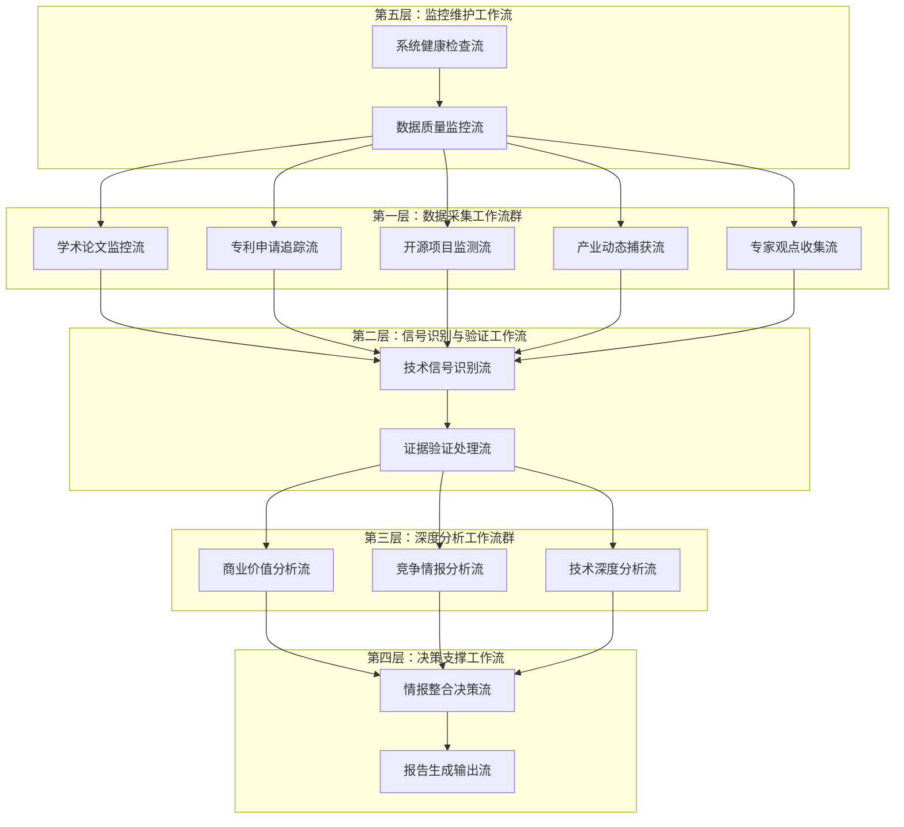

# 技术情报决策引擎 - Make工作流架构设计

## **工作流总体架构**

### **核心设计理念：分层协同的情报处理管道**



## **各工作流详细设计**

### **第一层：数据采集工作流群（5条并行工作流）**

#### **WF1：学术论文监控流**
```
触发方式：定时触发（每6小时）
数据源：arXiv, Google Scholar, PubMed, IEEE Xplore

工作流步骤：
1. 连接各学术数据源API
2. 使用预设关键词搜索最新论文
3. 提取论文元数据（标题、摘要、作者、发布时间）
4. AI初步筛选（技术突破性评估）
5. 写入临时数据表：Raw_Academic_Papers
6. 触发WF6（技术信号识别流）

输出格式：
{
  "source_type": "academic_paper",
  "title": "论文标题",
  "abstract": "摘要内容",
  "authors": ["作者列表"],
  "publication_date": "2024-12-19",
  "source_url": "原文链接",
  "initial_relevance_score": 8.5,
  "tech_keywords": ["AI", "breakthrough", "efficiency"]
}
```

#### **WF2：专利申请追踪流**
```
触发方式：定时触发（每12小时）
数据源：USPTO, EPO, WIPO, Google Patents

工作流步骤：
1. 连接专利数据库API
2. 搜索最新专利申请（关键技术领域）
3. 提取专利摘要和技术分类
4. 识别申请公司和发明人
5. 评估专利技术重要性
6. 写入临时数据表：Raw_Patent_Data
7. 触发WF6

输出格式：
{
  "source_type": "patent",
  "patent_number": "US20240123456",
  "title": "专利标题",
  "abstract": "技术摘要",
  "applicant": "公司名称",
  "filing_date": "2024-12-19",
  "tech_classification": ["G06N", "H04L"],
  "innovation_score": 7.8
}
```

#### **WF3：开源项目监测流**
```
触发方式：定时触发（每4小时）
数据源：GitHub, GitLab, SourceForge

工作流步骤：
1. 监控热门技术仓库
2. 识别重大更新和新项目
3. 分析代码提交频率和贡献者
4. 评估项目技术创新性
5. 提取README和文档关键信息
6. 写入临时数据表：Raw_OpenSource_Data
7. 触发WF6

输出格式：
{
  "source_type": "opensource",
  "project_name": "项目名称",
  "repository_url": "GitHub链接",
  "description": "项目描述",
  "stars": 15420,
  "recent_activity": "高活跃",
  "key_technologies": ["Python", "ML", "API"],
  "innovation_potential": 8.2
}
```

#### **WF4：产业动态捕获流**
```
触发方式：定时触发（每8小时）
数据源：TechCrunch, VentureBeat, 公司官网, 财报

工作流步骤：
1. 爬取科技媒体最新报道
2. 监控重点公司官方发布
3. 分析融资和并购消息
4. 识别产品发布和技术突破
5. 提取关键商业信息
6. 写入临时数据表：Raw_Industry_News
7. 触发WF6

输出格式：
{
  "source_type": "industry_news",
  "headline": "新闻标题",
  "content_summary": "内容摘要",
  "company": "相关公司",
  "announcement_date": "2024-12-19",
  "news_source": "TechCrunch",
  "business_impact_score": 7.5,
  "tech_relevance": ["AI", "automation"]
}
```

#### **WF5：专家观点收集流**
```
触发方式：定时触发（每24小时）
数据源：Twitter/X, LinkedIn, 学术会议, 专家博客

工作流步骤：
1. 监控技术专家社交媒体
2. 收集学术会议演讲内容
3. 追踪专家博客更新
4. 识别专家技术观点和预测
5. 评估专家权威性和观点价值
6. 写入临时数据表：Raw_Expert_Opinions
7. 触发WF6

输出格式：
{
  "source_type": "expert_opinion",
  "expert_name": "专家姓名",
  "expert_credentials": "权威资质",
  "opinion_content": "观点内容",
  "publication_platform": "LinkedIn",
  "credibility_score": 9.1,
  "tech_prediction": "技术趋势预测",
  "impact_assessment": "影响评估"
}
```

### **第二层：信号识别与验证工作流**

#### **WF6：技术信号识别流**
```
触发方式：被第一层工作流触发
输入：各种原始数据

工作流步骤：
1. 接收来自WF1-WF5的数据
2. AI技术信号强度评估
3. 多源数据交叉验证
4. 生成intelligence_id
5. 初步商业价值评估
6. 写入Tech_Intelligence_Master主表
7. 同时触发WF7, WF8, WF9, WF10

关键判断逻辑：
- 技术突破性：性能提升>20% 或 全新技术路径
- 信号强度：多源确认 + 专家认可 + 市场响应
- 商业潜力：市场规模>1亿美元 + 技术可行性高

输出：intelligence_id + 基础技术情报记录
```

#### **WF7：证据验证处理流**
```
触发方式：被WF6触发
输入：intelligence_id + 原始数据源

工作流步骤：
1. 验证所有原始链接有效性
2. 评估数据源权威性
3. 进行多源交叉验证
4. 寻找专家确认信息
5. 计算整体证据质量评分
6. 写入Evidence_Validation_Matrix表
7. 更新主表置信度字段

质量标准：
- 主要来源权威性≥8.0
- 至少2个独立来源确认
- 链接可访问性100%
- 数据一致性≥90%
```

### **第三层：深度分析工作流群（3条并行工作流）**

#### **WF8：商业价值分析流**
```
触发方式：被WF6触发
输入：intelligence_id + 技术基础信息

工作流步骤：
1. 市场规模建模分析
   - TAM/SAM/SOM计算
   - 市场增长率预测
   - 竞争格局分析
   
2. ROI预测建模
   - 投资成本估算
   - 收入预测模型
   - 风险调整计算
   
3. 商业化时间线评估
   - 技术成熟度分析
   - 监管审批时间
   - 市场接受度预测
   
4. 可比案例分析
   - 历史相似技术对比
   - 成功案例学习
   - 失败案例警示
   
5. 写入Commercial_Value_Quantification表
6. 更新主表商业价值相关字段

分析模型：
- 市场规模 = 用户数量 × 单用户价值 × 渗透率
- ROI = (预期收益 - 投资成本) / 投资成本 × 100%
- 投资回收期 = 初始投资 / 年均现金流
```

#### **WF9：竞争情报分析流**
```
触发方式：被WF6触发
输入：intelligence_id + 技术基础信息

工作流步骤：
1. 竞争者识别与分析
   - 直接竞争者识别
   - 间接竞争者分析
   - 潜在进入者评估
   
2. 专利布局分析
   - 相关专利检索
   - 专利权人分析
   - 专利到期时间
   
3. 市场地位评估
   - 各玩家市场份额
   - 技术领先程度
   - 资源投入对比
   
4. 威胁等级评估
   - 当前威胁等级
   - 未来威胁预测
   - 威胁变化趋势
   
5. 合作机会识别
   - 潜在合作伙伴
   - 收购目标分析
   - 战略联盟机会
   
6. 写入Competitive_Intelligence_Monitor表
7. 更新主表竞争相关字段

威胁评估模型：
威胁指数 = 竞争者实力 × 市场重叠度 × 资源投入 × 执行能力
```

#### **WF10：技术深度分析流**
```
触发方式：被WF6触发
输入：intelligence_id + 技术基础信息

工作流步骤：
1. 技术原理深度解析
   - 核心技术机制
   - 技术创新点
   - 技术局限性
   
2. 技术成熟度评估
   - TRL等级评定
   - 技术稳定性
   - 规模化可行性
   
3. 应用场景分析
   - 主要应用领域
   - 潜在应用扩展
   - 跨行业应用可能
   
4. 技术演进预测
   - 技术发展路径
   - 关键技术节点
   - 突破时间预测
   
5. 技术壁垒识别
   - 技术门槛高度
   - 专利保护程度
   - 人才稀缺性
   
6. 写入技术分析相关表
7. 更新主表技术评估字段
```

### **第四层：决策支撑工作流**

#### **WF11：情报整合决策流**
```
触发方式：WF8, WF9, WF10全部完成后触发
输入：完整的技术情报数据

工作流步骤：
1. 数据完整性检查
   - 验证所有必要字段已填充
   - 检查数据一致性
   - 确认分析质量
   
2. 综合评分计算
   - 技术价值综合评分
   - 投资机会评级
   - 紧急度等级确定
   
3. 行动建议生成
   - 即时行动建议（0-30天）
   - 短期策略（1-3个月）
   - 中期规划（3-12个月）
   
4. 风险评估与缓解
   - 技术风险识别
   - 商业风险评估
   - 风险缓解策略
   
5. 写入Action_Recommendations表
6. 更新主表最终评分
7. 触发WF12报告生成

决策逻辑：
- 高价值线索：商业价值≥8.0 且 置信度≥85%
- 紧急处理：竞争威胁≥8.0 或 时间窗口<6个月
- 投资建议：ROI≥30% 且 回收期≤24个月
```

#### **WF12：报告生成输出流**
```
触发方式：被WF11触发
输入：完整的技术情报数据

工作流步骤：
1. 数据筛选与排序
   - 按价值评分排序
   - 按紧急度分类
   - 按技术类别分组
   
2. 报告内容生成
   - 每日技术情报简报
   - 高价值线索详细卡片
   - 竞争情报预警
   - 投资决策建议书
   
3. 格式化输出
   - Markdown格式报告
   - 超链接验证
   - 图表数据可视化
   
4. 多渠道分发
   - 邮件发送
   - Slack通知
   - 仪表板更新
   
5. 反馈收集机制
   - 用户评分收集
   - 建议执行跟踪
   - 预测准确性验证

输出时间：
- 每日简报：上午9:00
- 紧急预警：实时
- 周报：周一上午
- 月报：每月1日
```

### **第五层：监控维护工作流**

#### **WF13：数据质量监控流**
```
触发方式：定时触发（每小时）

工作流步骤：
1. 数据完整性检查
   - 检查orphan记录
   - 验证外键完整性
   - 确认必填字段
   
2. 数据质量评估
   - 链接有效性检查
   - 数据新鲜度验证
   - 评分合理性检查
   
3. 异常数据识别
   - 异常值检测
   - 数据不一致识别
   - 重复记录发现
   
4. 自动修复机制
   - 失效链接替换
   - 缺失数据补充
   - 格式标准化
   
5. 质量报告生成
   - 数据质量仪表板
   - 异常情况预警
   - 修复建议输出
```

#### **WF14：系统健康检查流**
```
触发方式：定时触发（每30分钟）

工作流步骤：
1. 工作流运行状态检查
   - 各工作流执行情况
   - 错误日志分析
   - 性能指标监控
   
2. 数据源连接检查
   - API连接状态
   - 数据源响应时间
   - 数据获取成功率
   
3. 系统性能监控
   - 处理速度统计
   - 资源使用情况
   - 瓶颈识别
   
4. 预警机制
   - 系统故障预警
   - 性能下降提醒
   - 数据源异常通知
   
5. 自动恢复机制
   - 失败工作流重启
   - 备用数据源切换
   - 负载均衡调整
```

## **工作流协同关系**

### **数据流向关系**
```
原始数据采集 → 信号识别 → 证据验证 → 深度分析 → 决策整合 → 报告输出
     ↓              ↓           ↓           ↓           ↓
   质量监控 ←——————————————————————————————————————————————————————————
```

### **触发依赖关系**
```
时间触发：WF1-WF5 (数据采集)
数据触发：WF6 (信号识别) ← WF1-WF5
完成触发：WF7, WF8, WF9, WF10 ← WF6
汇聚触发：WF11 ← WF8, WF9, WF10
顺序触发：WF12 ← WF11
监控触发：WF13, WF14 (独立运行)
```

### **错误处理协同**
```
单个工作流失败：
- 记录错误日志
- 尝试自动重试
- 通知相关工作流
- 不阻塞其他流程

关键工作流失败：
- WF6失败：停止后续所有分析
- WF11失败：保留部分分析结果
- WF12失败：使用备用报告模板
```

### **资源协调机制**
```
优先级设置：
1. 紧急情报处理 (最高)
2. 日常数据采集 (高)
3. 深度分析处理 (中)
4. 报告生成 (中)
5. 质量监控 (低)

并发控制：
- 数据采集工作流：最多5个并发
- 分析工作流：最多3个并发
- 报告生成：单线程执行
- 监控工作流：独立运行
```

这个工作流架构设计确保了：

1. **完整性**：覆盖从数据采集到决策输出的全流程
2. **可靠性**：多层错误处理和自动恢复机制
3. **效率性**：合理的并行处理和优先级管理
4. **可扩展性**：模块化设计便于增加新的数据源和分析维度
5. **可监控性**：完整的质量监控和健康检查机制

Jason，这个工作流架构是否符合你的技术情报系统需求？需要我进一步详细设计某个具体工作流吗？
