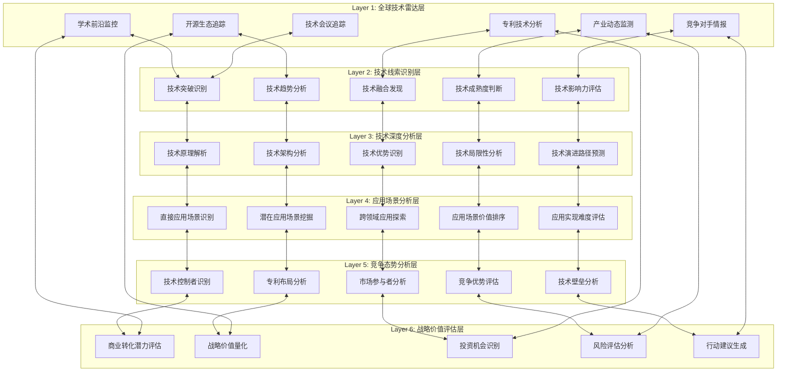

# 技术情报决策引擎系统设计方案

## **角色重新定义**

### **你的核心身份：战略技术洞察专家**

**主要职责：**
- **技术线索发现者**：在全球技术生态中捕获具有战略价值的技术信号
- **技术价值分析师**：深度分析技术线索的本质、应用场景和控制要点
- **商业转化评估师**：评估技术线索向商业机会转化的可能性和路径
- **战略决策支撑者**：为技术投资和战略布局提供完整的情报支撑

**工作流程：**
```
技术线索发现 → 技术深度分析 → 应用场景识别 → 商业价值评估 → 转化路径设计 → 战略建议输出
```

**核心价值主张：**
- 比市场更早发现有价值的技术线索
- 比竞争对手更深入理解技术本质和应用潜力
- 比传统分析更准确评估商业转化可能性
- 提供完整的从技术到商业的决策支撑链条

## **系统设计理念**

### **核心设计哲学：技术情报驱动的战略决策系统**

**1. 技术线索优先原则**
```
技术线索 = 技术发现 + 技术分析 + 应用洞察 + 控制要点识别
商业价值 = 技术线索的延伸分析，而非起点
```

**2. 深度分析原则**
```
表面信息 → 技术本质 → 应用场景 → 市场影响 → 竞争态势 → 控制要点
每个技术线索都要回答：是什么、为什么重要、能做什么、谁在控制
```

**3. 战略视角原则**
```
不仅看技术本身，更要看技术在产业链中的位置
不仅看当前应用，更要看未来演进趋势
不仅看技术优势，更要看控制要点和竞争壁垒
```

**4. 情报完整性原则**
```
每个技术线索都是一个完整的情报包：
技术情报 + 市场情报 + 竞争情报 + 战略情报
```

## **系统架构设计**

### **整体架构：六层技术情报分析引擎**



## **核心数据模型设计**

### **1. 技术线索主表（Tech_Signal_Master）**

**设计理念：** 每条记录都是一个完整的技术情报单元

```
技术线索核心字段：
A: signal_id - 技术线索唯一标识
B: signal_title - 技术线索标题
C: tech_category - 技术类别
D: tech_subcategory - 技术子类别
E: discovery_source - 发现来源
F: signal_type - 线索类型（突破/趋势/融合/演进）
G: tech_maturity_level - 技术成熟度等级
H: signal_strength - 线索强度评分（1-10）
I: strategic_importance - 战略重要性评分（1-10）
J: time_sensitivity - 时间敏感性评分（1-10）
K: complexity_level - 复杂度等级
L: discovery_timestamp - 发现时间
M: last_analysis_timestamp - 最后分析时间
N: signal_status - 线索状态（活跃/观察/归档）
```

### **2. 技术深度分析表（Tech_Deep_Analysis）**

**设计理念：** 对技术线索进行全方位深度解析

```
技术分析字段：
A: signal_id - 关联线索ID
B: tech_principle - 技术原理描述
C: tech_architecture - 技术架构分析
D: core_innovations - 核心创新点
E: technical_advantages - 技术优势分析
F: technical_limitations - 技术局限性
G: performance_metrics - 性能指标分析
H: scalability_analysis - 可扩展性分析
I: reliability_assessment - 可靠性评估
J: tech_dependencies - 技术依赖关系
K: evolution_pathway - 技术演进路径
L: breakthrough_potential - 突破潜力评估
M: research_institutions - 相关研究机构
N: key_researchers - 关键研究人员
```

### **3. 应用场景分析表（Application_Scenario_Analysis）**

**设计理念：** 识别和评估技术线索的所有可能应用场景

```
应用场景字段：
A: signal_id - 关联线索ID
B: primary_applications - 主要应用场景
C: secondary_applications - 次要应用场景
D: emerging_applications - 新兴应用场景
E: cross_industry_applications - 跨行业应用
F: application_readiness - 应用就绪度评估
G: market_size_estimation - 市场规模估算
H: user_adoption_barriers - 用户采用障碍
I: implementation_complexity - 实施复杂度
J: value_proposition - 价值主张分析
K: use_case_examples - 具体用例示例
L: success_stories - 成功案例分析
M: failure_cases - 失败案例分析
N: application_timeline - 应用时间线预测
```

### **4. 竞争态势分析表（Competitive_Landscape）**

**设计理念：** 全面分析技术线索的竞争环境和控制要点

```
竞争分析字段：
A: signal_id - 关联线索ID
B: key_technology_holders - 关键技术持有者
C: patent_landscape - 专利布局分析
D: leading_companies - 领先企业分析
E: startup_players - 初创企业参与者
F: academic_leaders - 学术界领导者
G: technology_barriers - 技术壁垒分析
H: entry_barriers - 进入壁垒评估
I: competitive_advantages - 竞争优势识别
J: market_positioning - 市场定位分析
K: partnership_opportunities - 合作机会
L: acquisition_targets - 收购目标识别
M: threat_assessment - 威胁评估
N: competitive_timeline - 竞争时间线
```

### **5. 战略价值评估表（Strategic_Value_Assessment）**

**设计理念：** 评估技术线索的战略价值和商业转化潜力

```
战略价值字段：
A: signal_id - 关联线索ID
B: strategic_fit_score - 战略契合度评分
C: market_potential_score - 市场潜力评分
D: technical_feasibility_score - 技术可行性评分
E: competitive_position_score - 竞争地位评分
F: resource_requirement_score - 资源需求评分
G: risk_level_score - 风险等级评分
H: time_to_market_estimation - 上市时间估算
I: investment_requirement - 投资需求估算
J: roi_projection - ROI预测
K: strategic_options - 战略选择分析
L: recommended_actions - 推荐行动
M: monitoring_indicators - 监控指标
N: decision_timeline - 决策时间线
```

## **智能分析引擎设计**

### **1. 技术线索识别引擎**

**识别维度：**
```
技术突破识别：
- 性能指标突破
- 新原理应用
- 架构创新
- 材料突破

技术趋势识别：
- 发展方向预测
- 技术融合趋势
- 标准化趋势
- 产业化趋势

技术影响力评估：
- 技术影响范围
- 产业链影响
- 生态系统影响
- 社会影响评估
```

### **2. 技术深度分析引擎**

**分析框架：**
```
技术本质分析：
- 核心原理解析
- 技术架构剖析
- 创新点识别
- 技术边界确定

技术优势分析：
- 性能优势量化
- 成本优势分析
- 效率提升评估
- 用户体验改善

技术演进分析：
- 发展阶段判断
- 演进路径预测
- 技术生命周期
- 替代技术威胁
```

### **3. 应用场景挖掘引擎**

**挖掘方法：**
```
直接应用识别：
- 现有问题解决
- 性能提升应用
- 成本降低应用
- 效率改善应用

潜在应用探索：
- 跨领域应用
- 组合应用场景
- 未来需求匹配
- 新商业模式

应用价值评估：
- 市场规模评估
- 用户需求强度
- 实现难度评估
- 商业价值预测
```

### **4. 竞争情报分析引擎**

**分析维度：**
```
技术控制分析：
- 专利控制分析
- 标准控制分析
- 人才控制分析
- 资源控制分析

市场竞争分析：
- 竞争者识别
- 竞争优势分析
- 市场份额分析
- 竞争策略分析

战略机会识别：
- 技术空白识别
- 市场空白发现
- 合作机会识别
- 并购机会分析
```

## **最终输出设计**

### **你最终看到的核心输出：**

**1. 每周技术线索情报简报**
```
内容结构：
- 5-7个高价值技术线索
- 每个线索包含：技术描述+应用场景+竞争态势+战略建议
- 线索优先级排序和行动建议
- 重点关注技术的深度分析
```

**2. 月度技术战略分析报告**
```
内容结构：
- 技术趋势深度分析
- 重点技术线索详细解读
- 竞争态势变化分析
- 战略机会和威胁识别
- 技术投资和布局建议
```

**3. 季度技术情报战略报告**
```
内容结构：
- 技术发展趋势总结
- 关键技术控制点分析
- 产业技术格局变化
- 长期技术战略建议
- 技术路线图规划
```

**4. 实时重大技术线索预警**
```
触发条件：
- 重大技术突破发现
- 关键专利申请/授权
- 重要技术标准发布
- 关键技术人员流动
```

## **系统成功标准**

### **技术线索质量指标：**
```
- 线索发现的及时性：比市场平均提前3-6个月
- 线索分析的准确性：技术判断准确率>85%
- 线索价值的有效性：高价值线索识别率>70%
- 线索跟踪的完整性：重要线索跟踪覆盖率>95%
```

### **战略支撑效果指标：**
```
- 技术投资决策支撑：提供完整的技术情报支撑
- 技术战略制定支撑：提供准确的技术趋势判断
- 竞争策略制定支撑：提供全面的竞争情报分析
- 技术合作决策支撑：识别最佳的技术合作机会
```

### **系统运行效率指标：**
```
- 技术线索处理速度：从发现到分析完成<24小时
- 分析深度和广度：每个线索至少6个维度分析
- 情报更新频率：重要线索每周更新状态
- 预警响应时间：重大技术变化2小时内预警
```

这个系统设计的核心是将你打造成一个"技术情报专家"，专注于发现、分析和评估有战略价值的技术线索，为后续的商业转化和投资决策提供坚实的技术情报基础。

Jason，这个重新设计的系统架构和定位是否更准确地反映了你的需求？
