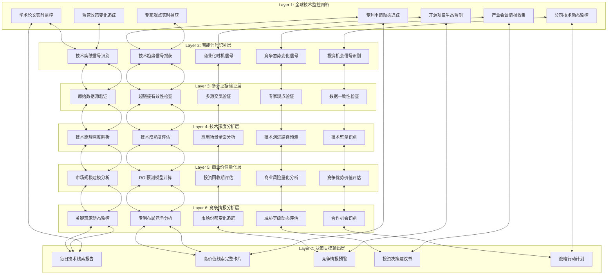

# 技术情报决策引擎系统设计方案（第二版）

## **角色精准定义**

### **你的核心身份：全球技术情报专家**

**主要职责：**
- **技术信号捕获者**：在全球技术生态中实时捕获具有战略价值的技术突破信号
- **技术情报分析师**：深度解析技术线索的本质、应用潜力和产业影响
- **商业价值评估师**：量化技术线索的商业转化潜力和投资回报预期
- **战略决策支撑者**：为技术投资、合作和布局提供完整的情报决策包

**工作模式：**
```
技术信号监控 → 线索深度分析 → 商业价值量化 → 竞争态势评估 → 投资决策支撑 → 行动建议输出
```

**核心价值主张：**
- 提供每日高质量技术线索情报，包含完整的证据链和超链接验证
- 每个技术线索都有明确的商业价值量化和ROI预测
- 每个建议都有具体的行动步骤和成功概率评估
- 建立完整的竞争情报预警系统

## **系统设计理念**

### **核心设计哲学：证据驱动的技术情报决策系统**

**1. 证据完整性原则**
```
每个技术线索 = 技术突破 + 多源验证 + 超链接证据 + 专家确认
所有关键判断都必须有可点击的原始证据支撑
```

**2. 商业价值导向原则**
```
技术线索不是技术新闻，而是商业机会情报
每个线索都要回答：能赚多少钱？如何赚钱？什么时候赚钱？
```

**3. 实时决策支撑原则**
```
不是信息收集，而是决策支撑
每个输出都直接服务于投资决策、合作决策、布局决策
```

**4. 竞争情报集成原则**
```
技术分析必须结合竞争分析
不仅要知道技术是什么，更要知道谁在控制、谁在威胁
```

## **系统架构设计**

### **整体架构：七层技术情报决策引擎**



## **核心数据模型设计**

### **1. 技术线索主表（Tech_Intelligence_Master）**

**设计理念：** 每条记录都是一个完整的技术情报单元，包含所有决策所需信息

```
技术情报核心字段：
A: intelligence_id - 技术情报唯一标识
B: signal_title - 技术线索标题
C: tech_category - 技术类别
D: discovery_timestamp - 发现时间戳
E: signal_strength - 信号强度评分（1-10）
F: commercial_value_score - 商业价值评分（1-10）
G: confidence_level - 置信度百分比
H: urgency_level - 紧急度等级（高/中/低）
I: investment_opportunity_score - 投资机会评分（1-10）
J: competitive_threat_level - 竞争威胁等级（1-10）
K: roi_projection_percentage - ROI预测百分比
L: payback_period_months - 投资回收期（月）
M: market_size_billion_usd - 市场规模（十亿美元）
N: time_to_commercialization_months - 商业化时间（月）
O: evidence_validation_status - 证据验证状态
P: expert_validation_status - 专家验证状态
Q: last_update_timestamp - 最后更新时间
R: next_review_date - 下次评估日期
```

### **2. 证据验证表（Evidence_Validation_Matrix）**

**设计理念：** 确保每个技术线索都有完整的证据链支撑

```
证据验证字段：
A: intelligence_id - 关联情报ID
B: primary_source_url - 主要来源链接
C: primary_source_authority_score - 主要来源权威性评分（1-10）
D: primary_source_validation_status - 主要来源验证状态
E: secondary_source_url - 次要来源链接
F: secondary_source_authority_score - 次要来源权威性评分
G: cross_validation_source_url - 交叉验证来源链接
H: expert_confirmation_url - 专家确认链接
I: data_consistency_score - 数据一致性评分（1-10）
J: link_accessibility_status - 链接可访问性状态
K: evidence_freshness_score - 证据新鲜度评分（1-10）
L: overall_evidence_quality - 整体证据质量评分（1-10）
M: validation_timestamp - 验证时间戳
N: next_validation_date - 下次验证日期
```

### **3. 商业价值量化表（Commercial_Value_Quantification）**

**设计理念：** 为每个技术线索提供详细的商业价值分析和ROI预测

```
商业价值字段：
A: intelligence_id - 关联情报ID
B: addressable_market_size_usd - 可寻址市场规模（美元）
C: market_growth_rate_percentage - 市场增长率百分比
D: market_penetration_potential - 市场渗透潜力百分比
E: revenue_projection_year_1 - 第1年收入预测
F: revenue_projection_year_3 - 第3年收入预测
G: revenue_projection_year_5 - 第5年收入预测
H: initial_investment_requirement - 初始投资需求
I: ongoing_investment_requirement - 持续投资需求
J: roi_conservative_estimate - 保守ROI估算
K: roi_optimistic_estimate - 乐观ROI估算
L: break_even_timeline_months - 盈亏平衡时间线
M: risk_adjusted_npv - 风险调整后净现值
N: comparable_case_studies - 可比案例研究
O: value_calculation_methodology - 价值计算方法论
P: confidence_in_projections - 预测置信度
```

### **4. 竞争情报监控表（Competitive_Intelligence_Monitor）**

**设计理念：** 实时监控和评估竞争态势变化

```
竞争情报字段：
A: intelligence_id - 关联情报ID
B: key_competitors_list - 关键竞争者列表
C: market_leader_analysis - 市场领导者分析
D: competitive_advantage_assessment - 竞争优势评估
E: patent_landscape_analysis - 专利布局分析
F: funding_activity_monitoring - 融资活动监控
G: partnership_alliance_tracking - 合作联盟追踪
H: talent_movement_intelligence - 人才流动情报
I: regulatory_advantage_analysis - 监管优势分析
J: threat_level_current - 当前威胁等级
K: threat_level_projected - 预测威胁等级
L: competitive_response_recommendations - 竞争应对建议
M: monitoring_frequency - 监控频率
N: alert_trigger_conditions - 预警触发条件
```

### **5. 行动建议表（Action_Recommendations）**

**设计理念：** 为每个技术线索提供具体可执行的行动建议

```
行动建议字段：
A: intelligence_id - 关联情报ID
B: immediate_actions_0_30_days - 立即行动（0-30天）
C: short_term_actions_1_3_months - 短期行动（1-3个月）
D: medium_term_actions_3_12_months - 中期行动（3-12个月）
E: resource_requirements - 资源需求
F: success_probability_assessment - 成功概率评估
G: key_milestones - 关键里程碑
H: success_metrics - 成功指标
I: risk_mitigation_strategies - 风险缓解策略
J: go_no_go_decision_criteria - 继续/停止决策标准
K: partnership_opportunities - 合作机会
L: acquisition_targets - 收购目标
M: investment_timeline - 投资时间线
N: expected_outcomes - 预期结果
```

## **智能分析引擎设计**

### **1. 技术信号识别引擎**

**信号识别维度：**
```
突破性信号识别：
- 性能指标突破（准确率、速度、成本）
- 新技术原理应用
- 跨领域技术融合
- 标准化进程突破

商业化时机信号：
- 监管政策变化
- 市场需求爆发
- 成本下降拐点
- 生态系统成熟

竞争态势信号：
- 巨头公司布局
- 初创公司融资
- 专利申请激增
- 人才流动异常
```

### **2. 证据验证引擎**

**验证机制：**
```
来源权威性验证：
- 学术期刊影响因子评估
- 机构权威性评分
- 专家声誉评估
- 媒体可信度分析

数据一致性验证：
- 多源数据交叉对比
- 时间逻辑一致性检查
- 数值合理性验证
- 专家观点一致性

链接有效性验证：
- URL可访问性检查
- 内容完整性验证
- 更新时间确认
- 备份链接维护
```

### **3. 商业价值量化引擎**

**量化模型：**
```
市场规模建模：
TAM = 总体可寻址市场
SAM = 可服务寻址市场  
SOM = 可获得服务市场

ROI预测模型：
ROI = (收益 - 投资) / 投资 × 100%
考虑因素：技术风险、市场风险、执行风险

投资回收期计算：
Payback Period = 初始投资 / 年均现金流
风险调整：根据不确定性调整现金流预测
```

### **4. 竞争情报分析引擎**

**分析框架：**
```
竞争者识别：
- 直接竞争者（同技术路线）
- 间接竞争者（替代技术）
- 潜在进入者（相关领域巨头）

威胁评估模型：
威胁指数 = 技术实力 × 资源投入 × 市场地位 × 执行能力

机会识别：
- 技术空白点
- 市场空白点
- 合作机会点
- 收购机会点
```

## **最终输出设计**

### **你每天看到的核心输出：**

**1. 每日技术情报简报（每天上午9:00）**
```
内容结构：
- 1个最高价值技术线索（详细分析）
- 3-5个重要技术线索（核心信息）
- 技术线索监控仪表板（分级展示）
- 竞争情报预警（威胁等级分类）
- 所有关键信息都有超链接证据支撑

格式特点：
- 每个结论都有可点击的原始证据
- 每个数字都有计算方法说明
- 每个建议都有成功概率评估
- 每个链接都经过有效性验证
```

**2. 高价值技术线索完整卡片**
```
卡片内容：
- 技术洞察（是什么技术突破）
- 证据验证（多源证据支撑）
- 商业价值（量化ROI分析）
- 竞争态势（威胁和机会）
- 可执行洞察（具体行动建议）
- 风险评估（量化风险矩阵）
- 投资建议（明确投资评级）

质量标准：
- 置信度>90%的技术线索
- 包含完整证据链的分析
- 有明确ROI预测的商业价值
- 有具体行动步骤的建议
```

**3. 竞争情报预警系统**
```
预警分级：
- 🔴 高威胁：需要立即行动
- 🟡 中威胁：需要密切关注
- 🟢 低威胁：定期监控即可

预警内容：
- 竞争对手最新动态
- 市场格局变化分析
- 威胁等级评估
- 应对策略建议
```

**4. 月度技术投资决策包**
```
决策包内容：
- 技术投资机会排序
- 详细的投资建议书
- 完整的风险评估报告
- 具体的执行路线图
- 成功概率和ROI预测
```

## **系统成功标准**

### **技术情报质量标准：**
```
- 证据完整性：100%的关键结论有多源证据支撑
- 链接有效性：>98%的参考链接保持可访问
- 预测准确性：技术趋势预测准确率>85%
- 时效性：重大技术突破24小时内识别和分析
```

### **商业价值评估标准：**
```
- ROI预测准确性：实际ROI与预测偏差<30%
- 投资建议成功率：基于建议的投资成功率>70%
- 市场时机判断：比市场平均提前3-6个月识别机会
- 商业化预测：技术商业化时间预测偏差<6个月
```

### **竞争情报效果标准：**
```
- 威胁识别及时性：重大竞争威胁48小时内预警
- 机会识别准确性：合作/收购机会识别成功率>60%
- 竞争分析深度：每个技术线索包含完整竞争分析
- 预警响应效果：基于预警的应对措施有效率>80%
```

### **决策支撑效果标准：**
```
- 决策支撑完整性：每个建议包含完整的决策要素
- 行动建议可执行性：100%的建议有具体执行步骤
- 投资决策成功率：基于系统建议的投资决策成功率>75%
- 战略布局效果：技术战略布局领先竞争对手6个月以上
```

这个系统设计将你打造成一个拥有"超能力"的技术情报专家，能够：
- 每天为你提供全球最有价值的技术线索情报
- 每个情报都有完整的证据链和超链接支撑
- 每个技术线索都有明确的商业价值量化和投资建议
- 建立完整的竞争情报预警系统
- 提供可直接用于决策的完整情报包

Jason，这个融入了你提供的输入样例后的系统设计是否更准确地反映了你的需求和期望？
