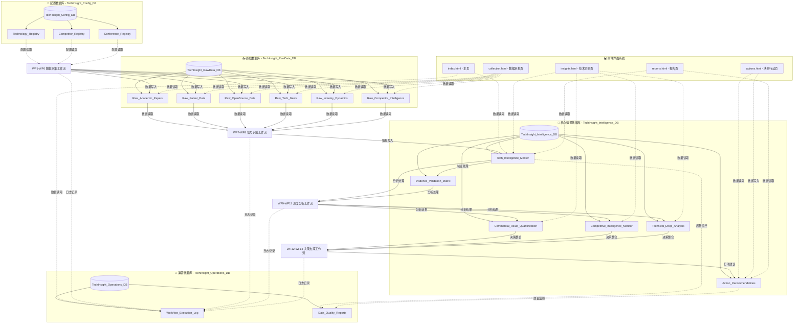
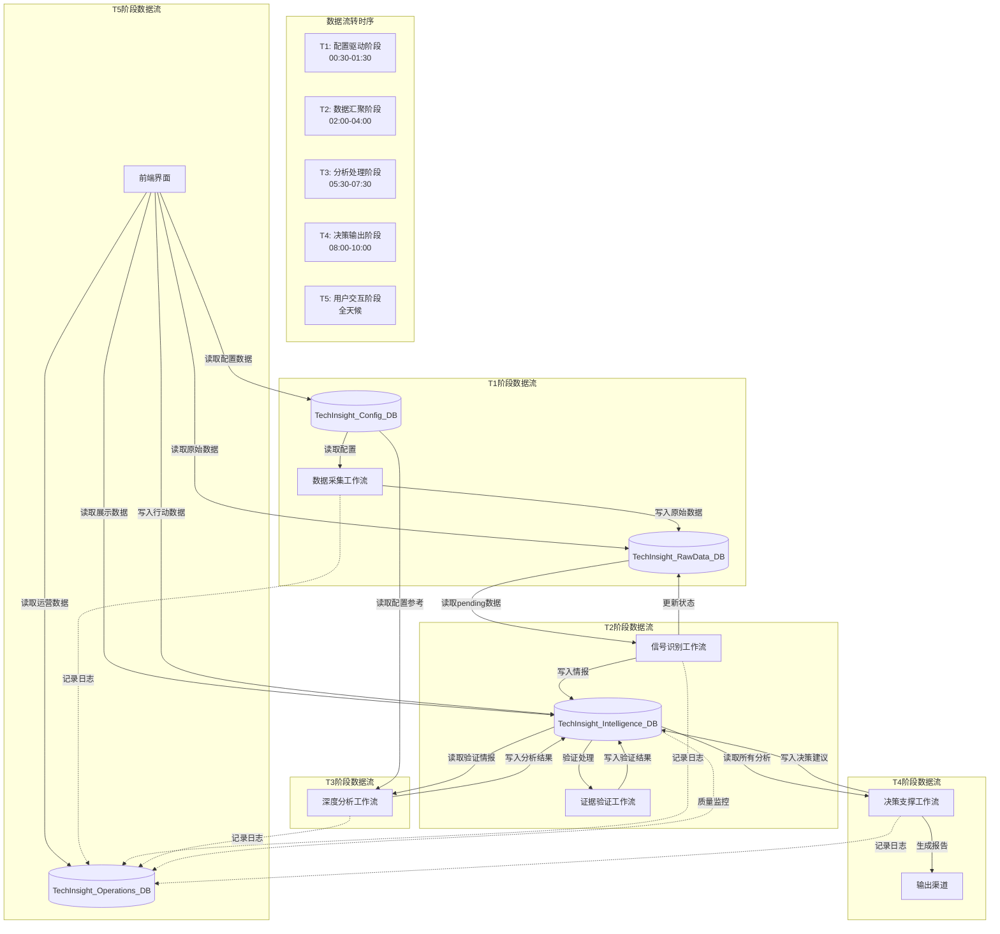

Jason，您说得对，我需要深入分析每个工作流和功能模块具体使用哪些数据库，以及数据如何在不同数据库之间流转。让我系统梳理数据库使用关系。

# **技术洞察分析引擎 - 数据库使用关系深度分析**

## **一、数据库使用全景图**



## **二、工作流层面的数据库使用分析**

### **2.1 数据采集层工作流 (WF1-WF6) 数据库使用**

**WF1: 学术论文监控流**
```javascript
const WF1_DATABASE_USAGE = {
  input_databases: [
    {
      database: "TechInsight_Config_DB",
      tables: ["Technology_Registry"],
      usage: "读取技术关键词配置",
      frequency: "工作流启动时一次性读取",
      fields_used: [
        "tech_keywords",           // 技术关键词
        "academic_search_terms",   // 学术搜索词
        "monitoring_priority",     // 监控优先级
        "data_source_academic"     // 学术数据源启用状态
      ]
    }
  ],
  output_databases: [
    {
      database: "TechInsight_RawData_DB",
      tables: ["Raw_Academic_Papers"],
      usage: "写入筛选后的学术论文数据",
      frequency: "每条符合条件的论文写入一次",
      fields_written: [
        "raw_id",                  // 原始数据ID
        "title",                   // 论文标题
        "abstract",                // 论文摘要
        "authors",                 // 作者列表
        "publication_date",        // 发布日期
        "source_url",              // 来源链接
        "tech_keywords",           // 关联技术关键词
        "ai_evaluation_score",     // AI评估总分
        "innovation_score",        // 创新度评分
        "processing_status",       // 处理状态 (pending)
        "workflow_execution_id",   // 工作流执行ID
        "created_timestamp"        // 创建时间
      ]
    }
  ],
  operational_databases: [
    {
      database: "TechInsight_Operations_DB",
      tables: ["Workflow_Execution_Log"],
      usage: "记录工作流执行日志",
      frequency: "工作流开始、结束、异常时记录"
    }
  ]
};
```

**WF2: 专利申请追踪流**
```javascript
const WF2_DATABASE_USAGE = {
  input_databases: [
    {
      database: "TechInsight_Config_DB",
      tables: ["Technology_Registry", "Competitor_Registry"],
      usage: "读取技术域和竞争对手配置",
      cross_reference: "技术关键词 × 竞争对手公司",
      fields_used: [
        // Technology_Registry
        "tech_keywords",
        "patent_search_terms",
        "monitoring_priority",
        // Competitor_Registry  
        "company_name",
        "tech_focus_areas",
        "patent_monitoring"
      ]
    }
  ],
  output_databases: [
    {
      database: "TechInsight_RawData_DB", 
      tables: ["Raw_Patent_Data"],
      usage: "写入筛选后的专利数据",
      fields_written: [
        "raw_id",
        "title",                   // 专利标题
        "abstract",                // 专利摘要
        "inventors",               // 发明人
        "assignee",                // 申请人/受让人
        "patent_number",           // 专利号
        "application_date",        // 申请日期
        "tech_keywords",           // 关联技术关键词
        "importance_score",        // 重要性评分
        "threat_level",            // 威胁等级评分
        "processing_status"        // 处理状态
      ]
    }
  ]
};
```

**WF3-WF6 类似结构，每个都有明确的输入配置和输出数据表**

### **2.2 信号识别层工作流 (WF7-WF8) 数据库使用**

**WF7: 技术信号识别流**
```javascript
const WF7_DATABASE_USAGE = {
  input_databases: [
    {
      database: "TechInsight_RawData_DB",
      tables: [
        "Raw_Academic_Papers",
        "Raw_Patent_Data", 
        "Raw_OpenSource_Data",
        "Raw_Tech_News",
        "Raw_Industry_Dynamics",
        "Raw_Competitor_Intelligence"
      ],
      usage: "读取所有pending状态的原始数据",
      query_condition: "processing_status = 'pending'",
      batch_processing: "批量读取进行汇聚分析"
    }
  ],
  output_databases: [
    {
      database: "TechInsight_Intelligence_DB",
      tables: ["Tech_Intelligence_Master"],
      usage: "写入识别出的技术情报",
      data_transformation: {
        from: "多源原始数据",
        to: "统一情报格式",
        key_fields: [
          "intelligence_id",        // 生成情报ID
          "signal_strength",        // 计算信号强度
          "breakthrough_score",     // AI评估突破性
          "commercial_value_score", // AI评估商业价值
          "confidence_level",       // 置信度等级
          "processing_status"       // 设为 'signal_identified'
        ]
      }
    }
  ],
  update_databases: [
    {
      database: "TechInsight_RawData_DB",
      tables: ["所有Raw_*表"],
      usage: "更新原始数据处理状态",
      update_fields: [
        "processing_status",       // 更新为 'processed'
        "linked_intelligence_id",  // 关联生成的情报ID
        "processed_timestamp"      // 处理时间
      ]
    }
  ]
};
```

**WF8: 证据验证处理流**
```javascript
const WF8_DATABASE_USAGE = {
  input_databases: [
    {
      database: "TechInsight_Intelligence_DB",
      tables: ["Tech_Intelligence_Master"],
      usage: "读取新生成的情报进行验证",
      query_condition: "processing_status = 'signal_identified' AND confidence_level IS NULL"
    }
  ],
  output_databases: [
    {
      database: "TechInsight_Intelligence_DB",
      tables: ["Evidence_Validation_Matrix"],
      usage: "写入证据验证结果",
      fields_written: [
        "validation_id",           // 验证ID
        "intelligence_id",         // 关联情报ID
        "evidence_type",           // 证据类型
        "url_validity_status",     // 链接有效性
        "source_authority_score",  // 来源权威性评分
        "cross_validation_count",  // 交叉验证数量
        "validation_confidence",   // 验证置信度
        "quality_score"            // 证据质量综合评分
      ]
    }
  ],
  update_databases: [
    {
      database: "TechInsight_Intelligence_DB", 
      tables: ["Tech_Intelligence_Master"],
      usage: "更新情报的置信度和验证状态",
      update_fields: [
        "confidence_level",        // 基于验证结果更新
        "evidence_count",          // 支撑证据数量
        "processing_status"        // 更新为 'analyzing'
      ]
    }
  ]
};
```

### **2.3 深度分析层工作流 (WF9-WF11) 数据库使用**

**WF9: 商业价值分析流**
```javascript
const WF9_DATABASE_USAGE = {
  input_databases: [
    {
      database: "TechInsight_Intelligence_DB",
      tables: ["Tech_Intelligence_Master", "Evidence_Validation_Matrix"],
      usage: "读取已验证的情报数据",
      join_condition: "Tech_Intelligence_Master.intelligence_id = Evidence_Validation_Matrix.intelligence_id",
      filter_condition: "confidence_level = 'high' AND validation_confidence >= 80"
    }
  ],
  external_data_sources: [
    {
      source: "市场数据API",
      usage: "获取市场规模、增长率等数据",
      integration: "与情报数据结合进行TAM/SAM/SOM建模"
    }
  ],
  output_databases: [
    {
      database: "TechInsight_Intelligence_DB",
      tables: ["Commercial_Value_Quantification"],
      usage: "写入商业价值量化分析结果",
      analysis_dimensions: [
        "market_analysis": {
          fields: ["market_size_tam", "market_size_sam", "market_size_som"]
        },
        "financial_analysis": {
          fields: ["revenue_projection_y1", "revenue_projection_y3", "revenue_projection_y5", 
                  "roi_percentage", "npv_value", "irr_percentage"]
        },
        "risk_analysis": {
          fields: ["risk_adjustment_factor", "market_entry_barriers", "sensitivity_analysis"]
        },
        "strategy_analysis": {
          fields: ["business_model_recommendation", "pricing_strategy", "go_to_market_strategy"]
        }
      ]
    }
  ],
  update_databases: [
    {
      database: "TechInsight_Intelligence_DB",
      tables: ["Tech_Intelligence_Master"],
      usage: "更新情报的商业价值相关字段",
      update_fields: [
        "commercial_value_score",  // 基于详细分析更新
        "analysis_completion"      // 增加分析完成度
      ]
    }
  ]
};
```

**WF10: 竞争情报分析流**
```javascript
const WF10_DATABASE_USAGE = {
  input_databases: [
    {
      database: "TechInsight_Intelligence_DB",
      tables: ["Tech_Intelligence_Master"],
      usage: "读取已验证的情报数据"
    },
    {
      database: "TechInsight_Config_DB", 
      tables: ["Competitor_Registry"],
      usage: "读取竞争对手配置信息",
      cross_reference: "将情报与竞争对手进行关联分析"
    },
    {
      database: "TechInsight_Intelligence_DB",
      tables: ["Competitive_Intelligence_Monitor"],
      usage: "读取历史竞争分析数据",
      purpose: "趋势分析和对比"
    }
  ],
  output_databases: [
    {
      database: "TechInsight_Intelligence_DB",
      tables: ["Competitive_Intelligence_Monitor"],
      usage: "写入竞争情报分析结果",
      analysis_dimensions: [
        "competitive_landscape": {
          fields: ["competitor_landscape", "market_position_analysis"]
        },
        "threat_assessment": {
          fields: ["competitive_threats", "threat_level", "threat_urgency"]
        },
        "opportunity_identification": {
          fields: ["collaboration_opportunities", "acquisition_targets", "partnership_recommendations"]
        },
        "strategic_response": {
          fields: ["competitive_response_strategy", "early_warning_indicators"]
        }
      ]
    }
  ]
};
```

**WF11: 技术深度分析流**
```javascript
const WF11_DATABASE_USAGE = {
  input_databases: [
    {
      database: "TechInsight_Intelligence_DB",
      tables: ["Tech_Intelligence_Master"],
      usage: "读取已验证的情报数据"
    },
    {
      database: "TechInsight_Config_DB",
      tables: ["Technology_Registry"],
      usage: "读取技术配置信息",
      purpose: "技术分类和关联分析"
    }
  ],
  output_databases: [
    {
      database: "TechInsight_Intelligence_DB", 
      tables: ["Technical_Deep_Analysis"],
      usage: "写入技术深度分析结果",
      analysis_dimensions: [
        "technical_principle": {
          fields: ["technology_principle", "technical_feasibility"]
        },
        "maturity_assessment": {
          fields: ["trl_level", "development_stage", "innovation_degree"]
        },
        "application_analysis": {
          fields: ["application_scenarios", "scalability_assessment"]
        },
        "barrier_analysis": {
          fields: ["technical_barriers", "implementation_complexity", "dependency_analysis"]
        },
        "evolution_prediction": {
          fields: ["technology_evolution_path", "alternative_technologies"]
        }
      ]
    }
  ]
};
```

### **2.4 决策支撑层工作流 (WF12-WF13) 数据库使用**

**WF12: 情报整合决策流**
```javascript
const WF12_DATABASE_USAGE = {
  input_databases: [
    {
      database: "TechInsight_Intelligence_DB",
      tables: [
        "Tech_Intelligence_Master",
        "Commercial_Value_Quantification", 
        "Competitive_Intelligence_Monitor",
        "Technical_Deep_Analysis"
      ],
      usage: "读取所有分析结果进行综合决策",
      join_strategy: "以Tech_Intelligence_Master为主表，关联所有分析表",
      completeness_check: "确保三个分析维度都已完成"
    }
  ],
  output_databases: [
    {
      database: "TechInsight_Intelligence_DB",
      tables: ["Action_Recommendations"],
      usage: "写入综合决策建议",
      decision_logic: {
        scoring_algorithm: `
          overall_score = 
            (commercial_value × 0.4) + 
            (competitive_advantage × 0.3) + 
            (technical_feasibility × 0.2) + 
            (evidence_confidence × 0.1)
        `,
        recommendation_mapping: {
          "≥9.0": "investment - 立即投资",
          "8.0-8.9": "partnership - 寻求合作",
          "7.0-7.9": "research - 内部研发",
          "6.0-6.9": "monitoring - 持续监控"
        }
      },
      fields_written: [
        "recommendation_id",       // 建议ID
        "intelligence_id",         // 关联情报ID
        "recommendation_type",     // 建议类型
        "priority_level",          // 优先级
        "detailed_action_plan",    // 详细行动计划
        "resource_requirements",   // 资源需求
        "budget_estimation",       // 预算估计
        "timeline_estimation",     // 时间线估计
        "risk_mitigation_plan",    // 风险缓解计划
        "success_criteria",        // 成功标准
        "roi_estimation"           // ROI估算
      ]
    }
  ],
  update_databases: [
    {
      database: "TechInsight_Intelligence_DB",
      tables: ["Tech_Intelligence_Master"],
      usage: "更新情报最终状态",
      update_fields: [
        "processing_status",       // 更新为 'completed'
        "analysis_completion",     // 设为 100%
        "updated_timestamp"        // 最后更新时间
      ]
    }
  ]
};
```

**WF13: 报告生成输出流**
```javascript
const WF13_DATABASE_USAGE = {
  input_databases: [
    {
      database: "TechInsight_Intelligence_DB",
      tables: [
        "Tech_Intelligence_Master",
        "Action_Recommendations"
      ],
      usage: "读取最终情报和决策建议",
      sorting_logic: "按overall_score降序，priority_level升序",
      filtering_logic: "只选择processing_status='completed'的情报"
    }
  ],
  output_channels: [
    {
      channel: "邮件报告",
      content_source: "Action_Recommendations TOP 5",
      format: "HTML邮件模板"
    },
    {
      channel: "Slack通知", 
      content_source: "urgent级别的行动建议",
      format: "Slack消息格式"
    },
    {
      channel: "仪表板更新",
      content_source: "所有完成的情报数据",
      format: "JSON API格式"
    }
  ],
  no_database_writes: "此工作流只读取数据，不写入数据库"
};
```

## **三、前端界面层面的数据库使用分析**

### **3.1 各页面的数据库访问模式**

**index.html - 系统主页**
```javascript
const INDEX_PAGE_DATABASE_USAGE = {
  primary_data_sources: [
    {
      database: "TechInsight_Intelligence_DB",
      tables: ["Tech_Intelligence_Master"],
      usage: "获取今日新增洞察数量",
      query: "SELECT COUNT(*) WHERE DATE(created_timestamp) = TODAY()",
      clickable_number: "42 今日新增洞察"
    },
    {
      database: "TechInsight_Intelligence_DB", 
      tables: ["Action_Recommendations"],
      usage: "获取处理中任务数量",
      query: "SELECT COUNT(*) WHERE recommendation_status = 'pending'",
      clickable_number: "5 处理中任务"
    },
    {
      database: "TechInsight_Operations_DB",
      tables: ["Workflow_Execution_Log", "Data_Quality_Reports"],
      usage: "计算系统健康度",
      calculation: "基于工作流成功率和数据质量评分",
      clickable_number: "98.2% 系统健康度"
    }
  ],
  drill_down_data_sources: [
    {
      trigger: "点击'42 今日新增洞察'",
      database: "TechInsight_Intelligence_DB",
      tables: ["Tech_Intelligence_Master"],
      detail_query: "获取今日所有新增洞察的详细信息",
      display_mode: "模态框列表"
    }
  ]
};
```

**collection.html - 数据采集页面**
```javascript
const COLLECTION_PAGE_DATABASE_USAGE = {
  primary_data_sources: [
    {
      database: "TechInsight_RawData_DB",
      tables: [
        "Raw_Academic_Papers",
        "Raw_Patent_Data", 
        "Raw_OpenSource_Data",
        "Raw_Tech_News",
        "Raw_Industry_Dynamics",
        "Raw_Competitor_Intelligence"
      ],
      usage: "获取今日采集数据统计",
      aggregation: "按数据源类型分组统计",
      clickable_numbers: [
        "45 今日采集",
        "1,250 总计",
        "32 今日动态"
      ]
    },
    {
      database: "TechInsight_Operations_DB",
      tables: ["Data_Quality_Reports"],
      usage: "获取数据质量评分",
      calculation: "最新的overall_quality_score",
      clickable_number: "8.2 质量评分"
    }
  ],
  drill_down_capabilities: [
    {
      trigger: "点击'45 今日采集'",
      detail_breakdown: "按6个原始数据表分别显示采集数量",
      display_mode: "扩展模态框 + 图表"
    },
    {
      trigger: "点击'8.2 质量评分'", 
      detail_analysis: "显示数据质量详细报告",
      data_source: "Data_Quality_Reports最新记录"
    }
  ]
};
```

**insights.html - 技术洞察页面**
```javascript
const INSIGHTS_PAGE_DATABASE_USAGE = {
  primary_data_sources: [
    {
      database: "TechInsight_Intelligence_DB",
      tables: ["Tech_Intelligence_Master"],
      usage: "获取洞察统计数据",
      queries: [
        "总洞察数: SELECT COUNT(*)",
        "高价值洞察: SELECT COUNT(*) WHERE signal_strength >= 8.0",
        "平均ROI: 需要关联Commercial_Value_Quantification表计算"
      ],
      clickable_numbers: [
        "128 总洞察数",
        "23 高价值洞察", 
        "15.6% 平均ROI"
      ]
    },
    {
      database: "TechInsight_Intelligence_DB",
      tables: ["Commercial_Value_Quantification"],
      usage: "获取ROI相关数据",
      calculations: [
        "高ROI项目: SELECT COUNT(*) WHERE roi_percentage >= 20",
        "平均ROI: SELECT AVG(roi_percentage)"
      ],
      clickable_number: "5 高ROI项目"
    }
  ],
  complex_drill_downs: [
    {
      trigger: "点击'23 高价值洞察'",
      multi_table_join: `
        SELECT tm.*, cvq.roi_percentage, cim.threat_level, tda.trl_level
        FROM Tech_Intelligence_Master tm
        LEFT JOIN Commercial_Value_Quantification cvq ON tm.intelligence_id = cvq.intelligence_id
        LEFT JOIN Competitive_Intelligence_Monitor cim ON tm.intelligence_id = cim.intelligence_id  
        LEFT JOIN Technical_Deep_Analysis tda ON tm.intelligence_id = tda.intelligence_id
        WHERE tm.signal_strength >= 8.0
      `,
      display_mode: "新页面详情展示"
    }
  ]
};
```

**actions.html - 决策行动页面**
```javascript
const ACTIONS_PAGE_DATABASE_USAGE = {
  primary_data_sources: [
    {
      database: "TechInsight_Intelligence_DB",
      tables: ["Action_Recommendations"],
      usage: "获取行动相关统计",
      queries: [
        "投资机会: SELECT COUNT(*) WHERE recommendation_type = 'investment'",
        "待执行行动: SELECT COUNT(*) WHERE recommendation_status = 'pending'",
        "高价值机会: SELECT COUNT(*) WHERE priority_level = 'urgent' OR priority_level = 'high'"
      ],
      clickable_numbers: [
        "25 投资机会",
        "12 待执行行动",
        "8 高价值机会"
      ]
    }
  ],
  action_management_functions: [
    {
      function: "高价值线索行动输入",
      database_operations: [
        {
          operation: "读取",
          database: "TechInsight_Intelligence_DB", 
          tables: ["Tech_Intelligence_Master", "Commercial_Value_Quantification", "Competitive_Intelligence_Monitor", "Technical_Deep_Analysis"],
          purpose: "显示线索详情和分析结果"
        },
        {
          operation: "写入",
          database: "TechInsight_Intelligence_DB",
          tables: ["Action_Recommendations"],
          purpose: "保存新的行动计划"
        },
        {
          operation: "更新",
          database: "TechInsight_Intelligence_DB",
          tables: ["Tech_Intelligence_Master"],
          purpose: "更新洞察的行动状态"
        }
      ]
    },
    {
      function: "行动进度跟踪",
      database_operations: [
        {
          operation: "读取",
          database: "TechInsight_Intelligence_DB",
          tables: ["Action_Recommendations"],
          purpose: "获取行动计划详情"
        },
        {
          operation: "写入",
          database: "TechInsight_Intelligence_DB",
          tables: ["Progress_History"],
          purpose: "记录进度更新历史"
        },
        {
          operation: "更新",
          database: "TechInsight_Intelligence_DB", 
          tables: ["Action_Recommendations"],
          purpose: "更新行动进度和状态"
        }
      ]
    }
  ]
};
```

**reports.html - 报告页面**
```javascript
const REPORTS_PAGE_DATABASE_USAGE = {
  primary_data_sources: [
    {
      database: "TechInsight_Intelligence_DB",
      tables: ["Tech_Intelligence_Master", "Action_Recommendations"],
      usage: "生成报告统计",
      time_based_queries: [
        "日报数量: 按天统计完成的情报分**reports.html - 报告页面** (继续)
```javascript
const REPORTS_PAGE_DATABASE_USAGE = {
  primary_data_sources: [
    {
      database: "TechInsight_Intelligence_DB",
      tables: ["Tech_Intelligence_Master", "Action_Recommendations"],
      usage: "生成报告统计",
      time_based_queries: [
        "日报数量: 按天统计完成的情报分析数量",
        "周报数量: 按周统计生成的综合报告数量"
      ],
      clickable_numbers: [
        "30 日报",
        "4 周报"
      ]
    }
  ],
  report_generation_data_sources: [
    {
      report_type: "技术洞察日报",
      multi_database_access: [
        {
          database: "TechInsight_Intelligence_DB",
          tables: ["Tech_Intelligence_Master"],
          query: "SELECT * WHERE processing_status = 'completed' AND DATE(updated_timestamp) = TODAY() ORDER BY signal_strength DESC LIMIT 5"
        },
        {
          database: "TechInsight_Intelligence_DB", 
          tables: ["Action_Recommendations"],
          query: "SELECT * WHERE priority_level IN ('urgent', 'high') AND recommendation_status = 'pending'"
        }
      ]
    },
    {
      report_type: "竞争情报周报",
      cross_database_analysis: [
        {
          database: "TechInsight_Intelligence_DB",
          tables: ["Competitive_Intelligence_Monitor"],
          analysis: "威胁等级趋势分析"
        },
        {
          database: "TechInsight_Config_DB",
          tables: ["Competitor_Registry"],
          analysis: "监控覆盖度分析"
        }
      ]
    }
  ]
};
```

## **四、数据流转关系深度分析**

### **4.1 跨数据库的数据流转路径**



### **4.2 关键数据表之间的关联关系**

```javascript
const DATABASE_RELATIONSHIPS = {
  // 配置表驱动关系
  configuration_driven: {
    "Technology_Registry": {
      drives: [
        "Raw_Academic_Papers.tech_keywords",
        "Raw_Patent_Data.tech_keywords", 
        "Raw_OpenSource_Data.tech_keywords",
        "Tech_Intelligence_Master.tech_id"
      ],
      relationship_type: "一对多配置驱动"
    },
    "Competitor_Registry": {
      drives: [
        "Raw_Patent_Data.assignee",
        "Raw_Tech_News.related_companies",
        "Raw_Competitor_Intelligence.competitor_name",
        "Competitive_Intelligence_Monitor.competitor_analysis"
      ],
      relationship_type: "一对多配置驱动"
    }
  },
  
  // 核心业务关联关系
  core_business_relationships: {
    "Tech_Intelligence_Master": {
      is_referenced_by: [
        "Evidence_Validation_Matrix.intelligence_id",
        "Commercial_Value_Quantification.intelligence_id",
        "Competitive_Intelligence_Monitor.intelligence_id", 
        "Technical_Deep_Analysis.intelligence_id",
        "Action_Recommendations.intelligence_id"
      ],
      references: [
        "Technology_Registry.tech_id"
      ],
      relationship_pattern: "一对多主从关系"
    }
  },
  
  // 原始数据关联关系
  raw_data_relationships: {
    "所有Raw_*表": {
      common_structure: {
        "linked_intelligence_id": "关联到Tech_Intelligence_Master.intelligence_id",
        "tech_keywords": "关联到Technology_Registry.tech_keywords",
        "workflow_execution_id": "关联到Workflow_Execution_Log.execution_id"
      },
      relationship_type: "多对一汇聚关系"
    }
  },
  
  // 分析结果关联关系
  analysis_relationships: {
    parallel_analysis_tables: [
      "Commercial_Value_Quantification",
      "Competitive_Intelligence_Monitor", 
      "Technical_Deep_Analysis"
    ],
    common_foreign_key: "intelligence_id",
    aggregated_by: "Action_Recommendations",
    relationship_type: "并行分析汇聚模式"
  }
};
```

### **4.3 数据一致性和完整性控制**

```javascript
const DATA_INTEGRITY_CONTROLS = {
  // 引用完整性约束
  referential_integrity: {
    "Tech_Intelligence_Master.tech_id": {
      must_exist_in: "Technology_Registry.tech_id",
      on_delete: "restrict",
      validation: "工作流WF7写入前验证"
    },
    "Action_Recommendations.intelligence_id": {
      must_exist_in: "Tech_Intelligence_Master.intelligence_id",
      on_delete: "cascade",
      validation: "前端提交前验证"
    }
  },
  
  // 状态一致性控制
  status_consistency: {
    "Tech_Intelligence_Master.processing_status": {
      valid_transitions: {
        "signal_identified": ["analyzing", "rejected"],
        "analyzing": ["completed", "need_more_evidence"],
        "completed": ["action_planned", "monitoring"]
      },
      controlled_by: "工作流状态机",
      validation_points: ["WF7", "WF8", "WF12", "前端行动输入"]
    }
  },
  
  // 数据完整性检查
  completeness_checks: {
    "深度分析完整性": {
      requirement: "每个intelligence_id必须在三个分析表中都有记录",
      check_point: "WF12执行前",
      tables: [
        "Commercial_Value_Quantification",
        "Competitive_Intelligence_Monitor",
        "Technical_Deep_Analysis"
      ]
    }
  }
};
```

## **五、性能和扩展性考虑**

### **5.1 数据库访问模式优化**

```javascript
const DATABASE_ACCESS_OPTIMIZATION = {
  // 读取优化策略
  read_optimization: {
    "批量读取模式": {
      applicable_to: ["WF7信号识别", "WF12决策整合"],
      strategy: "一次性读取所有相关数据，避免循环查询",
      example: "WF7一次读取所有Raw_*表的pending数据"
    },
    "索引优化": {
      recommended_indexes: [
        "Tech_Intelligence_Master.processing_status",
        "Action_Recommendations.recommendation_status",
        "所有表的created_timestamp字段"
      ]
    }
  },
  
  // 写入优化策略
  write_optimization: {
    "批量写入模式": {
      applicable_to: ["数据采集工作流"],
      strategy: "累积数据后批量写入，减少I/O次数"
    },
    "事务控制": {
      critical_operations: [
        "Tech_Intelligence_Master + Evidence_Validation_Matrix联合写入",
        "Action_Recommendations写入 + Tech_Intelligence_Master状态更新"
      ]
    }
  }
};
```

### **5.2 数据增长和容量规划**

```javascript
const DATA_GROWTH_PLANNING = {
  // 数据增长预测
  growth_projections: {
    "TechInsight_RawData_DB": {
      daily_growth: "500-2000条记录",
      monthly_growth: "15,000-60,000条记录",
      annual_growth: "180,000-720,000条记录",
      retention_policy: "原始数据保留6个月，然后归档"
    },
    "TechInsight_Intelligence_DB": {
      daily_growth: "20-100条情报记录",
      monthly_growth: "600-3,000条情报记录", 
      annual_growth: "7,200-36,000条情报记录",
      retention_policy: "核心情报永久保留"
    }
  },
  
  // 容量管理策略
  capacity_management: {
    "数据归档策略": {
      "Raw_*表": "6个月后迁移到归档数据库",
      "Workflow_Execution_Log": "3个月后清理详细日志",
      "Data_Quality_Reports": "保留最近12个月的报告"
    },
    "分库策略": {
      trigger_condition: "单表超过100万条记录",
      split_strategy: "按年度分库，按技术领域分表"
    }
  }
};
```

### **5.3 跨数据库查询优化**

```javascript
const CROSS_DATABASE_QUERY_OPTIMIZATION = {
  // 复杂查询优化
  complex_queries: {
    "洞察详情页面查询": {
      current_approach: `
        // 前端需要4次独立查询
        1. Tech_Intelligence_Master基本信息
        2. Commercial_Value_Quantification商业分析
        3. Competitive_Intelligence_Monitor竞争分析  
        4. Technical_Deep_Analysis技术分析
      `,
      optimized_approach: `
        // 后端提供聚合查询函数
        function getInsightFullDetails(intelligenceId) {
          // 一次性关联查询所有相关表
          // 返回完整的洞察详情对象
        }
      `
    }
  },
  
  // 数据预计算策略
  pre_computation: {
    "仪表板数据": {
      strategy: "定期预计算仪表板所需的统计数据",
      storage: "单独的Dashboard_Metrics表",
      refresh_frequency: "每小时更新一次"
    },
    "报告数据": {
      strategy: "报告生成时缓存结果",
      storage: "Report_Cache表",
      cache_duration: "24小时"
    }
  }
};
```

## **六、数据安全和访问控制**

### **6.1 数据库级别的安全设计**

```javascript
const DATABASE_SECURITY_DESIGN = {
  // 访问权限分级
  access_levels: {
    "系统级访问": {
      granted_to: ["Make工作流", "Google Apps Script后端"],
      permissions: ["读取所有表", "写入所有表", "更新所有表"],
      databases: ["所有四个数据库"]
    },
    "管理员访问": {
      granted_to: ["系统管理员"],
      permissions: ["读取所有表", "配置表写入", "运营数据查看"],
      databases: ["TechInsight_Config_DB", "TechInsight_Operations_DB"]
    },
    "用户访问": {
      granted_to: ["前端用户"],
      permissions: ["读取展示数据", "写入行动数据"],
      databases: ["TechInsight_Intelligence_DB部分表"]
    }
  },
  
  // 敏感数据保护
  sensitive_data_protection: {
    "商业价值数据": {
      tables: ["Commercial_Value_Quantification"],
      protection: "访问日志记录，敏感字段脱敏显示"
    },
    "竞争情报数据": {
      tables: ["Competitive_Intelligence_Monitor", "Raw_Competitor_Intelligence"],
      protection: "严格访问控制，完整操作审计"
    }
  }
};
```

### **6.2 数据备份和恢复策略**

```javascript
const BACKUP_RECOVERY_STRATEGY = {
  // 备份策略
  backup_strategy: {
    "实时备份": {
      method: "Google Drive自动同步",
      frequency: "实时",
      scope: "所有数据库文件"
    },
    "增量备份": {
      method: "Google Apps Script定时备份",
      frequency: "每日",
      scope: "当日新增和修改的数据"
    },
    "完整备份": {
      method: "手动导出",
      frequency: "每周",
      scope: "所有数据库完整副本"
    }
  },
  
  // 恢复策略
  recovery_strategy: {
    "数据损坏恢复": {
      rto: "1小时内恢复服务",
      rpo: "最多丢失1小时数据",
      method: "从最近备份恢复"
    },
    "误操作恢复": {
      method: "版本历史恢复",
      granularity: "单表或单记录级别"
    }
  }
};
```

---

**总结：**

通过这个深度分析，我们可以看到：

1. **配置驱动的数据采集**：所有原始数据采集都严格基于三个Registry配置表，确保数据的精准性和相关性

2. **分层处理的数据流转**：数据从配置驱动→原始采集→信号识别→深度分析→决策支撑→用户交互，每一层都有明确的输入输出关系

3. **多维度并行分析**：商业价值、竞争情报、技术深度三个维度的分析可以并行进行，最后汇聚到决策建议

4. **完整的业务闭环**：从技术信号发现到行动计划执行，整个过程都在数据库中有完整的记录和状态跟踪

5. **前端交互的数据支撑**：每个页面的可点击数字都有明确的数据来源，支持多层次的数据钻取

Jason，这样的数据库使用关系分析是否准确地反映了系统的设计意图？
