# 多源技术线索生成方案

## 整体架构流程

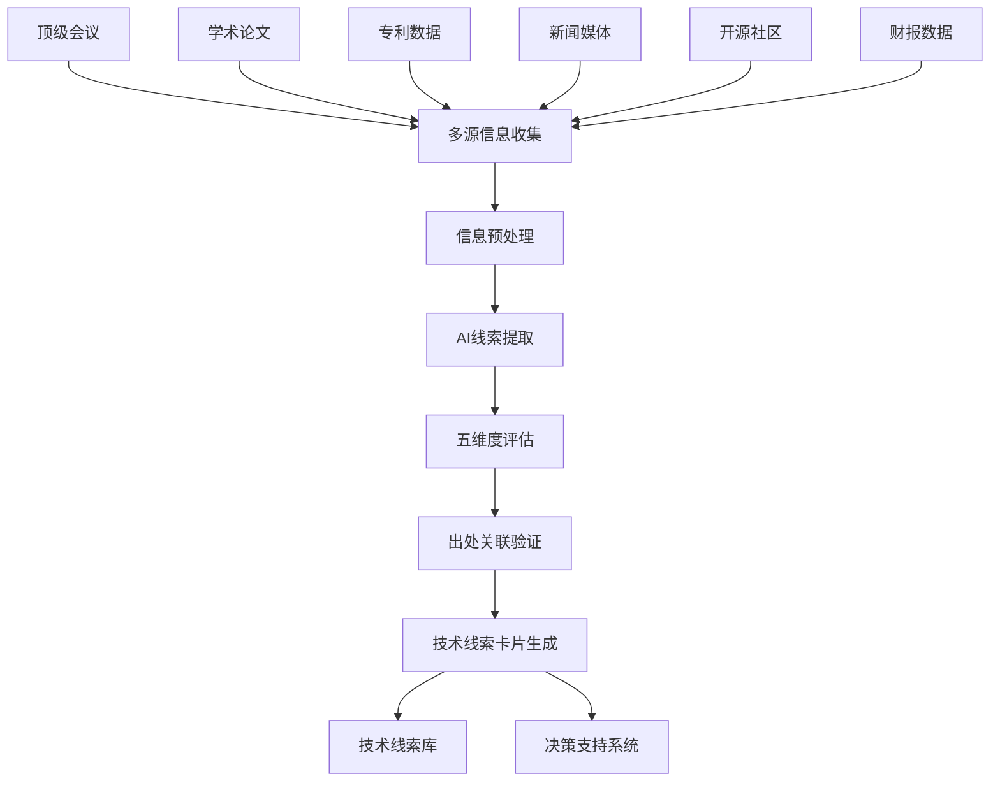

## 信息源采集策略

### **🎯 顶级会议信息源**
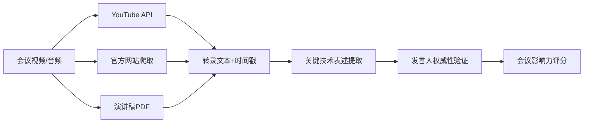

**重点会议源：**
- NVIDIA GTC, Google I/O, Apple WWDC
- Hot Chips, ISSCC, DAC, ISCA
- CES, MWC, Computex

### **📰 新闻媒体监控**
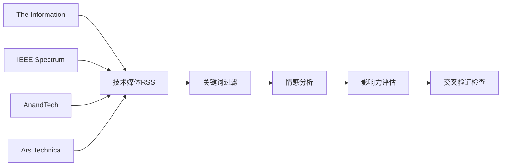

### **🔬 学术论文追踪**
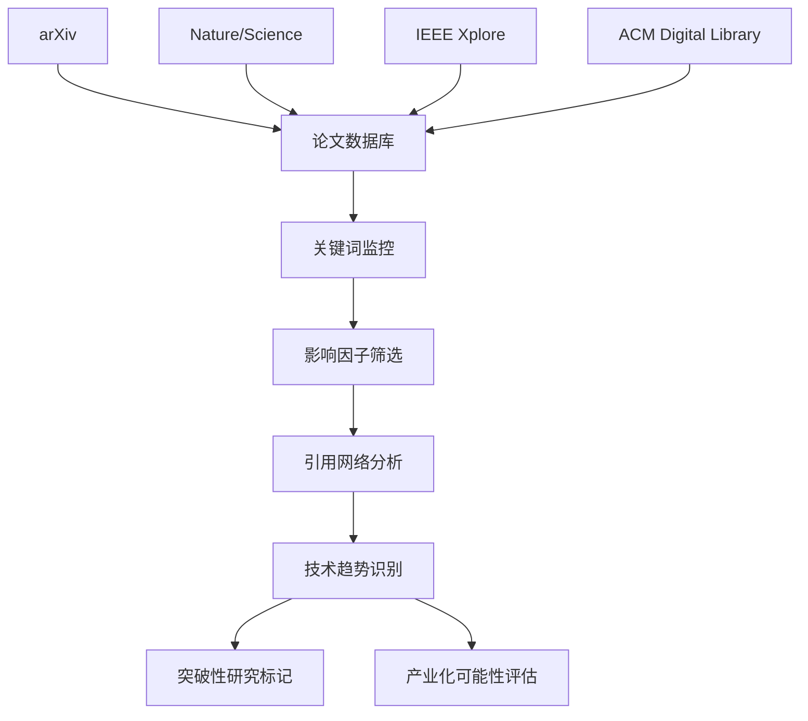

### **💡 专利情报分析**
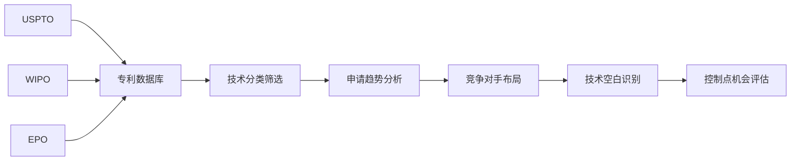

### **🌐 开源社区监控**
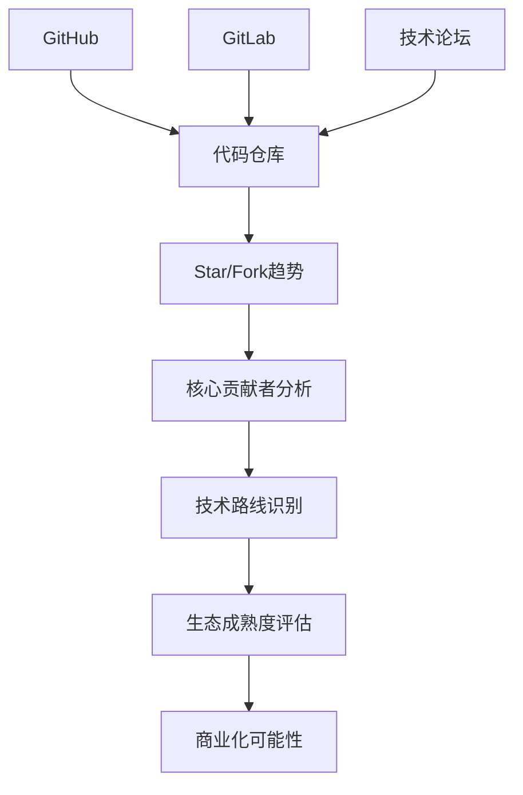

## AI线索提取引擎

### **多层AI分析架构**
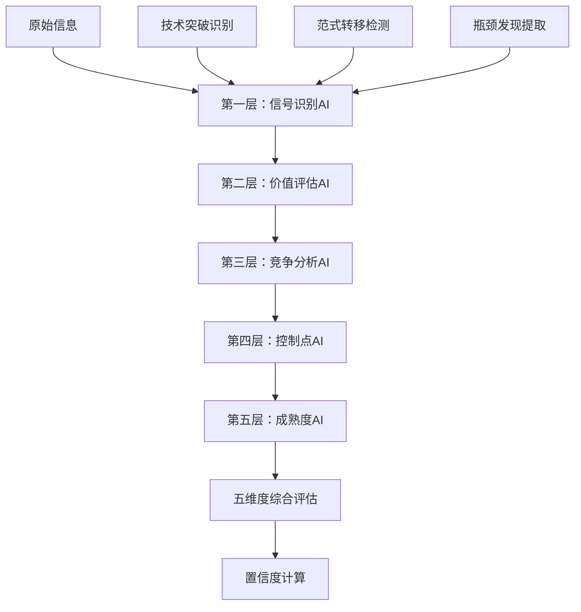

### **AI提示词分层设计**

**第一层 - 信号识别AI：**
```
专门识别技术线索类型和核心内容
输入：原始文本+来源元数据
输出：线索类型+核心表述+置信度
```

**第二层 - 价值评估AI：**
```
结合市场数据评估商业价值
输入：技术线索+市场报告+历史案例
输出：市场规模+时间窗口+ROI预期
```

**第三层 - 竞争分析AI：**
```
分析竞争格局和对手控制点
输入：技术线索+公司财报+专利数据
输出：竞争位置+对手优势+窗口期
```

## 五维度自动评估

### **💰 价值维度评估流程**
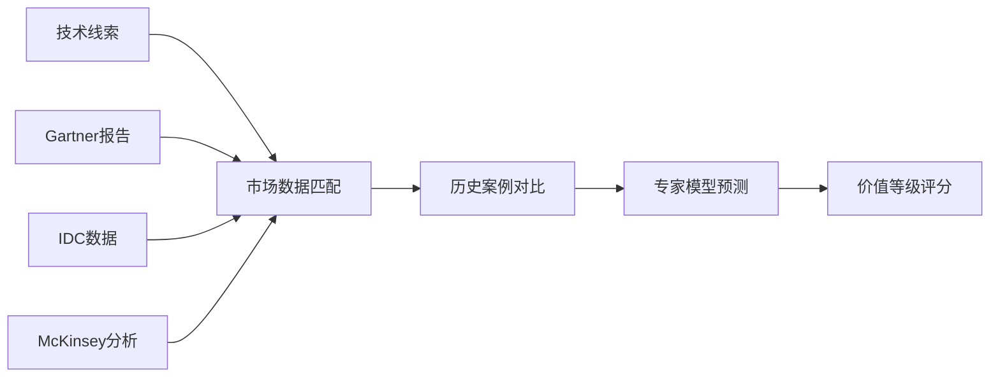

### **📍 来源可信度评估**
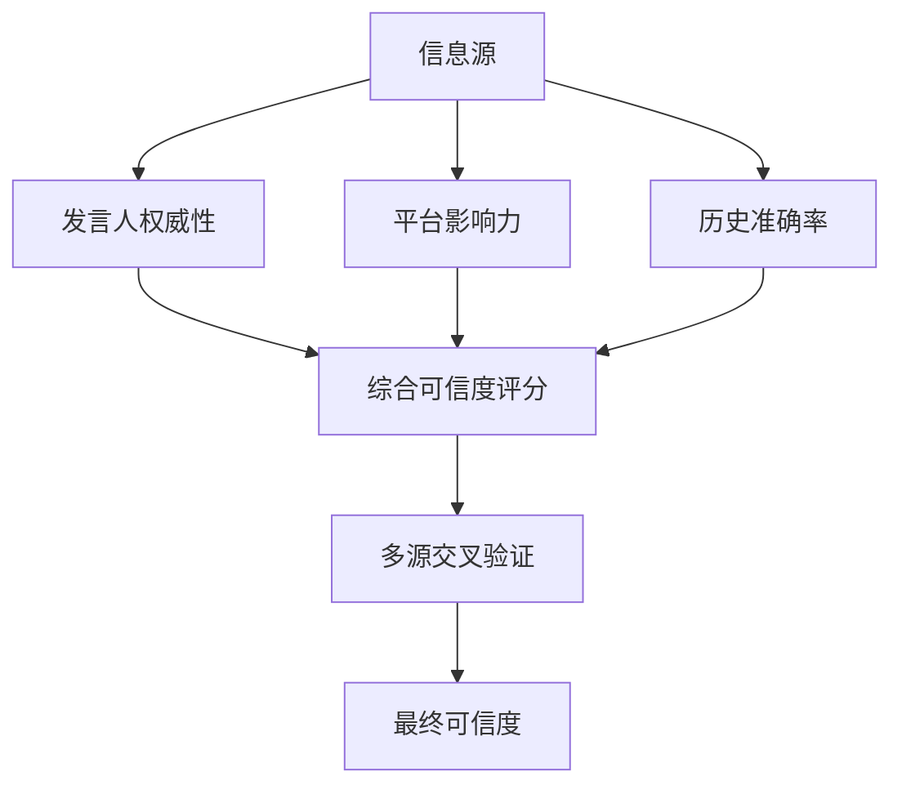

### **⚔️ 竞争态势分析**
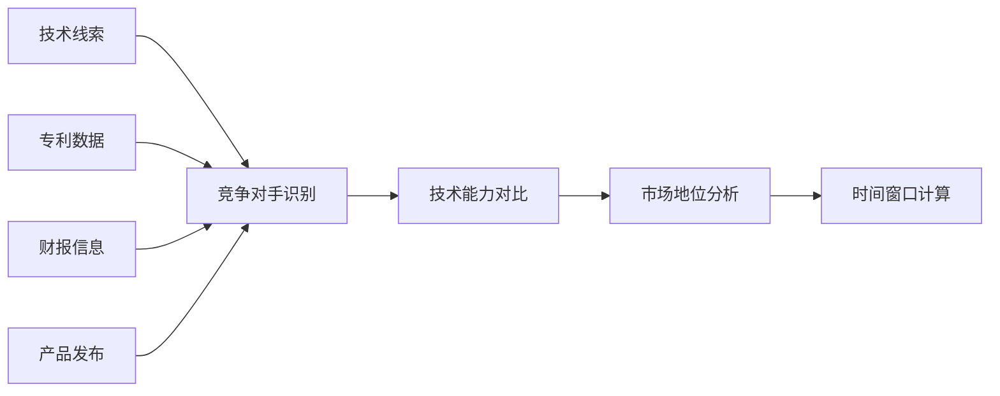

### **🔑 控制点机会评估**
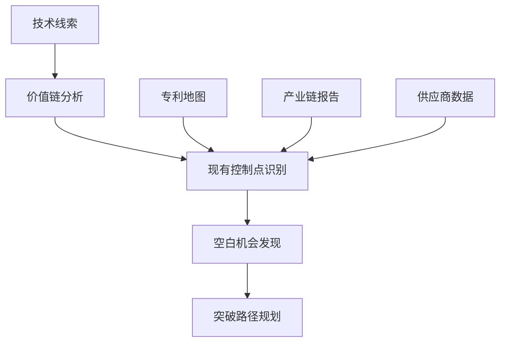

### **🧪 技术成熟度评估**
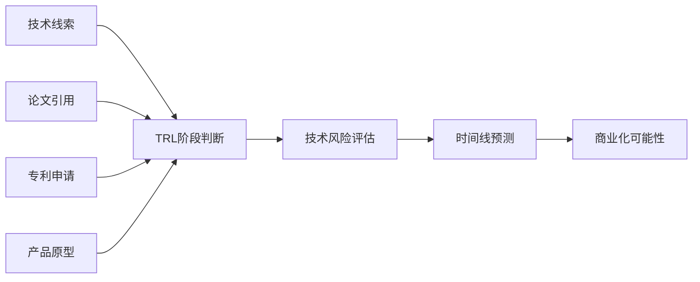

## 出处链接自动关联

### **链接收集与验证**
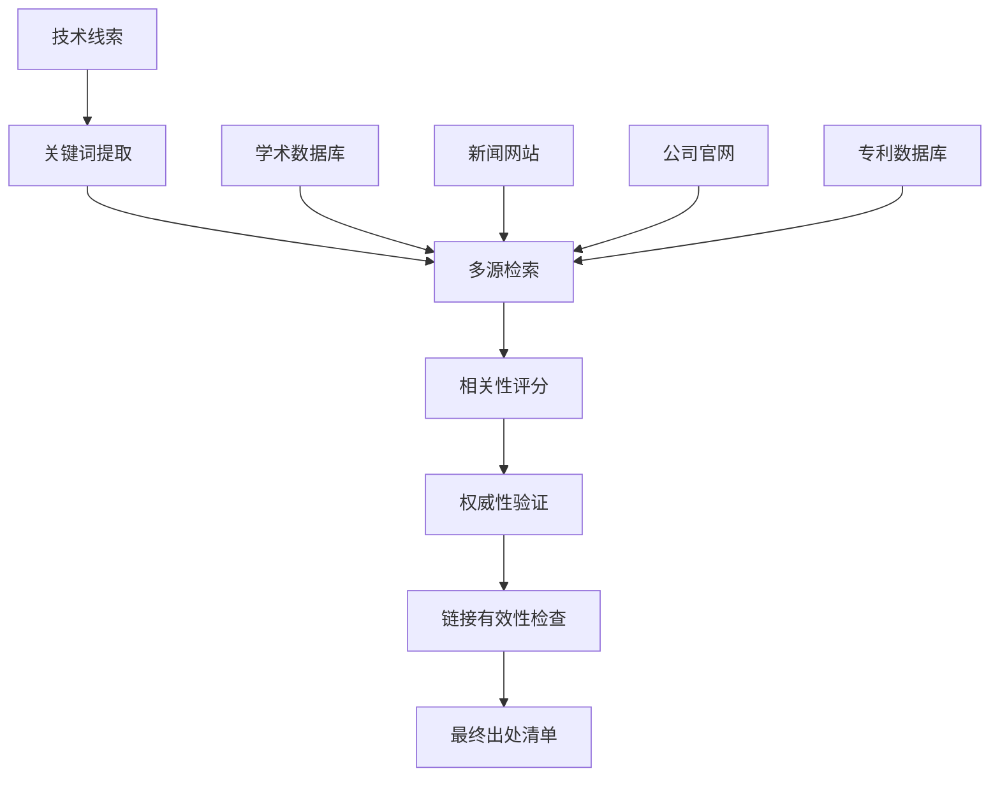

### **出处质量评估**
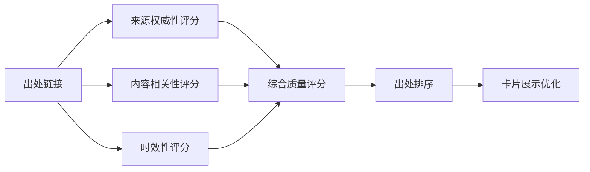

## 技术线索卡片生成

### **格式化输出流程**
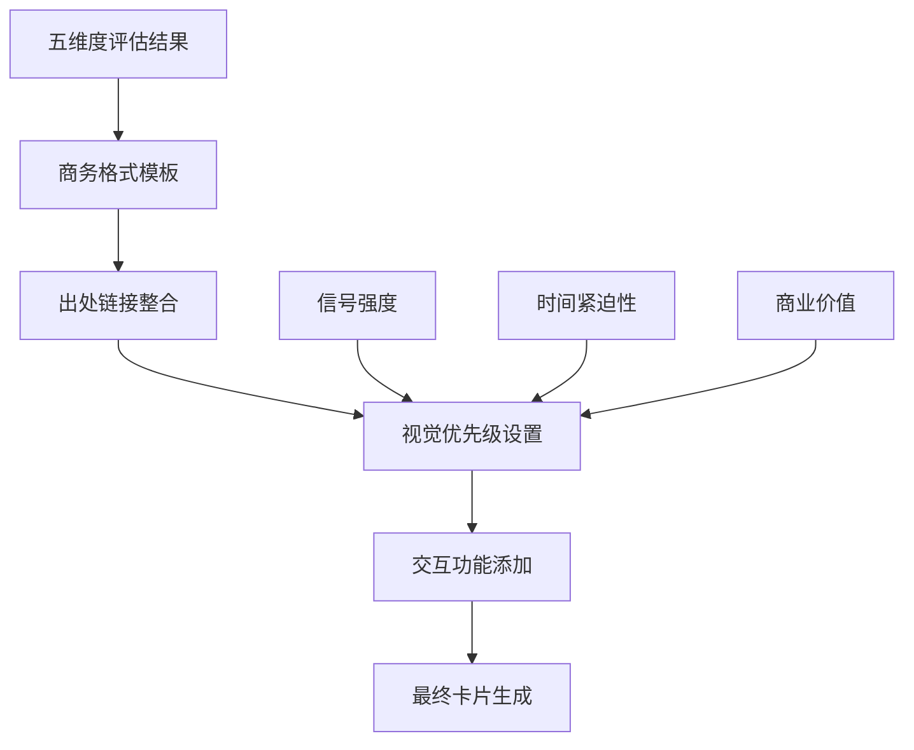

### **质量控制检查**
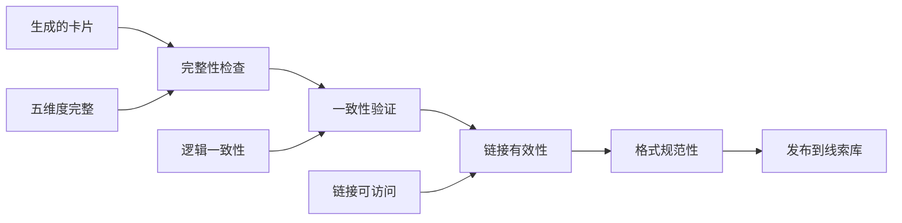

## 持续优化机制

### **反馈循环**
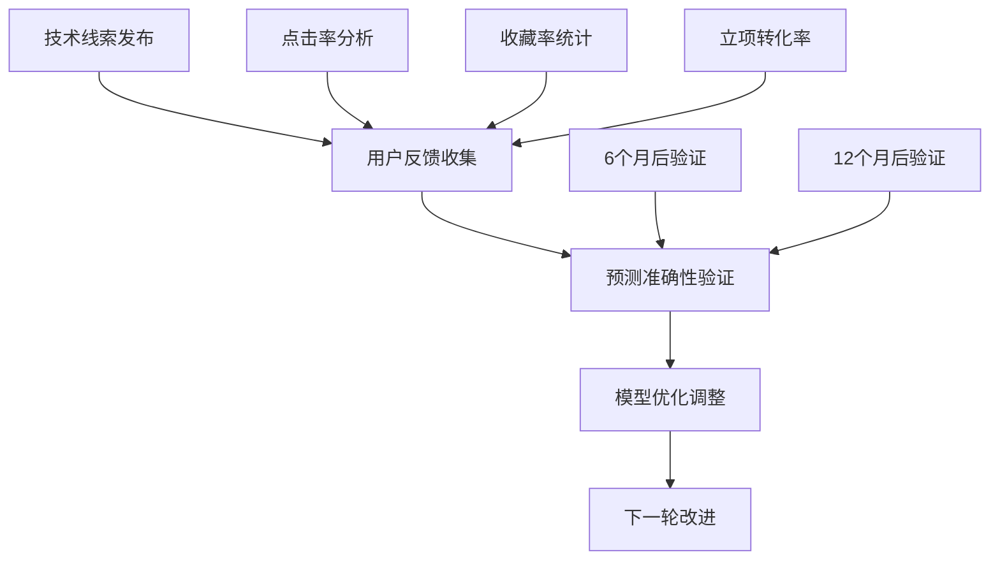

### **数据质量提升**
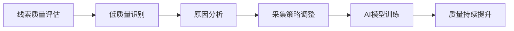

这个方案通过多源信息采集、分层AI分析、五维度评估和自动化验证，能够持续产生高质量的技术线索，并保持与商务卡片格式的一致性。
