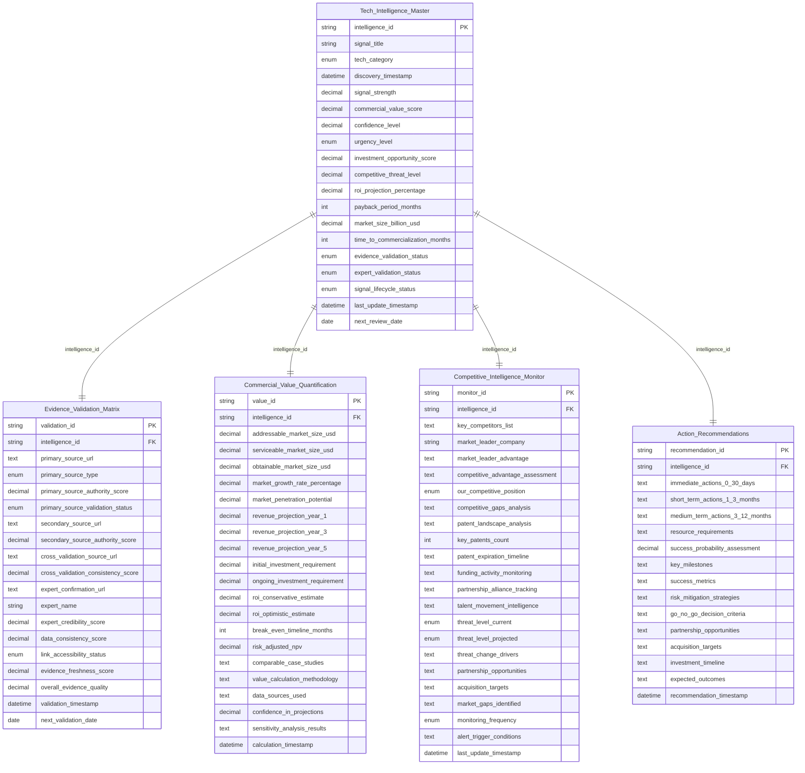

# 数据表字段关联关系详细分析

## **核心关联关系图**



## **字段间的具体关联逻辑**

### **1. 主表 → 证据验证表的字段关联**

```sql
-- 关联逻辑示例
SELECT 
    tim.intelligence_id,
    tim.signal_title,
    tim.confidence_level,  -- 受evidence表影响
    tim.evidence_validation_status,  -- 直接关联
    evm.overall_evidence_quality,  -- 影响confidence_level
    evm.primary_source_authority_score,  -- 影响confidence_level
    evm.data_consistency_score  -- 影响confidence_level
FROM Tech_Intelligence_Master tim
JOIN Evidence_Validation_Matrix evm ON tim.intelligence_id = evm.intelligence_id;
```

**字段影响关系：**
```
Evidence_Validation_Matrix.overall_evidence_quality 
    ↓ 影响计算
Tech_Intelligence_Master.confidence_level

Evidence_Validation_Matrix.primary_source_validation_status 
    ↓ 决定
Tech_Intelligence_Master.evidence_validation_status

Evidence_Validation_Matrix.expert_confirmation_url 
    ↓ 影响
Tech_Intelligence_Master.expert_validation_status
```

### **2. 主表 → 商业价值表的字段关联**

```sql
-- 商业价值字段关联
SELECT 
    tim.intelligence_id,
    tim.commercial_value_score,  -- 由CVQ表计算得出
    tim.roi_projection_percentage,  -- 直接来源于CVQ
    tim.payback_period_months,  -- 直接来源于CVQ
    tim.market_size_billion_usd,  -- 来源于CVQ的addressable_market
    cvq.roi_conservative_estimate,  -- 源数据
    cvq.break_even_timeline_months,  -- 源数据
    cvq.addressable_market_size_usd  -- 源数据
FROM Tech_Intelligence_Master tim
JOIN Commercial_Value_Quantification cvq ON tim.intelligence_id = cvq.intelligence_id;
```

**字段计算关系：**
```python
# 商业价值评分计算逻辑
def calculate_commercial_value_score(cvq_data):
    market_score = normalize_market_size(cvq_data['addressable_market_size_usd'])
    roi_score = normalize_roi(cvq_data['roi_conservative_estimate'])
    growth_score = normalize_growth(cvq_data['market_growth_rate_percentage'])
    
    # 加权计算
    commercial_value_score = (
        market_score * 0.4 +
        roi_score * 0.35 +
        growth_score * 0.25
    )
    
    return commercial_value_score

# 主表字段更新
Tech_Intelligence_Master.commercial_value_score = calculate_commercial_value_score(CVQ_data)
Tech_Intelligence_Master.roi_projection_percentage = CVQ_data.roi_conservative_estimate
Tech_Intelligence_Master.payback_period_months = CVQ_data.break_even_timeline_months
Tech_Intelligence_Master.market_size_billion_usd = CVQ_data.addressable_market_size_usd / 1_000_000_000
```

### **3. 主表 → 竞争情报表的字段关联**

```sql
-- 竞争情报字段关联
SELECT 
    tim.intelligence_id,
    tim.competitive_threat_level,  -- 由CIM表计算
    tim.urgency_level,  -- 受威胁等级影响
    cim.threat_level_current,  -- 源数据
    cim.threat_level_projected,  -- 影响urgency_level
    cim.our_competitive_position  -- 影响competitive_threat_level
FROM Tech_Intelligence_Master tim
JOIN Competitive_Intelligence_Monitor cim ON tim.intelligence_id = cim.intelligence_id;
```

**威胁等级计算逻辑：**
```python
def calculate_competitive_threat_level(cim_data):
    threat_mapping = {
        'Critical': 10.0,
        'High': 8.0,
        'Medium': 5.0,
        'Low': 2.0
    }
    
    current_threat = threat_mapping[cim_data['threat_level_current']]
    projected_threat = threat_mapping[cim_data['threat_level_projected']]
    
    # 考虑竞争地位
    position_factor = {
        'Leader': 0.7,      # 领导者威胁感知较低
        'Challenger': 1.0,   # 挑战者正常威胁感知
        'Follower': 1.3,     # 跟随者威胁感知较高
        'Niche': 0.9        # 细分市场威胁适中
    }
    
    competitive_threat_level = (
        (current_threat * 0.6 + projected_threat * 0.4) * 
        position_factor[cim_data['our_competitive_position']]
    )
    
    return min(competitive_threat_level, 10.0)
```

### **4. 主表 → 行动建议表的字段关联**

```sql
-- 行动建议字段关联
SELECT 
    tim.intelligence_id,
    tim.urgency_level,  -- 影响行动时间线
    tim.investment_opportunity_score,  -- 影响资源分配
    ar.success_probability_assessment,  -- 影响investment_opportunity_score
    ar.resource_requirements,  -- 与investment相关
    ar.immediate_actions_0_30_days  -- 基于urgency_level生成
FROM Tech_Intelligence_Master tim
JOIN Action_Recommendations ar ON tim.intelligence_id = ar.intelligence_id;
```

## **字段间的动态更新机制**

### **1. 级联更新触发器**

```sql
-- 证据验证更新触发主表置信度
DELIMITER //
CREATE TRIGGER update_confidence_on_evidence_change
    AFTER UPDATE ON Evidence_Validation_Matrix
    FOR EACH ROW
BEGIN
    DECLARE new_confidence DECIMAL(5,2);
    
    -- 计算新的置信度
    SELECT calculate_confidence_score(
        NEW.overall_evidence_quality,
        NEW.data_consistency_score,
        NEW.expert_credibility_score
    ) INTO new_confidence;
    
    -- 更新主表
    UPDATE Tech_Intelligence_Master 
    SET 
        confidence_level = new_confidence,
        evidence_validation_status = CASE 
            WHEN NEW.overall_evidence_quality >= 8.0 THEN 'Validated'
            WHEN NEW.overall_evidence_quality >= 6.0 THEN 'Pending'
            ELSE 'Rejected'
        END,
        last_update_timestamp = NOW()
    WHERE intelligence_id = NEW.intelligence_id;
END//
DELIMITER ;
```

### **2. 商业价值变化触发器**

```sql
-- 商业价值更新触发主表评分
DELIMITER //
CREATE TRIGGER update_scores_on_value_change
    AFTER UPDATE ON Commercial_Value_Quantification
    FOR EACH ROW
BEGIN
    DECLARE new_commercial_score DECIMAL(3,1);
    DECLARE new_investment_score DECIMAL(3,1);
    
    -- 计算商业价值评分
    SELECT calculate_commercial_value_score(
        NEW.addressable_market_size_usd,
        NEW.roi_conservative_estimate,
        NEW.market_growth_rate_percentage
    ) INTO new_commercial_score;
    
    -- 计算投资机会评分
    SELECT calculate_investment_opportunity_score(
        NEW.roi_conservative_estimate,
        NEW.break_even_timeline_months,
        NEW.confidence_in_projections
    ) INTO new_investment_score;
    
    -- 更新主表
    UPDATE Tech_Intelligence_Master 
    SET 
        commercial_value_score = new_commercial_score,
        investment_opportunity_score = new_investment_score,
        roi_projection_percentage = NEW.roi_conservative_estimate,
        payback_period_months = NEW.break_even_timeline_months,
        market_size_billion_usd = NEW.addressable_market_size_usd / 1000000000,
        last_update_timestamp = NOW()
    WHERE intelligence_id = NEW.intelligence_id;
END//
DELIMITER ;
```

### **3. 竞争威胁变化触发器**

```sql
-- 竞争威胁更新触发紧急度调整
DELIMITER //
CREATE TRIGGER update_urgency_on_threat_change
    AFTER UPDATE ON Competitive_Intelligence_Monitor
    FOR EACH ROW
BEGIN
    DECLARE new_threat_level DECIMAL(3,1);
    DECLARE new_urgency ENUM('Critical', 'High', 'Medium', 'Low');
    
    -- 计算威胁等级
    SELECT calculate_competitive_threat_level(
        NEW.threat_level_current,
        NEW.threat_level_projected,
        NEW.our_competitive_position
    ) INTO new_threat_level;
    
    -- 确定紧急度
    SET new_urgency = CASE 
        WHEN new_threat_level >= 8.0 THEN 'Critical'
        WHEN new_threat_level >= 6.0 THEN 'High'
        WHEN new_threat_level >= 4.0 THEN 'Medium'
        ELSE 'Low'
    END;
    
    -- 更新主表
    UPDATE Tech_Intelligence_Master 
    SET 
        competitive_threat_level = new_threat_level,
        urgency_level = new_urgency,
        last_update_timestamp = NOW()
    WHERE intelligence_id = NEW.intelligence_id;
END//
DELIMITER ;
```

## **字段关联的业务逻辑**

### **1. 置信度计算逻辑**

```python
def calculate_confidence_level(evidence_data, expert_data, historical_data):
    """
    置信度 = 证据质量(40%) + 专家验证(30%) + 历史准确性(30%)
    """
    evidence_score = (
        evidence_data['overall_evidence_quality'] * 0.5 +
        evidence_data['data_consistency_score'] * 0.3 +
        evidence_data['primary_source_authority_score'] * 0.2
    )
    
    expert_score = evidence_data['expert_credibility_score'] if evidence_data['expert_credibility_score'] else 5.0
    
    historical_score = get_historical_accuracy_score(historical_data)
    
    confidence = (
        evidence_score * 0.4 +
        expert_score * 0.3 +
        historical_score * 0.3
    ) * 10  # 转换为百分比
    
    return min(confidence, 100.0)
```

### **2. 紧急度评估逻辑**

```python
def determine_urgency_level(commercial_value, competitive_threat, time_sensitivity):
    """
    紧急度 = f(商业价值, 竞争威胁, 时间敏感性)
    """
    urgency_score = (
        commercial_value * 0.3 +
        competitive_threat * 0.4 +
        time_sensitivity * 0.3
    )
    
    if urgency_score >= 8.5:
        return 'Critical'
    elif urgency_score >= 7.0:
        return 'High'
    elif urgency_score >= 5.0:
        return 'Medium'
    else:
        return 'Low'
```

### **3. 投资机会评分逻辑**

```python
def calculate_investment_opportunity_score(roi, payback_period, confidence, market_size):
    """
    投资机会评分 = f(ROI, 回收期, 置信度, 市场规模)
    """
    # ROI评分 (0-10)
    roi_score = min(roi / 50.0, 10.0)  # 50%ROI = 满分
    
    # 回收期评分 (越短越好)
    payback_score = max(10 - payback_period / 6.0, 0)  # 6个月 = 满分
    
    # 置信度评分
    confidence_score = confidence / 10.0
    
    # 市场规模评分
    market_score = min(math.log10(market_size / 1000000000) * 2, 10.0)  # 10亿美元 = 满分
    
    investment_score = (
        roi_score * 0.35 +
        payback_score * 0.25 +
        confidence_score * 0.25 +
        market_score * 0.15
    )
    
    return investment_score
```

## **数据一致性维护**

### **1. 数据完整性检查**

```python
def validate_data_integrity(intelligence_id):
    """检查数据完整性"""
    checks = {
        'evidence_exists': check_evidence_record_exists(intelligence_id),
        'value_calculated': check_commercial_value_exists(intelligence_id),
        'competition_analyzed': check_competitive_analysis_exists(intelligence_id),
        'actions_defined': check_action_recommendations_exist(intelligence_id)
    }
    
    integrity_score = sum(checks.values()) / len(checks) * 100
    
    return {
        'integrity_score': integrity_score,
        'missing_components': [k for k, v in checks.items() if not v],
        'is_complete': integrity_score == 100
    }
```

### **2. 字段值一致性检查**

```python
def validate_field_consistency(intelligence_record):
    """检查字段值一致性"""
    inconsistencies = []
    
    # 检查ROI一致性
    if abs(intelligence_record['roi_projection_percentage'] - 
           get_commercial_value_roi(intelligence_record['intelligence_id'])) > 5.0:
        inconsistencies.append('ROI projection mismatch')
    
    # 检查市场规模一致性
    commercial_market_size = get_commercial_market_size(intelligence_record['intelligence_id'])
    if abs(intelligence_record['market_size_billion_usd'] - 
           commercial_market_size / 1000000000) > 0.1:
        inconsistencies.append('Market size mismatch')
    
    # 检查威胁等级一致性
    competitive_threat = get_competitive_threat_level(intelligence_record['intelligence_id'])
    if abs(intelligence_record['competitive_threat_level'] - competitive_threat) > 0.5:
        inconsistencies.append('Threat level mismatch')
    
    return {
        'is_consistent': len(inconsistencies) == 0,
        'inconsistencies': inconsistencies
    }
```

这个字段关联设计确保了：

1. **数据一致性**：所有相关字段通过触发器自动同步更新
2. **业务逻辑完整性**：字段间的计算关系反映真实的业务逻辑
3. **实时性**：字段变化立即触发相关字段的重新计算
4. **可追溯性**：每个计算结果都能追溯到源数据字段
5. **完整性验证**：通过检查机制确保数据完整性

Jason，这样的字段关联关系是否清楚地展示了数据表之间的内在逻辑？
