# 高价值技术线索发现系统实施方案

## **方案概述**

基于Make平台和Google Sheets构建一个完整的高价值技术线索发现系统，实现**量化结果+原始数据+计算依据+置信度验证**的完整数据模型。

## **核心架构设计**

### **整体数据流**

```mermaid
graph LR
    subgraph "数据收集层"
        A1[原始数据源监控]
        A2[实时数据采集]
        A3[链接有效性验证]
    end
    
    subgraph "数据增强层"
        B1[原文内容提取]
        B2[数据源权威性评估]
        B3[多源交叉验证]
        B4[专家验证引入]
    end
    
    subgraph "智能分析层"
        C1[AI深度分析]
        C2[量化指标计算]
        C3[推理链条生成]
        C4[置信度评估]
    end
    
    subgraph "价值评估层"
        D1[商业价值量化]
        D2[竞争情报分析]
        D3[风险评估矩阵]
        D4[行动建议生成]
    end
    
    subgraph "输出交付层"
        E1[完整数据模型构建]
        E2[高价值线索卡片]
        E3[可执行决策包]
    end

    A1 --> A2 --> A3 --> B1
    B1 --> B2 --> B3 --> B4
    B4 --> C1 --> C2 --> C3 --> C4
    C4 --> D1 --> D2 --> D3 --> D4
    D4 --> E1 --> E2 --> E3
```


## **Google Sheets数据库重新设计**

### **1. 原始数据增强表**

#### **Enhanced_Raw_Data_Master（增强原始数据主表）**
```
A: record_id - 记录唯一标识
B: source_type - 数据源类型（academic/opensource/patent/news/conference/competitor）
C: tech_topic - 技术主题
D: original_title - 原始标题
E: original_content - 原始内容全文
F: source_url - 原始链接
G: source_authority_score - 数据源权威性评分（0-10）
H: authority_calculation_basis - 权威性评分计算依据
I: publish_date - 发布日期
J: collection_timestamp - 采集时间戳
K: url_validation_status - 链接验证状态
L: url_check_timestamp - 链接检查时间
M: content_completeness_score - 内容完整性评分
N: content_quality_indicators - 内容质量指标JSON
O: cross_reference_sources - 交叉引用来源
P: expert_validation_status - 专家验证状态
Q: expert_validation_notes - 专家验证备注
R: data_freshness_score - 数据新鲜度评分
S: relevance_score - 技术相关性评分
T: processing_notes - 处理备注
```

#### **Multi_Source_Verification（多源验证表）**
```
A: verification_id - 验证唯一标识
B: claim_description - 待验证的技术声明
C: source_1_evidence - 来源1的证据
D: source_1_url - 来源1链接
E: source_1_authority - 来源1权威性
F: source_2_evidence - 来源2的证据
G: source_2_url - 来源2链接
H: source_2_authority - 来源2权威性
I: source_3_evidence - 来源3的证据
J: source_3_url - 来源3链接
K: source_3_authority - 来源3权威性
L: consistency_score - 一致性评分
M: verification_confidence - 验证置信度
N: verification_method - 验证方法说明
O: verification_timestamp - 验证时间
P: verification_notes - 验证备注
```

### **2. 智能分析结果表**

#### **AI_Analysis_With_Reasoning（带推理链的AI分析表）**
```
A: analysis_id - 分析唯一标识
B: tech_topic - 技术主题
C: analysis_type - 分析类型（tech_signal/market_value/risk_assessment）
D: ai_model_used - 使用的AI模型
E: input_data_summary - 输入数据摘要
F: ai_raw_output - AI原始输出
G: quantified_result - 量化结果
H: reasoning_chain - 推理链条
I: confidence_score - AI置信度
J: supporting_evidence - 支撑证据JSON
K: calculation_method - 计算方法说明
L: benchmark_comparison - 基准对比
M: sensitivity_analysis - 敏感性分析
N: validation_status - 验证状态
O: expert_review_notes - 专家评审备注
P: analysis_timestamp - 分析时间戳
```

#### **Business_Value_Quantification（商业价值量化表）**
```
A: value_id - 价值评估唯一标识
B: tech_topic - 技术主题
C: market_size_current - 当前市场规模
D: market_size_source - 市场规模数据来源
E: market_size_calculation - 市场规模计算方法
F: market_growth_rate - 市场增长率
G: growth_rate_source - 增长率数据来源
H: growth_projection_method - 增长预测方法
I: addressable_market_share - 可寻址市场份额
J: market_share_basis - 市场份额计算依据
K: roi_projection - ROI预测
L: roi_calculation_model - ROI计算模型
M: investment_requirement - 投资需求估算
N: payback_period - 投资回收期
O: risk_adjusted_npv - 风险调整后NPV
P: comparable_cases - 可比案例分析
Q: value_confidence_score - 价值评估置信度
R: value_calculation_notes - 价值计算备注
```

### **3. 完整技术线索表**

#### **High_Value_Tech_Signals（高价值技术线索主表）**
```
A: signal_id - 线索唯一标识
B: signal_title - 线索标题
C: signal_type - 线索类型
D: tech_domain - 技术领域
E: discovery_timestamp - 发现时间
F: signal_description - 线索完整描述
G: evidence_package_json - 证据包JSON（包含所有支撑数据）
H: confidence_breakdown - 置信度分解
I: value_score_breakdown - 价值评分分解
J: risk_assessment_details - 风险评估详情
K: competitive_analysis - 竞争分析
L: technical_maturity_analysis - 技术成熟度分析
M: market_opportunity_analysis - 市场机会分析
N: actionable_insights_json - 可执行洞察JSON
O: monitoring_indicators - 监控指标
P: expert_validation_record - 专家验证记录
Q: historical_accuracy_tracking - 历史准确性追踪
R: signal_lifecycle_status - 线索生命周期状态
S: last_update_timestamp - 最后更新时间
```

## **Make工作流详细设计**

### **工作流1：智能数据收集与验证引擎**

```json
{
  "workflow_name": "Intelligent_Data_Collection_Engine",
  "trigger": "定时触发（每日凌晨2:00）",
  "description": "收集原始数据并进行深度验证和增强",
  
  "modules": [
    {
      "module_1": "多源数据并行采集",
      "function": "从6个数据源采集最新数据",
      "details": {
        "academic_limit": 50,
        "opensource_limit": 30,
        "patent_limit": 20,
        "news_limit": 15,
        "conference_limit": 15,
        "competitor_limit": 20
      }
    },
    
    {
      "module_2": "链接批量验证",
      "function": "验证所有URL的可访问性和有效性",
      "implementation": {
        "method": "HTTP HEAD请求",
        "timeout": "10秒",
        "retry_count": 2,
        "parallel_processing": true
      }
    },
    
    {
      "module_3": "内容完整性分析",
      "function": "分析每条记录的内容完整性",
      "quality_checks": [
        "必填字段完整性",
        "内容长度合理性", 
        "文本可读性评分",
        "技术关键词密度"
      ]
    },
    
    {
      "module_4": "数据源权威性评估",
      "function": "评估每个数据源的权威性",
      "evaluation_criteria": {
        "academic": "期刊影响因子 + 机构排名 + 引用数",
        "opensource": "项目Star数 + 维护者声誉 + 社区活跃度",
        "patent": "专利局权威性 + 申请人知名度",
        "news": "媒体权威性 + 记者专业度 + 报道深度",
        "conference": "会议等级 + 主办方权威性 + 参与者质量",
        "competitor": "信息来源可靠性 + 数据新鲜度"
      }
    },
    
    {
      "module_5": "多源交叉验证",
      "function": "识别相同技术声明的多个来源",
      "verification_process": {
        "claim_extraction": "从每条记录中提取关键技术声明",
        "similarity_matching": "使用文本相似度算法匹配相同声明",
        "consistency_check": "验证不同来源声明的一致性",
        "confidence_calculation": "基于一致性计算验证置信度"
      }
    },
    
    {
      "module_6": "Google Sheets写入增强数据",
      "function": "将增强后的数据写入Enhanced_Raw_Data_Master",
      "data_enrichment": [
        "原始内容 + 质量评分",
        "权威性评估 + 计算依据",
        "交叉验证结果 + 置信度",
        "处理时间戳 + 处理备注"
      ]
    },
    
    {
      "module_7": "多源验证记录",
      "function": "将验证结果写入Multi_Source_Verification表",
      "verification_recording": "记录每个技术声明的多源验证过程和结果"
    }
  ]
}
```

### **工作流2：AI深度分析引擎**

```json
{
  "workflow_name": "AI_Deep_Analysis_Engine",
  "trigger": "工作流1完成后自动触发",
  "description": "对验证后的数据进行AI深度分析，生成完整推理链",
  
  "modules": [
    {
      "module_1": "读取验证后数据",
      "function": "从Enhanced_Raw_Data_Master读取高质量数据",
      "filter_conditions": [
        "source_authority_score >= 7",
        "content_completeness_score >= 8",
        "url_validation_status = 'valid'"
      ]
    },
    
    {
      "module_2": "xAI Grok-3技术线索分析",
      "function": "使用增强的提示词进行技术线索提取",
      "enhanced_prompt": {
        "system_role": "你是资深技术线索分析专家，必须基于具体证据进行分析",
        "input_format": "每条数据包含：原始内容+权威性评分+交叉验证结果",
        "output_requirement": "每个结论必须包含：量化评分+推理过程+支撑证据+置信度",
        "quality_control": "置信度低于0.7的结论必须标记并说明原因"
      }
    },
    
    {
      "module_3": "OpenAI GPT-4商业价值分析",
      "function": "深度分析商业价值并提供计算依据",
      "analysis_framework": {
        "market_sizing": "基于权威报告的市场规模分析",
        "competitive_analysis": "基于实际数据的竞争态势分析",
        "roi_calculation": "基于可比案例的ROI预测模型",
        "risk_assessment": "基于历史数据的风险量化分析"
      }
    },
    
    {
      "module_4": "推理链条构建",
      "function": "为每个分析结论构建完整的推理链条",
      "reasoning_components": [
        "输入数据摘要",
        "分析方法说明",
        "中间推理步骤",
        "结论形成过程",
        "置信度计算依据"
      ]
    },
    
    {
      "module_5": "商业价值量化",
      "function": "生成详细的商业价值量化分析",
      "quantification_process": {
        "data_collection": "收集相关市场数据和基准案例",
        "model_application": "应用经过验证的价值评估模型",
        "sensitivity_analysis": "进行敏感性分析和情景模拟",
        "confidence_assessment": "评估量化结果的可信度"
      }
    },
    
    {
      "module_6": "Google Sheets存储分析结果",
      "function": "将完整分析结果存储到AI_Analysis_With_Reasoning",
      "storage_structure": {
        "quantified_results": "所有量化结果",
        "reasoning_chains": "完整推理链条",
        "supporting_evidence": "支撑证据包",
        "confidence_scores": "各维度置信度"
      }
    },
    
    {
      "module_7": "商业价值数据存储",
      "function": "详细商业价值分析存储到Business_Value_Quantification",
      "value_data_structure": {
        "market_analysis": "市场分析+数据来源+计算方法",
        "roi_projection": "ROI预测+计算模型+可比案例",
        "investment_analysis": "投资分析+风险评估+回收期预测"
      }
    }
  ]
}
```

### **工作流3：高价值线索构建引擎**

```json
{
  "workflow_name": "High_Value_Signal_Builder",
  "trigger": "工作流2完成后自动触发或手动触发特定技术主题",
  "description": "构建包含完整证据链的高价值技术线索",
  
  "modules": [
    {
      "module_1": "多表数据聚合",
      "function": "聚合所有相关分析数据",
      "data_sources": [
        "Enhanced_Raw_Data_Master",
        "Multi_Source_Verification", 
        "AI_Analysis_With_Reasoning",
        "Business_Value_Quantification"
      ]
    },
    
    {
      "module_2": "证据包构建",
      "function": "为每个技术线索构建完整证据包",
      "evidence_package_structure": {
        "original_sources": "原始数据源信息",
        "verification_records": "多源验证记录",
        "analysis_reasoning": "AI分析推理链",
        "quantification_basis": "量化分析依据",
        "expert_validation": "专家验证记录"
      }
    },
    
    {
      "module_3": "置信度综合计算",
      "function": "计算技术线索的综合置信度",
      "confidence_model": {
        "data_quality_weight": 0.25,
        "source_authority_weight": 0.25,
        "cross_verification_weight": 0.20,
        "ai_analysis_confidence_weight": 0.15,
        "expert_validation_weight": 0.15
      }
    },
    
    {
      "module_4": "价值评分计算",
      "function": "计算技术线索的综合价值评分",
      "value_scoring_model": {
        "market_opportunity_weight": 0.30,
        "technical_feasibility_weight": 0.25,
        "competitive_advantage_weight": 0.20,
        "execution_difficulty_weight": 0.15,
        "time_sensitivity_weight": 0.10
      }
    },
    
    {
      "module_5": "可执行洞察生成",
      "function": "生成具体的可执行行动建议",
      "insight_generation": {
        "immediate_actions": "基于紧迫性的立即行动建议",
        "resource_requirements": "具体的资源需求估算",
        "success_metrics": "可衡量的成功指标",
        "risk_mitigation": "具体的风险缓解措施",
        "monitoring_plan": "持续监控计划"
      }
    },
    
    {
      "module_6": "高价值线索过滤",
      "function": "筛选出真正的高价值技术线索",
      "filtering_criteria": {
        "min_confidence_score": 0.8,
        "min_value_score": 8.0,
        "min_evidence_sources": 3,
        "max_execution_difficulty": 7.0
      }
    },
    
    {
      "module_7": "完整线索数据存储",
      "function": "将高价值技术线索存储到主表",
      "storage_to": "High_Value_Tech_Signals",
      "data_completeness_check": [
        "证据包完整性检查",
        "推理链条完整性检查", 
        "量化数据完整性检查",
        "可执行性检查"
      ]
    }
  ]
}
```

### **工作流4：智能卡片生成引擎**

```json
{
  "workflow_name": "Intelligent_Card_Generator",
  "trigger": "工作流3完成后自动触发",
  "description": "生成包含完整证据链的高价值技术线索卡片",
  
  "modules": [
    {
      "module_1": "读取高价值线索数据",
      "function": "从High_Value_Tech_Signals读取完整线索数据",
      "data_enrichment": "关联所有相关的证据和分析数据"
    },
    
    {
      "module_2": "卡片内容结构化",
      "function": "将复杂数据结构化为卡片格式",
      "card_sections": {
        "executive_summary": "执行摘要（量化结果+关键洞察）",
        "evidence_validation": "证据验证（数据源+验证状态）",
        "reasoning_chain": "推理链条（分析过程+计算依据）",
        "quantified_analysis": "量化分析（商业价值+风险评估）",
        "competitive_intelligence": "竞争情报（威胁分析+机会识别）",
        "actionable_insights": "可执行洞察（具体行动+成功指标）"
      }
    },
    
    {
      "module_3": "xAI卡片内容生成",
      "function": "使用Grok-3生成专业的卡片内容",
      "generation_requirements": {
        "evidence_transparency": "每个关键结论都显示支撑证据",
        "calculation_visibility": "所有量化结果都显示计算过程",
        "action_specificity": "所有建议都具体可执行",
        "risk_quantification": "所有风险都有量化评估"
      }
    },
    
    {
      "module_4": "卡片质量验证",
      "function": "验证卡片的完整性和可用性",
      "quality_checks": [
        "证据链完整性检查",
        "量化数据一致性检查",
        "可执行性验证",
        "决策支撑充分性检查"
      ]
    },
    
    {
      "module_5": "多格式输出生成",
      "function": "生成多种格式的输出",
      "output_formats": {
        "html_card": "HTML格式的交互式卡片",
        "pdf_report": "PDF格式的详细报告",
        "executive_summary": "高管摘要版本",
        "technical_deep_dive": "技术深度分析版本"
      }
    },
    
    {
      "module_6": "邮件报告发送",
      "function": "发送包含完整证据链的智能报告",
      "email_content": {
        "subject_personalization": "基于线索价值和紧迫性的个性化主题",
        "content_layering": "分层次展示信息（摘要->详情->证据）",
        "interactive_elements": "可点击的证据链接和计算过程"
      }
    },
    
    {
      "module_7": "输出结果存档",
      "function": "存档所有输出结果供后续追踪",
      "archival_data": [
        "完整卡片HTML",
        "生成时间戳", 
        "使用的数据版本",
        "置信度快照",
        "后续跟踪计划"
      ]
    }
  ]
}
```

## **实施计划**

### **Phase 1: 基础数据架构（第1-2周）**

#### **Week 1: Google Sheets架构建设**
```
Day 1-2: 创建Enhanced_Raw_Data_Master表结构
Day 3-4: 创建Multi_Source_Verification表结构  
Day 5-7: 创建AI_Analysis_With_Reasoning和Business_Value_Quantification表结构
```

#### **Week 2: 数据收集工作流**
```
Day 1-3: 实施工作流1的前4个模块（数据采集+验证+权威性评估）
Day 4-5: 实施多源交叉验证功能
Day 6-7: 测试和优化数据收集质量
```

### **Phase 2: AI分析能力建设（第3-4周）**

#### **Week 3: AI分析工作流**
```
Day 1-2: 设计增强的AI提示词模板
Day 3-4: 实施工作流2的AI分析模块
Day 5-7: 实施推理链条构建和商业价值量化
```

#### **Week 4: 价值评估优化**
```
Day 1-3: 完善商业价值量化算法
Day 4-5: 实施置信度综合计算模型
Day 6-7: 测试AI分析准确性和完整性
```

### **Phase 3: 高价值线索构建（第5周）**

#### **Week 5: 线索构建和卡片生成**
```
Day 1-2: 实施工作流3（高价值线索构建）
Day 3-4: 实施工作流4（智能卡片生成）
Day 5-7: 端到端测试和质量优化
```

### **Phase 4: 系统优化和部署（第6周）**

#### **Week 6: 系统优化和上线**
```
Day 1-2: 性能优化和错误处理完善
Day 3-4: 用户培训和文档准备
Day 5-7: 正式上线和监控
```

## **成功标准**

### **数据质量标准**
```
✅ 数据源权威性：平均评分 >8.0/10
✅ 链接有效性：>95%可访问
✅ 多源验证覆盖率：>80%的关键声明有多源验证
✅ 内容完整性：>90%的记录包含完整必填字段
```

### **分析质量标准**
```
✅ AI分析置信度：平均 >0.8
✅ 推理链完整性：100%的结论有完整推理链
✅ 量化覆盖率：>70%的判断有量化支撑
✅ 证据透明度：100%的关键结论可追溯到原始数据
```

### **输出质量标准**
```
✅ 高价值线索识别率：每次分析产出3-5个高价值线索
✅ 可执行性：100%的行动建议有具体执行步骤
✅ 决策支撑完整性：包含投资决策所需的全部信息
✅ 历史准确性：6个月后验证准确率 >80%
```

这个方案确保每个技术线索都是一个完整的"决策数据包"，包含量化结果、原始证据、推理过程和可执行建议，真正实现高价值技术线索的识别和交付。
